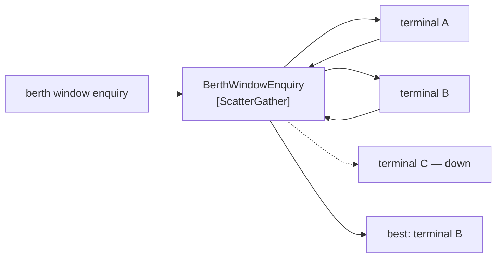

# Scatter-Gather

🌍 🇬🇧 English (this file) · 🇫🇷 [Français](ScatterGather-fr.md)

## Intent

Scatter-Gather sends a message to several recipients and assembles their replies, so that the best or the fullest
answer can be taken from a set of candidates.

## Problem

A container needs a berth window. Three terminals in the port could take it, and the answer wanted is whichever
can take it soonest.

Asked one at a time, the question takes as long as three round trips and the first acceptable answer wins rather
than the best one. Asked all at once with no participant assembling the replies, three answers arrive on a
channel and nobody compares them.

And two of the three may not answer at all. A terminal whose system is down does not reply *no* — it replies
nothing, and nothing is indistinguishable from *still thinking*.

## Solution

The pattern broadcasts the request and aggregates the replies.

Three questions go out at once, so the wait is one round trip rather than three. The replies are collected by one
participant, which can then compare them and answer the question that was actually asked: *which terminal
soonest*, not *did anybody say yes*.

The reply set is what makes it useful and what makes it hard: **how long to wait for parties that may never
answer is a decision this participant owns.** No other participant can make it, and the pattern does not decide
it.

## Structure



Three go out, two come back, one answer is produced. The third arrow is dotted because the pattern has to work
when it stays that way.

## The roles

| Role | Annotation | Applies to | What it carries |
|---|---|---|---|
| ScatterGather | `[ScatterGather]` | interface, class | The participant that broadcasts a request and aggregates the replies. |

One role, and like [Composed Message Processor](ComposedMessageProcessor-en.md) it names an assembly rather than
a mechanism. The two are worth telling apart by what is distributed: there, the parts of one message; here, the
whole message to several parties who each answer.

## The example

From [`ScatterGatherUsage.cs`](../../../../DesignPatternCatalog.Usage/EnterpriseIntegration/ScatterGatherUsage.cs).

```csharp
public string? Best(IReadOnlyList<(string Terminal, DateOnly? Window)> replies) {
    string? best = null;
    DateOnly? soonest = null;
    foreach ((string terminal, DateOnly? window) in replies) {
        if (window is null) { continue; }
        if (soonest is null || window < soonest) { soonest = window; best = terminal; }
    }

    return best;
}
```

The method is `Best` and it takes the replies that arrived. It does not wait for them — the waiting happened
before this call, and the sample is deliberately showing the *gather* half rather than the timeout, because the
timeout is the part it declines to invent.

`DateOnly?` per reply is a terminal that answered *I cannot*, and `continue` skips it. That is a different thing
from a terminal that did not answer at all, which never appears in the list — and the code cannot tell them
apart, because by the time `Best` is called the distinction has already been lost.

`string?` returning null is *nobody can take it*. That is a real answer to the question and not a failure, which
is why it is a nullable return rather than an exception.

The sample states where the difficulty lives: *the reply set is what makes it useful and what makes it hard: how
long to wait for parties that may never answer is a decision this participant owns.*

## Applicability

**Use scatter-gather where several parties could answer and the best answer is wanted.** The book's case: a
broadcast plus a comparison.

**Use it where asking in sequence would be too slow.** Three round trips become one, which is usually the reason
to prefer it.

**Use it where a party may not answer.** The pattern accommodates that; asking one at a time does not, since a
silent party blocks the sequence.

**Decide the waiting policy explicitly.** It is this participant's decision and nobody else's, and leaving it
implicit means the default is *wait for ever*.

## When not to use it

**Do not use it where every reply is required.** If the answer is only valid with all three, silence from one is
not a slower answer, it is no answer — and the pattern's tolerance for missing replies becomes a way to produce
confident wrong results.

**Do not use it where the parts of one message are what should be distributed.** That is
[Composed Message Processor](ComposedMessageProcessor-en.md).

**Do not use it without a timeout.** This is the failure it invites: a gatherer waiting on a party that will never
answer holds the request for ever, and the caller sees a system that is merely slow.

**Do not treat a missing reply as a negative one.** *I cannot take it* and *I did not answer* are different facts,
and collapsing them means a terminal with a broken interface is silently excluded from every enquiry.

**Do not scatter to parties whose answers cost them.** A broadcast asks everybody to do work, and three quotes
computed to discard two is three times the load for one answer.

**Do not use it where the request has side effects.** Scattering a command executes it several times, which is
the difference between asking three terminals for a window and booking three windows.

## Advantages

* One round trip instead of several, whatever the number of parties.
* The best answer can be chosen, rather than the first acceptable one.
* Parties that do not answer do not block the result.
* A new candidate party is a change to the scatter list and to nothing else.
* The comparison logic is in one participant, so *best* has one definition.

## Drawbacks

* The waiting policy is a decision with no good default, and the pattern does not supply one.
* A missing reply and a negative reply are easy to conflate, and the code usually cannot tell them apart.
* Every party does the work, and the answers not chosen are work discarded.
* It is stateful for as long as the replies are outstanding, with an aggregator's problems.
* Scattering anything with side effects multiplies them.

## Relations with other patterns

**`ComposedMessageProcessor`** is the sibling composite, and the distinction is what is distributed: parts there,
the whole message here.

**`RecipientList`** is the scatter half on its own — send to several, without collecting anything back.

**`Aggregator`** is the gather half, and everything its page says about correlation, completeness and state
applies here.

**`RequestReply`** is what each arm of the scatter is, and **`CorrelationIdentifier`** is what lets the gatherer
tell whose reply is whose.

**`PublishSubscribeChannel`** is one way to scatter, when the set of candidates is a subscription rather than a
computed list.

## Source

*Enterprise Integration Patterns*, Gregor Hohpe and Bobby Woolf, Addison-Wesley, 2003 — the message-routing
chapter.

* [Index entry](../../../generated/catalog-index.md#scattergather-enterprise-integration-patterns)
* [Generated attribute](../../../../DesignPatternCatalog.EnterpriseIntegration/ScatterGather.cs)
* [Example](../../../../DesignPatternCatalog.Usage/EnterpriseIntegration/ScatterGatherUsage.cs)
