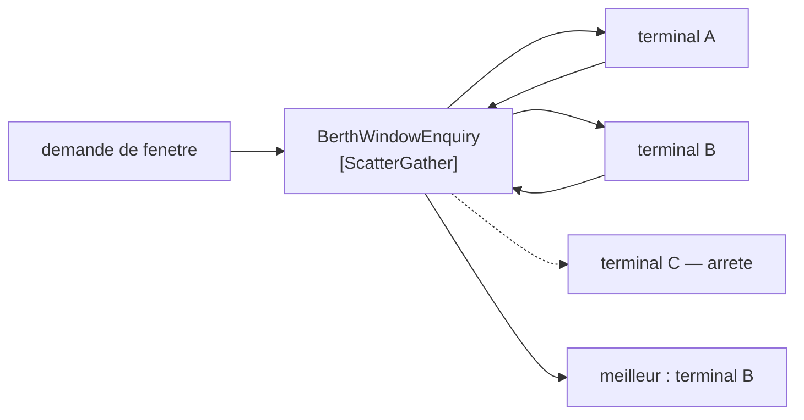

# Scatter-Gather

🌍 🇫🇷 Français (ce fichier) · 🇬🇧 [English](ScatterGather-en.md)

## Intention

Scatter-Gather envoie un message à plusieurs destinataires et rassemble leurs réponses, de sorte que la meilleure
ou la plus complète puisse être prise dans un ensemble de candidates.

## Problème

Un conteneur a besoin d'une fenêtre de poste à quai. Trois terminaux du port pourraient le prendre, et la réponse
voulue est celui qui peut le prendre le plus tôt.

Posée un à un, la question prend le temps de trois allers-retours et c'est la première réponse acceptable qui
l'emporte plutôt que la meilleure. Posée à tous en même temps sans participant qui rassemble les réponses, trois
réponses arrivent sur un canal et personne ne les compare.

Et deux des trois peuvent ne pas répondre du tout. Un terminal dont le système est arrêté ne répond pas *non* — il
ne répond rien, et rien est indiscernable de *réfléchit encore*.

## Solution

Le patron diffuse la requête et agrège les réponses.

Trois questions partent en même temps : l'attente est d'un aller-retour plutôt que de trois. Les réponses sont
rassemblées par un participant, qui peut alors les comparer et répondre à la question réellement posée : *quel
terminal le plus tôt*, non *quelqu'un a-t-il dit oui*.

L'ensemble des réponses est ce qui le rend utile et ce qui le rend difficile : **combien de temps attendre des
parties qui peuvent ne jamais répondre est une décision que ce participant possède.** Aucun autre participant ne
peut la prendre, et le patron ne la tranche pas.

## Structure



Trois partent, deux reviennent, une réponse est produite. La troisième flèche est en pointillés parce que le patron
doit fonctionner si elle le reste.

## Les rôles

| Rôle | Annotation | S'applique à | Ce qu'il porte |
|---|---|---|---|
| ScatterGather | `[ScatterGather]` | interface, classe | Le participant qui diffuse une requête et agrège les réponses. |

Un seul rôle et, comme [Composed Message Processor](ComposedMessageProcessor-fr.md), il nomme un assemblage plutôt
qu'un mécanisme. Les deux valent d'être distingués par ce qui est distribué : là-bas, les parties d'un message ; ici,
le message entier à plusieurs parties qui répondent chacune.

## L'exemple

Extrait de [`ScatterGatherUsage.cs`](../../../../DesignPatternCatalog.Usage/EnterpriseIntegration/ScatterGatherUsage.cs).

```csharp
public string? Best(IReadOnlyList<(string Terminal, DateOnly? Window)> replies) {
    string? best = null;
    DateOnly? soonest = null;
    foreach ((string terminal, DateOnly? window) in replies) {
        if (window is null) { continue; }
        if (soonest is null || window < soonest) { soonest = window; best = terminal; }
    }

    return best;
}
```

La méthode s'appelle `Best` et prend les réponses arrivées. Elle ne les attend pas — l'attente a eu lieu avant cet
appel, et l'exemple montre délibérément la moitié *gather* plutôt que le délai d'attente, parce que le délai est la
part qu'il refuse d'inventer.

Un `DateOnly?` par réponse est un terminal qui a répondu *je ne peux pas*, et `continue` le passe. C'est autre chose
qu'un terminal qui n'a pas répondu du tout, lequel n'apparaît jamais dans la liste — et le code ne peut pas les
distinguer, parce qu'au moment où `Best` est appelée la distinction est déjà perdue.

Un `string?` qui rend `null` veut dire *personne ne peut le prendre*. C'est une vraie réponse à la question et non un
échec, ce qui est pourquoi c'est un retour nullable plutôt qu'une exception.

L'exemple énonce où siège la difficulté : *l'ensemble des réponses est ce qui le rend utile et ce qui le rend
difficile : combien de temps attendre des parties qui peuvent ne jamais répondre est une décision que ce participant
possède.*

## Possibilités d'application

**Employez scatter-gather là où plusieurs parties pourraient répondre et où la meilleure réponse est voulue.** Le cas
du livre : une diffusion plus une comparaison.

**Employez-le là où demander en séquence serait trop lent.** Trois allers-retours deviennent un, ce qui est
d'ordinaire la raison de le préférer.

**Employez-le là où une partie peut ne pas répondre.** Le patron s'en accommode ; demander un à un non, puisqu'une
partie silencieuse bloque la séquence.

**Décidez explicitement la politique d'attente.** C'est la décision de ce participant et d'aucun autre, et la laisser
implicite fait que le défaut est *attendre indéfiniment*.

## Quand ne pas l'utiliser

**Ne l'employez pas là où chaque réponse est requise.** Si la réponse n'est valide qu'avec les trois, le silence de
l'une n'est pas une réponse plus lente, c'est aucune réponse — et la tolérance du patron aux réponses manquantes
devient un moyen de produire des résultats faux et assurés.

**Ne l'employez pas là où ce sont les parties d'un message qui doivent être distribuées.** C'est
[Composed Message Processor](ComposedMessageProcessor-fr.md).

**Ne l'employez pas sans délai d'attente.** C'est la panne qu'il invite : un rassembleur qui attend une partie qui ne
répondra jamais retient la requête indéfiniment, et l'appelant voit un système simplement lent.

**Ne prenez pas une réponse manquante pour une réponse négative.** *Je ne peux pas le prendre* et *je n'ai pas
répondu* sont deux faits différents, et les confondre fait qu'un terminal à l'interface cassée est exclu en silence
de chaque demande.

**Ne diffusez pas vers des parties pour qui répondre coûte.** Une diffusion demande à tout le monde de travailler, et
trois cotations calculées pour en jeter deux font trois fois la charge pour une réponse.

**Ne l'employez pas là où la requête a des effets de bord.** Diffuser une commande l'exécute plusieurs fois, ce qui
est la différence entre demander une fenêtre à trois terminaux et réserver trois fenêtres.

## Avantages

* Un aller-retour au lieu de plusieurs, quel que soit le nombre de parties.
* La meilleure réponse peut être choisie, plutôt que la première acceptable.
* Les parties qui ne répondent pas ne bloquent pas le résultat.
* Une nouvelle partie candidate est un changement de la liste de diffusion et de rien d'autre.
* La logique de comparaison est dans un participant : *le meilleur* a une seule définition.

## Inconvénients

* La politique d'attente est une décision sans bon défaut, et le patron n'en fournit aucune.
* Une réponse manquante et une réponse négative sont faciles à confondre, et le code ne sait d'ordinaire pas les
  distinguer.
* Chaque partie fait le travail, et les réponses non retenues sont du travail jeté.
* Il est doté d'un état tant que les réponses sont en attente, avec les problèmes d'un agrégateur.
* Diffuser quoi que ce soit qui a des effets de bord les multiplie.

## Liens avec les autres patrons

**`ComposedMessageProcessor`** est le composite frère, et la distinction est ce qui est distribué : des parties
là-bas, le message entier ici.

**`RecipientList`** est la moitié *scatter* toute seule — envoyer à plusieurs, sans rien rassembler en retour.

**`Aggregator`** est la moitié *gather*, et tout ce que sa page dit de la corrélation, de la complétude et de l'état
vaut ici.

**`RequestReply`** est ce qu'est chaque bras de la diffusion, et **`CorrelationIdentifier`** est ce qui permet au
rassembleur de savoir de qui est chaque réponse.

**`PublishSubscribeChannel`** est une façon de diffuser, quand l'ensemble des candidats est un abonnement plutôt
qu'une liste calculée.

## Source

*Enterprise Integration Patterns*, Gregor Hohpe et Bobby Woolf, Addison-Wesley, 2003 — le chapitre sur le routage
des messages.

* [Entrée d'index](../../../generated/catalog-index.md#scattergather-enterprise-integration-patterns)
* [Attribut généré](../../../../DesignPatternCatalog.EnterpriseIntegration/ScatterGather.cs)
* [Exemple](../../../../DesignPatternCatalog.Usage/EnterpriseIntegration/ScatterGatherUsage.cs)
