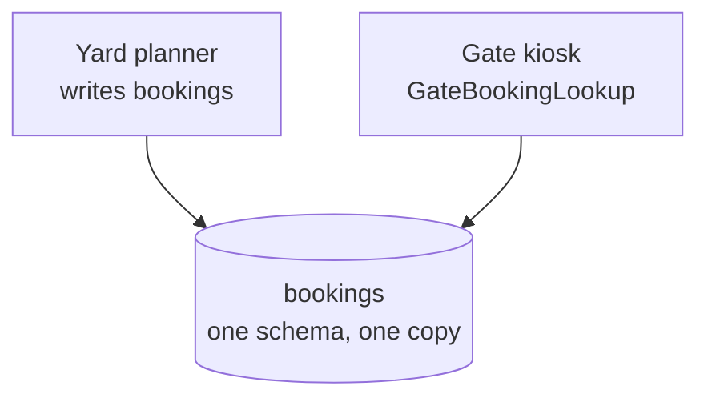

# Shared Database

🌍 🇬🇧 English (this file) · 🇫🇷 [Français](SharedDatabase-fr.md)

## Intent

Shared Database integrates applications by having them read and write one schema, so that there is no data to
transfer and nothing to fall out of step.

## Problem

The terminal operating system and the gate kiosks. A truck arriving at the gate must see the same booking the
yard planner saw thirty seconds ago.

No copy of that booking would be current enough. A file written at 04:00 is a day old; a message published a
minute ago may not have arrived; and a truck turned away at the gate because the kiosk had yesterday's data is a
driver on a weighbridge with nowhere to go.

## Solution

The pattern removes the transfer entirely.

Both applications read and write one schema. There is nothing to fall out of step because there is one copy, and
consistency comes free rather than being arranged.

What it costs is that the schema becomes a contract. Altering a column is altering both applications at once,
and the table can no longer be changed by one team alone.

## Structure



Both arrows point at the same store, and there is no arrow between the applications. What they share is not a
message but a table.

## The roles

| Role | Annotation | Applies to | What it carries |
|---|---|---|---|
| SharedDatabase | `[SharedDatabase]` | interface, class, assembly | The participant that reads or writes the shared schema. |

One role, covering both readers and writers. The distinction the annotation does *not* make is between the two —
because the cost falls on both: a reader is as constrained by the schema as a writer.

## The example

From [`SharedDatabaseUsage.cs`](../../../../DesignPatternCatalog.Usage/EnterpriseIntegration/SharedDatabaseUsage.cs).

```csharp
[SharedDatabase]
public sealed class GateBookingLookup {

    public string? FindBooking(string truckPlate) {
        // ... SELECT against the shared bookings table
        return null;
    }

}
```

A `SELECT` and nothing else. There is no client, no serialisation, no retry and no staleness to reason about —
which is exactly what the style buys, and why it is so often reached for.

The annotation is what the class would not otherwise say. Read the method alone and it looks like ordinary data
access; the annotation records that the table on the other side of it is **not this application's** and that a
migration here is a negotiation.

The sample's remark states both halves: *consistency comes free. The price is that this table can no longer be
changed by one team alone.*

## Applicability

**Use Shared Database where the data must be current at every moment**, and no transfer interval is short
enough.

**Use it where several applications need the same data and the semantics must not diverge.** The book notes that
a shared schema forces one interpretation, which is a benefit as well as a constraint: two applications cannot
disagree about what a booking is.

**Use it where a transactional guarantee across the applications is wanted.** One database means one
transaction, which no other integration style offers.

## When not to use it

**Do not use it across an organisational boundary.** The schema is a contract, and a contract that can only be
changed by agreement between parties who do not share a release cycle is a contract that will not be changed.
The customs case is [File Transfer](FileTransfer-en.md)'s for exactly this reason.

**Do not use it where the applications must evolve independently.** This is the style's central cost: a column
belongs to everyone, so every migration is coordinated, and the coupling is invisible in either application's
code. It is the reason the field spent the following decade arguing against it.

**Do not use it where the applications disagree about the model.** A shared schema forces one interpretation.
Where two applications genuinely mean different things by the same word — which is
[Bounded Context](../domain-driven-design/BoundedContext-en.md)'s subject — the schema becomes a compromise that
serves neither.

**Do not use it under heavy concurrent load without expecting contention.** Several applications writing one
schema contend for the same rows, and the book names performance as a real limit rather than an implementation
detail.

**Do not use it and then also transfer.** A shared database plus a nightly export is two integration styles with
two truths, and the second one is stale by definition.

## Advantages

* Data is current for everybody, with no transfer and no interval.
* Consistency comes free: there is one copy, so nothing can diverge.
* One transaction can span what would otherwise be two integrations.
* The semantics are forced into agreement, so two applications cannot mean different things by one column.
* It is the least code of any style: a connection string and a query.

## Drawbacks

* The schema is a contract, and altering it alters every application at once.
* No application owns its data, so no team can migrate without the others.
* The coupling is invisible in the code: a `SELECT` looks local and is not.
* Concurrent writers contend, and the contention grows with the number of applications.
* Only data is shared — nothing can be asked of another application.

## Relations with other patterns

**`FileTransfer`**, **`RemoteProcedureInvocation`** and **`Messaging`** are the other three styles, and the four
are meant to be read as one choice.

**`Messaging`** is the style the rest of this catalogue elaborates, and the one the field moved to as the cost
of a shared schema became better understood.

**`BoundedContext`**, in the Domain-Driven Design catalogue, is the counter-argument stated as a pattern: where
two applications need different models, one schema cannot serve both.

**[`SharedDatabase`](../../../generated/catalog-index.md#shareddatabase-microservices-patterns)**, in the
Microservices Patterns catalogue, is the same arrangement under the opposite recommendation: Richardson presents
it as what
[Database per Service](../../../generated/catalog-index.md#databaseperservice-microservices-patterns) exists to
escape. Both entries are held, because the two works are two verdicts on one arrangement rather than two
arrangements — and a codebase annotated with either is saying which of the two it means.

## Source

*Enterprise Integration Patterns*, Gregor Hohpe and Bobby Woolf, Addison-Wesley, 2003 — chapter 2, integration
styles.

* [Index entry](../../../generated/catalog-index.md#shareddatabase-enterprise-integration-patterns)
* [Generated attribute](../../../../DesignPatternCatalog.EnterpriseIntegration/SharedDatabase.cs)
* [Example](../../../../DesignPatternCatalog.Usage/EnterpriseIntegration/SharedDatabaseUsage.cs)
