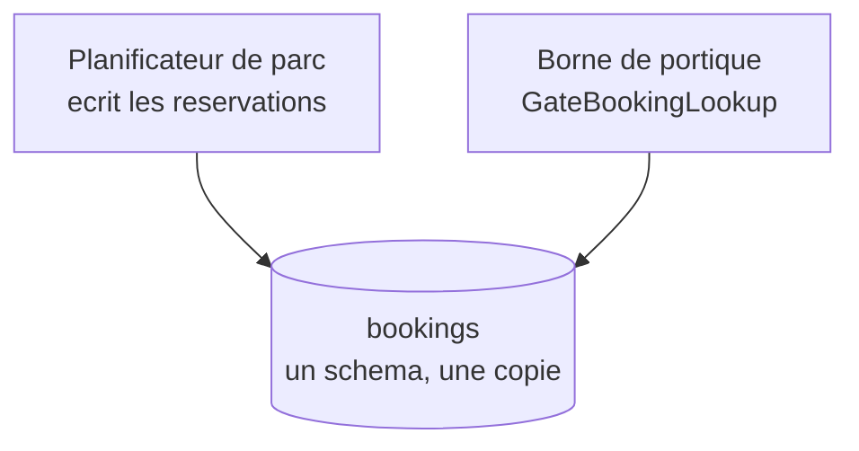

# Shared Database

🌍 🇫🇷 Français (ce fichier) · 🇬🇧 [English](SharedDatabase-en.md)

## Intention

Shared Database intègre des applications en leur faisant lire et écrire un seul schéma, de sorte qu'il n'y ait
aucune donnée à transférer et rien qui puisse se désynchroniser.

## Problème

Le système d'exploitation du terminal et les bornes de portique. Un camion qui arrive au portique doit voir la
même réservation que le planificateur de parc voyait il y a trente secondes.

Aucune copie de cette réservation ne serait assez fraîche. Un fichier écrit à 04h00 a un jour ; un message publié
il y a une minute n'est peut-être pas arrivé ; et un camion refoulé au portique parce que la borne avait les
données d'hier, c'est un chauffeur sur un pont-bascule qui n'a nulle part où aller.

## Solution

Le patron supprime le transfert entièrement.

Les deux applications lisent et écrivent un seul schéma. Il n'y a rien qui puisse se désynchroniser puisqu'il y a
une seule copie, et la cohérence est gratuite au lieu d'être organisée.

Ce que cela coûte, c'est que le schéma devient un contrat. Modifier une colonne, c'est modifier les deux
applications d'un coup, et la table ne peut plus être changée par une seule équipe.

## Structure



Les deux flèches pointent vers le même stockage, et il n'y a aucune flèche entre les applications. Ce qu'elles
partagent n'est pas un message mais une table.

## Les rôles

| Rôle | Annotation | S'applique à | Ce qu'il porte |
|---|---|---|---|
| SharedDatabase | `[SharedDatabase]` | interface, classe, assembly | Le participant qui lit ou écrit le schéma partagé. |

Un seul rôle, couvrant lecteurs et écrivains. La distinction que l'annotation ne fait *pas* est celle entre les
deux — parce que le coût retombe sur les deux : un lecteur est aussi contraint par le schéma qu'un écrivain.

## L'exemple

Extrait de [`SharedDatabaseUsage.cs`](../../../../DesignPatternCatalog.Usage/EnterpriseIntegration/SharedDatabaseUsage.cs).

```csharp
[SharedDatabase]
public sealed class GateBookingLookup {

    public string? FindBooking(string truckPlate) {
        // ... SELECT against the shared bookings table
        return null;
    }

}
```

Un `SELECT` et rien d'autre. Il n'y a pas de client, pas de sérialisation, pas de réessai et aucune péremption à
raisonner — c'est exactement ce que le style achète, et pourquoi on y recourt si souvent.

L'annotation est ce que la classe ne dirait pas autrement. Lisez la méthode seule et cela ressemble à un accès
aux données ordinaire ; l'annotation consigne que la table de l'autre côté **n'appartient pas à cette
application** et qu'une migration ici est une négociation.

La remarque de l'exemple énonce les deux moitiés : *la cohérence est gratuite. Le prix est que cette table ne
peut plus être changée par une seule équipe.*

## Possibilités d'application

**Employez Shared Database là où la donnée doit être à jour à chaque instant**, et où aucun intervalle de
transfert n'est assez court.

**Employez-le là où plusieurs applications ont besoin des mêmes données et où la sémantique ne doit pas
diverger.** Le livre note qu'un schéma partagé force une interprétation unique, ce qui est un bénéfice autant
qu'une contrainte : deux applications ne peuvent pas être en désaccord sur ce qu'est une réservation.

**Employez-le là où une garantie transactionnelle entre les applications est voulue.** Une base veut dire une
transaction, ce qu'aucun autre style d'intégration n'offre.

## Quand ne pas l'utiliser

**Ne l'employez pas à travers une frontière organisationnelle.** Le schéma est un contrat, et un contrat qui ne
peut être changé que par accord entre des parties qui ne partagent pas de cycle de livraison est un contrat qui
ne sera pas changé. Le cas de la douane relève de [File Transfer](FileTransfer-fr.md) pour exactement cette
raison.

**Ne l'employez pas là où les applications doivent évoluer indépendamment.** C'est le coût central du style : une
colonne appartient à tout le monde, donc chaque migration est coordonnée, et le couplage est invisible dans le
code de chacune. C'est la raison pour laquelle la profession a passé la décennie suivante à argumenter contre.

**Ne l'employez pas là où les applications ne s'accordent pas sur le modèle.** Un schéma partagé force une
interprétation. Là où deux applications entendent réellement des choses différentes par le même mot — le sujet de
[Bounded Context](../domain-driven-design/BoundedContext-fr.md) — le schéma devient un compromis qui ne sert ni
l'une ni l'autre.

**Ne l'employez pas sous forte charge concurrente sans en attendre de la contention.** Plusieurs applications qui
écrivent un schéma se disputent les mêmes lignes, et le livre nomme la performance comme une limite réelle plutôt
qu'un détail d'implémentation.

**Ne l'employez pas en transférant aussi.** Une base partagée plus un export nocturne, ce sont deux styles
d'intégration avec deux vérités, et la seconde est périmée par définition.

## Avantages

* La donnée est à jour pour tout le monde, sans transfert et sans intervalle.
* La cohérence est gratuite : il y a une copie, donc rien ne peut diverger.
* Une transaction peut couvrir ce qui serait sinon deux intégrations.
* La sémantique est forcée à l'accord : deux applications ne peuvent pas entendre des choses différentes par une
  colonne.
* C'est le style qui demande le moins de code : une chaîne de connexion et une requête.

## Inconvénients

* Le schéma est un contrat, et le modifier modifie toutes les applications d'un coup.
* Aucune application ne possède ses données : aucune équipe ne peut migrer sans les autres.
* Le couplage est invisible dans le code : un `SELECT` a l'air local et ne l'est pas.
* Les écrivains concurrents se disputent, et la contention croît avec le nombre d'applications.
* Seule la donnée est partagée — rien ne peut être demandé à une autre application.

## Liens avec les autres patrons

**`FileTransfer`**, **`RemoteProcedureInvocation`** et **`Messaging`** sont les trois autres styles, et les
quatre se lisent comme un seul choix.

**`Messaging`** est le style que le reste de ce catalogue développe, et celui vers lequel la profession s'est
déplacée à mesure que le coût d'un schéma partagé était mieux compris.

**`BoundedContext`**, dans le catalogue Domain-Driven Design, est le contre-argument énoncé comme patron : là où
deux applications ont besoin de modèles différents, un schéma ne peut pas servir les deux.

**[`SharedDatabase`](../../../generated/catalog-index.md#shareddatabase-microservices-patterns)**, dans le
catalogue Microservices Patterns, est le même agencement sous la recommandation inverse : Richardson le présente
comme ce que
[Database per Service](../../../generated/catalog-index.md#databaseperservice-microservices-patterns) existe pour
fuir. Les deux entrées sont tenues, parce que les deux œuvres sont deux verdicts sur un même agencement plutôt
que deux agencements — et un code annoté avec l'une ou l'autre dit lequel des deux il entend.

## Source

*Enterprise Integration Patterns*, Gregor Hohpe et Bobby Woolf, Addison-Wesley, 2003 — chapitre 2, les styles
d'intégration.

* [Entrée d'index](../../../generated/catalog-index.md#shareddatabase-enterprise-integration-patterns)
* [Attribut généré](../../../../DesignPatternCatalog.EnterpriseIntegration/SharedDatabase.cs)
* [Exemple](../../../../DesignPatternCatalog.Usage/EnterpriseIntegration/SharedDatabaseUsage.cs)
