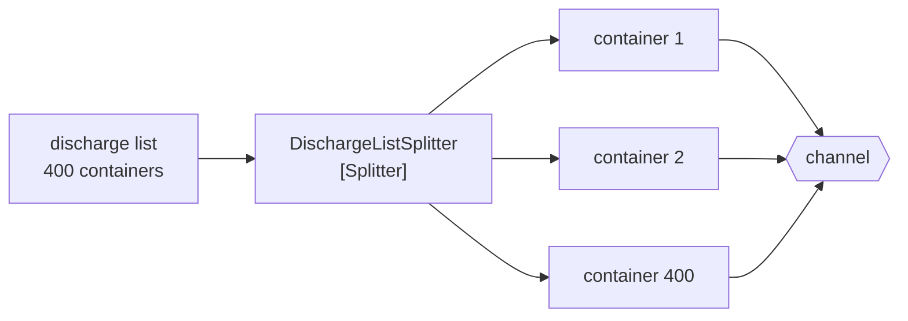

# Splitter

🌍 🇬🇧 English (this file) · 🇫🇷 [Français](Splitter-fr.md)

## Intent

Splitter breaks a message carrying several elements into one message per element, so that each can be processed
and routed on its own.

## Problem

A vessel's discharge list arrives as one EDI message naming four hundred containers.

Every step after it works on one container at a time. The reefer filter tests one container's type; the yard
planner assigns one container a slot; the router chooses a destination per container. Handed the whole list, each
of them has to loop — and each loop is a place where an exception on container 213 abandons 214 through 400, or
where a partial failure leaves nobody able to say what was done.

Routing is worse than looping. A list of four hundred mixed containers has no single destination, so a router
either sends the whole list everywhere or unpacks it — which is this pattern, written in the wrong place.

## Solution

The pattern turns the one into four hundred.

A splitter consumes one message and emits many, one per element. Every step downstream then works at the
granularity it actually wants, and each container succeeds or fails on its own.

The assertion is the **arithmetic**: nothing dropped and nothing invented. A consignment of four hundred yields
four hundred messages, and a rule can check the count — which is what makes a silent loss in the middle of a
discharge findable rather than discovered when a container is missing from a vessel.

## Structure



One in, four hundred out, and the count is the thing a rule can check.

## The roles

| Role | Annotation | Applies to | What it carries |
|---|---|---|---|
| Splitter | `[Splitter]` | interface, class | The participant that consumes one message and emits many. |

One role, and what it claims is countable — which is unusual in this catalogue. Most annotations assert something
about shape or intent; this one asserts an equality between an input's element count and an output's message
count, and that is a claim a test can hold to.

## The example

From [`SplitterUsage.cs`](../../../../DesignPatternCatalog.Usage/EnterpriseIntegration/SplitterUsage.cs).

```csharp
[Splitter]
public sealed class DischargeListSplitter {

    public IReadOnlyList<string> Split(IReadOnlyList<string> containerNumbers) => containerNumbers;

}
```

The body is the identity function, and that is the sample being deliberate rather than lazy. A splitter that
filtered, reordered or enriched while splitting would be two patterns wearing one name; writing it as identity
makes the arithmetic visible — four hundred in, four hundred out — and any real implementation is judged against
that.

`IReadOnlyList` on both sides means the splitter cannot mutate what it was given, so the input list remains
whatever the upstream step produced.

There is no channel in the signature. The splitter emits messages; where they go is a
[router](MessageRouter-en.md)'s decision, and keeping the two apart is what lets a discharge list be split once
and routed differently by different terminals.

The sample states the assertion and why it is worth having: *a consignment of four hundred containers yields four
hundred messages, and a rule can check the count — which is what makes a silent loss in the middle of a discharge
findable.*

## Applicability

**Use a splitter where a message carries several elements that are processed separately.** The book's case, and
the commonest shape in any EDI integration.

**Use it where a failure should be per element.** One container failing validation should not abandon the
remaining three hundred and ninety-nine.

**Use it before routing.** Elements that need different destinations cannot be routed while they are one message.

**Keep the arithmetic true.** Nothing dropped and nothing invented is the claim; a splitter that also filters has
made the count unable to prove anything.

## When not to use it

**Do not use it where the elements are only meaningful together.** A discharge list that must be accepted or
rejected as a whole is a single unit of work, and splitting it means reassembling it before anything can decide.

**Do not let it filter.** Dropping elements while splitting destroys the arithmetic, which is the one thing the
annotation asserts. Filter afterwards, with a [message filter](MessageFilter-en.md), where the count of what was
dropped is its own fact.

**Do not use it without deciding what reassembles.** Four hundred messages with no
[aggregator](Aggregator-en.md) behind them means nobody can say the discharge is finished — the shipping line
wanted one answer and got four hundred.

**Do not lose the set.** Split messages need a [message sequence](MessageSequence-en.md) if anything downstream
must know which discharge they belong to, and how many there were.

**Do not split what will not fit in the receiver's throughput.** Turning one message into four hundred multiplies
load by four hundred, and a downstream step sized for lists is not sized for elements.

## Advantages

* Every downstream step works at the granularity it actually wants.
* A failure is per element rather than per consignment.
* Elements can be routed differently, which they cannot be while they are one message.
* The arithmetic is checkable, so a silent loss in the middle is findable.
* Elements can be processed concurrently, which a single message cannot be.

## Drawbacks

* Message volume multiplies by the element count, and everything downstream pays it.
* The set is lost unless something carries it — the elements no longer know they were a discharge list.
* Order is lost as soon as the elements are processed concurrently.
* Partial completion becomes possible: three hundred and ninety-nine done, and nothing that says so.
* An aggregator is usually needed behind it, which brings state and a completeness problem of its own.

## Relations with other patterns

**`Aggregator`** is the counterpart, and the two are usually a pair: what a splitter takes apart, an aggregator
puts back together.

**`MessageSequence`** is what the emitted messages carry so that the set survives the split — which set, which
place, how many.

**`ComposedMessageProcessor`** is the splitter, a router and an aggregator assembled into one addressable step.

**`Resequencer`** is what restores the order the split and the concurrency destroyed.

**`RecipientList`** also turns one message into several, and the difference is what travels: parts here, the whole
message there.

**`ClaimCheck`** is the alternative for a large message that does not need splitting — store it and pass a
reference.

## Source

*Enterprise Integration Patterns*, Gregor Hohpe and Bobby Woolf, Addison-Wesley, 2003 — the message-routing
chapter.

* [Index entry](../../../generated/catalog-index.md#splitter-enterprise-integration-patterns)
* [Generated attribute](../../../../DesignPatternCatalog.EnterpriseIntegration/Splitter.cs)
* [Example](../../../../DesignPatternCatalog.Usage/EnterpriseIntegration/SplitterUsage.cs)
