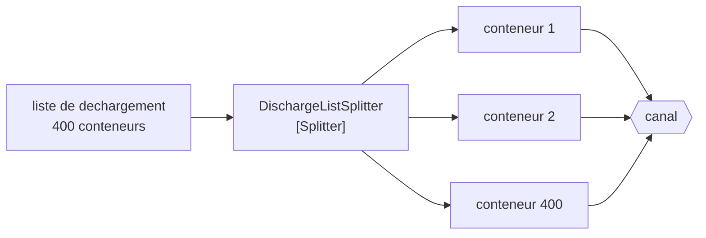

# Splitter

🌍 🇫🇷 Français (ce fichier) · 🇬🇧 [English](Splitter-en.md)

## Intention

Splitter décompose un message qui porte plusieurs éléments en un message par élément, de sorte que chacun puisse
être traité et routé pour lui-même.

## Problème

La liste de déchargement d'un navire arrive comme un seul message EDI nommant quatre cents conteneurs.

Chaque étape suivante travaille sur un conteneur à la fois. Le filtre des frigorifiques teste le type d'un
conteneur ; le planificateur de parc attribue un emplacement à un conteneur ; le routeur choisit une destination par
conteneur. Recevant la liste entière, chacun d'eux doit boucler — et chaque boucle est un endroit où une exception
sur le conteneur 213 abandonne les 214 à 400, ou bien où un échec partiel ne laisse personne capable de dire ce qui
a été fait.

Router est pire que boucler. Une liste de quatre cents conteneurs mêlés n'a aucune destination unique : un routeur
envoie donc soit la liste entière partout, soit la déballe — ce qui est ce patron, écrit au mauvais endroit.

## Solution

Le patron transforme l'un en quatre cents.

Un diviseur consomme un message et en émet plusieurs, un par élément. Chaque étape en aval travaille alors à la
granularité qu'elle veut réellement, et chaque conteneur réussit ou échoue pour lui-même.

L'affirmation est l'**arithmétique** : rien de jeté et rien d'inventé. Un lot de quatre cents produit quatre cents
messages, et une règle peut vérifier le compte — ce qui rend une perte silencieuse au milieu d'un déchargement
trouvable plutôt que découverte quand un conteneur manque à un navire.

## Structure



Un en entrée, quatre cents en sortie, et le compte est ce qu'une règle peut vérifier.

## Les rôles

| Rôle | Annotation | S'applique à | Ce qu'il porte |
|---|---|---|---|
| Splitter | `[Splitter]` | interface, classe | Le participant qui consomme un message et en émet plusieurs. |

Un seul rôle, et ce qu'il revendique est dénombrable — ce qui est inhabituel dans ce catalogue. La plupart des
annotations affirment quelque chose sur une forme ou une intention ; celle-ci affirme une égalité entre le nombre
d'éléments d'une entrée et le nombre de messages d'une sortie, et c'est une revendication qu'un test peut tenir.

## L'exemple

Extrait de [`SplitterUsage.cs`](../../../../DesignPatternCatalog.Usage/EnterpriseIntegration/SplitterUsage.cs).

```csharp
[Splitter]
public sealed class DischargeListSplitter {

    public IReadOnlyList<string> Split(IReadOnlyList<string> containerNumbers) => containerNumbers;

}
```

Le corps est la fonction identité, et c'est l'exemple qui est délibéré plutôt que paresseux. Un diviseur qui
filtrerait, réordonnerait ou enrichirait en divisant serait deux patrons sous un seul nom ; l'écrire en identité rend
l'arithmétique visible — quatre cents en entrée, quatre cents en sortie — et toute implémentation réelle se juge
là-dessus.

`IReadOnlyList` des deux côtés veut dire que le diviseur ne peut pas modifier ce qu'on lui a donné : la liste
d'entrée reste ce que l'étape amont a produit.

Il n'y a aucun canal dans la signature. Le diviseur émet des messages ; où ils vont est la décision d'un
[routeur](MessageRouter-fr.md), et tenir les deux à part est ce qui permet qu'une liste de déchargement soit divisée
une fois et routée différemment par des terminaux différents.

L'exemple énonce l'affirmation et sa raison d'être : *un lot de quatre cents conteneurs produit quatre cents
messages, et une règle peut vérifier le compte — ce qui rend une perte silencieuse au milieu d'un déchargement
trouvable.*

## Possibilités d'application

**Employez un diviseur là où un message porte plusieurs éléments traités séparément.** Le cas du livre, et la forme
la plus courante de toute intégration EDI.

**Employez-le là où un échec devrait être par élément.** Un conteneur qui échoue à la validation ne devrait pas
abandonner les trois cent quatre-vingt-dix-neuf autres.

**Employez-le avant le routage.** Des éléments qui ont besoin de destinations différentes ne peuvent pas être routés
tant qu'ils sont un seul message.

**Gardez l'arithmétique vraie.** Rien de jeté et rien d'inventé est la revendication ; un diviseur qui filtre aussi a
rendu le compte incapable de rien prouver.

## Quand ne pas l'utiliser

**Ne l'employez pas là où les éléments n'ont de sens qu'ensemble.** Une liste de déchargement qui doit être acceptée
ou rejetée en bloc est une seule unité de travail, et la diviser oblige à la réassembler avant que quoi que ce soit
puisse décider.

**Ne le laissez pas filtrer.** Jeter des éléments en divisant détruit l'arithmétique, qui est la seule chose que
l'annotation affirme. Filtrez ensuite, avec un [filtre](MessageFilter-fr.md), là où le compte de ce qui a été jeté est
un fait à part entière.

**Ne l'employez pas sans décider ce qui réassemble.** Quatre cents messages sans [agrégateur](Aggregator-fr.md)
derrière signifient que personne ne peut dire que le déchargement est fini — l'armateur voulait une réponse et en a
reçu quatre cents.

**Ne perdez pas l'ensemble.** Les messages divisés ont besoin d'une [séquence](MessageSequence-fr.md) si quoi que ce
soit en aval doit savoir à quel déchargement ils appartiennent, et combien il y en avait.

**Ne divisez pas ce qui ne tiendra pas dans le débit du receveur.** Transformer un message en quatre cents multiplie
la charge par quatre cents, et une étape en aval dimensionnée pour des listes ne l'est pas pour des éléments.

## Avantages

* Chaque étape en aval travaille à la granularité qu'elle veut réellement.
* Un échec est par élément plutôt que par lot.
* Les éléments peuvent être routés différemment, ce qui est impossible tant qu'ils sont un seul message.
* L'arithmétique est vérifiable : une perte silencieuse au milieu est trouvable.
* Les éléments peuvent être traités concurremment, ce qu'un message unique ne permet pas.

## Inconvénients

* Le volume de messages est multiplié par le nombre d'éléments, et tout l'aval le paie.
* L'ensemble est perdu à moins que quelque chose le porte — les éléments ne savent plus qu'ils étaient une liste de
  déchargement.
* L'ordre est perdu dès que les éléments sont traités concurremment.
* L'achèvement partiel devient possible : trois cent quatre-vingt-dix-neuf faits, et rien qui le dise.
* Un agrégateur est d'ordinaire nécessaire derrière, ce qui apporte un état et un problème de complétude propre.

## Liens avec les autres patrons

**`Aggregator`** est le pendant, et les deux forment d'ordinaire une paire : ce qu'un diviseur défait, un agrégateur
le refait.

**`MessageSequence`** est ce que les messages émis portent pour que l'ensemble survive à la division — quel ensemble,
quelle place, combien.

**`ComposedMessageProcessor`** est le diviseur, un routeur et un agrégateur assemblés en une étape adressable.

**`Resequencer`** est ce qui rétablit l'ordre que la division et la concurrence ont détruit.

**`RecipientList`** transforme elle aussi un message en plusieurs, et la différence est ce qui voyage : des parties
ici, le message entier là-bas.

**`ClaimCheck`** est l'alternative pour un gros message qui n'a pas besoin d'être divisé — le stocker et passer une
référence.

## Source

*Enterprise Integration Patterns*, Gregor Hohpe et Bobby Woolf, Addison-Wesley, 2003 — le chapitre sur le routage
des messages.

* [Entrée d'index](../../../generated/catalog-index.md#splitter-enterprise-integration-patterns)
* [Attribut généré](../../../../DesignPatternCatalog.EnterpriseIntegration/Splitter.cs)
* [Exemple](../../../../DesignPatternCatalog.Usage/EnterpriseIntegration/SplitterUsage.cs)
