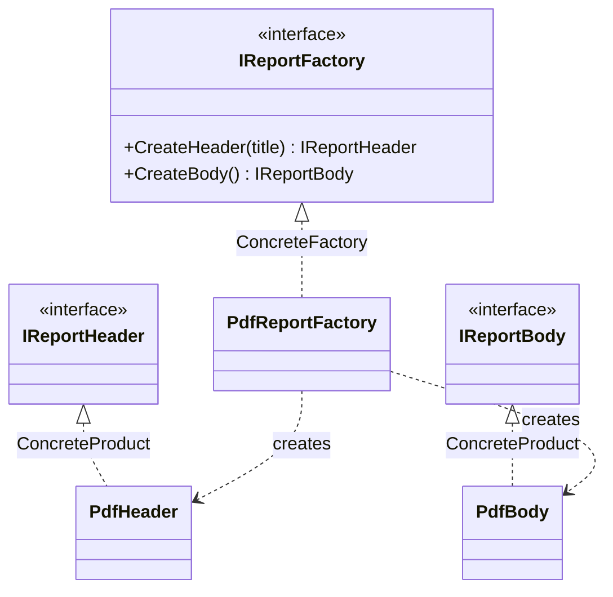

# Abstract Factory

🌍 🇬🇧 English (this file) · 🇫🇷 [Français](AbstractFactory-fr.md)

> Provides an interface for creating families of related or dependent objects without specifying their
> concrete classes.
>
> — Gamma, Helm, Johnson & Vlissides, *Design Patterns*, 1994

## The problem

You are rendering a report, and a report has parts: a header, a body, later a footer and a table of
contents. You render it to PDF, and also to HTML.

The parts are not independent. A PDF header and an HTML body do not make a report — they make a
corrupt file. The parts of one output format form a **family**, and members of two families must never
be mixed.

Now write it the obvious way:

```csharp
var header = new PdfHeader(title);
var body    = new HtmlBody();     // compiles, ships, breaks
```

Nothing stopped that. The constraint "these two go together" exists only in the head of whoever wrote
the class, and it has to be re-remembered at every call site. Adding a third format means finding all
of them.

## The solution

Give the family an object.

Declare one interface whose operations create each member — `CreateHeader`, `CreateBody` — and one
implementation per family. A caller holds the interface, never the concrete classes, and asks it for
parts. Whichever implementation it was handed decides the whole family at once, so a mismatch is no
longer something to remember: it is something that cannot be expressed.

The choice of family is made **once**, where the factory is chosen, instead of at every `new`.

## Structure



Read it as two columns. On the left the factory axis, on the right the product axis; each concrete
factory reaches across to the concrete products of **its own** family and to no others.

## The roles

| Role | Annotation | Applies to | What it carries |
|---|---|---|---|
| AbstractFactory | `[AbstractFactory.AbstractFactory]` | interface, class | Declares the set of operations that create the abstract products of the family. |
| ConcreteFactory | `[AbstractFactory.ConcreteFactory]` | class | Implements the creation operations for one coherent family of concrete products. |
| AbstractProduct | `[AbstractFactory.AbstractProduct]` | interface, class | Declares the interface of one kind of product the family produces. |
| ConcreteProduct | `[AbstractFactory.ConcreteProduct]` | class, struct | Implements one abstract product, and is created by exactly one concrete factory. |

## The example

From [`AbstractFactoryUsage.cs`](../../../../DesignPatternCatalog.Usage/GangOfFour/AbstractFactoryUsage.cs).

```csharp
[AbstractFactory.AbstractFactory]
public interface IReportFactory {

    IReportHeader CreateHeader(string title);
    IReportBody   CreateBody();

}
```

One operation per kind of part. This interface is the contract of a *family*: whoever implements it
undertakes to produce parts that belong together.

```csharp
[AbstractFactory.AbstractProduct]
public interface IReportHeader { }

[AbstractFactory.AbstractProduct]
public interface IReportBody { }
```

The two abstract products. The caller sees only these, which is what keeps it ignorant of PDF.

```csharp
[AbstractFactory.ConcreteFactory(AbstractFactory = typeof(IReportFactory))]
public sealed class PdfReportFactory : IReportFactory {

    public IReportHeader CreateHeader(string title) => new PdfHeader(title);
    public IReportBody   CreateBody()               => new PdfBody();

}
```

Here is the family, stated in one place. Note the annotation's argument: `AbstractFactory = typeof(IReportFactory)`
binds this participant to *this* occurrence of the pattern. A codebase with a report factory and an
invoice factory has two Abstract Factories, and the link is what tells them apart — the type hierarchy
alone would not.

```csharp
[AbstractFactory.ConcreteProduct(AbstractProduct = typeof(IReportHeader))]
public sealed class PdfHeader : IReportHeader {

    public PdfHeader(string title) { Title = title; }
    public string Title { get; }

}
```

Each concrete product declares which abstract product it implements. The compiler knows it too, from
`: IReportHeader` — the link is only needed where the hierarchy does not already say it, and is
optional otherwise.

**One honest word about this sample.** It shows a single family, PDF. A single family is not yet a
reason to use the pattern; the pattern earns its keep at the *second* one, when `HtmlReportFactory`
arrives and not one line of calling code changes. Read the sample as the shape you would already have
in place when that day comes.

## When to use it

The book's own list:

* the system should be independent of how its products are created, composed and represented;
* it should be configured with **one of several families** of products;
* a family of related products is designed to be used together, and **you need to enforce that**;
* you publish a library of products and want to reveal their interfaces, not their implementations.

The third is the discriminating one. If nothing goes wrong when parts of different families are mixed,
you do not have this problem.

## When not to use it

* **There is only one family.** Then the interface, the concrete factory and the two abstract product
  types buy nothing: nothing varies. Construct directly, or use a `FactoryMethod` for the one thing
  that does vary. Add the abstraction when the second family appears, not in anticipation of it.
* **What varies is one object, not a family.** One product with several implementations is
  `FactoryMethod` or plain injection. Abstract Factory is for the *correlation* between several
  products; without correlation it is ceremony.
* **The family gains new kinds of member often.** This is the pattern's stated weakness, and it is
  structural: adding `CreateFooter` means changing the abstract factory and **every** concrete factory
  at once. Families that grow members frequently fight the pattern; families that gain new *variants*
  suit it perfectly.
* **A container already does it.** On .NET, registering a coherent set of implementations per
  configuration achieves the same effect without the parallel hierarchy — the composition root becomes
  the place where the family is chosen. Reach for Abstract Factory when the choice is made at run time
  and repeatedly, rather than once at start-up.

## What it costs

**What you gain**

* concrete classes are isolated: callers name only interfaces, so swapping a family touches one line;
* exchanging whole families is easy, because a family is a single object;
* consistency among products is enforced by construction rather than by discipline.

**What you pay**

* **supporting new kinds of product is hard** — the abstract factory's interface is a contract every
  concrete factory must honour, so every addition ripples across all of them;
* a class explosion: with *m* kinds of product and *n* families you carry `m + n + m×n` types;
* one more level of indirection between a caller and the object it gets.

## Patterns it is confused with

| | |
|---|---|
| **`FactoryMethod`** | One product, chosen by a subclass. Abstract Factory is several products chosen together by an object. An Abstract Factory is very often *implemented* with factory methods — one per creation operation. |
| **`Builder`** | Also assembles something complicated, but step by step and returning the result at the end. Abstract Factory returns each part immediately. Builder is about the *construction sequence*; Abstract Factory is about the *family*. |
| **`Prototype`** | A concrete factory can be built from prototypes — it clones a stored instance per product instead of `new`-ing one — which is a way to implement this pattern rather than an alternative to it. |
| **`Singleton`** | A concrete factory usually needs to exist once, so the two are often seen together. Unrelated intents. |

## Where this comes from

*Design Patterns: Elements of Reusable Object-Oriented Software*, Gamma, Helm, Johnson & Vlissides,
Addison-Wesley, 1994 — the Creational patterns chapter.

* [Index entry](../../../generated/catalog-index.md#abstractfactory-gang-of-four) — the annotations,
  the targets, the links.
* [Generated attribute](../../../../DesignPatternCatalog.GangOfFour/AbstractFactory.cs)
* [Sample](../../../../DesignPatternCatalog.Usage/GangOfFour/AbstractFactoryUsage.cs)
