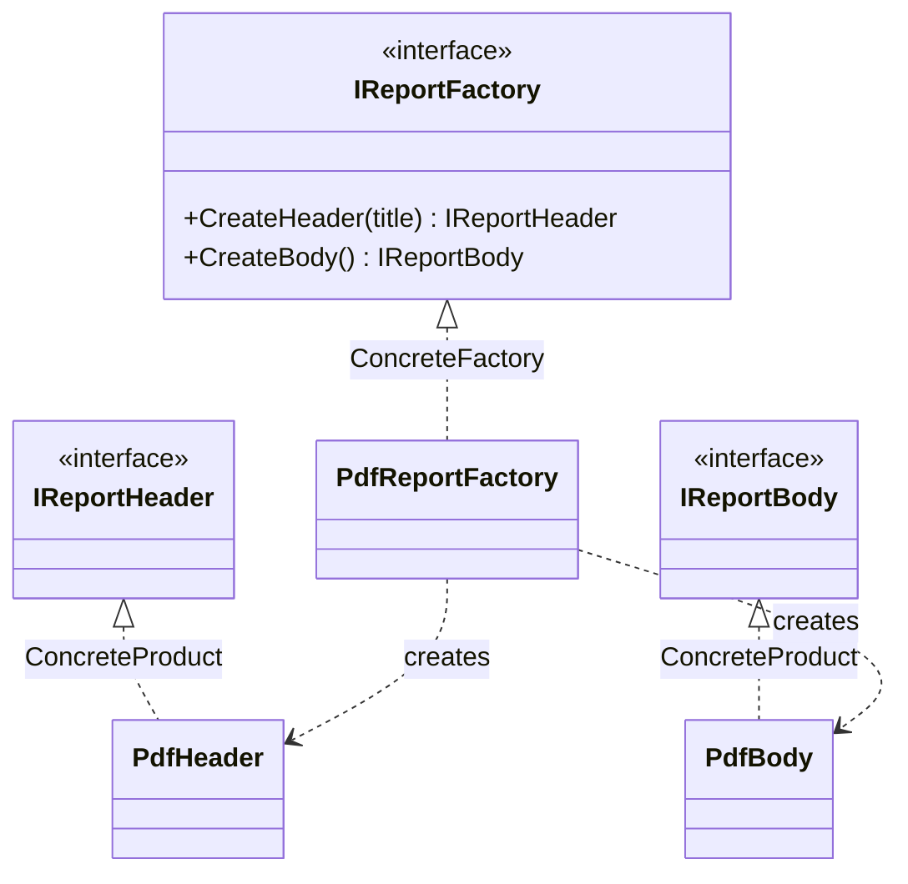

# Abstract Factory

🌍 🇬🇧 English (this file) · 🇫🇷 [Français](AbstractFactory-fr.md)

## Intent

Abstract Factory is a creational pattern that provides an interface for creating families of related or
dependent objects without specifying their concrete classes.

## Problem

Consider a report renderer. A report has parts — a header, a body, later a footer and a table of
contents — and it must be produced as PDF and as HTML.

The parts are not independent. A PDF header and an HTML body do not make a report, they make a corrupt
file. The parts of one output format form a family, and members of two families must never be mixed.

Written the obvious way, nothing prevents the mismatch:

```csharp
var header = new PdfHeader(title);
var body   = new HtmlBody();     // compiles, ships, breaks
```

The constraint "these two belong together" exists only in the mind of whoever wrote the class, and it
has to be recalled at every call site. Adding a third format means finding all of them.

## Solution

The pattern gives the family an object.

One interface declares an operation per member of the family — `CreateHeader`, `CreateBody` — and one
implementation exists per family. A caller holds the interface, never the concrete classes, and asks it
for parts. Whichever implementation it was handed decides the entire family at once, so a mismatch
stops being something to remember and becomes something that cannot be expressed.

The choice of family is made once, where the factory is chosen, instead of at every `new`.

## Structure



The diagram has two axes: the factory hierarchy on the left, the product hierarchies on the right. Each
concrete factory reaches across to the concrete products of its own family and to no others.

## The roles

| Role | Annotation | Applies to | What it carries |
|---|---|---|---|
| AbstractFactory | `[AbstractFactory.AbstractFactory]` | interface, class | Declares the set of operations that create the abstract products of the family. |
| ConcreteFactory | `[AbstractFactory.ConcreteFactory]` | class | Implements the creation operations for one coherent family of concrete products. |
| AbstractProduct | `[AbstractFactory.AbstractProduct]` | interface, class | Declares the interface of one kind of product the family produces. |
| ConcreteProduct | `[AbstractFactory.ConcreteProduct]` | class, struct | Implements one abstract product, and is created by exactly one concrete factory. |

## The example

From [`AbstractFactoryUsage.cs`](../../../../DesignPatternCatalog.Usage/GangOfFour/AbstractFactoryUsage.cs).

```csharp
[AbstractFactory.AbstractFactory]
public interface IReportFactory {

    IReportHeader CreateHeader(string title);
    IReportBody   CreateBody();

}
```

One operation per kind of part. This interface is the contract of a family: whoever implements it
undertakes to produce parts that belong together.

```csharp
[AbstractFactory.AbstractProduct]
public interface IReportHeader { }

[AbstractFactory.AbstractProduct]
public interface IReportBody { }
```

The two abstract products. A caller sees only these, which is what keeps it ignorant of PDF.

```csharp
[AbstractFactory.ConcreteFactory(AbstractFactory = typeof(IReportFactory))]
public sealed class PdfReportFactory : IReportFactory {

    public IReportHeader CreateHeader(string title) => new PdfHeader(title);
    public IReportBody   CreateBody()               => new PdfBody();

}
```

The family, stated in one place. The annotation's argument — `AbstractFactory = typeof(IReportFactory)`
— binds this participant to this occurrence of the pattern. A codebase with a report factory and an
invoice factory holds two Abstract Factories, and the link is what tells them apart; the type hierarchy
alone would not.

```csharp
[AbstractFactory.ConcreteProduct(AbstractProduct = typeof(IReportHeader))]
public sealed class PdfHeader : IReportHeader {

    public PdfHeader(string title) { Title = title; }
    public string Title { get; }

}
```

Each concrete product declares which abstract product it implements. The compiler knows that too, from
`: IReportHeader`, so the link is only needed where the hierarchy does not already say it.

The sample carries a single family, PDF. One family is not yet a reason to apply the pattern; the
pattern earns its place at the second, when `HtmlReportFactory` arrives and no calling code changes.

## Applicability

**Use Abstract Factory when the system should be independent of how its products are created, composed
and represented.**

**Use Abstract Factory when the system must be configured with one of several families of products.**

**Use Abstract Factory when a family of related products is designed to be used together and that
constraint has to be enforced.** This is the discriminating condition: if nothing goes wrong when parts
of different families are mixed, the problem the pattern solves is absent.

**Use Abstract Factory when publishing a library of products whose interfaces should be visible and
whose implementations should not.**

## When not to use it

**Do not use Abstract Factory for a single family.** The interface, the concrete factory and the
abstract product types buy nothing while nothing varies. Direct construction, or a `FactoryMethod` for
the one thing that does vary, is enough. The abstraction belongs to the day the second family appears,
not to the anticipation of it.

**Do not use Abstract Factory when what varies is one object rather than a family.** One product with
several implementations is `FactoryMethod`, or plain injection. Abstract Factory serves the correlation
between several products; without correlation it is ceremony.

**Do not use Abstract Factory for a family that often gains new kinds of member.** This is the pattern's
stated weakness and it is structural: adding `CreateFooter` changes the abstract factory and every
concrete factory at once. Families that gain new variants suit the pattern; families that gain new
members fight it.

**Do not use Abstract Factory where a container already does the work.** On .NET, registering a coherent
set of implementations per configuration produces the same effect without the parallel hierarchy, the
composition root becoming the place where the family is chosen. The pattern is worth its cost when the
choice is made repeatedly at run time rather than once at start-up.

## Advantages

* Concrete classes are isolated: callers name interfaces only, so changing family touches one line.
* Whole families are exchanged at once, a family being a single object.
* Consistency among products is enforced by construction rather than by discipline.

## Drawbacks

* Supporting a new kind of product is hard: the abstract factory's interface is a contract every
  concrete factory honours, so each addition ripples through all of them.
* The type count grows quickly — `m` kinds of product across `n` families means `m + n + m×n` types.
* One more level of indirection sits between a caller and the object it receives.

## Relations with other patterns

**`FactoryMethod`** creates one product, chosen by a subclass, where Abstract Factory creates several
chosen together by an object. An Abstract Factory is very often implemented with factory methods, one
per creation operation, so the two nest rather than compete.

**`Builder`** also assembles something complicated, but step by step, returning the result at the end;
Abstract Factory returns each part immediately. Builder is about the construction sequence, Abstract
Factory about the family.

**`Prototype`** can implement a concrete factory: it clones a stored instance per product instead of
constructing one.

**`Singleton`** often applies to a concrete factory, which usually needs to exist once. The intents are
unrelated.

## Source

*Design Patterns: Elements of Reusable Object-Oriented Software*, Gamma, Helm, Johnson & Vlissides,
Addison-Wesley, 1994 — the creational patterns chapter.

* [Index entry](../../../generated/catalog-index.md#abstractfactory-gang-of-four)
* [Generated attribute](../../../../DesignPatternCatalog.GangOfFour/AbstractFactory.cs)
* [Sample](../../../../DesignPatternCatalog.Usage/GangOfFour/AbstractFactoryUsage.cs)
