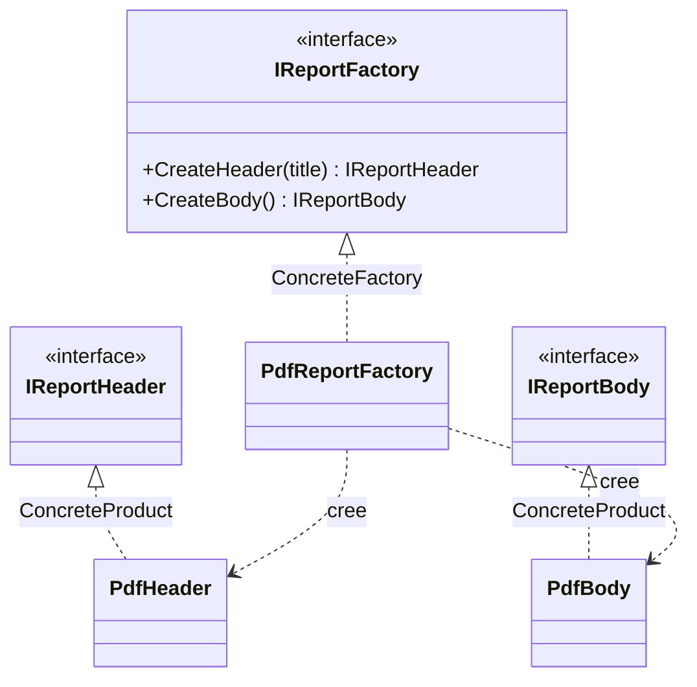

# Abstract Factory

🌍 🇫🇷 Français (ce fichier) · 🇬🇧 [English](AbstractFactory-en.md)

## Intention

Abstract Factory est un patron de création qui fournit une interface pour créer des familles d'objets
liés ou dépendants sans spécifier leurs classes concrètes.

## Problème

Prenons un générateur de rapports. Un rapport a des parties — un en-tête, un corps, plus tard un pied de
page et une table des matières — et il doit être produit en PDF comme en HTML.

Les parties ne sont pas indépendantes. Un en-tête PDF et un corps HTML ne font pas un rapport, ils font
un fichier corrompu. Les parties d'un format forment une famille, et les membres de deux familles ne
doivent jamais se mélanger.

Écrite de la façon évidente, la construction n'empêche rien :

```csharp
var header = new PdfHeader(title);
var body   = new HtmlBody();     // compile, part en production, casse
```

La contrainte « ces deux-là vont ensemble » n'existe que dans l'esprit de qui a écrit la classe, et il
faut se la remémorer à chaque site d'appel. L'ajout d'un troisième format oblige à les retrouver tous.

## Solution

Le patron donne un objet à la famille.

Une interface déclare une opération par membre de la famille — `CreateHeader`, `CreateBody` — et il
existe une implémentation par famille. L'appelant tient l'interface, jamais les classes concrètes, et lui
demande ses parties. L'implémentation qui lui a été confiée décide de toute la famille d'un coup : un
mélange cesse d'être une chose dont il faut se souvenir et devient une chose qui ne peut pas s'exprimer.

Le choix de la famille se fait une fois, là où la fabrique est choisie, au lieu de se refaire à chaque
`new`.

## Structure



Le diagramme a deux axes : la hiérarchie des fabriques à gauche, celles des produits à droite. Chaque
fabrique concrète traverse vers les produits concrets de sa propre famille et d'aucune autre.

## Les rôles

| Rôle | Annotation | S'applique à | Ce qu'il porte |
|---|---|---|---|
| AbstractFactory | `[AbstractFactory.AbstractFactory]` | interface, classe | Déclare l'ensemble des opérations qui créent les produits abstraits de la famille. |
| ConcreteFactory | `[AbstractFactory.ConcreteFactory]` | classe | Implémente les opérations de création pour une famille cohérente de produits concrets. |
| AbstractProduct | `[AbstractFactory.AbstractProduct]` | interface, classe | Déclare l'interface d'un type de produit que la famille fabrique. |
| ConcreteProduct | `[AbstractFactory.ConcreteProduct]` | classe, struct | Implémente un produit abstrait, et est créé par exactement une fabrique concrète. |

## L'exemple

Extrait de [`AbstractFactoryUsage.cs`](../../../../DesignPatternCatalog.Usage/GangOfFour/AbstractFactoryUsage.cs).

```csharp
[AbstractFactory.AbstractFactory]
public interface IReportFactory {

    IReportHeader CreateHeader(string title);
    IReportBody   CreateBody();

}
```

Une opération par type de partie. Cette interface est le contrat d'une famille : qui l'implémente
s'engage à produire des parties qui vont ensemble.

```csharp
[AbstractFactory.AbstractProduct]
public interface IReportHeader { }

[AbstractFactory.AbstractProduct]
public interface IReportBody { }
```

Les deux produits abstraits. Un appelant ne voit qu'eux, ce qui le maintient ignorant du PDF.

```csharp
[AbstractFactory.ConcreteFactory(AbstractFactory = typeof(IReportFactory))]
public sealed class PdfReportFactory : IReportFactory {

    public IReportHeader CreateHeader(string title) => new PdfHeader(title);
    public IReportBody   CreateBody()               => new PdfBody();

}
```

La famille, énoncée en un seul endroit. L'argument de l'annotation —
`AbstractFactory = typeof(IReportFactory)` — rattache ce participant à cette occurrence du patron. Une
base de code qui possède une fabrique de rapports et une fabrique de factures tient deux Abstract
Factory, et le lien est ce qui les distingue ; la hiérarchie de types seule ne le dirait pas.

```csharp
[AbstractFactory.ConcreteProduct(AbstractProduct = typeof(IReportHeader))]
public sealed class PdfHeader : IReportHeader {

    public PdfHeader(string title) { Title = title; }
    public string Title { get; }

}
```

Chaque produit concret déclare quel produit abstrait il implémente. Le compilateur le sait aussi, par
`: IReportHeader`, de sorte que le lien n'est nécessaire que là où la hiérarchie ne le dit pas déjà.

L'exemple ne porte qu'une famille, PDF. Une famille n'est pas encore une raison d'appliquer le patron ;
celui-ci gagne sa place à la deuxième, quand `HtmlReportFactory` arrive et qu'aucun code appelant ne
change.

## Possibilités d'application

**Utilisez Abstract Factory lorsque le système doit être indépendant de la façon dont ses produits sont
créés, composés et représentés.**

**Utilisez Abstract Factory lorsque le système doit être configurable avec une famille de produits parmi
plusieurs.**

**Utilisez Abstract Factory lorsqu'une famille de produits liés est conçue pour être utilisée ensemble et
que cette contrainte doit être tenue.** C'est la condition discriminante : si rien ne casse quand des
parties de familles différentes se mélangent, le problème que résout le patron est absent.

**Utilisez Abstract Factory lorsque vous publiez une bibliothèque de produits dont les interfaces
doivent être visibles et les implémentations non.**

## Quand ne pas l'utiliser

**N'utilisez pas Abstract Factory pour une famille unique.** L'interface, la fabrique concrète et les
types de produits abstraits n'achètent rien tant que rien ne varie. Une construction directe, ou une
`FactoryMethod` pour la seule chose qui varie, suffit. L'abstraction appartient au jour où la deuxième
famille apparaît, non à son anticipation.

**N'utilisez pas Abstract Factory quand ce qui varie est un objet et non une famille.** Un produit à
plusieurs implémentations relève de `FactoryMethod` ou d'une simple injection. Abstract Factory sert la
corrélation entre plusieurs produits ; sans corrélation, c'est du cérémonial.

**N'utilisez pas Abstract Factory pour une famille qui gagne souvent de nouveaux types de membres.**
C'est la faiblesse annoncée du patron, et elle est structurelle : ajouter `CreateFooter` modifie la
fabrique abstraite et toutes les fabriques concrètes d'un coup. Les familles qui gagnent de nouvelles
variantes lui conviennent ; celles qui gagnent de nouveaux membres luttent contre lui.

**N'utilisez pas Abstract Factory là où un conteneur fait déjà le travail.** Sur .NET, enregistrer un jeu
cohérent d'implémentations par configuration produit le même effet sans la hiérarchie parallèle, la
racine de composition devenant l'endroit où la famille est choisie. Le patron mérite son coût quand le
choix se fait de façon répétée à l'exécution plutôt qu'une fois au démarrage.

## Avantages

* Les classes concrètes sont isolées : les appelants ne nomment que des interfaces, donc changer de
  famille touche une ligne.
* Des familles entières s'échangent d'un coup, une famille étant un seul objet.
* La cohérence entre produits est tenue par construction plutôt que par discipline.

## Inconvénients

* Ajouter un type de produit est difficile : l'interface de la fabrique abstraite est un contrat que
  chaque fabrique concrète honore, donc chaque ajout se propage à toutes.
* Le nombre de types croît vite — `m` types de produits sur `n` familles donnent `m + n + m×n` types.
* Un niveau d'indirection supplémentaire s'intercale entre un appelant et l'objet qu'il reçoit.

## Liens avec les autres patrons

**`FactoryMethod`** crée un produit choisi par une sous-classe, là où Abstract Factory en crée plusieurs
choisis ensemble par un objet. Une Abstract Factory est très souvent implémentée avec des factory
methods, une par opération de création : les deux s'emboîtent plutôt qu'ils ne rivalisent.

**`Builder`** assemble aussi quelque chose de compliqué, mais étape par étape, en rendant le résultat à
la fin ; Abstract Factory rend chaque partie immédiatement. Builder porte sur la séquence de
construction, Abstract Factory sur la famille.

**`Prototype`** peut implémenter une fabrique concrète : elle clone une instance stockée par produit au
lieu d'en construire une.

**`Singleton`** s'applique souvent à une fabrique concrète, qui n'a d'ordinaire besoin d'exister qu'une
fois. Les intentions sont sans rapport.

## Source

*Design Patterns: Elements of Reusable Object-Oriented Software*, Gamma, Helm, Johnson & Vlissides,
Addison-Wesley, 1994 — chapitre des patrons de création.

* [Entrée d'index](../../../generated/catalog-index.md#abstractfactory-gang-of-four)
* [Attribut généré](../../../../DesignPatternCatalog.GangOfFour/AbstractFactory.cs)
* [Exemple](../../../../DesignPatternCatalog.Usage/GangOfFour/AbstractFactoryUsage.cs)
