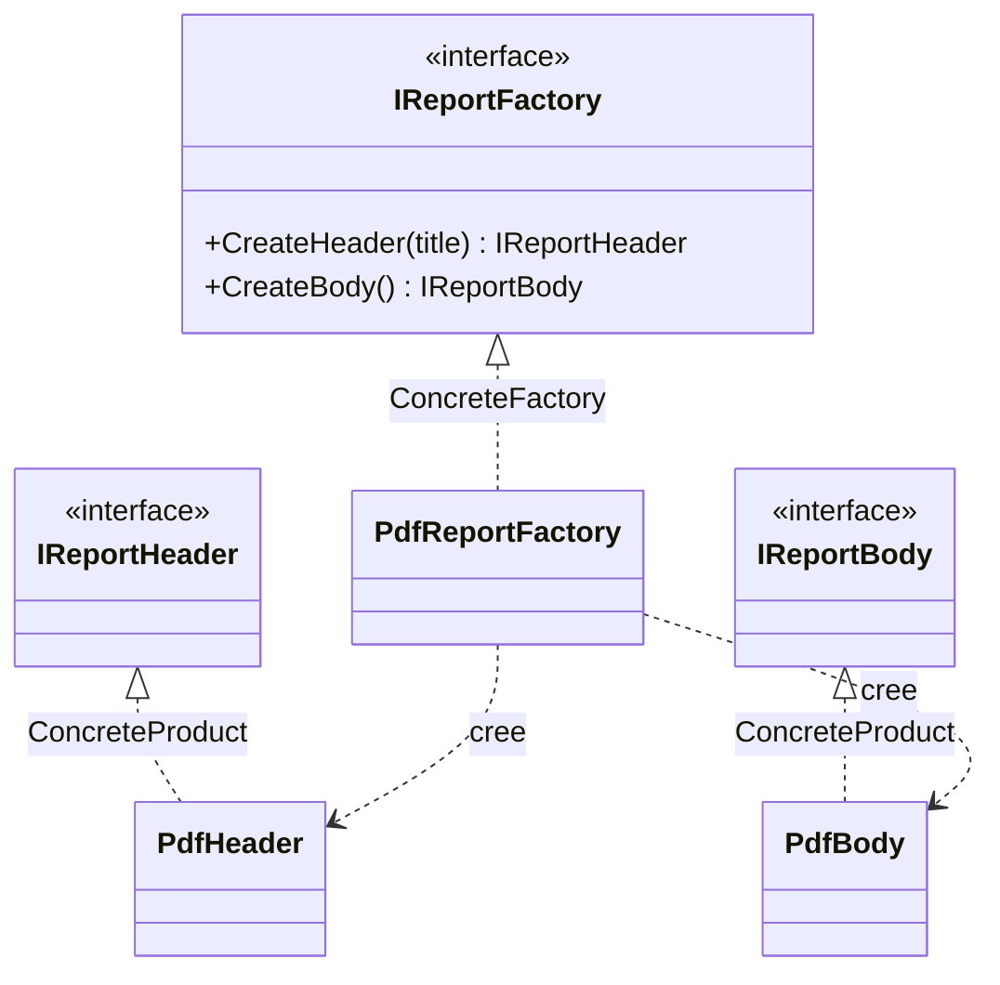

# Abstract Factory

🌍 🇫🇷 Français (ce fichier) · 🇬🇧 [English](AbstractFactory-en.md)

> Fournit une interface pour créer des familles d'objets liés ou dépendants sans spécifier leurs
> classes concrètes.
>
> — Gamma, Helm, Johnson & Vlissides, *Design Patterns*, 1994

## Le problème

Tu produis un rapport, et un rapport a des parties : un en-tête, un corps, plus tard un pied de page
et une table des matières. Tu le produis en PDF, et aussi en HTML.

Les parties ne sont pas indépendantes. Un en-tête PDF et un corps HTML ne font pas un rapport — ils
font un fichier corrompu. Les parties d'un format forment une **famille**, et les membres de deux
familles ne doivent jamais se mélanger.

Écris-le maintenant de la façon évidente :

```csharp
var header = new PdfHeader(title);
var body   = new HtmlBody();     // compile, part en production, casse
```

Rien ne l'a empêché. La contrainte « ces deux-là vont ensemble » n'existe que dans la tête de celui
qui a écrit la classe, et il faut se la remémorer à chaque site d'appel. Ajouter un troisième format
oblige à tous les retrouver.

## La solution

Donner un objet à la famille.

Déclarer une interface dont les opérations créent chaque membre — `CreateHeader`, `CreateBody` — et
une implémentation par famille. L'appelant tient l'interface, jamais les classes concrètes, et lui
demande ses parties. L'implémentation qu'on lui a confiée décide de toute la famille d'un coup : un
mélange n'est plus quelque chose dont il faut se souvenir, c'est quelque chose qui ne peut pas
s'exprimer.

Le choix de la famille se fait **une fois**, là où la fabrique est choisie, au lieu de se faire à
chaque `new`.

## Structure



Lis-le en deux colonnes. À gauche l'axe des fabriques, à droite l'axe des produits ; chaque fabrique
concrète traverse vers les produits concrets de **sa propre** famille et d'aucune autre.

## Les rôles

| Rôle | Annotation | S'applique à | Ce qu'il porte |
|---|---|---|---|
| AbstractFactory | `[AbstractFactory.AbstractFactory]` | interface, classe | Déclare l'ensemble des opérations qui créent les produits abstraits de la famille. |
| ConcreteFactory | `[AbstractFactory.ConcreteFactory]` | classe | Implémente les opérations de création pour une famille cohérente de produits concrets. |
| AbstractProduct | `[AbstractFactory.AbstractProduct]` | interface, classe | Déclare l'interface d'un type de produit que la famille fabrique. |
| ConcreteProduct | `[AbstractFactory.ConcreteProduct]` | classe, struct | Implémente un produit abstrait, et est créé par exactement une fabrique concrète. |

## L'exemple

Tiré de [`AbstractFactoryUsage.cs`](../../../../DesignPatternCatalog.Usage/GangOfFour/AbstractFactoryUsage.cs).

```csharp
[AbstractFactory.AbstractFactory]
public interface IReportFactory {

    IReportHeader CreateHeader(string title);
    IReportBody   CreateBody();

}
```

Une opération par type de partie. Cette interface est le contrat d'une *famille* : qui l'implémente
s'engage à produire des parties qui vont ensemble.

```csharp
[AbstractFactory.AbstractProduct]
public interface IReportHeader { }

[AbstractFactory.AbstractProduct]
public interface IReportBody { }
```

Les deux produits abstraits. L'appelant ne voit qu'eux, et c'est ce qui le maintient ignorant du PDF.

```csharp
[AbstractFactory.ConcreteFactory(AbstractFactory = typeof(IReportFactory))]
public sealed class PdfReportFactory : IReportFactory {

    public IReportHeader CreateHeader(string title) => new PdfHeader(title);
    public IReportBody   CreateBody()               => new PdfBody();

}
```

Voici la famille, énoncée en un seul endroit. Note l'argument de l'annotation :
`AbstractFactory = typeof(IReportFactory)` rattache ce participant à *cette* occurrence du pattern. Une
base de code qui a une fabrique de rapports et une fabrique de factures a deux Abstract Factory, et
c'est le lien qui les distingue — la hiérarchie de types seule ne le dirait pas.

```csharp
[AbstractFactory.ConcreteProduct(AbstractProduct = typeof(IReportHeader))]
public sealed class PdfHeader : IReportHeader {

    public PdfHeader(string title) { Title = title; }
    public string Title { get; }

}
```

Chaque produit concret déclare quel produit abstrait il implémente. Le compilateur le sait aussi, par
`: IReportHeader` — le lien n'est nécessaire que là où la hiérarchie ne le dit pas déjà, et reste
optionnel sinon.

**Un mot honnête sur cet exemple.** Il ne montre qu'une famille, PDF. Une seule famille n'est pas
encore une raison d'employer le pattern ; le pattern gagne sa place à la *deuxième*, quand
`HtmlReportFactory` arrive et que pas une ligne du code appelant ne change. Lis l'exemple comme la
forme que tu aurais déjà en place le jour venu.

## Quand l'utiliser

La liste du livre :

* le système doit être indépendant de la façon dont ses produits sont créés, composés et représentés ;
* il doit être configurable avec **une famille parmi plusieurs** ;
* une famille de produits liés est conçue pour être utilisée ensemble, et **il faut le faire
  respecter** ;
* tu publies une bibliothèque de produits et veux en révéler les interfaces, pas les implémentations.

Le troisième est le point discriminant. Si rien ne casse quand des parties de familles différentes se
mélangent, tu n'as pas ce problème.

## Quand ne pas l'utiliser

* **Il n'y a qu'une famille.** Alors l'interface, la fabrique concrète et les deux types de produits
  abstraits n'achètent rien : rien ne varie. Construis directement, ou emploie une `FactoryMethod`
  pour la seule chose qui varie. Ajoute l'abstraction quand la deuxième famille apparaît, pas par
  anticipation.
* **Ce qui varie est un objet, pas une famille.** Un produit avec plusieurs implémentations relève de
  `FactoryMethod` ou d'une simple injection. Abstract Factory sert la *corrélation* entre plusieurs
  produits ; sans corrélation, c'est du cérémonial.
* **La famille gagne souvent de nouveaux types de membres.** C'est la faiblesse annoncée du pattern, et
  elle est structurelle : ajouter `CreateFooter` oblige à modifier la fabrique abstraite **et toutes**
  les fabriques concrètes d'un coup. Les familles qui gagnent souvent des membres luttent contre le
  pattern ; celles qui gagnent de nouvelles *variantes* lui conviennent parfaitement.
* **Un conteneur le fait déjà.** Sur .NET, enregistrer un jeu cohérent d'implémentations par
  configuration produit le même effet sans la hiérarchie parallèle — la racine de composition devient
  l'endroit où la famille est choisie. Réserve Abstract Factory au cas où le choix se fait à
  l'exécution et de façon répétée, plutôt qu'une fois au démarrage.

## Ce qu'il coûte

**Ce que tu gagnes**

* les classes concrètes sont isolées : les appelants ne nomment que des interfaces, donc changer de
  famille touche une ligne ;
* échanger des familles entières est facile, une famille étant un seul objet ;
* la cohérence entre produits est tenue par construction plutôt que par discipline.

**Ce que tu paies**

* **ajouter un type de produit est difficile** — l'interface de la fabrique abstraite est un contrat
  que chaque fabrique concrète doit honorer, donc chaque ajout se propage à toutes ;
* une explosion de classes : avec *m* types de produits et *n* familles, tu portes `m + n + m×n` types ;
* un niveau d'indirection de plus entre un appelant et l'objet qu'il obtient.

## Patterns qu'on confond avec lui

| | |
|---|---|
| **`FactoryMethod`** | Un produit, choisi par une sous-classe. Abstract Factory, c'est plusieurs produits choisis ensemble par un objet. Une Abstract Factory est très souvent *implémentée* avec des factory methods — une par opération de création. |
| **`Builder`** | Assemble aussi quelque chose de compliqué, mais étape par étape, et rend le résultat à la fin. Abstract Factory rend chaque partie immédiatement. Builder porte sur la *séquence de construction* ; Abstract Factory sur la *famille*. |
| **`Prototype`** | Une fabrique concrète peut être bâtie sur des prototypes — elle clone une instance stockée par produit au lieu d'en construire une — ce qui est une façon d'implémenter ce pattern plutôt qu'une alternative. |
| **`Singleton`** | Une fabrique concrète n'a d'ordinaire besoin d'exister qu'une fois : on les rencontre souvent ensemble. Intentions sans rapport. |

## D'où cela vient

*Design Patterns: Elements of Reusable Object-Oriented Software*, Gamma, Helm, Johnson & Vlissides,
Addison-Wesley, 1994 — chapitre des patterns de création.

* [Entrée d'index](../../../generated/catalog-index.md#abstractfactory-gang-of-four) — les
  annotations, les cibles, les liens.
* [Attribut généré](../../../../DesignPatternCatalog.GangOfFour/AbstractFactory.cs)
* [Exemple](../../../../DesignPatternCatalog.Usage/GangOfFour/AbstractFactoryUsage.cs)
