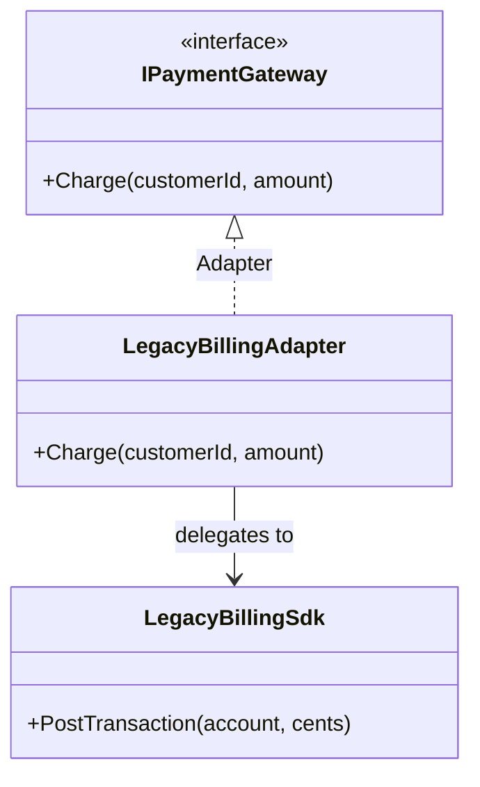

# Adapter

🌍 🇬🇧 English (this file) · 🇫🇷 [Français](Adapter-fr.md)

## Intent

Adapter is a structural pattern that converts the interface of a type into the interface a client
expects, letting types collaborate that could not otherwise because of incompatible interfaces.

## Problem

A billing SDK bought from a third party exposes one operation:

```csharp
public void PostTransaction(int account, long cents) { }
```

The application talks about customers and amounts, not accounts and cents, and every call site already
uses its own vocabulary. Neither side can move: the SDK is not owned, and rewriting the application to
speak in cents would spread a vendor's idea of money through the whole codebase.

## Solution

The pattern introduces a third type whose only job is translation.

It implements the interface the client expects, holds the incompatible object, and converts each call —
arguments, units, names, error conventions. The client compiles against its own vocabulary and never
learns that a translation happened. Replacing the vendor later means writing another adapter and
changing nothing else.

## Structure



The adapter inherits from the target and holds the adaptee. That composition is what the Gang of Four
call an *object adapter*, and it is the only form C# offers, since the language has no multiple
inheritance for classes.

## The roles

| Role | Annotation | Applies to | What it carries |
|---|---|---|---|
| Target | `[Adapter.Target]` | interface, class | Declares the interface the client actually uses. |
| Adapter | `[Adapter.Adapter]` | class | Implements the target interface by delegating to the adaptee and translating the calls. |
| Adaptee | `[Adapter.Adaptee]` | interface, class, struct | Holds the behaviour worth reusing, but exposes it through an incompatible interface. |

## The example

From [`AdapterUsage.cs`](../../../../DesignPatternCatalog.Usage/GangOfFour/AdapterUsage.cs).

```csharp
[Adapter.Target]
public interface IPaymentGateway {
    void Charge(string customerId, decimal amount);
}

[Adapter.Adaptee]
public sealed class LegacyBillingSdk {
    public void PostTransaction(int account, long cents) { }
}
```

The two interfaces that do not meet. `IPaymentGateway` belongs to the application; `LegacyBillingSdk`
arrives as a binary.

```csharp
[Adapter.Adapter(Target = typeof(IPaymentGateway), Adaptee = typeof(LegacyBillingSdk))]
public sealed class LegacyBillingAdapter : IPaymentGateway {

    private readonly LegacyBillingSdk _sdk;

    public LegacyBillingAdapter(LegacyBillingSdk sdk) { _sdk = sdk; }

    public void Charge(string customerId, decimal amount) {
        _sdk.PostTransaction(int.Parse(customerId), (long)(amount * 100));
    }

}
```

One method, and two conversions inside it — and both are where adapters leak. `int.Parse(customerId)`
throws where a customer identifier is not numeric, turning a type mismatch into a run-time failure. The
cast to `long` truncates rather than rounds, so a price of `19.999` posts as `1999` cents.

Neither problem belongs to the pattern; both belong to *this* adapter, and they are the reason an
adapter is a piece of code to test rather than a formality. The translation is where the two models
disagree, and disagreements have to be resolved somewhere.

## Applicability

**Use Adapter to reuse an existing class whose interface does not match the one needed.**

**Use Adapter when creating a reusable class that must cooperate with classes it cannot foresee** — the
class names an interface, and adapters connect it to whatever arrives later.

**Use Adapter to bring several existing types under one interface** without subclassing each of them.

## When not to use it

**Do not use Adapter where both sides are owned.** Changing one of the two interfaces is cheaper than
maintaining a third type forever. An adapter between two of your own classes usually records an
unresolved disagreement about vocabulary rather than a boundary.

**Do not use Adapter where the mismatch is semantic rather than syntactic.** Matching signatures do not
make the operations equivalent: an adapter that maps a total to a subtotal compiles perfectly and is
wrong. The pattern converts shapes, not meanings.

**Do not let one adapter serve many adaptees.** A class implementing one interface over five vendors,
switching on a discriminator, has stopped being an adapter; one adapter per adaptee keeps each
translation readable.

**Do not use Adapter where the translation loses what the caller needs.** Where the adaptee reports
errors, progress or partial results the target interface cannot express, the adapter has to swallow
them, and the caller loses information it may need.

## Advantages

* Client code stays written in its own vocabulary and does not depend on the foreign type.
* The foreign type is replaceable: another vendor means another adapter.
* The conversion lives in one testable place instead of being spread across call sites.

## Drawbacks

* One more type and one more indirection between the caller and the work.
* The translation can lose information the target interface has no way to express.
* An adapter is the place where two models disagree, so it accumulates the awkward cases — parsing,
  rounding, missing fields — and needs tests of its own.

## Relations with other patterns

**`Bridge`** has almost the same structure and the opposite intent. A bridge is designed up front so
that an abstraction and its implementation can vary independently; an adapter is fitted afterwards to
make two things work together that were never designed to.

**`Decorator`** keeps the interface it wraps and adds behaviour, where Adapter changes the interface and
adds none.

**`Facade`** simplifies a whole subsystem behind a new interface, where Adapter converts one interface
into one other. A facade may have no counterpart in what it hides; an adapter always has exactly one.

**`Proxy`** also stands in front of another object, keeping its interface, in order to control access to
it rather than to translate it.

## Source

*Design Patterns: Elements of Reusable Object-Oriented Software*, Gamma, Helm, Johnson & Vlissides,
Addison-Wesley, 1994 — the structural patterns chapter.

* [Index entry](../../../generated/catalog-index.md#adapter-gang-of-four)
* [Generated attribute](../../../../DesignPatternCatalog.GangOfFour/Adapter.cs)
* [Sample](../../../../DesignPatternCatalog.Usage/GangOfFour/AdapterUsage.cs)
