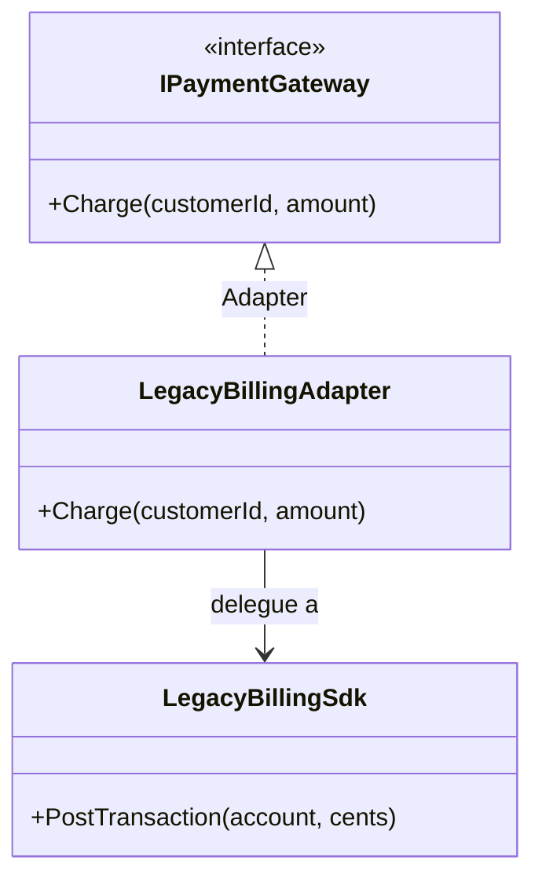

# Adapter

🌍 🇫🇷 Français (ce fichier) · 🇬🇧 [English](Adapter-en.md)

## Intention

Adapter est un patron structurel qui convertit l'interface d'un type en celle qu'un client attend,
permettant à des types de collaborer alors que leurs interfaces incompatibles l'interdisaient.

## Problème

Un SDK de facturation acheté à un tiers expose une seule opération :

```csharp
public void PostTransaction(int account, long cents) { }
```

L'application parle de clients et de montants, pas de comptes et de centimes, et chaque site d'appel
emploie déjà son propre vocabulaire. Aucun des deux côtés ne peut bouger : le SDK n'appartient pas au
projet, et réécrire l'application pour qu'elle parle en centimes répandrait l'idée que ce fournisseur se
fait de l'argent dans toute la base de code.

## Solution

Le patron introduit un troisième type dont le seul rôle est la traduction.

Il implémente l'interface que le client attend, détient l'objet incompatible, et convertit chaque appel —
arguments, unités, noms, conventions d'erreur. Le client compile contre son propre vocabulaire et
n'apprend jamais qu'une traduction a eu lieu. Remplacer le fournisseur plus tard consiste à écrire un
autre adaptateur et à ne rien changer d'autre.

## Structure



L'adaptateur hérite de la cible et détient l'adapté. Cette composition est ce que le Gang of Four appelle
un *adaptateur d'objet*, et c'est la seule forme que C# offre, le langage ne connaissant pas l'héritage
multiple de classes.

## Les rôles

| Rôle | Annotation | S'applique à | Ce qu'il porte |
|---|---|---|---|
| Target | `[Adapter.Target]` | interface, classe | Déclare l'interface que le client utilise réellement. |
| Adapter | `[Adapter.Adapter]` | classe | Implémente l'interface cible en déléguant à l'adapté et en traduisant les appels. |
| Adaptee | `[Adapter.Adaptee]` | interface, classe, struct | Porte le comportement qui vaut d'être réutilisé, mais l'expose par une interface incompatible. |

## L'exemple

Extrait de [`AdapterUsage.cs`](../../../../DesignPatternCatalog.Usage/GangOfFour/AdapterUsage.cs).

```csharp
[Adapter.Target]
public interface IPaymentGateway {
    void Charge(string customerId, decimal amount);
}

[Adapter.Adaptee]
public sealed class LegacyBillingSdk {
    public void PostTransaction(int account, long cents) { }
}
```

Les deux interfaces qui ne se rencontrent pas. `IPaymentGateway` appartient à l'application ;
`LegacyBillingSdk` arrive sous forme de binaire.

```csharp
[Adapter.Adapter(Target = typeof(IPaymentGateway), Adaptee = typeof(LegacyBillingSdk))]
public sealed class LegacyBillingAdapter : IPaymentGateway {

    private readonly LegacyBillingSdk _sdk;

    public LegacyBillingAdapter(LegacyBillingSdk sdk) { _sdk = sdk; }

    public void Charge(string customerId, decimal amount) {
        _sdk.PostTransaction(int.Parse(customerId), (long)(amount * 100));
    }

}
```

Une méthode, et deux conversions à l'intérieur — et c'est par là que les adaptateurs fuient.
`int.Parse(customerId)` lève une exception dès qu'un identifiant client n'est pas numérique, transformant
une incompatibilité de types en défaillance à l'exécution. La conversion en `long` tronque au lieu
d'arrondir : un prix de `19,999` se poste donc à `1999` centimes.

Aucun des deux problèmes n'appartient au patron ; tous deux appartiennent à *cet* adaptateur, et ils sont
la raison pour laquelle un adaptateur est du code à tester plutôt qu'une formalité. La traduction est
l'endroit où les deux modèles divergent, et une divergence doit bien se résoudre quelque part.

## Possibilités d'application

**Utilisez Adapter pour réutiliser une classe existante dont l'interface ne correspond pas à celle dont
vous avez besoin.**

**Utilisez Adapter en écrivant une classe réutilisable qui doit coopérer avec des classes qu'elle ne peut
pas prévoir** — la classe nomme une interface, et des adaptateurs la relient à ce qui arrivera plus tard.

**Utilisez Adapter pour rassembler plusieurs types existants sous une seule interface**, sans hériter de
chacun d'eux.

## Quand ne pas l'utiliser

**N'utilisez pas Adapter quand les deux côtés vous appartiennent.** Changer l'une des deux interfaces coûte
moins cher que maintenir un troisième type indéfiniment. Un adaptateur entre deux de vos propres classes
consigne d'ordinaire un désaccord de vocabulaire non résolu plutôt qu'une frontière.

**N'utilisez pas Adapter quand l'incompatibilité est sémantique et non syntaxique.** Des signatures qui
concordent ne rendent pas les opérations équivalentes : un adaptateur qui envoie un total là où un
sous-total est attendu compile parfaitement et se trompe. Le patron convertit des formes, pas des sens.

**Ne laissez pas un adaptateur servir plusieurs adaptés.** Une classe qui implémente une interface au-dessus
de cinq fournisseurs, en branchant sur un discriminant, a cessé d'être un adaptateur ; un adaptateur par
adapté garde chaque traduction lisible.

**N'utilisez pas Adapter quand la traduction perd ce dont l'appelant a besoin.** Là où l'adapté rapporte des
erreurs, une progression ou des résultats partiels que l'interface cible ne sait pas exprimer,
l'adaptateur doit les avaler, et l'appelant perd une information dont il pouvait avoir besoin.

## Avantages

* Le code client reste écrit dans son propre vocabulaire et ne dépend pas du type étranger.
* Le type étranger devient remplaçable : un autre fournisseur, un autre adaptateur.
* La conversion vit en un seul endroit testable au lieu d'être dispersée sur les sites d'appel.

## Inconvénients

* Un type de plus et une indirection de plus entre l'appelant et le travail.
* La traduction peut perdre une information que l'interface cible n'a aucun moyen d'exprimer.
* Un adaptateur est l'endroit où deux modèles divergent : il accumule donc les cas pénibles — analyse
  syntaxique, arrondis, champs manquants — et demande ses propres tests.

## Liens avec les autres patrons

**`Bridge`** a presque la même structure et l'intention inverse. Un pont est conçu en amont pour qu'une
abstraction et son implémentation varient indépendamment ; un adaptateur est ajusté après coup pour faire
fonctionner ensemble deux choses qui n'ont jamais été conçues pour cela.

**`Decorator`** conserve l'interface qu'il enveloppe et ajoute du comportement, là où Adapter change
l'interface et n'en ajoute aucun.

**`Facade`** simplifie tout un sous-système derrière une interface nouvelle, là où Adapter convertit une
interface en une autre. Une façade peut n'avoir aucun équivalent dans ce qu'elle cache ; un adaptateur en a
toujours exactement un.

**`Proxy`** se place aussi devant un autre objet en gardant son interface, afin d'en contrôler l'accès
plutôt que de le traduire.

## Source

*Design Patterns: Elements of Reusable Object-Oriented Software*, Gamma, Helm, Johnson & Vlissides,
Addison-Wesley, 1994 — chapitre des patrons structurels.

* [Entrée d'index](../../../generated/catalog-index.md#adapter-gang-of-four)
* [Attribut généré](../../../../DesignPatternCatalog.GangOfFour/Adapter.cs)
* [Exemple](../../../../DesignPatternCatalog.Usage/GangOfFour/AdapterUsage.cs)
