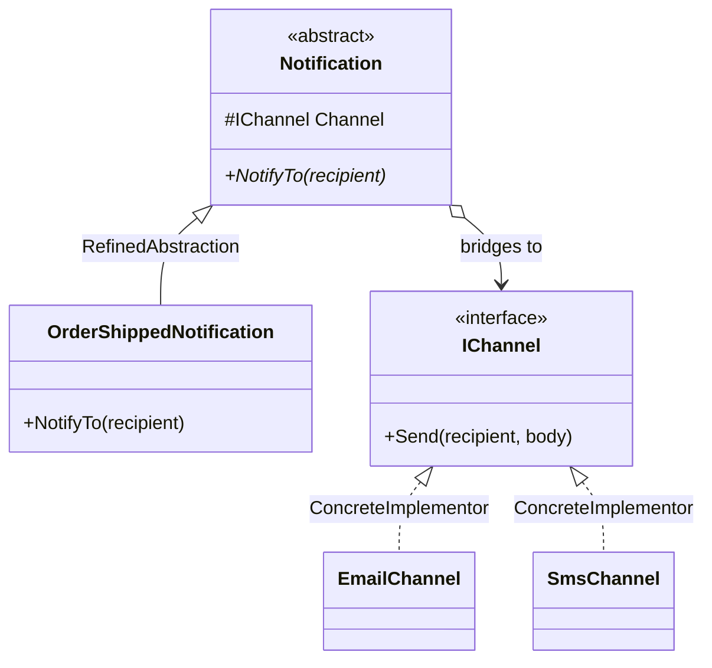

# Bridge

🌍 🇬🇧 English (this file) · 🇫🇷 [Français](Bridge-fr.md)

## Intent

Bridge is a structural pattern that decouples an abstraction from its implementation so that the two can
vary independently.

## Problem

A notification has two independent questions inside it. *What does it say* — an order has shipped, a
password is expiring, an invoice is overdue. *How does it get there* — email, SMS, push, a webhook.

Both sides grow, and they grow separately: the product team adds messages, the platform team adds
channels. Expressed by inheritance alone, every combination becomes a class:

```
OrderShippedByEmail   OrderShippedBySms   OrderShippedByPush
PasswordExpiringByEmail   PasswordExpiringBySms   PasswordExpiringByPush
```

Four messages and four channels are sixteen classes, and a fifth channel is four more. The two axes have
been multiplied where they should have been kept apart.

## Solution

The pattern replaces the multiplication with a reference.

Two hierarchies are declared instead of one. The abstraction holds what the notification says and keeps a
reference to an implementor; the implementor declares the primitive operations delivery needs. Adding a
message subclasses the abstraction, adding a channel implements the implementor, and neither touches the
other.

Sixteen classes become four plus four, and a fifth channel is one class.

## Structure



Two hierarchies side by side, joined by one reference rather than by inheritance. That reference is the
bridge, and it is what allows each side to be extended alone.

## The roles

| Role | Annotation | Applies to | What it carries |
|---|---|---|---|
| Abstraction | `[Bridge.Abstraction]` | class, interface | Defines the abstraction's interface and holds a reference to an implementor. |
| RefinedAbstraction | `[Bridge.RefinedAbstraction]` | class | Extends the interface defined by the abstraction, without touching the implementation side. |
| Implementor | `[Bridge.Implementor]` | interface, class | Declares the primitive operations the abstraction is built upon. |
| ConcreteImplementor | `[Bridge.ConcreteImplementor]` | class | Provides one concrete implementation of the primitive operations. |

## The example

From [`BridgeUsage.cs`](../../../../DesignPatternCatalog.Usage/GangOfFour/BridgeUsage.cs).

```csharp
[Bridge.Implementor]
public interface IChannel {
    void Send(string recipient, string body);
}

[Bridge.ConcreteImplementor(Implementor = typeof(IChannel))]
public sealed class EmailChannel : IChannel {
    public void Send(string recipient, string body) { }
}

[Bridge.ConcreteImplementor(Implementor = typeof(IChannel))]
public sealed class SmsChannel : IChannel {
    public void Send(string recipient, string body) { }
}
```

The implementation side, and its interface is deliberately primitive: a recipient and a body. It says
nothing about orders or passwords, which is what keeps the channels reusable across every message.

```csharp
[Bridge.Abstraction(Implementor = typeof(IChannel))]
public abstract class Notification {

    protected Notification(IChannel channel) { Channel = channel; }

    protected IChannel Channel { get; }

    public abstract void NotifyTo(string recipient);

}
```

The abstraction holds the implementor and exposes it to its subclasses only. `NotifyTo` is the vocabulary
of the caller — notify somebody — where `Send` is the vocabulary of the transport. The two are not the
same interface, and that difference is why this is a bridge rather than a field.

```csharp
[Bridge.RefinedAbstraction(Abstraction = typeof(Notification))]
public sealed class OrderShippedNotification : Notification {

    public OrderShippedNotification(IChannel channel) : base(channel) { }

    public override void NotifyTo(string recipient) => Channel.Send(recipient, "Your order has shipped.");

}
```

One message, in one line, over any channel. A second message is another class here and nothing anywhere
else; a third channel is another class there and nothing here.

## Applicability

**Use Bridge to avoid a permanent binding between an abstraction and its implementation** — for instance
where the implementation is selected at run time.

**Use Bridge when both the abstraction and its implementation should be extensible by subclassing**, so
that the two can be combined and extended independently.

**Use Bridge when a change in the implementation should not affect clients**, which for a compiled
language means not recompiling them.

**Use Bridge to share one implementation among several objects** where that sharing should stay invisible
to the client.

## When not to use it

**Do not use Bridge where only one side varies.** One implementation and several abstractions is ordinary
inheritance; one abstraction and several implementations is an interface with implementations. The pattern
earns its second hierarchy when both sides move.

**Do not use Bridge where the abstraction has no behaviour of its own.** Where the abstraction only
forwards to the implementor member for member, the two hierarchies are one interface written twice, and
the indirection buys nothing.

**Do not use Bridge before the second axis exists.** Two hierarchies for a combination that has never
occurred is a design paying today for a variation that may never arrive.

**Do not use Bridge where the implementor interface has to know the abstraction's vocabulary.** A `Send`
that takes an order rather than a body has coupled the channels to the messages, and the axes are joined
again in everything but name.

## Advantages

* The two hierarchies grow independently, so the class count adds rather than multiplies.
* The implementation can be chosen or replaced at run time, and clients do not see it.
* Implementation details are hidden from clients, and an implementor can be shared between abstractions.

## Drawbacks

* Two hierarchies where a reader expected one, and the join between them exists only as a reference.
* One indirection on every operation.
* The implementor interface has to be primitive enough for every implementation and rich enough for every
  abstraction, which is a design that has to be got right early.

## Relations with other patterns

**`Adapter`** has nearly the same structure and the opposite intent: an adapter is fitted after the fact to
make two incompatible things work together, a bridge is designed up front so that two things can vary
apart.

**`AbstractFactory`** is often what creates and configures a bridge, choosing the implementor for the
abstraction.

**`Strategy`** looks identical in a diagram — an object holding an interface it delegates to — and differs
in what varies. A strategy swaps one algorithm for another behind a fixed abstraction; a bridge exists so
that the abstraction itself can also be subclassed.

## Source

*Design Patterns: Elements of Reusable Object-Oriented Software*, Gamma, Helm, Johnson & Vlissides,
Addison-Wesley, 1994 — the structural patterns chapter.

* [Index entry](../../../generated/catalog-index.md#bridge-gang-of-four)
* [Generated attribute](../../../../DesignPatternCatalog.GangOfFour/Bridge.cs)
* [Sample](../../../../DesignPatternCatalog.Usage/GangOfFour/BridgeUsage.cs)
