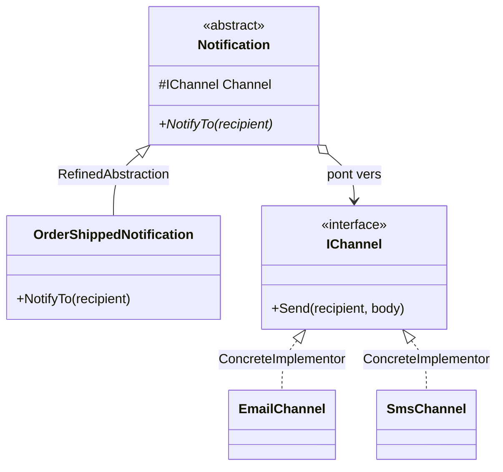

# Bridge

🌍 🇫🇷 Français (ce fichier) · 🇬🇧 [English](Bridge-en.md)

## Intention

Bridge est un patron structurel qui découple une abstraction de son implémentation afin que les deux
puissent varier indépendamment.

## Problème

Une notification porte deux questions indépendantes. *Que dit-elle* — une commande est expédiée, un mot de
passe expire, une facture est en retard. *Comment arrive-t-elle* — courriel, SMS, notification push,
webhook.

Les deux côtés grossissent, et séparément : l'équipe produit ajoute des messages, l'équipe plateforme
ajoute des canaux. Exprimé par le seul héritage, chaque combinaison devient une classe :

```
OrderShippedByEmail   OrderShippedBySms   OrderShippedByPush
PasswordExpiringByEmail   PasswordExpiringBySms   PasswordExpiringByPush
```

Quatre messages et quatre canaux font seize classes, et un cinquième canal en fait quatre de plus. Les deux
axes ont été multipliés là où il fallait les tenir à part.

## Solution

Le patron remplace la multiplication par une référence.

Deux hiérarchies sont déclarées au lieu d'une. L'abstraction porte ce que la notification dit et garde une
référence vers un implémenteur ; l'implémenteur déclare les opérations primitives dont la livraison a
besoin. Ajouter un message revient à hériter de l'abstraction, ajouter un canal à implémenter
l'implémenteur, et aucun des deux ne touche l'autre.

Seize classes deviennent quatre plus quatre, et un cinquième canal ne coûte qu'une classe.

## Structure



Deux hiérarchies côte à côte, jointes par une référence et non par un héritage. Cette référence est le
pont, et c'est elle qui permet d'étendre chaque côté seul.

## Les rôles

| Rôle | Annotation | S'applique à | Ce qu'il porte |
|---|---|---|---|
| Abstraction | `[Bridge.Abstraction]` | classe, interface | Définit l'interface de l'abstraction et garde une référence vers un implémenteur. |
| RefinedAbstraction | `[Bridge.RefinedAbstraction]` | classe | Étend l'interface définie par l'abstraction, sans toucher au côté implémentation. |
| Implementor | `[Bridge.Implementor]` | interface, classe | Déclare les opérations primitives sur lesquelles l'abstraction est bâtie. |
| ConcreteImplementor | `[Bridge.ConcreteImplementor]` | classe | Fournit une implémentation concrète des opérations primitives. |

## L'exemple

Extrait de [`BridgeUsage.cs`](../../../../DesignPatternCatalog.Usage/GangOfFour/BridgeUsage.cs).

```csharp
[Bridge.Implementor]
public interface IChannel {
    void Send(string recipient, string body);
}

[Bridge.ConcreteImplementor(Implementor = typeof(IChannel))]
public sealed class EmailChannel : IChannel {
    public void Send(string recipient, string body) { }
}

[Bridge.ConcreteImplementor(Implementor = typeof(IChannel))]
public sealed class SmsChannel : IChannel {
    public void Send(string recipient, string body) { }
}
```

Le côté implémentation, dont l'interface est volontairement primitive : un destinataire et un corps. Elle ne
dit rien des commandes ni des mots de passe, et c'est ce qui garde les canaux réutilisables pour tous les
messages.

```csharp
[Bridge.Abstraction(Implementor = typeof(IChannel))]
public abstract class Notification {

    protected Notification(IChannel channel) { Channel = channel; }

    protected IChannel Channel { get; }

    public abstract void NotifyTo(string recipient);

}
```

L'abstraction détient l'implémenteur et ne l'expose qu'à ses sous-classes. `NotifyTo` est le vocabulaire de
l'appelant — notifier quelqu'un — là où `Send` est celui du transport. Les deux ne sont pas la même
interface, et cette différence est ce qui fait un pont plutôt qu'un champ.

```csharp
[Bridge.RefinedAbstraction(Abstraction = typeof(Notification))]
public sealed class OrderShippedNotification : Notification {

    public OrderShippedNotification(IChannel channel) : base(channel) { }

    public override void NotifyTo(string recipient) => Channel.Send(recipient, "Your order has shipped.");

}
```

Un message, en une ligne, sur n'importe quel canal. Un deuxième message est une autre classe ici et rien
ailleurs ; un troisième canal est une autre classe là-bas et rien ici.

## Possibilités d'application

**Utilisez Bridge pour éviter un lien permanent entre une abstraction et son implémentation** — par exemple
là où l'implémentation est choisie à l'exécution.

**Utilisez Bridge lorsque l'abstraction et son implémentation doivent toutes deux être extensibles par
héritage**, afin de pouvoir les combiner et les étendre indépendamment.

**Utilisez Bridge lorsqu'un changement d'implémentation ne doit pas affecter les clients**, ce qui, pour un
langage compilé, signifie ne pas les recompiler.

**Utilisez Bridge pour partager une implémentation entre plusieurs objets** là où ce partage doit rester
invisible au client.

## Quand ne pas l'utiliser

**N'utilisez pas Bridge quand un seul côté varie.** Une implémentation et plusieurs abstractions relèvent de
l'héritage ordinaire ; une abstraction et plusieurs implémentations, d'une interface avec ses
implémentations. Le patron gagne sa seconde hiérarchie quand les deux côtés bougent.

**N'utilisez pas Bridge quand l'abstraction n'a aucun comportement propre.** Là où l'abstraction ne fait que
transmettre membre pour membre à l'implémenteur, les deux hiérarchies sont une interface écrite deux fois,
et l'indirection n'achète rien.

**N'utilisez pas Bridge avant que le second axe existe.** Deux hiérarchies pour une combinaison qui ne s'est
jamais présentée, c'est une conception qui paie aujourd'hui une variation qui peut ne jamais venir.

**N'utilisez pas Bridge quand l'interface de l'implémenteur doit connaître le vocabulaire de l'abstraction.**
Un `Send` qui prend une commande au lieu d'un corps a couplé les canaux aux messages, et les axes sont de
nouveau joints, en tout sauf en nom.

## Avantages

* Les deux hiérarchies croissent indépendamment : le nombre de classes s'additionne au lieu de se
  multiplier.
* L'implémentation peut être choisie ou remplacée à l'exécution, et les clients ne la voient pas.
* Les détails d'implémentation sont cachés aux clients, et un implémenteur peut être partagé entre
  abstractions.

## Inconvénients

* Deux hiérarchies là où un lecteur en attendait une, et la jonction entre elles n'existe que comme
  référence.
* Une indirection sur chaque opération.
* L'interface de l'implémenteur doit être assez primitive pour toutes les implémentations et assez riche
  pour toutes les abstractions, ce qui est une conception à réussir tôt.

## Liens avec les autres patrons

**`Adapter`** a presque la même structure et l'intention inverse : un adaptateur est ajusté après coup pour
faire fonctionner ensemble deux choses incompatibles, un pont est conçu en amont pour que deux choses
varient séparément.

**`AbstractFactory`** est souvent ce qui crée et configure un pont, en choisissant l'implémenteur de
l'abstraction.

**`Strategy`** paraît identique sur un diagramme — un objet détenant une interface à laquelle il délègue —
et diffère par ce qui varie. Une stratégie échange un algorithme contre un autre derrière une abstraction
fixe ; un pont existe pour que l'abstraction elle-même puisse aussi être héritée.

## Source

*Design Patterns: Elements of Reusable Object-Oriented Software*, Gamma, Helm, Johnson & Vlissides,
Addison-Wesley, 1994 — chapitre des patrons structurels.

* [Entrée d'index](../../../generated/catalog-index.md#bridge-gang-of-four)
* [Attribut généré](../../../../DesignPatternCatalog.GangOfFour/Bridge.cs)
* [Exemple](../../../../DesignPatternCatalog.Usage/GangOfFour/BridgeUsage.cs)
