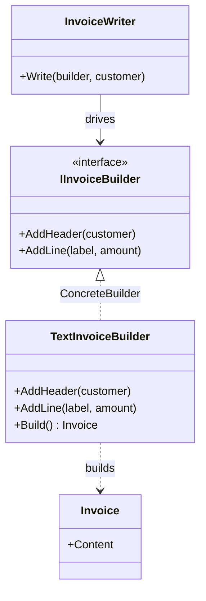

# Builder

🌍 🇬🇧 English (this file) · 🇫🇷 [Français](Builder-fr.md)

## Intent

Builder is a creational pattern that separates the construction of a complex object from its
representation, so that the same construction process can produce different representations.

## Problem

An invoice has a shape: a header naming the customer, then one line per charge. That shape is business
knowledge and it is the same everywhere.

What differs is what the invoice comes out as — plain text for the terminal, HTML for the customer
portal, a fixed-width file for the accounting system. Three outputs, one shape.

Written directly, the shape is copied once per output:

```csharp
public string RenderText(Order order)  { /* header, then a loop */ }
public string RenderHtml(Order order)  { /* header, then the same loop */ }
```

The two methods differ in every line and agree on every decision. A change to the shape — adding a VAT
line — has to be made in as many places as there are formats, and the day one is missed is the day the
formats disagree.

## Solution

The pattern separates the sequence of steps from what each step does.

The steps are declared as an interface: `AddHeader`, `AddLine`. One class, the director, knows the
sequence and calls the steps in order while holding nothing but the interface. One class per output, the
builders, knows what a step means and accumulates the result.

The sequence is written once. Each format is one implementation: adding a format adds a class and
changes nothing else, and changing the shape changes the director and nothing else.

## Structure



No arrow runs from `InvoiceWriter` to `Invoice`: the director drives the construction and never sees the
result.

## The roles

| Role | Annotation | Applies to | What it carries |
|---|---|---|---|
| Builder | `[Builder.Builder]` | interface, class | Declares the step by step construction operations. |
| ConcreteBuilder | `[Builder.ConcreteBuilder]` | class | Implements the construction steps and keeps track of the representation it builds. |
| Director | `[Builder.Director]` | class | Drives the construction sequence through the builder interface. |
| Product | `[Builder.Product]` | class, struct | The complex object under construction. |

## The example

From [`BuilderUsage.cs`](../../../../DesignPatternCatalog.Usage/GangOfFour/BuilderUsage.cs).

```csharp
[Builder.Product]
public sealed class Invoice {
    public Invoice(string content) { Content = content; }
    public string Content { get; }
}
```

The product, deliberately plain: the pattern is not about it.

```csharp
[Builder.Builder]
public interface IInvoiceBuilder {
    void AddHeader(string customer);
    void AddLine(string label, decimal amount);
}
```

The steps, and nothing else. The interface declares no `Build()`.

```csharp
[Builder.ConcreteBuilder(Builder = typeof(IInvoiceBuilder), Product = typeof(Invoice))]
public sealed class TextInvoiceBuilder : IInvoiceBuilder {

    private readonly StringBuilder _content = new();

    public void AddHeader(string customer)            => _content.AppendLine($"Invoice for {customer}");
    public void AddLine(string label, decimal amount) => _content.AppendLine($"  {label}: {amount:N2}");

    public Invoice Build() => new(_content.ToString());

}
```

The builder is stateful by design: it accumulates between calls, which is what makes step-by-step
construction possible.

`Build()` lives on the concrete builder rather than on the interface, and that is the book's own
guidance. Different builders may return products of different types — a text builder returns a
string-backed invoice, a PDF builder would return a byte stream — and there is often no useful common
supertype. The client chose the concrete builder, so the client knows what it will get back.

```csharp
[Builder.Director(Builder = typeof(IInvoiceBuilder))]
public sealed class InvoiceWriter {

    public void Write(IInvoiceBuilder builder, string customer) {
        builder.AddHeader(customer);
        builder.AddLine("Subscription", 49.90m);
    }

}
```

The director: the shape of an invoice in two lines, with no knowledge of what it is being written into.
This is the class that survives a change of format.

## Applicability

**Use Builder when the algorithm for creating a complex object should be independent of the parts and of
how they are assembled.**

**Use Builder when the construction process must allow different representations of the thing being
constructed.**

Both conditions describe the same situation from two sides: one sequence, several results. Where no
second representation can be named, the pattern has nothing to separate.

## When not to use it

**Do not confuse the pattern with a fluent builder.**
`new PersonBuilder().WithName("…").WithAge(30).Build()` is not this pattern, and the collision of names
causes more confusion than any other in the Gang of Four. A fluent builder has no director and produces
exactly one representation; it exists to work around a constructor with too many parameters. That is a
real and useful technique, and a different one.

**Do not use Builder for a single representation.** The director and the builder interface then stand
between a caller and a constructor.

**Do not use Builder where C# already covers the need.** Named arguments, optional parameters, object
initialisers and `init` properties handle most of what fluent builders were invented for, and `record`
types with `with` expressions handle the rest. The pattern is worth its cost when the sequence matters,
not when the parameter list is long.

**Do not use Builder when the parts are independent.** Where the caller can assemble the pieces in any
order without consequence, there is no construction process to isolate.

## Advantages

* The internal representation can vary freely, the director never naming it.
* Construction code and representation code are isolated from each other, so each changes alone.
* The process is controlled more finely: the product is assembled step by step under the director rather
  than in one constructor call.

## Drawbacks

* A concrete builder per representation, which the book states as the cost, and each implements every
  step.
* The product is unusable until construction finishes, so a window exists in which the builder holds a
  half-built thing.
* Four types where a caller might have expected one method.

## Relations with other patterns

**`AbstractFactory`** also creates complex things but returns each product immediately, where Builder
returns the result at the end of a sequence. Abstract Factory is about families, Builder about the
construction process.

**`FactoryMethod`** creates one object in one call: no sequence, no accumulation, no director.

**`Composite`** is very often what a Builder builds, a tree assembled step by step being the natural
product of this pattern.

**`TemplateMethod`** resembles the director — a fixed sequence with varying steps — except that the
varying steps live in a separate object here rather than in a subclass.

## Source

*Design Patterns: Elements of Reusable Object-Oriented Software*, Gamma, Helm, Johnson & Vlissides,
Addison-Wesley, 1994 — the creational patterns chapter.

* [Index entry](../../../generated/catalog-index.md#builder-gang-of-four)
* [Generated attribute](../../../../DesignPatternCatalog.GangOfFour/Builder.cs)
* [Sample](../../../../DesignPatternCatalog.Usage/GangOfFour/BuilderUsage.cs)
