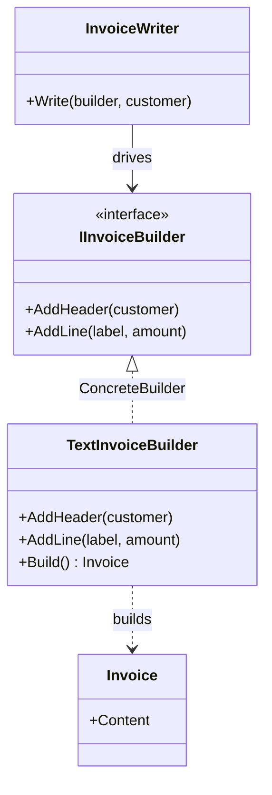

# Builder

🌍 🇬🇧 English (this file) · 🇫🇷 [Français](Builder-fr.md)

> Separates the construction of a complex object from its representation, so that the same
> construction process can produce different representations.
>
> — Gamma, Helm, Johnson & Vlissides, *Design Patterns*, 1994

## The problem

An invoice has a shape: a header naming the customer, then one line per charge. That shape is business
knowledge and it is the same everywhere.

What is not the same is what the invoice comes out as. Plain text for the terminal, HTML for the
customer portal, a fixed-width file for the accounting system. Three outputs, one shape.

Write it directly and the shape gets copied once per output:

```csharp
public string RenderText(Order order)  { /* header, then a loop */ }
public string RenderHtml(Order order)  { /* header, then the same loop */ }
```

The two methods differ in every line and agree on every decision. Change the shape — add a VAT line —
and you change it in as many places as you have formats, and the day you miss one is the day the
formats disagree.

## The solution

Separate **the sequence of steps** from **what each step does**.

Declare the steps as an interface: `AddHeader`, `AddLine`. One class — the director — knows the
sequence and calls the steps in order, holding nothing but the interface. One class per output — the
builders — knows what a step means and accumulates the result.

The sequence is written once. Each format is one implementation. Adding a format adds a class and
changes nothing else; changing the shape changes the director and nothing else.

## Structure



Notice what the director does **not** touch. There is no arrow from `InvoiceWriter` to `Invoice`: the
director drives the construction and never sees the result.

## The roles

| Role | Annotation | Applies to | What it carries |
|---|---|---|---|
| Builder | `[Builder.Builder]` | interface, class | Declares the step by step construction operations. |
| ConcreteBuilder | `[Builder.ConcreteBuilder]` | class | Implements the construction steps and keeps track of the representation it builds. |
| Director | `[Builder.Director]` | class | Drives the construction sequence through the builder interface. |
| Product | `[Builder.Product]` | class, struct | The complex object under construction. |

## The example

From [`BuilderUsage.cs`](../../../../DesignPatternCatalog.Usage/GangOfFour/BuilderUsage.cs).

```csharp
[Builder.Product]
public sealed class Invoice {
    public Invoice(string content) { Content = content; }
    public string Content { get; }
}
```

The product. Deliberately dull: the pattern is not about it.

```csharp
[Builder.Builder]
public interface IInvoiceBuilder {
    void AddHeader(string customer);
    void AddLine(string label, decimal amount);
}
```

The steps, and **only** the steps. Read what is absent: there is no `Build()` here.

```csharp
[Builder.ConcreteBuilder(Builder = typeof(IInvoiceBuilder), Product = typeof(Invoice))]
public sealed class TextInvoiceBuilder : IInvoiceBuilder {

    private readonly StringBuilder _content = new();

    public void AddHeader(string customer)            => _content.AppendLine($"Invoice for {customer}");
    public void AddLine(string label, decimal amount) => _content.AppendLine($"  {label}: {amount:N2}");

    public Invoice Build() => new(_content.ToString());

}
```

The builder is **stateful on purpose** — it accumulates between calls, which is what makes step-by-step
construction possible.

And here is the detail worth stopping on: `Build()` exists on the concrete builder and not on the
interface. That is not an oversight, it is the book's own guidance. Different builders may return
products of different types — a text builder returns a string-backed invoice, a PDF builder might
return a byte stream — and there is often no useful common supertype. The client picked the concrete
builder, so the client knows what it will get back and can ask for it.

```csharp
[Builder.Director(Builder = typeof(IInvoiceBuilder))]
public sealed class InvoiceWriter {

    public void Write(IInvoiceBuilder builder, string customer) {
        builder.AddHeader(customer);
        builder.AddLine("Subscription", 49.90m);
    }

}
```

The director: the shape of an invoice, in two lines, with no idea what it is being written into. This
class is what you keep when the formats change, and it is the reason the pattern exists.

## When to use it

The book's own list:

* the algorithm for creating a complex object should be **independent of the parts** and of how they
  are assembled;
* the construction process must allow **different representations** of the thing being constructed.

Both mention the same thing from two sides: there is one sequence and several results. If you cannot
name a second representation, the pattern has nothing to separate.

## When not to use it

* **When you mean a fluent builder.** `new PersonBuilder().WithName("…").WithAge(30).Build()` is
  *not* this pattern, and the collision of names causes more confusion than any other in the Gang of
  Four. A fluent builder has **no director** and produces exactly **one** representation; it exists to
  work around a constructor with too many parameters. That is a real and useful technique — it is
  simply a different one, and calling it Builder makes people think they have a separation they do not
  have.
* **When there is one representation.** Then the director and the builder interface are two types
  standing between a caller and a constructor. Construct the object directly.
* **When C# already covers it.** Named arguments, optional parameters, object initialisers and `init`
  properties handle most of what fluent builders were invented for, and `record` types with `with`
  expressions handle the rest. Reach for a builder when the *sequence* matters, not when the
  *parameter list* is long.
* **When the parts are independent.** If the caller can assemble the pieces in any order and nothing
  goes wrong, there is no construction process to isolate — you have a bag of setters, and Builder
  adds ritual to it.

## What it costs

**What you gain**

* the internal representation can vary freely — the director never names it;
* construction code and representation code are isolated from each other, so each changes alone;
* finer control over the process: the product is assembled step by step under the director's control,
  rather than in one constructor call.

**What you pay**

* **a concrete builder per representation**, which is the book's stated cost — and each must implement
  every step;
* the product is not usable until construction finishes, so there is a window where the builder holds
  a half-built thing;
* four types where a caller might have expected one method.

## Patterns it is confused with

| | |
|---|---|
| **A fluent builder** | The most common confusion. See the first bullet above: no director, one representation, a workaround for long constructors. |
| **`AbstractFactory`** | Also creates complex things, but returns each product **immediately**; Builder returns the result **at the end**, after a sequence. Abstract Factory is about families; Builder is about the construction process. |
| **`FactoryMethod`** | Creates one object in one call. No sequence, no accumulation, no director. |
| **`Composite`** | Very often what a Builder builds: a tree assembled step by step is the natural product of this pattern. |
| **`TemplateMethod`** | The director resembles one — a fixed sequence with varying steps — but the varying steps live in a *separate object* here, not in a subclass. |

## Where this comes from

*Design Patterns: Elements of Reusable Object-Oriented Software*, Gamma, Helm, Johnson & Vlissides,
Addison-Wesley, 1994 — the Creational patterns chapter.

* [Index entry](../../../generated/catalog-index.md#builder-gang-of-four) — the annotations, the
  targets, the links.
* [Generated attribute](../../../../DesignPatternCatalog.GangOfFour/Builder.cs)
* [Sample](../../../../DesignPatternCatalog.Usage/GangOfFour/BuilderUsage.cs)
