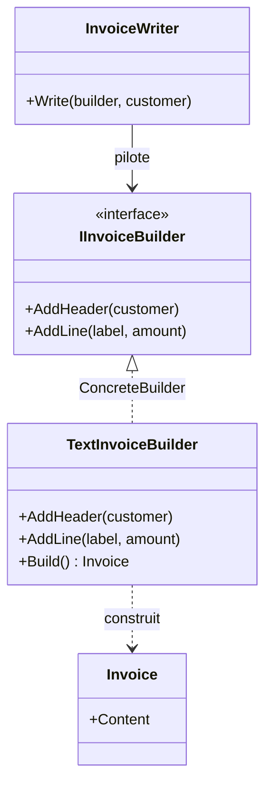

# Builder

🌍 🇫🇷 Français (ce fichier) · 🇬🇧 [English](Builder-en.md)

## Intention

Builder est un patron de création qui sépare la construction d'un objet complexe de sa représentation, de
sorte que le même processus de construction puisse produire des représentations différentes.

## Problème

Une facture a une forme : un en-tête nommant le client, puis une ligne par prestation. Cette forme est
une connaissance métier et elle est la même partout.

Ce qui diffère, c'est ce en quoi la facture sort — du texte brut pour le terminal, du HTML pour le portail
client, un fichier à colonnes fixes pour la comptabilité. Trois sorties, une forme.

Écrite directement, la forme se recopie une fois par sortie :

```csharp
public string RenderText(Order order)  { /* en-tête, puis une boucle */ }
public string RenderHtml(Order order)  { /* en-tête, puis la même boucle */ }
```

Les deux méthodes diffèrent à chaque ligne et s'accordent sur chaque décision. Un changement de forme —
l'ajout d'une ligne de TVA — doit être fait en autant d'endroits qu'il y a de formats, et le jour où l'un
est oublié est le jour où les formats divergent.

## Solution

Le patron sépare la séquence des étapes de ce que fait chaque étape.

Les étapes sont déclarées dans une interface : `AddHeader`, `AddLine`. Une classe, le directeur, connaît
la séquence et appelle les étapes dans l'ordre en ne tenant que l'interface. Une classe par sortie, les
monteurs, sait ce qu'une étape veut dire et accumule le résultat.

La séquence est écrite une fois. Chaque format est une implémentation : ajouter un format ajoute une
classe et ne change rien d'autre, et changer la forme change le directeur et rien d'autre.

## Structure



Aucune flèche ne va de `InvoiceWriter` vers `Invoice` : le directeur pilote la construction et ne voit
jamais le résultat.

## Les rôles

| Rôle | Annotation | S'applique à | Ce qu'il porte |
|---|---|---|---|
| Builder | `[Builder.Builder]` | interface, classe | Déclare les opérations de construction étape par étape. |
| ConcreteBuilder | `[Builder.ConcreteBuilder]` | classe | Implémente les étapes de construction et suit la représentation qu'il bâtit. |
| Director | `[Builder.Director]` | classe | Pilote la séquence de construction à travers l'interface du monteur. |
| Product | `[Builder.Product]` | classe, struct | L'objet complexe en cours de construction. |

## L'exemple

Extrait de [`BuilderUsage.cs`](../../../../DesignPatternCatalog.Usage/GangOfFour/BuilderUsage.cs).

```csharp
[Builder.Product]
public sealed class Invoice {
    public Invoice(string content) { Content = content; }
    public string Content { get; }
}
```

Le produit, volontairement dépouillé : le patron ne parle pas de lui.

```csharp
[Builder.Builder]
public interface IInvoiceBuilder {
    void AddHeader(string customer);
    void AddLine(string label, decimal amount);
}
```

Les étapes, et rien d'autre. L'interface ne déclare aucun `Build()`.

```csharp
[Builder.ConcreteBuilder(Builder = typeof(IInvoiceBuilder), Product = typeof(Invoice))]
public sealed class TextInvoiceBuilder : IInvoiceBuilder {

    private readonly StringBuilder _content = new();

    public void AddHeader(string customer)            => _content.AppendLine($"Invoice for {customer}");
    public void AddLine(string label, decimal amount) => _content.AppendLine($"  {label}: {amount:N2}");

    public Invoice Build() => new(_content.ToString());

}
```

Le monteur est à état par conception : il accumule entre les appels, ce qui rend possible une construction
étape par étape.

`Build()` vit sur le monteur concret plutôt que sur l'interface, et c'est la recommandation même du
livre. Des monteurs différents peuvent rendre des produits de types différents — un monteur texte rend
une facture adossée à une chaîne, un monteur PDF rendrait un flux d'octets — et il n'existe souvent aucun
supertype utile. Le client a choisi le monteur concret, il sait donc ce qu'il récupérera.

```csharp
[Builder.Director(Builder = typeof(IInvoiceBuilder))]
public sealed class InvoiceWriter {

    public void Write(IInvoiceBuilder builder, string customer) {
        builder.AddHeader(customer);
        builder.AddLine("Subscription", 49.90m);
    }

}
```

Le directeur : la forme d'une facture en deux lignes, sans connaissance de ce dans quoi elle s'écrit.
C'est la classe qui survit à un changement de format.

## Possibilités d'application

**Utilisez Builder lorsque l'algorithme de création d'un objet complexe doit être indépendant des parties
et de la façon dont elles sont assemblées.**

**Utilisez Builder lorsque le processus de construction doit permettre des représentations différentes de
ce qui est construit.**

Les deux conditions décrivent la même situation de deux côtés : une séquence, plusieurs résultats. Là où
aucune deuxième représentation ne peut être nommée, le patron n'a rien à séparer.

## Quand ne pas l'utiliser

**Ne confondez pas le patron avec un builder fluide.**
`new PersonBuilder().WithName("…").WithAge(30).Build()` n'est pas ce patron, et cette collision de noms
provoque plus de confusion que n'importe quelle autre du Gang of Four. Un builder fluide n'a pas de
directeur et ne produit qu'une seule représentation ; il existe pour contourner un constructeur à trop de
paramètres. C'est une technique réelle et utile, et une autre.

**N'utilisez pas Builder pour une représentation unique.** Le directeur et l'interface du monteur se
plantent alors entre un appelant et un constructeur.

**N'utilisez pas Builder là où C# couvre déjà le besoin.** Arguments nommés, paramètres optionnels,
initialiseurs d'objet et propriétés `init` couvrent l'essentiel de ce pour quoi les builders fluides ont
été inventés, et les `record` avec expressions `with` font le reste. Le patron mérite son coût quand la
séquence compte, non quand la liste de paramètres est longue.

**N'utilisez pas Builder quand les parties sont indépendantes.** Là où l'appelant peut assembler les
morceaux dans n'importe quel ordre sans conséquence, il n'y a pas de processus de construction à isoler.

## Avantages

* La représentation interne peut varier librement, le directeur ne la nommant jamais.
* Le code de construction et celui de représentation sont isolés l'un de l'autre, donc chacun change seul.
* Le processus est contrôlé plus finement : le produit est assemblé étape par étape sous la conduite du
  directeur plutôt qu'en un seul appel de constructeur.

## Inconvénients

* Un monteur concret par représentation, ce que le livre énonce comme le coût, et chacun implémente toutes
  les étapes.
* Le produit est inutilisable tant que la construction n'est pas finie : il existe une fenêtre où le
  monteur détient une chose à moitié bâtie.
* Quatre types là où un appelant en attendait peut-être une méthode.

## Liens avec les autres patrons

**`AbstractFactory`** crée aussi des choses complexes mais rend chaque produit immédiatement, là où
Builder rend le résultat au terme d'une séquence. Abstract Factory porte sur les familles, Builder sur le
processus de construction.

**`FactoryMethod`** crée un objet en un appel : pas de séquence, pas d'accumulation, pas de directeur.

**`Composite`** est très souvent ce qu'un Builder construit, un arbre assemblé étape par étape étant le
produit naturel de ce patron.

**`TemplateMethod`** ressemble au directeur — une séquence fixe avec des étapes variables — sauf que les
étapes variables vivent ici dans un objet séparé plutôt que dans une sous-classe.

## Source

*Design Patterns: Elements of Reusable Object-Oriented Software*, Gamma, Helm, Johnson & Vlissides,
Addison-Wesley, 1994 — chapitre des patrons de création.

* [Entrée d'index](../../../generated/catalog-index.md#builder-gang-of-four)
* [Attribut généré](../../../../DesignPatternCatalog.GangOfFour/Builder.cs)
* [Exemple](../../../../DesignPatternCatalog.Usage/GangOfFour/BuilderUsage.cs)
