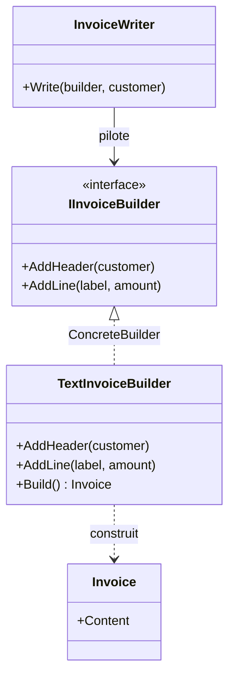

# Builder

🌍 🇫🇷 Français (ce fichier) · 🇬🇧 [English](Builder-en.md)

> Sépare la construction d'un objet complexe de sa représentation, de sorte que le même processus de
> construction puisse produire des représentations différentes.
>
> — Gamma, Helm, Johnson & Vlissides, *Design Patterns*, 1994

## Le problème

Une facture a une forme : un en-tête nommant le client, puis une ligne par prestation. Cette forme est
une connaissance métier et elle est la même partout.

Ce qui n'est pas le même, c'est ce en quoi la facture sort. Du texte brut pour le terminal, du HTML
pour le portail client, un fichier à colonnes fixes pour la compta. Trois sorties, une forme.

Écris-le directement et la forme se recopie une fois par sortie :

```csharp
public string RenderText(Order order)  { /* en-tête, puis une boucle */ }
public string RenderHtml(Order order)  { /* en-tête, puis la même boucle */ }
```

Les deux méthodes diffèrent à chaque ligne et s'accordent sur chaque décision. Change la forme —
ajoute une ligne de TVA — et tu la changes en autant d'endroits que tu as de formats ; le jour où tu en
oublies un est le jour où les formats divergent.

## La solution

Séparer **la séquence des étapes** de **ce que fait chaque étape**.

Déclare les étapes dans une interface : `AddHeader`, `AddLine`. Une classe — le directeur — connaît la
séquence et appelle les étapes dans l'ordre, ne tenant que l'interface. Une classe par sortie — les
monteurs — sait ce qu'une étape veut dire et accumule le résultat.

La séquence est écrite une fois. Chaque format est une implémentation. Ajouter un format ajoute une
classe et ne change rien d'autre ; changer la forme change le directeur et rien d'autre.

## Structure



Remarque ce que le directeur ne touche **pas**. Aucune flèche ne va de `InvoiceWriter` vers `Invoice` :
le directeur pilote la construction et ne voit jamais le résultat.

## Les rôles

| Rôle | Annotation | S'applique à | Ce qu'il porte |
|---|---|---|---|
| Builder | `[Builder.Builder]` | interface, classe | Déclare les opérations de construction étape par étape. |
| ConcreteBuilder | `[Builder.ConcreteBuilder]` | classe | Implémente les étapes de construction et suit la représentation qu'il bâtit. |
| Director | `[Builder.Director]` | classe | Pilote la séquence de construction à travers l'interface du monteur. |
| Product | `[Builder.Product]` | classe, struct | L'objet complexe en cours de construction. |

## L'exemple

Tiré de [`BuilderUsage.cs`](../../../../DesignPatternCatalog.Usage/GangOfFour/BuilderUsage.cs).

```csharp
[Builder.Product]
public sealed class Invoice {
    public Invoice(string content) { Content = content; }
    public string Content { get; }
}
```

Le produit. Volontairement terne : le pattern ne parle pas de lui.

```csharp
[Builder.Builder]
public interface IInvoiceBuilder {
    void AddHeader(string customer);
    void AddLine(string label, decimal amount);
}
```

Les étapes, et **seulement** les étapes. Lis ce qui est absent : il n'y a pas de `Build()` ici.

```csharp
[Builder.ConcreteBuilder(Builder = typeof(IInvoiceBuilder), Product = typeof(Invoice))]
public sealed class TextInvoiceBuilder : IInvoiceBuilder {

    private readonly StringBuilder _content = new();

    public void AddHeader(string customer)            => _content.AppendLine($"Invoice for {customer}");
    public void AddLine(string label, decimal amount) => _content.AppendLine($"  {label}: {amount:N2}");

    public Invoice Build() => new(_content.ToString());

}
```

Le monteur est **volontairement à état** — il accumule entre les appels, et c'est ce qui rend possible
une construction étape par étape.

Et voici le détail sur lequel s'arrêter : `Build()` existe sur le monteur concret et pas sur
l'interface. Ce n'est pas un oubli, c'est la recommandation même du livre. Des monteurs différents
peuvent rendre des produits de types différents — un monteur texte rend une facture adossée à une
chaîne, un monteur PDF rendrait un flux d'octets — et il n'existe souvent aucun supertype utile.
C'est le client qui a choisi le monteur concret : il sait donc ce qu'il récupérera et peut le
demander.

```csharp
[Builder.Director(Builder = typeof(IInvoiceBuilder))]
public sealed class InvoiceWriter {

    public void Write(IInvoiceBuilder builder, string customer) {
        builder.AddHeader(customer);
        builder.AddLine("Subscription", 49.90m);
    }

}
```

Le directeur : la forme d'une facture, en deux lignes, sans la moindre idée de ce dans quoi elle
s'écrit. C'est cette classe qu'on garde quand les formats changent, et c'est la raison d'être du
pattern.

## Quand l'utiliser

La liste du livre :

* l'algorithme de création d'un objet complexe doit être **indépendant des parties** et de la façon
  dont elles sont assemblées ;
* le processus de construction doit permettre des **représentations différentes** de ce qui est
  construit.

Les deux disent la même chose de deux côtés : il y a une séquence et plusieurs résultats. Si tu ne peux
pas nommer une deuxième représentation, le pattern n'a rien à séparer.

## Quand ne pas l'utiliser

* **Quand tu veux dire builder fluide.** `new PersonBuilder().WithName("…").WithAge(30).Build()`
  n'est **pas** ce pattern, et cette collision de noms provoque plus de confusion que n'importe quelle
  autre du Gang of Four. Un builder fluide n'a **pas de directeur** et ne produit qu'**une seule**
  représentation ; il existe pour contourner un constructeur à trop de paramètres. C'est une technique
  réelle et utile — simplement une autre, et l'appeler Builder fait croire à une séparation qui n'est
  pas là.
* **Quand il n'y a qu'une représentation.** Le directeur et l'interface du monteur sont alors deux
  types plantés entre un appelant et un constructeur. Construis l'objet directement.
* **Quand C# le couvre déjà.** Arguments nommés, paramètres optionnels, initialiseurs d'objet et
  propriétés `init` couvrent l'essentiel de ce pour quoi les builders fluides ont été inventés, et les
  `record` avec expressions `with` font le reste. Sors un builder quand la *séquence* compte, pas quand
  la *liste de paramètres* est longue.
* **Quand les parties sont indépendantes.** Si l'appelant peut assembler les morceaux dans n'importe
  quel ordre sans que rien ne casse, il n'y a pas de processus de construction à isoler — tu as un sac
  de setters, et Builder n'y ajoute que du rituel.

## Ce qu'il coûte

**Ce que tu gagnes**

* la représentation interne peut varier librement — le directeur ne la nomme jamais ;
* le code de construction et celui de représentation sont isolés l'un de l'autre, donc chacun change
  seul ;
* un contrôle plus fin du processus : le produit est assemblé étape par étape sous la conduite du
  directeur, plutôt qu'en un seul appel de constructeur.

**Ce que tu paies**

* **un monteur concret par représentation**, ce que le livre énonce comme le coût — et chacun doit
  implémenter toutes les étapes ;
* le produit n'est pas utilisable tant que la construction n'est pas finie : il existe une fenêtre où
  le monteur détient une chose à moitié bâtie ;
* quatre types là où un appelant en attendait peut-être une méthode.

## Patterns qu'on confond avec lui

| | |
|---|---|
| **Un builder fluide** | La confusion la plus fréquente. Voir le premier point ci-dessus : pas de directeur, une seule représentation, un contournement des constructeurs trop longs. |
| **`AbstractFactory`** | Crée aussi des choses complexes, mais rend chaque produit **immédiatement** ; Builder rend le résultat **à la fin**, après une séquence. Abstract Factory parle de familles ; Builder de processus de construction. |
| **`FactoryMethod`** | Crée un objet en un appel. Pas de séquence, pas d'accumulation, pas de directeur. |
| **`Composite`** | Très souvent ce qu'un Builder construit : un arbre assemblé étape par étape est le produit naturel de ce pattern. |
| **`TemplateMethod`** | Le directeur y ressemble — une séquence fixe avec des étapes variables — mais ici les étapes variables vivent dans un *objet séparé*, pas dans une sous-classe. |

## D'où cela vient

*Design Patterns: Elements of Reusable Object-Oriented Software*, Gamma, Helm, Johnson & Vlissides,
Addison-Wesley, 1994 — chapitre des patterns de création.

* [Entrée d'index](../../../generated/catalog-index.md#builder-gang-of-four) — les annotations, les
  cibles, les liens.
* [Attribut généré](../../../../DesignPatternCatalog.GangOfFour/Builder.cs)
* [Exemple](../../../../DesignPatternCatalog.Usage/GangOfFour/BuilderUsage.cs)
