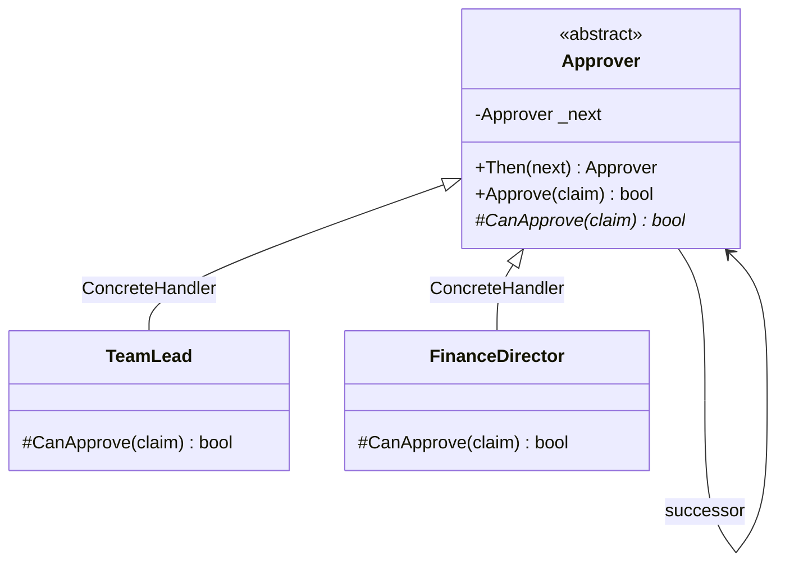

# Chain of Responsibility

🌍 🇬🇧 English (this file) · 🇫🇷 [Français](ChainOfResponsibility-fr.md)

## Intent

Chain of Responsibility is a behavioural pattern that avoids coupling the sender of a request to its
receiver by giving several objects a chance to handle it, passing the request along the chain until one
handles it.

## Problem

An expense claim is approved by a team lead up to five hundred, by a finance director up to twenty
thousand, and above that by the board.

Written at the point of submission, the caller has to know the whole hierarchy:

```csharp
if (amount <= 500)         _teamLead.Approve(claim);
else if (amount <= 20_000) _financeDirector.Approve(claim);
else                       _board.Approve(claim);
```

Every place that submits a claim now holds the company's approval policy, and a change to a threshold —
or a new level between two existing ones — has to be found in all of them.

## Solution

The pattern lets the request travel.

Each handler is asked whether it can deal with the claim. If it can, it does and the request stops. If it
cannot, it passes it to its successor. The submitter holds the first handler and knows nothing beyond it:
not how many there are, not what they decide, not which one will answer.

The chain is assembled somewhere else, once, and can be rearranged without touching a single caller.

## Structure



The arrow from the handler to itself is the chain. Nothing else in the diagram says how long it is.

## The roles

| Role | Annotation | Applies to | What it carries |
|---|---|---|---|
| Handler | `[ChainOfResponsibility.Handler]` | interface, class | Declares the handling operation and, usually, the link to the successor. |
| ConcreteHandler | `[ChainOfResponsibility.ConcreteHandler]` | class | Handles the requests it is responsible for, and forwards the others to its successor. |

Two roles, the fewest of any multi-role pattern in this catalogue. The pattern is a shape more than a
cast.

## The example

From [`ChainOfResponsibilityUsage.cs`](../../../../DesignPatternCatalog.Usage/GangOfFour/ChainOfResponsibilityUsage.cs).

```csharp
public sealed record ExpenseClaim(string Employee, decimal Amount);
```

The request, carried unchanged along the chain and annotated by nothing: it is data, not a participant.

```csharp
[ChainOfResponsibility.Handler]
public abstract class Approver {

    private Approver? _next;

    public Approver Then(Approver next) {
        _next = next;

        return next;
    }

    public bool Approve(ExpenseClaim claim) {
        if (CanApprove(claim)) { return true; }

        return _next is not null && _next.Approve(claim);
    }

    protected abstract bool CanApprove(ExpenseClaim claim);

}
```

The base class holds the whole mechanism, and subclasses answer one question. `Approve` is the shape of
the pattern in three lines: try, otherwise pass on, otherwise stop.

That last clause is worth naming. `_next is not null && …` returns **false** at the end of the chain. The
book states this as the pattern's principal risk — receipt is not guaranteed, and a request can fall off
the end with nobody having handled it. Here it is at least explicit: the caller receives a `false` it has
to deal with, rather than a silence it might not notice.

`Then` returns its argument rather than `this`, which allows `lead.Then(director).Then(board)` to read as
a sequence. The chain is therefore built by whoever composes the application, and the handlers themselves
never know their position.

```csharp
[ChainOfResponsibility.ConcreteHandler(Handler = typeof(Approver))]
public sealed class TeamLead : Approver {
    protected override bool CanApprove(ExpenseClaim claim) => claim.Amount <= 500m;
}

[ChainOfResponsibility.ConcreteHandler(Handler = typeof(Approver))]
public sealed class FinanceDirector : Approver {
    protected override bool CanApprove(ExpenseClaim claim) => claim.Amount <= 20_000m;
}
```

One line per level of authority. Each handler knows its own limit and nothing about the others, which is
what allows a level to be inserted between two existing ones without either noticing.

## Applicability

**Use Chain of Responsibility when more than one object may handle a request and the handler is not known
in advance** — the handler being determined automatically as the request travels.

**Use Chain of Responsibility to issue a request to one of several objects without naming the receiver
explicitly.**

**Use Chain of Responsibility when the set of objects that can handle a request should be specified
dynamically**, so that the chain can be assembled and rearranged at run time.

## When not to use it

**Do not use Chain of Responsibility where every request must be handled.** The book's own stated
drawback is that receipt is not guaranteed: a request can traverse the whole chain and be answered by
nobody, and no part of the structure prevents it. A design that requires an answer must add a terminal
handler that always accepts, or treat the fall-through as an error rather than as a result.

**Do not use Chain of Responsibility where the criteria form a table.** Thresholds like the sample's are
data, and a sorted list of limits with a lookup says the same thing in one place, testable, and orderable
by construction. The pattern earns its indirection when handlers differ in kind rather than in a number.

**Do not use Chain of Responsibility where the order is subtle and unstated.** The behaviour depends
entirely on the sequence, and the sequence lives in whatever code assembles the chain — which is often
far from both the handlers and the callers.

**Do not use Chain of Responsibility where debugging matters more than decoupling.** Answering "who
handled this request, and why did the one before it decline" means stepping through a structure that no
single class describes.

## Advantages

* Sender and receiver are decoupled: neither holds a reference to the other, and neither knows how many
  candidates exist.
* Responsibilities are assigned flexibly, since the chain is built at run time and can be reordered or
  extended.
* Each handler is small and testable on its own, holding one decision.

## Drawbacks

* Receipt is not guaranteed, and an unhandled request looks like a handled one unless the design says
  otherwise.
* The behaviour is distributed, so no single place shows what the system will do with a given request.
* Every handler pays a call for every request it declines, and a long chain traverses them all.

## Relations with other patterns

**`Composite`** is often the structure a chain runs along: a component's parent is a natural successor, and
the book presents the combination directly.

**`Command`** is a common payload, letting the request travelling the chain be stored, queued or logged as
an object.

**`Decorator`** looks similar — an object holding another of the same type — and differs in that every
decorator in a chain contributes, where a handler that accepts a request ends it.

## Source

*Design Patterns: Elements of Reusable Object-Oriented Software*, Gamma, Helm, Johnson & Vlissides,
Addison-Wesley, 1994 — the behavioural patterns chapter.

* [Index entry](../../../generated/catalog-index.md#chainofresponsibility-gang-of-four)
* [Generated attribute](../../../../DesignPatternCatalog.GangOfFour/ChainOfResponsibility.cs)
* [Sample](../../../../DesignPatternCatalog.Usage/GangOfFour/ChainOfResponsibilityUsage.cs)
