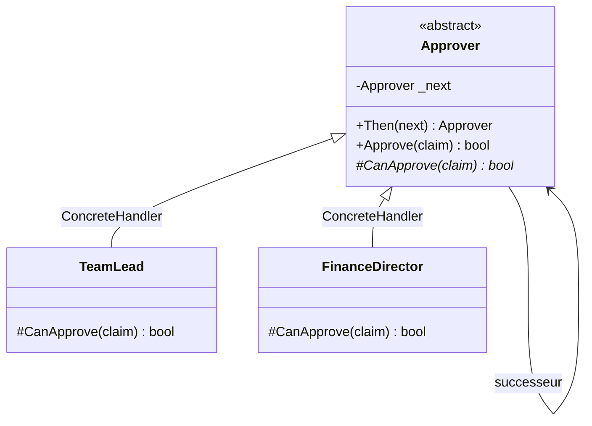

# Chain of Responsibility

🌍 🇫🇷 Français (ce fichier) · 🇬🇧 [English](ChainOfResponsibility-en.md)

## Intention

Chain of Responsibility est un patron comportemental qui évite de coupler l'émetteur d'une requête à son
destinataire en donnant à plusieurs objets une chance de la traiter, la requête circulant le long de la
chaîne jusqu'à ce que l'un d'eux s'en charge.

## Problème

Une note de frais est approuvée par un chef d'équipe jusqu'à cinq cents, par un directeur financier
jusqu'à vingt mille, et au-delà par le conseil.

Écrit au point de soumission, l'appelant doit connaître toute la hiérarchie :

```csharp
if (amount <= 500)         _teamLead.Approve(claim);
else if (amount <= 20_000) _financeDirector.Approve(claim);
else                       _board.Approve(claim);
```

Chaque endroit qui soumet une note porte désormais la politique d'approbation de l'entreprise, et un
changement de seuil — ou un nouveau niveau entre deux existants — doit être retrouvé dans tous.

## Solution

Le patron fait voyager la requête.

Chaque gestionnaire est interrogé sur sa capacité à traiter la note. S'il le peut, il le fait et la
requête s'arrête. Sinon, il la transmet à son successeur. Le soumetteur détient le premier gestionnaire et
ne sait rien au-delà : ni combien il y en a, ni ce qu'ils décident, ni lequel répondra.

La chaîne est assemblée ailleurs, une fois, et peut être réagencée sans toucher un seul appelant.

## Structure



La flèche du gestionnaire vers lui-même est la chaîne. Rien d'autre dans le diagramme ne dit sa longueur.

## Les rôles

| Rôle | Annotation | S'applique à | Ce qu'il porte |
|---|---|---|---|
| Handler | `[ChainOfResponsibility.Handler]` | interface, classe | Déclare l'opération de traitement et, d'ordinaire, le lien vers le successeur. |
| ConcreteHandler | `[ChainOfResponsibility.ConcreteHandler]` | classe | Traite les requêtes dont il a la charge, et transmet les autres à son successeur. |

Deux rôles, le plus petit nombre de tous les patrons à rôles multiples de ce catalogue. Le patron est une
forme plus qu'une distribution.

## L'exemple

Extrait de [`ChainOfResponsibilityUsage.cs`](../../../../DesignPatternCatalog.Usage/GangOfFour/ChainOfResponsibilityUsage.cs).

```csharp
public sealed record ExpenseClaim(string Employee, decimal Amount);
```

La requête, transportée inchangée le long de la chaîne et annotée par rien : c'est une donnée, non un
participant.

```csharp
[ChainOfResponsibility.Handler]
public abstract class Approver {

    private Approver? _next;

    public Approver Then(Approver next) {
        _next = next;

        return next;
    }

    public bool Approve(ExpenseClaim claim) {
        if (CanApprove(claim)) { return true; }

        return _next is not null && _next.Approve(claim);
    }

    protected abstract bool CanApprove(ExpenseClaim claim);

}
```

La classe de base porte tout le mécanisme, et les sous-classes répondent à une seule question. `Approve`
est la forme du patron en trois lignes : essayer, sinon transmettre, sinon s'arrêter.

Cette dernière clause mérite d'être nommée. `_next is not null && …` rend **false** au bout de la chaîne.
Le livre énonce cela comme le risque principal du patron — la réception n'est pas garantie, et une requête
peut tomber au bout sans que personne l'ait traitée. Ici c'est au moins explicite : l'appelant reçoit un
`false` dont il doit s'occuper, plutôt qu'un silence qu'il pourrait ne pas remarquer.

`Then` rend son argument plutôt que `this`, ce qui permet à `lead.Then(director).Then(board)` de se lire
comme une séquence. La chaîne est donc bâtie par celui qui compose l'application, et les gestionnaires
eux-mêmes ignorent leur position.

```csharp
[ChainOfResponsibility.ConcreteHandler(Handler = typeof(Approver))]
public sealed class TeamLead : Approver {
    protected override bool CanApprove(ExpenseClaim claim) => claim.Amount <= 500m;
}

[ChainOfResponsibility.ConcreteHandler(Handler = typeof(Approver))]
public sealed class FinanceDirector : Approver {
    protected override bool CanApprove(ExpenseClaim claim) => claim.Amount <= 20_000m;
}
```

Une ligne par niveau d'autorité. Chaque gestionnaire connaît sa propre limite et rien des autres, ce qui
permet d'insérer un niveau entre deux existants sans que ni l'un ni l'autre s'en aperçoive.

## Possibilités d'application

**Utilisez Chain of Responsibility lorsque plusieurs objets peuvent traiter une requête sans qu'on sache
lequel à l'avance** — le gestionnaire étant déterminé automatiquement à mesure que la requête circule.

**Utilisez Chain of Responsibility pour adresser une requête à l'un de plusieurs objets sans nommer le
destinataire explicitement.**

**Utilisez Chain of Responsibility lorsque l'ensemble des objets capables de traiter une requête doit être
spécifié dynamiquement**, de sorte que la chaîne puisse être assemblée et réagencée à l'exécution.

## Quand ne pas l'utiliser

**N'utilisez pas Chain of Responsibility là où toute requête doit être traitée.** L'inconvénient que le
livre énonce lui-même est que la réception n'est pas garantie : une requête peut parcourir toute la chaîne
sans que personne y réponde, et aucune partie de la structure ne l'empêche. Une conception qui exige une
réponse doit ajouter un gestionnaire terminal qui accepte toujours, ou traiter la sortie de chaîne comme
une erreur plutôt que comme un résultat.

**N'utilisez pas Chain of Responsibility là où les critères forment une table.** Des seuils comme ceux de
l'exemple sont des données, et une liste triée de limites avec une recherche dit la même chose en un seul
endroit, testable et ordonnée par construction. Le patron gagne son indirection quand les gestionnaires
diffèrent par nature plutôt que par un nombre.

**N'utilisez pas Chain of Responsibility là où l'ordre est subtil et non énoncé.** Le comportement dépend
entièrement de la séquence, et la séquence vit dans le code qui assemble la chaîne — souvent loin des
gestionnaires comme des appelants.

**N'utilisez pas Chain of Responsibility là où le débogage compte plus que le découplage.** Répondre à
« qui a traité cette requête, et pourquoi celui d'avant a-t-il décliné » oblige à parcourir une structure
qu'aucune classe ne décrit.

## Avantages

* Émetteur et destinataire sont découplés : aucun ne référence l'autre, et aucun ne sait combien de
  candidats existent.
* Les responsabilités s'attribuent souplement, la chaîne étant bâtie à l'exécution, réordonnable et
  extensible.
* Chaque gestionnaire est petit et testable seul, portant une seule décision.

## Inconvénients

* La réception n'est pas garantie, et une requête non traitée ressemble à une requête traitée si la
  conception ne dit pas le contraire.
* Le comportement est distribué : aucun endroit unique ne montre ce que le système fera d'une requête
  donnée.
* Chaque gestionnaire paie un appel pour chaque requête qu'il décline, et une longue chaîne les traverse
  tous.

## Liens avec les autres patrons

**`Composite`** est souvent la structure le long de laquelle une chaîne court : le parent d'un composant
est un successeur naturel, et le livre présente directement cette combinaison.

**`Command`** est une charge utile courante, permettant à la requête qui circule d'être stockée, mise en
file ou journalisée comme un objet.

**`Decorator`** paraît semblable — un objet détenant un autre du même type — et diffère en ceci que chaque
décorateur d'une chaîne contribue, là où un gestionnaire qui accepte une requête y met fin.

## Source

*Design Patterns: Elements of Reusable Object-Oriented Software*, Gamma, Helm, Johnson & Vlissides,
Addison-Wesley, 1994 — chapitre des patrons comportementaux.

* [Entrée d'index](../../../generated/catalog-index.md#chainofresponsibility-gang-of-four)
* [Attribut généré](../../../../DesignPatternCatalog.GangOfFour/ChainOfResponsibility.cs)
* [Exemple](../../../../DesignPatternCatalog.Usage/GangOfFour/ChainOfResponsibilityUsage.cs)
