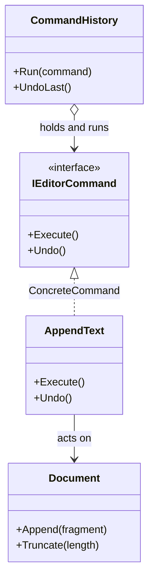

# Command

🌍 🇬🇧 English (this file) · 🇫🇷 [Français](Command-fr.md)

## Intent

Command is a behavioural pattern that encapsulates a request as an object, letting callers be
parameterized with different requests, and letting requests be queued, logged or undone.

## Problem

An editor appends text, deletes a selection, changes a font. Each is a method call, and a method call
happens and is gone.

That is enough until the editor needs undo, or a macro, or a queue, or a log of what a user did. None of
those can be built from a call: there is nothing to keep, nothing to reverse, nothing to replay. The
action has no existence apart from the moment it runs.

## Solution

The pattern turns the request into an object.

An object can be stored, put on a stack, sent over a queue, held until later, and asked to undo itself.
The caller no longer knows what the request does — it knows only that it can be executed — so one
invoker serves every action the application will ever have.

## Structure



## The roles

| Role | Annotation | Applies to | What it carries |
|---|---|---|---|
| Command | `[Command.Command]` | interface, class | Declares the operation that carries out the request. |
| ConcreteCommand | `[Command.ConcreteCommand]` | class, struct | Binds a receiver to an action, and implements the request by invoking it. |
| Receiver | `[Command.Receiver]` | interface, class | Knows how to perform the work associated with the request. |
| Invoker | `[Command.Invoker]` | class | Holds commands and asks them to carry out the request. |
| ExecuteMethod | `[Command.ExecuteMethod]` | method | The operation that carries out the request. |

## The example

From [`CommandUsage.cs`](../../../../DesignPatternCatalog.Usage/GangOfFour/CommandUsage.cs).

```csharp
[Command.Receiver]
public sealed class Document {

    public string Text { get; private set; } = string.Empty;

    public void Append(string fragment) => Text += fragment;
    public void Truncate(int length)    => Text = Text[..length];

}
```

The receiver knows how to do the work and nothing about commands.

```csharp
[Command.Command]
public interface IEditorCommand {

    [Command.ExecuteMethod]
    void Execute();

    void Undo();

}
```

`Execute` is annotated; `Undo` is not, because the catalogue holds one method role for this pattern and
that role is the one that carries out the request.

```csharp
[Command.ConcreteCommand(Command = typeof(IEditorCommand), Receiver = typeof(Document))]
public sealed class AppendText : IEditorCommand {

    private readonly Document _document;
    private readonly string   _fragment;
    private          int      _lengthBefore;

    public AppendText(Document document, string fragment) {
        _document = document;
        _fragment = fragment;
    }

    // No annotation here: the role is introduced by IEditorCommand.Execute, and annotated there once.
    public void Execute() {
        _lengthBefore = _document.Text.Length;
        _document.Append(_fragment);
    }

    public void Undo() => _document.Truncate(_lengthBefore);

}
```

The comment in the sample states a rule of this library rather than of the pattern:
[ADR-0010](../../for-maintainers/adr/0010-annotate-the-declaration-that-introduces-a-role.md) annotates
the declaration that introduces a role, never its implementations. The interface declares `Execute`
once, so the role is marked once; annotating every implementation would count one role as many.

The command holds what it needs to reverse itself — the length before the append — and captures it at
execution rather than at construction. Undo is only possible because that state is kept, and keeping it
is the command's job, not the document's.

```csharp
[Command.Invoker(Command = typeof(IEditorCommand))]
public sealed class CommandHistory {

    private readonly Stack<IEditorCommand> _done = new();

    public void Run(IEditorCommand command) {
        command.Execute();
        _done.Push(command);
    }

    public void UndoLast() {
        if (_done.Count > 0) { _done.Pop().Undo(); }
    }

}
```

The invoker is the reason the pattern was worth it: a history that works for every command that will
ever exist, written once, knowing none of them.

`Undo` here truncates back to a remembered length, which reverses an append and only an append. A command
that deletes from the middle cannot be undone by a length, so each command has to know its own inverse —
and some operations have none, which is the point at which a memento of the whole document replaces
per-command reversal.

## Applicability

**Use Command to parameterize objects by an action to perform** — the callback expressed as an object.

**Use Command to specify, queue and execute requests at different times**, the command's lifetime being
independent of the request that created it.

**Use Command to support undo**, the execute operation storing what it needs to reverse itself.

**Use Command to support logging changes**, so that they can be reapplied after a crash.

**Use Command to structure a system around high-level operations built on primitives** — the book's
transaction case, where a command is the unit that either happens or does not.

## When not to use it

**Do not use Command where a delegate suffices.** An action with no state, no undo and no queue is
`Action` on .NET. The pattern earns its type when the request must outlive the call.

**Do not promise undo the design cannot deliver.** Reversing an operation is a per-command problem, and
some operations are not reversible at all — a sent email, a deleted file, an operation whose inverse
depends on state something else has changed since. A partial undo is worse than none, because callers
trust it.

**Do not use Command where the invoker has to know what it is invoking.** An invoker that switches on the
command type has taken back the coupling the pattern removed.

**Do not let a command become the application.** A command that decides, validates, authorises and
notifies is a service with an `Execute` method; the pattern's value is that the object is small enough
to be queued, stacked and replayed.

## Advantages

* The object that invokes is decoupled from the object that knows how to perform.
* Commands are first-class: they can be stored, passed, queued, logged and composed.
* New commands are added without changing any existing class, since nothing existing knows them.
* Several commands can be assembled into one, which the book calls a macro command.

## Drawbacks

* A class per action, where a method call would have done.
* Undo has to be designed per command, and its state has to be kept somewhere for as long as it may be
  needed.
* A history that holds commands holds everything they reference, so the undo stack keeps objects alive.

## Relations with other patterns

**`Composite`** implements macro commands: a command holding commands, executed as one.

**`Memento`** carries the state a command needs to undo itself when the receiver's state is too large or
too private to be captured field by field.

**`Prototype`** copies a command before it is placed in a history, where the same command object would
otherwise be executed twice.

**`Observer`** and Command combine when a notification carries an object rather than parameters, so the
reaction can be queued or undone.

## Source

*Design Patterns: Elements of Reusable Object-Oriented Software*, Gamma, Helm, Johnson & Vlissides,
Addison-Wesley, 1994 — the behavioural patterns chapter.

* [Index entry](../../../generated/catalog-index.md#command-gang-of-four)
* [Generated attribute](../../../../DesignPatternCatalog.GangOfFour/Command.cs)
* [Sample](../../../../DesignPatternCatalog.Usage/GangOfFour/CommandUsage.cs)
