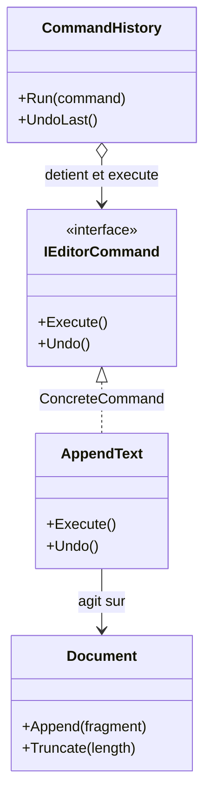

# Command

🌍 🇫🇷 Français (ce fichier) · 🇬🇧 [English](Command-en.md)

## Intention

Command est un patron comportemental qui encapsule une requête sous forme d'objet, permettant de
paramétrer les appelants par des requêtes différentes, et de mettre ces requêtes en file, de les
journaliser ou de les annuler.

## Problème

Un éditeur ajoute du texte, supprime une sélection, change une police. Chacune est un appel de méthode, et
un appel de méthode a lieu puis disparaît.

Cela suffit jusqu'à ce que l'éditeur ait besoin d'une annulation, d'une macro, d'une file, ou d'un journal
de ce que l'utilisateur a fait. Aucune de ces choses ne se construit à partir d'un appel : il n'y a rien à
garder, rien à inverser, rien à rejouer. L'action n'a aucune existence hors du moment où elle s'exécute.

## Solution

Le patron transforme la requête en objet.

Un objet se range, s'empile, se transmet par une file, se garde pour plus tard, et peut être prié de
s'annuler. L'appelant ne sait plus ce que fait la requête — il sait seulement qu'elle peut être exécutée
— si bien qu'un seul invocateur sert toutes les actions que l'application aura jamais.

## Structure



## Les rôles

| Rôle | Annotation | S'applique à | Ce qu'il porte |
|---|---|---|---|
| Command | `[Command.Command]` | interface, classe | Déclare l'opération qui accomplit la requête. |
| ConcreteCommand | `[Command.ConcreteCommand]` | classe, struct | Lie un destinataire à une action, et implémente la requête en l'invoquant. |
| Receiver | `[Command.Receiver]` | interface, classe | Sait accomplir le travail associé à la requête. |
| Invoker | `[Command.Invoker]` | classe | Détient des commandes et leur demande d'accomplir la requête. |
| ExecuteMethod | `[Command.ExecuteMethod]` | méthode | L'opération qui accomplit la requête. |

## L'exemple

Extrait de [`CommandUsage.cs`](../../../../DesignPatternCatalog.Usage/GangOfFour/CommandUsage.cs).

```csharp
[Command.Receiver]
public sealed class Document {

    public string Text { get; private set; } = string.Empty;

    public void Append(string fragment) => Text += fragment;
    public void Truncate(int length)    => Text = Text[..length];

}
```

Le destinataire sait faire le travail et ne sait rien des commandes.

```csharp
[Command.Command]
public interface IEditorCommand {

    [Command.ExecuteMethod]
    void Execute();

    void Undo();

}
```

`Execute` est annotée ; `Undo` ne l'est pas, parce que le catalogue ne tient qu'un rôle de méthode pour ce
patron, et que ce rôle est celui qui accomplit la requête.

```csharp
[Command.ConcreteCommand(Command = typeof(IEditorCommand), Receiver = typeof(Document))]
public sealed class AppendText : IEditorCommand {

    private readonly Document _document;
    private readonly string   _fragment;
    private          int      _lengthBefore;

    public AppendText(Document document, string fragment) {
        _document = document;
        _fragment = fragment;
    }

    // No annotation here: the role is introduced by IEditorCommand.Execute, and annotated there once.
    public void Execute() {
        _lengthBefore = _document.Text.Length;
        _document.Append(_fragment);
    }

    public void Undo() => _document.Truncate(_lengthBefore);

}
```

Le commentaire de l'exemple énonce une règle de cette bibliothèque et non du patron :
[ADR-0010](../../for-maintainers/adr/0010-annotate-the-declaration-that-introduces-a-role.md) annote la
déclaration qui introduit un rôle, jamais ses implémentations. L'interface déclare `Execute` une fois, le
rôle est donc marqué une fois ; annoter chaque implémentation compterait un rôle pour plusieurs.

La commande détient ce dont elle a besoin pour s'inverser — la longueur avant l'ajout — et le capture à
l'exécution plutôt qu'à la construction. L'annulation n'est possible que parce que cet état est conservé,
et le conserver est le travail de la commande, non celui du document.

```csharp
[Command.Invoker(Command = typeof(IEditorCommand))]
public sealed class CommandHistory {

    private readonly Stack<IEditorCommand> _done = new();

    public void Run(IEditorCommand command) {
        command.Execute();
        _done.Push(command);
    }

    public void UndoLast() {
        if (_done.Count > 0) { _done.Pop().Undo(); }
    }

}
```

L'invocateur est la raison pour laquelle le patron valait la peine : un historique qui fonctionne pour
toutes les commandes qui existeront jamais, écrit une fois, n'en connaissant aucune.

Ici, `Undo` tronque jusqu'à une longueur mémorisée, ce qui inverse un ajout et rien d'autre. Une commande
qui supprime au milieu ne s'annule pas par une longueur : chaque commande doit connaître son propre
inverse — et certaines opérations n'en ont pas, point à partir duquel un memento du document entier
remplace l'inversion commande par commande.

## Possibilités d'application

**Utilisez Command pour paramétrer des objets par une action à accomplir** — le rappel exprimé comme un
objet.

**Utilisez Command pour spécifier, mettre en file et exécuter des requêtes à des moments différents**, la
durée de vie de la commande étant indépendante de la requête qui l'a créée.

**Utilisez Command pour prendre en charge l'annulation**, l'opération d'exécution stockant ce dont elle a
besoin pour s'inverser.

**Utilisez Command pour journaliser les changements**, afin de pouvoir les réappliquer après une panne.

**Utilisez Command pour structurer un système autour d'opérations de haut niveau bâties sur des
primitives** — le cas transactionnel du livre, où une commande est l'unité qui a lieu ou n'a pas lieu.

## Quand ne pas l'utiliser

**N'utilisez pas Command là où un délégué suffit.** Une action sans état, sans annulation et sans file,
c'est `Action` sur .NET. Le patron gagne son type quand la requête doit survivre à l'appel.

**Ne promettez pas une annulation que la conception ne peut pas tenir.** Inverser une opération est un
problème propre à chaque commande, et certaines opérations ne sont pas réversibles du tout — un courriel
envoyé, un fichier supprimé, une opération dont l'inverse dépend d'un état que quelque chose d'autre a
modifié depuis. Une annulation partielle est pire que pas d'annulation, parce que les appelants s'y fient.

**N'utilisez pas Command là où l'invocateur doit savoir ce qu'il invoque.** Un invocateur qui branche sur
le type de la commande a repris le couplage que le patron avait retiré.

**Ne laissez pas une commande devenir l'application.** Une commande qui décide, valide, autorise et
notifie est un service muni d'une méthode `Execute` ; la valeur du patron tient à ce que l'objet soit
assez petit pour être mis en file, empilé et rejoué.

## Avantages

* L'objet qui invoque est découplé de celui qui sait accomplir.
* Les commandes sont de première classe : elles se stockent, se passent, se mettent en file, se
  journalisent et se composent.
* De nouvelles commandes s'ajoutent sans modifier aucune classe existante, puisque rien d'existant ne les
  connaît.
* Plusieurs commandes s'assemblent en une seule, ce que le livre appelle une macro-commande.

## Inconvénients

* Une classe par action, là où un appel de méthode aurait suffi.
* L'annulation se conçoit commande par commande, et son état doit être conservé aussi longtemps qu'il
  peut servir.
* Un historique qui détient des commandes détient tout ce qu'elles référencent : la pile d'annulation
  maintient des objets en vie.

## Liens avec les autres patrons

**`Composite`** implémente les macro-commandes : une commande détenant des commandes, exécutée comme une
seule.

**`Memento`** porte l'état dont une commande a besoin pour s'annuler lorsque celui du destinataire est trop
volumineux ou trop privé pour être capturé champ par champ.

**`Prototype`** copie une commande avant son placement dans un historique, là où le même objet-commande
serait sinon exécuté deux fois.

**`Observer`** et Command se combinent quand une notification porte un objet plutôt que des paramètres, de
sorte que la réaction puisse être mise en file ou annulée.

## Source

*Design Patterns: Elements of Reusable Object-Oriented Software*, Gamma, Helm, Johnson & Vlissides,
Addison-Wesley, 1994 — chapitre des patrons comportementaux.

* [Entrée d'index](../../../generated/catalog-index.md#command-gang-of-four)
* [Attribut généré](../../../../DesignPatternCatalog.GangOfFour/Command.cs)
* [Exemple](../../../../DesignPatternCatalog.Usage/GangOfFour/CommandUsage.cs)
