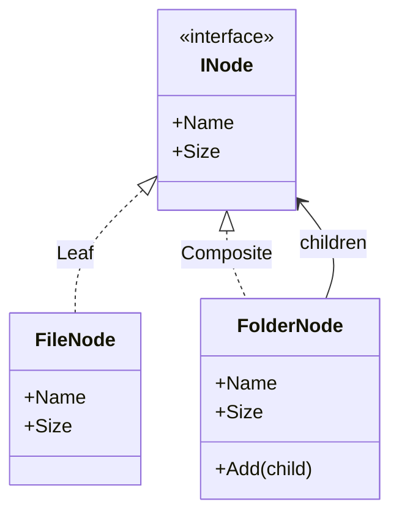

# Composite

🌍 🇬🇧 English (this file) · 🇫🇷 [Français](Composite-fr.md)

## Intent

Composite is a structural pattern that composes objects into tree structures to represent part-whole
hierarchies, and lets clients treat individual objects and compositions uniformly.

## Problem

A file browser shows a tree of files and folders, and every screen asks both of them the same questions:
what is its name, what is its size.

Written without the pattern, the caller has to know which it is holding:

```csharp
long size = node is FolderNode folder
    ? folder.Children.Sum(Size)   // and recurse, here, in the caller
    : ((FileNode)node).Size;
```

The recursion leaks into every caller, each of them re-deciding what a folder's size means. Adding a
third kind of node — a symbolic link, an archive — means finding every one of those tests.

## Solution

The pattern gives the whole and the part one interface.

A leaf answers the questions from its own data. A composite answers them by asking its children the same
questions and combining the answers. Since both satisfy the same interface, a caller holds one thing and
never asks which kind it is; the recursion lives once, inside the composite.

## Structure



The arrow from the composite back to the interface is the pattern: a folder holds `INode`, so it holds
files and folders alike, to any depth, without knowing which.

## The roles

| Role | Annotation | Applies to | What it carries |
|---|---|---|---|
| Component | `[Composite.Component]` | interface, class | Declares the interface shared by the leaves and the composites of the tree. |
| Leaf | `[Composite.Leaf]` | class, struct | A terminal element of the tree: it has no children. |
| Composite | `[Composite.Composite]` | class | An element that holds other components and delegates the work to them. |

## The example

From [`CompositeUsage.cs`](../../../../DesignPatternCatalog.Usage/GangOfFour/CompositeUsage.cs).

```csharp
[Composite.Component]
public interface INode {
    string Name { get; }
    long   Size { get; }
}
```

Two members, and neither mentions children. This is the interface a caller works against, and it is
deliberately the interface of a *part*, not of a container.

```csharp
[Composite.Leaf(Component = typeof(INode))]
public sealed class FileNode : INode {

    public FileNode(string name, long size) {
        Name = name;
        Size = size;
    }

    public string Name { get; }
    public long   Size { get; }

}
```

The leaf answers from its own state.

```csharp
[Composite.Composite(Component = typeof(INode))]
public sealed class FolderNode : INode {

    private readonly List<INode> _children = new();

    public FolderNode(string name) { Name = name; }

    public string Name { get; }
    public long   Size => _children.Sum(child => child.Size);

    public void Add(INode child) => _children.Add(child);

}
```

`Size` is the pattern in one line: the composite answers by asking its children, and because a child may
itself be a folder the recursion goes as deep as the tree.

`Add` is declared here and not on `INode`, and that is a decision the book discusses at length. Putting
child management on the component would make every caller able to add children to a file, which is
uniform and unsafe; leaving it on the composite means a caller that needs to build a tree must know it
holds a folder, which is safe and less uniform. The sample takes safety. The book calls this the choice
between transparency and safety and says there is no answer that satisfies both.

## Applicability

**Use Composite to represent part-whole hierarchies of objects.**

**Use Composite when clients should be able to ignore the difference between a composition and an
individual object**, treating everything in the structure uniformly.

## When not to use it

**Do not use Composite where leaves and composites do not really share operations.** A component
interface that fits both only because half its members are meaningless on a leaf has bought uniformity by
weakening every type in the tree.

**Do not use Composite where the caller has to know which kind it holds anyway.** If the interesting
operations end up on the composite, callers will test and cast, and the uniformity the pattern promises
never arrives.

**Do not use Composite on a graph that can contain cycles.** Nothing in the structure prevents a folder
being added to its own subtree, and `Size` then recurses until the stack ends. A tree is an invariant the
pattern assumes and does not enforce.

**Do not use Composite where the tree is deep and the traversal is hot.** Every question walks the
structure, so an unmemoised `Size` on a large tree is recomputed on each read.

## Advantages

* Client code is simple: one interface, no tests on kind, no recursion outside the structure.
* New kinds of leaf and composite are added without touching callers.
* Arbitrarily complex structures are expressed by composition rather than by a class per shape.

## Drawbacks

* The component interface tends to become the union of what leaves and composites need, which makes it
  too general for both.
* The type system stops helping: nothing prevents a component being placed where only a leaf makes
  sense.
* The tree invariant is assumed rather than checked, and cycles are not detected.

## Relations with other patterns

**`Decorator`** shares the recursive structure, holding one child rather than many and adding behaviour
rather than aggregating. The two are often used together, and the book notes that a decorator can be read
as a degenerate composite.

**`Iterator`** traverses the structure without exposing it, which is what a client usually wants next.

**`Visitor`** localises an operation over the whole tree in one class instead of spreading it across every
component.

**`Flyweight`** allows leaves to be shared between several parents when they carry no context of their
own.

**`Builder`** is frequently what assembles a composite, a tree being the natural product of a
step-by-step construction.

## Source

*Design Patterns: Elements of Reusable Object-Oriented Software*, Gamma, Helm, Johnson & Vlissides,
Addison-Wesley, 1994 — the structural patterns chapter.

* [Index entry](../../../generated/catalog-index.md#composite-gang-of-four)
* [Generated attribute](../../../../DesignPatternCatalog.GangOfFour/Composite.cs)
* [Sample](../../../../DesignPatternCatalog.Usage/GangOfFour/CompositeUsage.cs)
