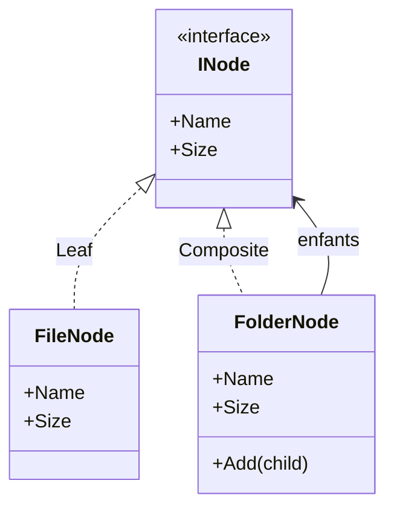

# Composite

🌍 🇫🇷 Français (ce fichier) · 🇬🇧 [English](Composite-en.md)

## Intention

Composite est un patron structurel qui compose des objets en structures arborescentes pour représenter des
hiérarchies partie-tout, et laisse les clients traiter uniformément les objets individuels et les
compositions.

## Problème

Un explorateur de fichiers montre un arbre de fichiers et de dossiers, et chaque écran leur pose les mêmes
questions : quel est son nom, quelle est sa taille.

Écrit sans le patron, l'appelant doit savoir ce qu'il tient :

```csharp
long size = node is FolderNode folder
    ? folder.Children.Sum(Size)   // et la récursion, ici, chez l'appelant
    : ((FileNode)node).Size;
```

La récursion fuit dans chaque appelant, et chacun redécide de ce que signifie la taille d'un dossier.
Ajouter un troisième type de nœud — un lien symbolique, une archive — oblige à retrouver chacun de ces
tests.

## Solution

Le patron donne une seule interface au tout et à la partie.

Une feuille répond aux questions depuis ses propres données. Un composite y répond en posant les mêmes
questions à ses enfants et en combinant les réponses. Comme les deux satisfont la même interface, un
appelant tient une seule chose et ne demande jamais de quel type elle est ; la récursion vit une seule
fois, dans le composite.

## Structure



La flèche qui part du composite vers l'interface est le patron : un dossier détient des `INode`, donc des
fichiers comme des dossiers, à n'importe quelle profondeur, sans savoir lesquels.

## Les rôles

| Rôle | Annotation | S'applique à | Ce qu'il porte |
|---|---|---|---|
| Component | `[Composite.Component]` | interface, classe | Déclare l'interface partagée par les feuilles et les composites de l'arbre. |
| Leaf | `[Composite.Leaf]` | classe, struct | Un élément terminal de l'arbre : il n'a pas d'enfants. |
| Composite | `[Composite.Composite]` | classe | Un élément qui détient d'autres composants et leur délègue le travail. |

## L'exemple

Extrait de [`CompositeUsage.cs`](../../../../DesignPatternCatalog.Usage/GangOfFour/CompositeUsage.cs).

```csharp
[Composite.Component]
public interface INode {
    string Name { get; }
    long   Size { get; }
}
```

Deux membres, et aucun ne mentionne d'enfants. C'est l'interface contre laquelle un appelant travaille, et
c'est délibérément l'interface d'une *partie*, non celle d'un conteneur.

```csharp
[Composite.Leaf(Component = typeof(INode))]
public sealed class FileNode : INode {

    public FileNode(string name, long size) {
        Name = name;
        Size = size;
    }

    public string Name { get; }
    public long   Size { get; }

}
```

La feuille répond depuis son propre état.

```csharp
[Composite.Composite(Component = typeof(INode))]
public sealed class FolderNode : INode {

    private readonly List<INode> _children = new();

    public FolderNode(string name) { Name = name; }

    public string Name { get; }
    public long   Size => _children.Sum(child => child.Size);

    public void Add(INode child) => _children.Add(child);

}
```

`Size` est le patron en une ligne : le composite répond en interrogeant ses enfants, et comme un enfant peut
lui-même être un dossier, la récursion descend aussi profond que l'arbre.

`Add` est déclaré ici et non sur `INode`, et c'est une décision que le livre discute longuement. Placer la
gestion des enfants sur le composant rendrait tout appelant capable d'ajouter des enfants à un fichier, ce
qui est uniforme et dangereux ; la laisser sur le composite oblige un appelant qui construit un arbre à
savoir qu'il tient un dossier, ce qui est sûr et moins uniforme. L'exemple choisit la sûreté. Le livre
nomme cet arbitrage transparence contre sûreté, et dit qu'aucune réponse ne satisfait les deux.

## Possibilités d'application

**Utilisez Composite pour représenter des hiérarchies partie-tout d'objets.**

**Utilisez Composite lorsque les clients doivent pouvoir ignorer la différence entre une composition et un
objet individuel**, en traitant uniformément tout ce que contient la structure.

## Quand ne pas l'utiliser

**N'utilisez pas Composite là où feuilles et composites ne partagent pas réellement d'opérations.** Une
interface de composant qui ne convient aux deux que parce que la moitié de ses membres n'a aucun sens sur
une feuille a payé l'uniformité en affaiblissant chaque type de l'arbre.

**N'utilisez pas Composite si l'appelant doit de toute façon savoir ce qu'il tient.** Si les opérations
intéressantes finissent sur le composite, les appelants testeront et convertiront, et l'uniformité que
promet le patron n'arrive jamais.

**N'utilisez pas Composite sur un graphe pouvant contenir des cycles.** Rien dans la structure n'empêche
d'ajouter un dossier à son propre sous-arbre, et `Size` récurse alors jusqu'à épuisement de la pile.
L'arborescence est un invariant que le patron suppose et n'impose pas.

**N'utilisez pas Composite là où l'arbre est profond et le parcours fréquent.** Chaque question parcourt la
structure : un `Size` non mémoïsé sur un grand arbre est recalculé à chaque lecture.

## Avantages

* Le code client est simple : une interface, aucun test de type, aucune récursion hors de la structure.
* De nouveaux types de feuilles et de composites s'ajoutent sans toucher aux appelants.
* Des structures arbitrairement complexes s'expriment par composition plutôt que par une classe par forme.

## Inconvénients

* L'interface du composant tend à devenir l'union de ce dont feuilles et composites ont besoin, ce qui la
  rend trop générale pour les deux.
* Le système de types cesse d'aider : rien n'empêche de placer un composant là où seule une feuille a du
  sens.
* L'invariant d'arborescence est supposé plutôt que vérifié, et les cycles ne sont pas détectés.

## Liens avec les autres patrons

**`Decorator`** partage la structure récursive, en détenant un enfant plutôt que plusieurs et en ajoutant du
comportement plutôt qu'en agrégeant. Les deux s'emploient souvent ensemble, et le livre note qu'un décorateur
peut se lire comme un composite dégénéré.

**`Iterator`** parcourt la structure sans l'exposer, ce qu'un client veut d'ordinaire ensuite.

**`Visitor`** localise une opération sur tout l'arbre dans une seule classe au lieu de la répandre sur
chaque composant.

**`Flyweight`** permet de partager des feuilles entre plusieurs parents lorsqu'elles ne portent aucun
contexte propre.

**`Builder`** est fréquemment ce qui assemble un composite, un arbre étant le produit naturel d'une
construction étape par étape.

## Source

*Design Patterns: Elements of Reusable Object-Oriented Software*, Gamma, Helm, Johnson & Vlissides,
Addison-Wesley, 1994 — chapitre des patrons structurels.

* [Entrée d'index](../../../generated/catalog-index.md#composite-gang-of-four)
* [Attribut généré](../../../../DesignPatternCatalog.GangOfFour/Composite.cs)
* [Exemple](../../../../DesignPatternCatalog.Usage/GangOfFour/CompositeUsage.cs)
