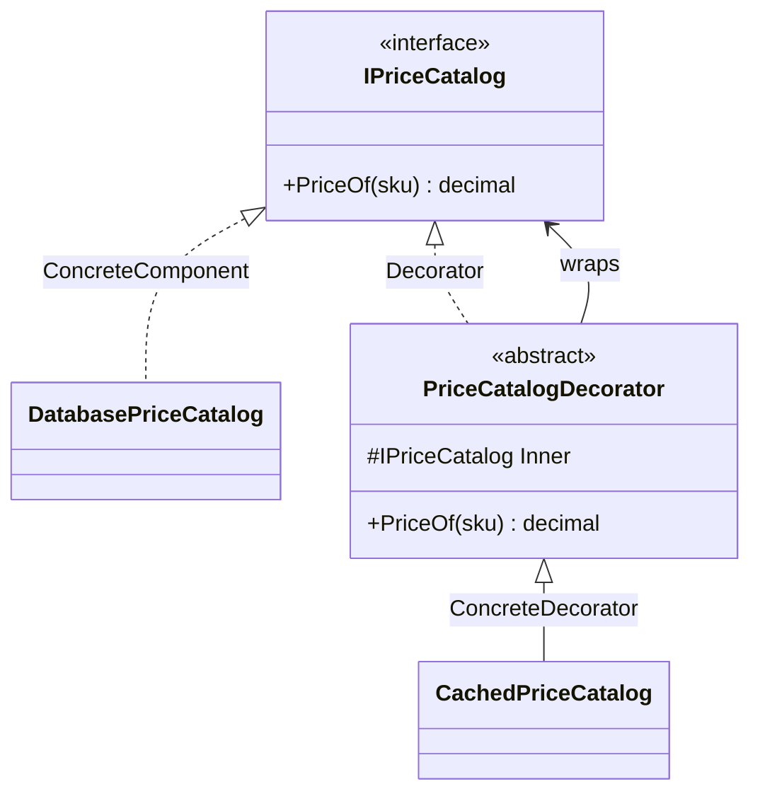

# Decorator

🌍 🇬🇧 English (this file) · 🇫🇷 [Français](Decorator-fr.md)

## Intent

Decorator is a structural pattern that attaches additional responsibilities to an object dynamically, as
a flexible alternative to subclassing for extending behaviour.

## Problem

A price catalogue reads from the database. It works, it is tested, and it is slow enough that repeated
lookups should be cached. Later the same calls need tracing, and later still a retry.

Subclassing answers the first request and collapses on the second. `CachedPriceCatalog`,
`TracedPriceCatalog`, then `CachedTracedPriceCatalog`, and a class per combination after that. The
combinations multiply while the responsibilities stay simple, and none of them can be turned off for one
caller.

## Solution

The pattern wraps rather than extends.

A decorator implements the same interface as the object it wraps, holds one, and forwards to it. Around
that forwarding it does its own work — before, after, or instead. Because the wrapper satisfies the same
interface, it can wrap another wrapper, and the responsibilities compose at run time in whatever order
the composition root chooses.

## Structure



The decorator both implements the component interface and holds one. That double relation is what allows
the chain, and it is what distinguishes the pattern from ordinary subclassing.

## The roles

| Role | Annotation | Applies to | What it carries |
|---|---|---|---|
| Component | `[Decorator.Component]` | interface, class | Declares the interface shared by the decorated objects and their decorators. |
| ConcreteComponent | `[Decorator.ConcreteComponent]` | class | The object to which responsibilities can be attached. |
| Decorator | `[Decorator.Decorator]` | class | Holds a component and forwards to it, providing the base for concrete decorators. |
| ConcreteDecorator | `[Decorator.ConcreteDecorator]` | class | Adds one responsibility around the component it wraps. |

## The example

From [`DecoratorUsage.cs`](../../../../DesignPatternCatalog.Usage/GangOfFour/DecoratorUsage.cs).

```csharp
[Decorator.Component]
public interface IPriceCatalog {
    decimal PriceOf(string sku);
}

[Decorator.ConcreteComponent(Component = typeof(IPriceCatalog))]
public sealed class DatabasePriceCatalog : IPriceCatalog {
    public decimal PriceOf(string sku) => 19.90m;
}
```

The thing being decorated knows nothing about decoration, which is the property the pattern exists to
preserve.

```csharp
[Decorator.Decorator(Component = typeof(IPriceCatalog))]
public abstract class PriceCatalogDecorator : IPriceCatalog {

    protected PriceCatalogDecorator(IPriceCatalog inner) { Inner = inner; }

    protected IPriceCatalog Inner { get; }

    public virtual decimal PriceOf(string sku) => Inner.PriceOf(sku);

}
```

The abstract decorator carries the plumbing so that concrete decorators do not repeat it: hold the
inner component, and forward every member by default. With a one-member interface the saving is small;
with twenty members it is the difference between a decorator being three lines and being twenty-three.

```csharp
[Decorator.ConcreteDecorator(Decorator = typeof(PriceCatalogDecorator))]
public sealed class CachedPriceCatalog : PriceCatalogDecorator {

    private readonly Dictionary<string, decimal> _cache = new();

    public CachedPriceCatalog(IPriceCatalog inner) : base(inner) { }

    public override decimal PriceOf(string sku) {
        if (_cache.TryGetValue(sku, out decimal cached)) { return cached; }

        decimal price = Inner.PriceOf(sku);
        _cache[sku] = price;

        return price;
    }

}
```

One responsibility, added without touching `DatabasePriceCatalog`. The decorator is stateful — the cache
belongs to the wrapper, not to the thing wrapped — and it holds that state for as long as the wrapper
lives, which makes its lifetime a decision rather than a detail.

## Applicability

**Use Decorator to add responsibilities to individual objects dynamically and transparently**, without
affecting other objects of the same type.

**Use Decorator for responsibilities that can be withdrawn.**

**Use Decorator when extension by subclassing is impractical** — where the combinations would produce a
class per pairing, or where the class to extend is sealed or not owned.

## When not to use it

**Do not use Decorator over a wide interface.** Every decorator must forward every member, and a member
added to the component obliges every decorator in the codebase. The abstract decorator softens this and
does not remove it.

**Do not use Decorator where the order of wrapping is significant and unstated.** Caching outside
tracing hides the calls that the cache answers; tracing outside caching records them. Both compositions
compile, and the composition root is the only place the choice appears.

**Do not use Decorator where callers depend on the object's identity or its concrete type.** A wrapped
object fails `is DatabasePriceCatalog`, reports the wrapper from `GetType()`, and is not reference-equal
to what was registered.

**Do not use Decorator where an interception mechanism already exists.** Containers and proxy generators
apply cross-cutting behaviour without a class per responsibility, at the cost of the behaviour no longer
being visible in the type graph.

## Advantages

* More flexible than static inheritance: responsibilities are added and removed at run time, and
  combined in any order.
* Each responsibility is one small class, so a feature that was a combinatorial explosion of subclasses
  becomes a list of wrappers.
* The decorated class stays unchanged, which matters most when it is sealed, generated, or owned by
  someone else.

## Drawbacks

* A decorator is not identical to its component: identity, type checks and reference equality all see
  the wrapper.
* A design ends up with many small similar classes, and reading a stack of them tells less about the
  behaviour than one class would.
* Debugging goes through every layer, and a chain assembled at run time is not visible in the code that
  uses it.

## Relations with other patterns

**`Adapter`** changes the interface of what it wraps; a decorator keeps it and changes the behaviour.

**`Composite`** shares the recursive structure. The Gang of Four describe a decorator as a degenerate
composite with a single child, adding behaviour rather than aggregating.

**`Proxy`** is also a wrapper keeping the same interface, and the difference is intent: a proxy controls
access to its subject, a decorator augments it.

**`Strategy`** changes the guts of an object where a decorator changes its skin, in the book's own
phrasing. Where the object cannot be wrapped, changing what it delegates to is the alternative.

## Source

*Design Patterns: Elements of Reusable Object-Oriented Software*, Gamma, Helm, Johnson & Vlissides,
Addison-Wesley, 1994 — the structural patterns chapter.

* [Index entry](../../../generated/catalog-index.md#decorator-gang-of-four)
* [Generated attribute](../../../../DesignPatternCatalog.GangOfFour/Decorator.cs)
* [Sample](../../../../DesignPatternCatalog.Usage/GangOfFour/DecoratorUsage.cs)
