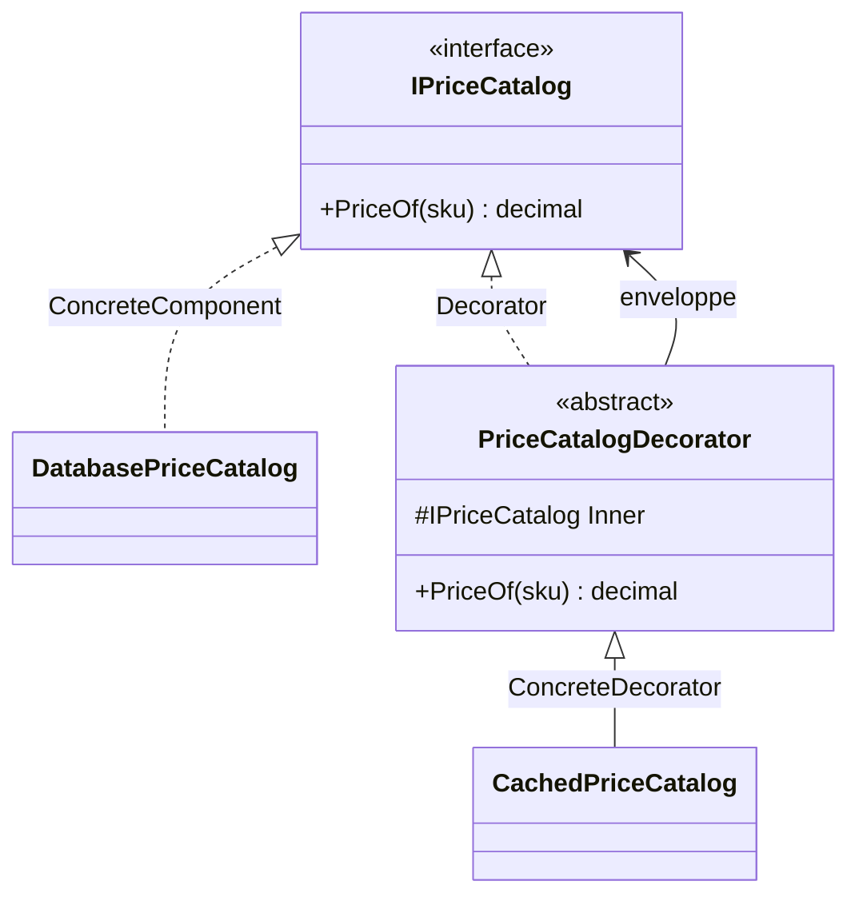

# Decorator

🌍 🇫🇷 Français (ce fichier) · 🇬🇧 [English](Decorator-en.md)

## Intention

Decorator est un patron structurel qui attache dynamiquement des responsabilités supplémentaires à un
objet, en alternative souple à l'héritage pour étendre un comportement.

## Problème

Un catalogue de prix lit en base. Il fonctionne, il est testé, et il est assez lent pour que des
consultations répétées méritent un cache. Plus tard, les mêmes appels demandent une trace, et plus tard
encore un réessai.

L'héritage répond à la première demande et s'effondre à la deuxième. `CachedPriceCatalog`,
`TracedPriceCatalog`, puis `CachedTracedPriceCatalog`, et ensuite une classe par combinaison. Les
combinaisons se multiplient pendant que les responsabilités restent simples, et aucune ne peut être coupée
pour un seul appelant.

## Solution

Le patron enveloppe au lieu d'étendre.

Un décorateur implémente la même interface que l'objet qu'il enveloppe, en détient un, et lui transmet les
appels. Autour de cette transmission il fait son propre travail — avant, après, ou à la place. Comme
l'enveloppe satisfait la même interface, elle peut envelopper une autre enveloppe, et les responsabilités se
composent à l'exécution dans l'ordre que la racine de composition choisit.

## Structure



Le décorateur à la fois implémente l'interface du composant et en détient un. Cette double relation est ce
qui autorise la chaîne, et ce qui distingue le patron d'un héritage ordinaire.

## Les rôles

| Rôle | Annotation | S'applique à | Ce qu'il porte |
|---|---|---|---|
| Component | `[Decorator.Component]` | interface, classe | Déclare l'interface partagée par les objets décorés et leurs décorateurs. |
| ConcreteComponent | `[Decorator.ConcreteComponent]` | classe | L'objet auquel des responsabilités peuvent être attachées. |
| Decorator | `[Decorator.Decorator]` | classe | Détient un composant et lui transmet les appels, servant de base aux décorateurs concrets. |
| ConcreteDecorator | `[Decorator.ConcreteDecorator]` | classe | Ajoute une responsabilité autour du composant qu'il enveloppe. |

## L'exemple

Extrait de [`DecoratorUsage.cs`](../../../../DesignPatternCatalog.Usage/GangOfFour/DecoratorUsage.cs).

```csharp
[Decorator.Component]
public interface IPriceCatalog {
    decimal PriceOf(string sku);
}

[Decorator.ConcreteComponent(Component = typeof(IPriceCatalog))]
public sealed class DatabasePriceCatalog : IPriceCatalog {
    public decimal PriceOf(string sku) => 19.90m;
}
```

La chose décorée ne sait rien de la décoration, et c'est la propriété que le patron existe pour préserver.

```csharp
[Decorator.Decorator(Component = typeof(IPriceCatalog))]
public abstract class PriceCatalogDecorator : IPriceCatalog {

    protected PriceCatalogDecorator(IPriceCatalog inner) { Inner = inner; }

    protected IPriceCatalog Inner { get; }

    public virtual decimal PriceOf(string sku) => Inner.PriceOf(sku);

}
```

Le décorateur abstrait porte la plomberie pour que les décorateurs concrets ne la répètent pas : détenir le
composant interne, et transmettre chaque membre par défaut. Avec une interface à un membre, l'économie est
mince ; avec vingt membres, c'est la différence entre un décorateur de trois lignes et un de vingt-trois.

```csharp
[Decorator.ConcreteDecorator(Decorator = typeof(PriceCatalogDecorator))]
public sealed class CachedPriceCatalog : PriceCatalogDecorator {

    private readonly Dictionary<string, decimal> _cache = new();

    public CachedPriceCatalog(IPriceCatalog inner) : base(inner) { }

    public override decimal PriceOf(string sku) {
        if (_cache.TryGetValue(sku, out decimal cached)) { return cached; }

        decimal price = Inner.PriceOf(sku);
        _cache[sku] = price;

        return price;
    }

}
```

Une responsabilité, ajoutée sans toucher à `DatabasePriceCatalog`. Le décorateur est à état — le cache
appartient à l'enveloppe, non à la chose enveloppée — et il garde cet état aussi longtemps que l'enveloppe
vit, ce qui fait de sa durée de vie une décision et non un détail.

## Possibilités d'application

**Utilisez Decorator pour ajouter dynamiquement et de façon transparente des responsabilités à des objets
individuels**, sans affecter les autres objets du même type.

**Utilisez Decorator pour des responsabilités qui peuvent être retirées.**

**Utilisez Decorator lorsque l'extension par héritage est impraticable** — là où les combinaisons
produiraient une classe par paire, ou là où la classe à étendre est scellée ou n'appartient pas au projet.

## Quand ne pas l'utiliser

**N'utilisez pas Decorator au-dessus d'une interface large.** Chaque décorateur doit transmettre chaque
membre, et un membre ajouté au composant oblige tous les décorateurs de la base de code. Le décorateur
abstrait adoucit ce coût sans le supprimer.

**N'utilisez pas Decorator là où l'ordre d'enveloppement compte et n'est pas énoncé.** Le cache à l'extérieur
de la trace masque les appels auxquels le cache répond ; la trace à l'extérieur du cache les enregistre. Les
deux compositions compilent, et la racine de composition est le seul endroit où le choix apparaît.

**N'utilisez pas Decorator là où les appelants dépendent de l'identité de l'objet ou de son type concret.**
Un objet enveloppé échoue à `is DatabasePriceCatalog`, rapporte l'enveloppe depuis `GetType()`, et n'est pas
identique par référence à ce qui a été enregistré.

**N'utilisez pas Decorator là où un mécanisme d'interception existe déjà.** Les conteneurs et les
générateurs de proxy appliquent un comportement transverse sans une classe par responsabilité, au prix d'un
comportement qui n'est plus visible dans le graphe de types.

## Avantages

* Plus souple qu'un héritage statique : les responsabilités s'ajoutent et se retirent à l'exécution, et se
  combinent dans n'importe quel ordre.
* Chaque responsabilité est une petite classe : une fonctionnalité qui était une explosion combinatoire de
  sous-classes devient une liste d'enveloppes.
* La classe décorée reste inchangée, ce qui compte surtout quand elle est scellée, générée, ou détenue par
  quelqu'un d'autre.

## Inconvénients

* Un décorateur n'est pas identique à son composant : identité, tests de type et égalité par référence voient
  l'enveloppe.
* La conception se peuple de nombreuses petites classes semblables, et lire une pile d'enveloppes renseigne
  moins sur le comportement qu'une seule classe.
* Le débogage traverse chaque couche, et une chaîne assemblée à l'exécution n'est pas visible dans le code
  qui l'utilise.

## Liens avec les autres patrons

**`Adapter`** change l'interface de ce qu'il enveloppe ; un décorateur la conserve et change le
comportement.

**`Composite`** partage la structure récursive. Le Gang of Four décrit un décorateur comme un composite
dégénéré à un seul enfant, qui ajoute du comportement au lieu d'agréger.

**`Proxy`** est aussi une enveloppe qui garde la même interface, et la différence est d'intention : un proxy
contrôle l'accès à son sujet, un décorateur l'augmente.

**`Strategy`** change les entrailles d'un objet là où un décorateur change sa peau, selon la formule même du
livre. Là où l'objet ne peut pas être enveloppé, changer ce à quoi il délègue est l'alternative.

## Source

*Design Patterns: Elements of Reusable Object-Oriented Software*, Gamma, Helm, Johnson & Vlissides,
Addison-Wesley, 1994 — chapitre des patrons structurels.

* [Entrée d'index](../../../generated/catalog-index.md#decorator-gang-of-four)
* [Attribut généré](../../../../DesignPatternCatalog.GangOfFour/Decorator.cs)
* [Exemple](../../../../DesignPatternCatalog.Usage/GangOfFour/DecoratorUsage.cs)
