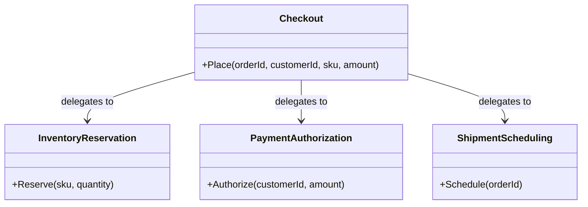

# Facade

🌍 🇬🇧 English (this file) · 🇫🇷 [Français](Facade-fr.md)

## Intent

Facade is a structural pattern that provides a single, higher level interface to a set of interfaces in a
subsystem, making that subsystem easier to use.

## Problem

Placing an order touches three subsystems: stock is reserved, payment is authorised, a shipment is
scheduled. Each has its own type, its own vocabulary and its own order in the sequence.

Every caller that places an order therefore has to know all three, and has to know that reservation comes
before authorisation. The web front end knows it, the phone-order screen knows it, the batch importer
knows it, and each of them is a place where the sequence can be got wrong.

## Solution

The pattern adds one type in front of the three, offering the operation the caller actually wants.

The facade knows which subsystem handles what and in which order; it holds no domain logic of its own and
delegates everything. Callers depend on one small interface instead of three larger ones, and the sequence
exists in one place.

The subsystems stay public. A facade is a convenience, not a wall: a caller with an unusual need can still
address them directly.

## Structure



Every arrow points away from the facade. Nothing points back: the subsystems do not know it exists, which
is what distinguishes this pattern from a mediator.

## The roles

| Role | Annotation | Applies to | What it carries |
|---|---|---|---|
| Facade | `[Facade.Facade]` | class | Offers the simplified entry point, and knows which subsystem type handles each request. |
| Subsystem | `[Facade.Subsystem]` | interface, class, struct | Does the real work, and knows nothing about the facade. |

## The example

From [`FacadeUsage.cs`](../../../../DesignPatternCatalog.Usage/GangOfFour/FacadeUsage.cs).

```csharp
[Facade.Subsystem]
public sealed class InventoryReservation {
    public void Reserve(string sku, int quantity) { }
}

[Facade.Subsystem]
public sealed class PaymentAuthorization {
    public void Authorize(string customerId, decimal amount) { }
}

[Facade.Subsystem]
public sealed class ShipmentScheduling {
    public void Schedule(string orderId) { }
}
```

Three independent pieces of work. None of them mentions checkout, and none mentions the others.

```csharp
[Facade.Facade]
public sealed class Checkout {

    private readonly InventoryReservation _inventory = new();
    private readonly PaymentAuthorization _payment   = new();
    private readonly ShipmentScheduling   _shipping  = new();

    public void Place(string orderId, string customerId, string sku, decimal amount) {
        _inventory.Reserve(sku, 1);
        _payment.Authorize(customerId, amount);
        _shipping.Schedule(orderId);
    }

}
```

One method holding the sequence, and no logic beyond it: no calculation, no decision, no rule. That
restraint is what keeps this a facade.

The three `new` expressions are worth naming, because they are the point where this pattern and dependency
injection meet and disagree. A facade that constructs its own subsystems cannot be tested against
substitutes and cannot be given a different payment provider, which is the shape the
`DependencyInjection` catalogue files as `ControlFreak`. Taking the three as constructor parameters costs
nothing here and keeps the facade's promise — one small interface for the caller — while leaving the
wiring to the composition root.

## Applicability

**Use Facade to provide a simple interface to a complex subsystem**, where most clients need only a
common subset of what the subsystem can do.

**Use Facade to decouple clients from the classes of a subsystem**, so that the subsystem can be
reorganised without touching them.

**Use Facade to layer subsystems**, giving each layer a single entry point and letting layers communicate
through facades alone.

## When not to use it

**Do not let a facade acquire logic.** Once it decides, calculates, compensates or retries, it has become
a component of the domain with its own rules, and the name stops describing it. A checkout that must undo
the reservation when authorisation fails is an orchestration — `MicroservicesPatterns` holds it as `Saga`
— not a facade.

**Do not use Facade where the subsystem is already small.** One type in front of two straightforward calls
adds a hop and a file.

**Do not let a facade become the only way in.** A facade that hides its subsystems entirely forces every
unusual need to be added to it, and it grows until it is the subsystem.

**Do not use Facade to bundle unrelated operations.** A class whose methods share nothing but their
caller is a utility bag; a facade covers one subsystem and one purpose.

## Advantages

* Clients depend on one small interface rather than on several larger ones.
* The subsystem can be reorganised, split or replaced without touching callers.
* The order of operations exists in one place instead of being remembered at every call site.

## Drawbacks

* A facade tends to grow, since every new need is easier to add to it than to justify going around it.
* It is another indirection, and the sequence it holds is invisible from the caller's side.
* Where it is the only entry point, it becomes a bottleneck in the design as well as in the code.

## Relations with other patterns

**`Adapter`** converts one interface into one other, where a facade offers a new interface over several
types. An adapter always has a counterpart; a facade's operation may correspond to nothing that existed.

**`Mediator`** also centralises communication, and the difference is direction: a mediator's colleagues
know it and talk through it, where a facade's subsystems are unaware of it.

**`AbstractFactory`** can serve the same purpose as a facade when the subsystem to hide is the creation of
objects.

**`Singleton`** is often applied to a facade, one instance usually being enough — with the reservations
that pattern's own page sets out.

## Source

*Design Patterns: Elements of Reusable Object-Oriented Software*, Gamma, Helm, Johnson & Vlissides,
Addison-Wesley, 1994 — the structural patterns chapter.

* [Index entry](../../../generated/catalog-index.md#facade-gang-of-four)
* [Generated attribute](../../../../DesignPatternCatalog.GangOfFour/Facade.cs)
* [Sample](../../../../DesignPatternCatalog.Usage/GangOfFour/FacadeUsage.cs)
