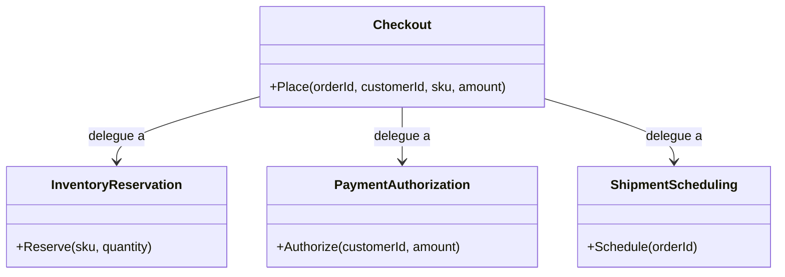

# Facade

🌍 🇫🇷 Français (ce fichier) · 🇬🇧 [English](Facade-en.md)

## Intention

Facade est un patron structurel qui fournit une interface unique et de plus haut niveau à un ensemble
d'interfaces d'un sous-système, rendant ce sous-système plus facile à employer.

## Problème

Passer une commande touche trois sous-systèmes : le stock est réservé, le paiement est autorisé, une
expédition est planifiée. Chacun a son type, son vocabulaire et sa place dans la séquence.

Chaque appelant qui passe une commande doit donc connaître les trois, et savoir que la réservation précède
l'autorisation. Le site web le sait, l'écran de prise de commande téléphonique le sait, l'importateur par
lots le sait, et chacun est un endroit où la séquence peut être fausse.

## Solution

Le patron ajoute un type devant les trois, offrant l'opération que l'appelant veut réellement.

La façade sait quel sous-système traite quoi et dans quel ordre ; elle ne porte aucune logique métier propre
et délègue tout. Les appelants dépendent d'une petite interface au lieu de trois plus grandes, et la
séquence existe en un seul endroit.

Les sous-systèmes restent publics. Une façade est une commodité, non un mur : un appelant aux besoins
inhabituels peut toujours les adresser directement.

## Structure



Toutes les flèches partent de la façade. Aucune ne revient : les sous-systèmes ignorent son existence, et
c'est ce qui distingue ce patron d'un médiateur.

## Les rôles

| Rôle | Annotation | S'applique à | Ce qu'il porte |
|---|---|---|---|
| Facade | `[Facade.Facade]` | classe | Offre le point d'entrée simplifié, et sait quel type du sous-système traite chaque demande. |
| Subsystem | `[Facade.Subsystem]` | interface, classe, struct | Fait le travail réel, et ne sait rien de la façade. |

## L'exemple

Extrait de [`FacadeUsage.cs`](../../../../DesignPatternCatalog.Usage/GangOfFour/FacadeUsage.cs).

```csharp
[Facade.Subsystem]
public sealed class InventoryReservation {
    public void Reserve(string sku, int quantity) { }
}

[Facade.Subsystem]
public sealed class PaymentAuthorization {
    public void Authorize(string customerId, decimal amount) { }
}

[Facade.Subsystem]
public sealed class ShipmentScheduling {
    public void Schedule(string orderId) { }
}
```

Trois travaux indépendants. Aucun ne mentionne la commande, aucun ne mentionne les autres.

```csharp
[Facade.Facade]
public sealed class Checkout {

    private readonly InventoryReservation _inventory = new();
    private readonly PaymentAuthorization _payment   = new();
    private readonly ShipmentScheduling   _shipping  = new();

    public void Place(string orderId, string customerId, string sku, decimal amount) {
        _inventory.Reserve(sku, 1);
        _payment.Authorize(customerId, amount);
        _shipping.Schedule(orderId);
    }

}
```

Une méthode qui porte la séquence, et aucune logique au-delà : pas de calcul, pas de décision, pas de règle.
Cette retenue est ce qui en fait une façade.

Les trois `new` méritent d'être nommés, car c'est le point où ce patron et l'injection de dépendances se
rencontrent et se contredisent. Une façade qui construit ses propres sous-systèmes ne peut être testée
contre des substituts ni recevoir un autre prestataire de paiement, forme que le catalogue
`DependencyInjection` range sous `ControlFreak`. Prendre les trois en paramètres de constructeur ne coûte
rien ici et conserve la promesse de la façade — une petite interface pour l'appelant — en laissant le câblage
à la racine de composition.

## Possibilités d'application

**Utilisez Facade pour fournir une interface simple à un sous-système complexe**, là où la plupart des
clients n'ont besoin que d'un sous-ensemble courant de ce que le sous-système sait faire.

**Utilisez Facade pour découpler les clients des classes d'un sous-système**, afin que celui-ci puisse être
réorganisé sans y toucher.

**Utilisez Facade pour stratifier des sous-systèmes**, en donnant à chaque couche un point d'entrée unique et
en laissant les couches communiquer par façades.

## Quand ne pas l'utiliser

**Ne laissez pas une façade acquérir de la logique.** Dès qu'elle décide, calcule, compense ou réessaie, elle
est devenue un composant du domaine avec ses propres règles, et le nom cesse de la décrire. Un passage de
commande qui doit annuler la réservation quand l'autorisation échoue est une orchestration —
`MicroservicesPatterns` la tient sous `Saga` — et non une façade.

**N'utilisez pas Facade là où le sous-système est déjà petit.** Un type devant deux appels directs ajoute un
saut et un fichier.

**Ne laissez pas une façade devenir la seule porte d'entrée.** Une façade qui cache entièrement ses
sous-systèmes force tout besoin inhabituel à s'ajouter à elle, et elle grossit jusqu'à devenir le
sous-système.

**N'utilisez pas Facade pour regrouper des opérations sans rapport.** Une classe dont les méthodes ne
partagent que leur appelant est un sac à outils ; une façade couvre un sous-système et une intention.

## Avantages

* Les clients dépendent d'une petite interface plutôt que de plusieurs plus grandes.
* Le sous-système peut être réorganisé, découpé ou remplacé sans toucher aux appelants.
* L'ordre des opérations existe en un seul endroit au lieu d'être mémorisé à chaque site d'appel.

## Inconvénients

* Une façade tend à grossir, tout nouveau besoin étant plus facile à lui ajouter qu'à justifier de la
  contourner.
* C'est une indirection de plus, et la séquence qu'elle porte est invisible du côté de l'appelant.
* Là où elle est le seul point d'entrée, elle devient un goulet dans la conception autant que dans le code.

## Liens avec les autres patrons

**`Adapter`** convertit une interface en une autre, là où une façade offre une interface nouvelle au-dessus de
plusieurs types. Un adaptateur a toujours un équivalent ; l'opération d'une façade peut ne correspondre à
rien qui existait.

**`Mediator`** centralise aussi la communication, et la différence est de sens : les collègues d'un médiateur
le connaissent et passent par lui, là où les sous-systèmes d'une façade l'ignorent.

**`AbstractFactory`** peut rendre le même service qu'une façade quand le sous-système à cacher est la
création d'objets.

**`Singleton`** s'applique souvent à une façade, une instance suffisant d'ordinaire — avec les réserves que
la page de ce patron expose.

## Source

*Design Patterns: Elements of Reusable Object-Oriented Software*, Gamma, Helm, Johnson & Vlissides,
Addison-Wesley, 1994 — chapitre des patrons structurels.

* [Entrée d'index](../../../generated/catalog-index.md#facade-gang-of-four)
* [Attribut généré](../../../../DesignPatternCatalog.GangOfFour/Facade.cs)
* [Exemple](../../../../DesignPatternCatalog.Usage/GangOfFour/FacadeUsage.cs)
