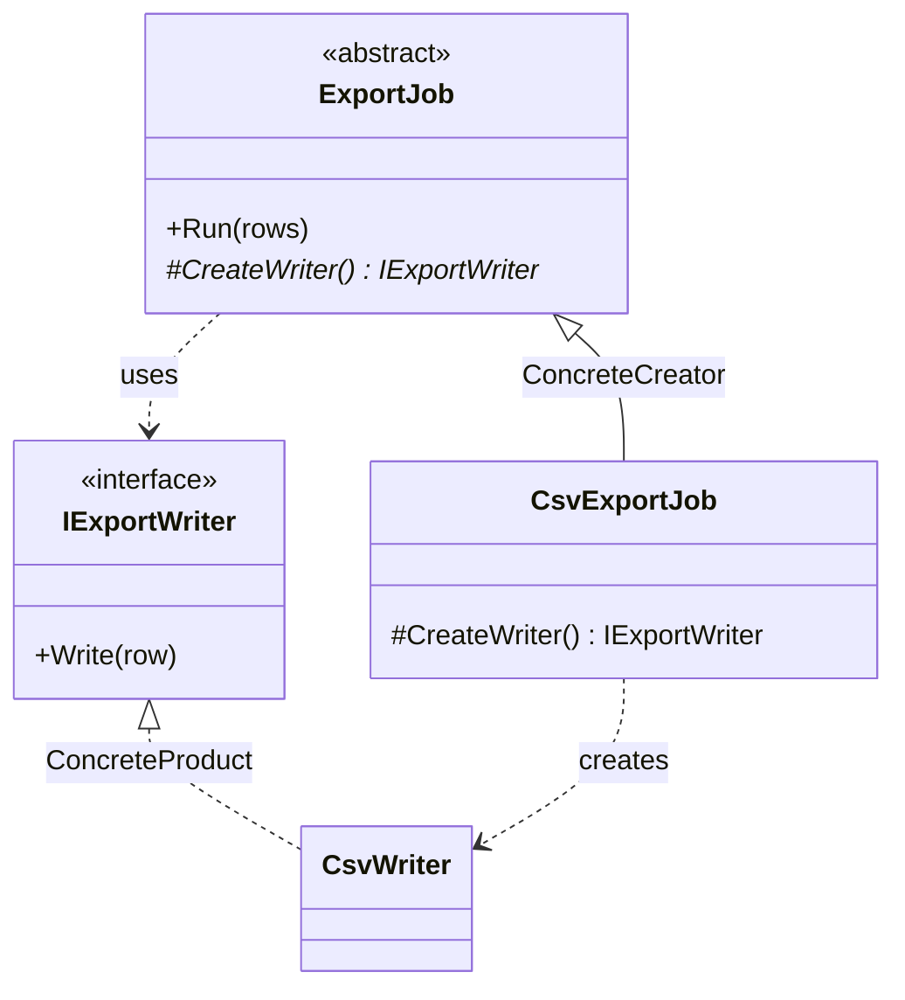

# Factory Method

🌍 🇬🇧 English (this file) · 🇫🇷 [Français](FactoryMethod-fr.md)

## Intent

Factory Method is a creational pattern that defines an interface for creating an object but lets
subclasses decide which class to instantiate, deferring instantiation to them.

## Problem

A class sometimes knows when to create something, and in what order to use it, without knowing what.

An export job knows the whole procedure: open a writer, push every row through it, close. That sequence
is the job's business and does not change. Which writer — CSV, XML, a fixed-width mainframe format — is
not the job's business at all, and changes with every new export.

Written directly, the two are welded together:

```csharp
public void Run(IEnumerable<string> rows) {
    var writer = new CsvWriter();          // the one line that does not belong here
    foreach (var row in rows) writer.Write(row);
}
```

The procedure can no longer be reused without dragging CSV along, and a second format means either
copying the loop or threading a `switch` through it.

## Solution

The pattern moves that one line into an operation of its own, declared without a body and supplied by
subclasses.

The base class keeps the procedure and calls the operation where the `new` used to be. Each subclass
answers a single question — which product? — and inherits everything else. Creation is deferred down the
hierarchy while the algorithm stays up it.

## Structure



Two parallel hierarchies and one diagonal: the creators on the left, the products on the right, and each
concrete creator pointing across at the concrete product it makes.

## The roles

| Role | Annotation | Applies to | What it carries |
|---|---|---|---|
| Creator | `[FactoryMethod.Creator]` | class, interface | Declares the factory method and, usually, calls it to obtain a product. |
| FactoryMethod | `[FactoryMethod.FactoryMethod]` | method | The operation that creates the product, and which subclasses override. |
| ConcreteCreator | `[FactoryMethod.ConcreteCreator]` | class | Overrides the factory method to return an instance of a concrete product. |
| Product | `[FactoryMethod.Product]` | interface, class | Declares the interface of the objects the factory method creates. |
| ConcreteProduct | `[FactoryMethod.ConcreteProduct]` | class, struct | Implements the product interface. |

One of the five roles is a method rather than a type. It is the only creational pattern in this
catalogue with a member-level role, and the annotation goes on the method, not on the class declaring
it.

## The example

From [`FactoryMethodUsage.cs`](../../../../DesignPatternCatalog.Usage/GangOfFour/FactoryMethodUsage.cs).

```csharp
[FactoryMethod.Product]
public interface IExportWriter {
    void Write(string row);
}

[FactoryMethod.ConcreteProduct(Product = typeof(IExportWriter))]
public sealed class CsvWriter : IExportWriter {
    public void Write(string row) { }
}
```

The product axis. The creator will only ever name the interface.

```csharp
[FactoryMethod.Creator]
public abstract class ExportJob {

    public void Run(IEnumerable<string> rows) {
        IExportWriter writer = CreateWriter();
        foreach (string row in rows) { writer.Write(row); }
    }
```

`Run` is complete, concrete and inherited by every subclass: it holds the procedure. It calls
`CreateWriter()` where a `new` would have been, and therefore knows nothing about CSV.

```csharp
    [FactoryMethod.FactoryMethod]
    protected abstract IExportWriter CreateWriter();

}
```

The factory method itself. `abstract`, so every subclass must answer; `protected`, so the answer is an
internal matter of the hierarchy rather than something callers invoke.

```csharp
[FactoryMethod.ConcreteCreator(Creator = typeof(ExportJob), ConcreteProduct = typeof(CsvWriter))]
public sealed class CsvExportJob : ExportJob {

    protected override IExportWriter CreateWriter() => new CsvWriter();

}
```

A whole export job in one line, everything else being inherited. The annotation's two links record the
diagonal the diagram shows: this creator, that product.

`Run` is itself a `TemplateMethod` — a fixed algorithm with one step left to subclasses. The book says
the two normally travel together, and that factory methods are usually called from template methods.
The sample shows both and annotates one, because the catalogue holds a pattern where a work presents it
rather than everywhere a reader could spot it.

## Applicability

**Use Factory Method when a class cannot anticipate the class of objects it must create.**

**Use Factory Method when a class wants its subclasses to specify the objects it creates.**

**Use Factory Method when a class delegates work to one of several helper subclasses and the knowledge
of which helper should live in one place.**

The common thread: the varying part is a single object, and the code that varies it is already a
subclass for other reasons.

## When not to use it

**Do not use Factory Method where injection would do.** To vary only the created object, pass it in — a
constructor parameter of type `IExportWriter`, or a `Func<IExportWriter>` where a fresh one is needed per
call. Subclassing to change one instantiation is a heavy lever, and it forces every variation to become
a type. On .NET this is usually the better default, and the `DependencyInjection` catalogue holds it as
`ConstructorInjection`.

**Do not use Factory Method when the choice is data.** A format arriving as a string from configuration
calls for a lookup — a dictionary of factories, a registry — not a subclass per value. Subclasses answer
*which class*; they answer badly when the question is *which of fifty rows*.

**Do not use Factory Method when the creator has no other reason to be a hierarchy.** A base class whose
only abstract member is the factory method is a hierarchy invented to host one line.

**Do not confuse the pattern with a static creation helper.** `Money.FromCents(500)`,
`Task.FromResult(x)` and `Uri.TryCreate(…)` are widely called factory methods and are not this pattern:
no subclass, no deferral, nothing overridden. They are a naming convention for constructors with better
names — useful, unrelated, and a frequent source of confusion in review.

## Advantages

* The procedure is written once and reused by every variant.
* Application-specific classes stay out of framework code, which is the book's central claim for the
  pattern and the reason it is everywhere in class libraries.
* The knowledge of which product to build lives in exactly one method per variant.

## Drawbacks

* A subclass per product, which the book states as the cost: a client may have to subclass the creator
  solely to create one particular product.
* Two hierarchies to keep in step, the diagonal between them existing only in the overriding code.
* One more indirection between reading the algorithm and knowing what it operates on.

## Relations with other patterns

**`AbstractFactory`** creates several products chosen together by an object, where Factory Method
creates one chosen by a subclass. An Abstract Factory's operations are usually factory methods.

**`TemplateMethod`** is a fixed algorithm with steps left to subclasses; Factory Method is the special
case where the deferred step is creation, and as in the sample it is typically called from a template
method.

**`Prototype`** also varies what gets created, but by cloning a configured instance instead of
subclassing the creator. It suits the case where the parallel hierarchy is the cost being avoided.

## Source

*Design Patterns: Elements of Reusable Object-Oriented Software*, Gamma, Helm, Johnson & Vlissides,
Addison-Wesley, 1994 — the creational patterns chapter.

* [Index entry](../../../generated/catalog-index.md#factorymethod-gang-of-four)
* [Generated attribute](../../../../DesignPatternCatalog.GangOfFour/FactoryMethod.cs)
* [Sample](../../../../DesignPatternCatalog.Usage/GangOfFour/FactoryMethodUsage.cs)
