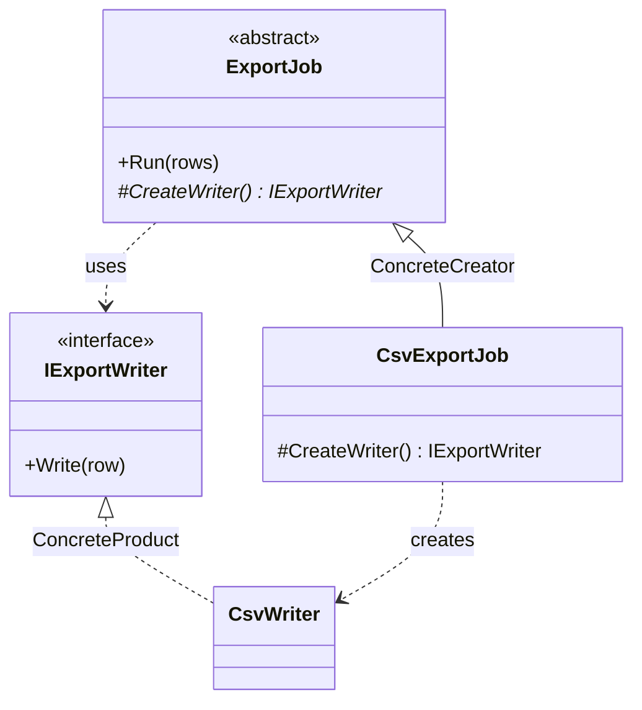

# Factory Method

🌍 🇬🇧 English (this file) · 🇫🇷 [Français](FactoryMethod-fr.md)

> Defines an interface for creating an object, but lets subclasses decide which class to instantiate,
> deferring instantiation to them.
>
> — Gamma, Helm, Johnson & Vlissides, *Design Patterns*, 1994

## The problem

A class knows **when** to create something, and in what order to use it, but not **what**.

An export job knows the whole procedure: open a writer, push every row through it, close. That
sequence is the job's business and it does not change. Which writer — CSV, XML, a fixed-width
mainframe format — is not the job's business at all, and changes with every new export.

Written directly, the two get welded together:

```csharp
public void Run(IEnumerable<string> rows) {
    var writer = new CsvWriter();          // the one line that should not be here
    foreach (var row in rows) writer.Write(row);
}
```

Now the procedure cannot be reused without dragging CSV along, and a second format means either
copying the loop or threading a `switch` through it.

## The solution

Pull that one line out into an operation of its own, declare it without a body, and let subclasses
supply it.

The base class keeps the procedure and calls the operation where the `new` used to be. Each subclass
answers one question — *which product?* — and inherits everything else. Creation is **deferred** down
the hierarchy while the algorithm stays up it.

## Structure



Two parallel hierarchies, and one diagonal. The creator hierarchy on the left, the product hierarchy
on the right, and each concrete creator points across at the concrete product it makes.

## The roles

| Role | Annotation | Applies to | What it carries |
|---|---|---|---|
| Creator | `[FactoryMethod.Creator]` | class, interface | Declares the factory method and, usually, calls it to obtain a product. |
| FactoryMethod | `[FactoryMethod.FactoryMethod]` | method | The operation that creates the product, and which subclasses override. |
| ConcreteCreator | `[FactoryMethod.ConcreteCreator]` | class | Overrides the factory method to return an instance of a concrete product. |
| Product | `[FactoryMethod.Product]` | interface, class | Declares the interface of the objects the factory method creates. |
| ConcreteProduct | `[FactoryMethod.ConcreteProduct]` | class, struct | Implements the product interface. |

Note that one of the five roles is a **method**, not a type. It is the only Creational pattern in this
catalogue with a member-level role, and it is the pattern's centre — so the annotation goes on the
method, not on the class that declares it.

## The example

From [`FactoryMethodUsage.cs`](../../../../DesignPatternCatalog.Usage/GangOfFour/FactoryMethodUsage.cs).

```csharp
[FactoryMethod.Product]
public interface IExportWriter {
    void Write(string row);
}

[FactoryMethod.ConcreteProduct(Product = typeof(IExportWriter))]
public sealed class CsvWriter : IExportWriter {
    public void Write(string row) { }
}
```

The product axis. The creator will only ever name the interface.

```csharp
[FactoryMethod.Creator]
public abstract class ExportJob {

    public void Run(IEnumerable<string> rows) {
        IExportWriter writer = CreateWriter();
        foreach (string row in rows) { writer.Write(row); }
    }
```

This is the whole point of the pattern in four lines. `Run` is complete, concrete, and inherited by
everything — it knows the procedure. It calls `CreateWriter()` where a `new` would have been, and
therefore knows nothing about CSV.

```csharp
    [FactoryMethod.FactoryMethod]
    protected abstract IExportWriter CreateWriter();

}
```

The factory method itself. `abstract`, so every subclass must answer; `protected`, so the answer is an
internal matter of the hierarchy rather than something callers can invoke.

```csharp
[FactoryMethod.ConcreteCreator(Creator = typeof(ExportJob), ConcreteProduct = typeof(CsvWriter))]
public sealed class CsvExportJob : ExportJob {

    protected override IExportWriter CreateWriter() => new CsvWriter();

}
```

A whole export job in one line, because everything else was inherited. The annotation's two links
record the diagonal the diagram shows: this creator, that product.

**Worth noticing:** `Run` is itself a `TemplateMethod` — a fixed algorithm with one step left to
subclasses. The book says the two normally travel together, and factory methods are usually called
from template methods. The sample shows both, and only annotates one, because the catalogue holds a
pattern where a work presents it, not everywhere a reader could spot it.

## When to use it

The book's own list:

* a class **cannot anticipate** the class of objects it must create;
* a class wants **its subclasses** to specify the objects it creates;
* a class delegates work to one of several helper subclasses, and you want to keep the knowledge of
  *which helper* in one place.

The common thread: the varying part is a single object, and the code that varies it is already
a subclass for other reasons.

## When not to use it

* **When injection would do.** If all you need is to vary the created object, pass it in — a
  constructor parameter of type `IExportWriter`, or a `Func<IExportWriter>` when a fresh one is needed
  per call. **Subclassing to change one instantiation is a heavy lever**, and it forces every variation
  to be a type. On .NET this is usually the better default; the `DependencyInjection` catalogue holds
  it as `ConstructorInjection`.
* **When the choice is data.** If the format arrives as a string from configuration, you want a lookup
  — a dictionary of factories, a registry — not a subclass per value. Subclasses answer *which class*;
  they answer it badly when the question is *which of fifty rows*.
* **When the creator has no other reason to be a hierarchy.** A base class whose only abstract member
  is the factory method is a hierarchy invented to host one line. That is the shape the previous two
  bullets are really warning about.
* **When you meant a static creation helper.** `Money.FromCents(500)`, `Task.FromResult(x)`,
  `Uri.TryCreate(...)` are widely called "factory methods" and are **not this pattern**: no subclass,
  no deferral, nothing overridden. They are a naming convention for constructors with better names.
  Useful, unrelated, and a frequent source of confusion in code review.

## What it costs

**What you gain**

* the procedure is written once and reused by every variant;
* application-specific classes stay out of framework code — the book's central claim for it, and the
  reason the pattern is everywhere in class libraries;
* the knowledge of *which product* lives in exactly one method per variant.

**What you pay**

* **a subclass per product**, which the book states as the drawback: a client may have to subclass the
  creator solely to create one particular product;
* two hierarchies to keep in step, and the diagonal between them exists only in the code that
  overrides;
* one more indirection between reading the algorithm and knowing what it operates on.

## Patterns it is confused with

| | |
|---|---|
| **`AbstractFactory`** | Several products chosen together, by an object. Factory Method is one product chosen by a subclass. An Abstract Factory's operations are usually factory methods, so the two nest rather than compete. |
| **`TemplateMethod`** | A fixed algorithm with steps left to subclasses. Factory Method is the special case where the deferred step is *creation* — and, as in the sample, is typically called from a template method. |
| **`Prototype`** | Also varies what gets created, but by cloning a configured instance instead of subclassing the creator. Choose Prototype when subclassing the creator is the cost you are trying to avoid. |
| **A static creation helper** | Not this pattern. See the last bullet above. |

## Where this comes from

*Design Patterns: Elements of Reusable Object-Oriented Software*, Gamma, Helm, Johnson & Vlissides,
Addison-Wesley, 1994 — the Creational patterns chapter.

* [Index entry](../../../generated/catalog-index.md#factorymethod-gang-of-four) — the annotations, the
  targets, the links.
* [Generated attribute](../../../../DesignPatternCatalog.GangOfFour/FactoryMethod.cs)
* [Sample](../../../../DesignPatternCatalog.Usage/GangOfFour/FactoryMethodUsage.cs)
