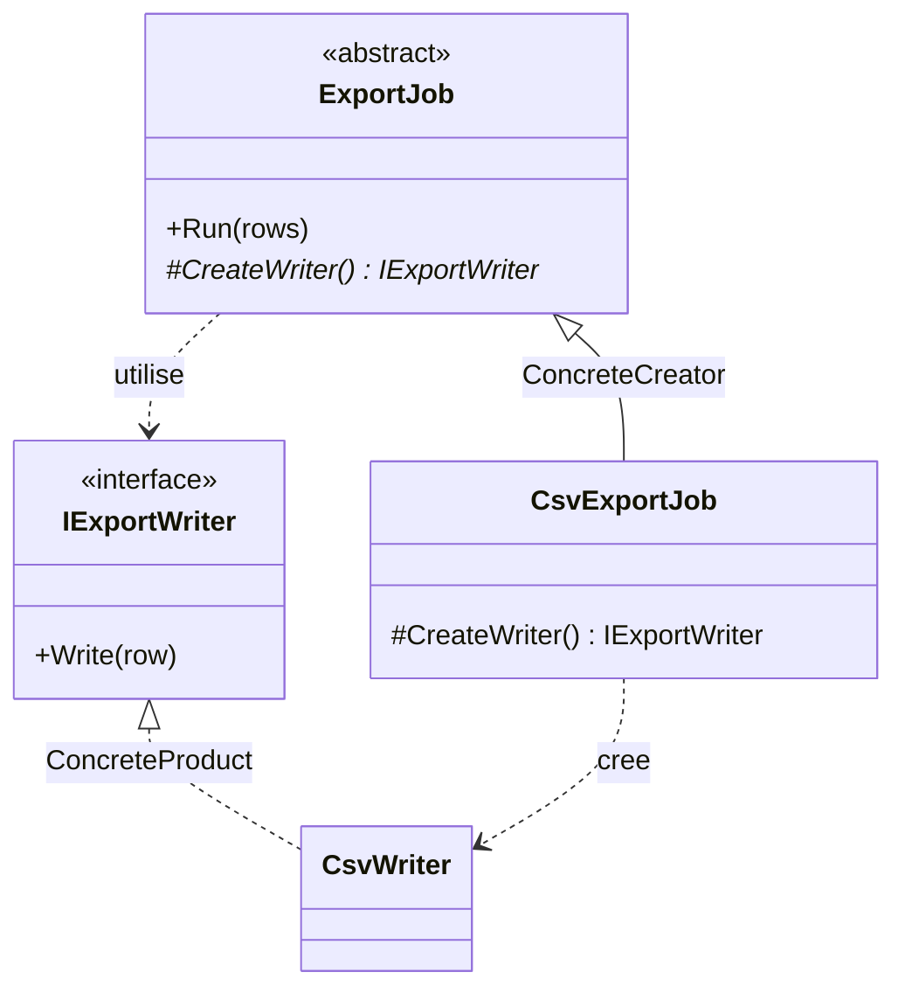

# Factory Method

🌍 🇫🇷 Français (ce fichier) · 🇬🇧 [English](FactoryMethod-en.md)

> Définit une interface pour créer un objet, mais laisse les sous-classes décider quelle classe
> instancier, en leur déléguant l'instanciation.
>
> — Gamma, Helm, Johnson & Vlissides, *Design Patterns*, 1994

## Le problème

Une classe sait **quand** créer quelque chose, et dans quel ordre s'en servir, mais pas **quoi**.

Un job d'export connaît toute la procédure : ouvrir un writer, y pousser chaque ligne, fermer. Cette
séquence est l'affaire du job et elle ne change pas. Quel writer — CSV, XML, un format à colonnes fixes
pour le mainframe — n'est pas du tout l'affaire du job, et change à chaque nouvel export.

Écrit directement, les deux se soudent :

```csharp
public void Run(IEnumerable<string> rows) {
    var writer = new CsvWriter();          // la seule ligne qui ne devrait pas être là
    foreach (var row in rows) writer.Write(row);
}
```

La procédure n'est plus réutilisable sans traîner le CSV avec elle, et un second format oblige soit à
copier la boucle, soit à y faufiler un `switch`.

## La solution

Sortir cette ligne dans une opération à elle, la déclarer sans corps, et laisser les sous-classes la
fournir.

La classe de base garde la procédure et appelle l'opération là où était le `new`. Chaque sous-classe
répond à une seule question — *quel produit ?* — et hérite de tout le reste. La création est
**déléguée** vers le bas de la hiérarchie pendant que l'algorithme reste en haut.

## Structure



Deux hiérarchies parallèles, et une diagonale. La hiérarchie des créateurs à gauche, celle des produits
à droite, et chaque créateur concret pointe en travers vers le produit concret qu'il fabrique.

## Les rôles

| Rôle | Annotation | S'applique à | Ce qu'il porte |
|---|---|---|---|
| Creator | `[FactoryMethod.Creator]` | classe, interface | Déclare la factory method et, d'ordinaire, l'appelle pour obtenir un produit. |
| FactoryMethod | `[FactoryMethod.FactoryMethod]` | méthode | L'opération qui crée le produit, et que les sous-classes redéfinissent. |
| ConcreteCreator | `[FactoryMethod.ConcreteCreator]` | classe | Redéfinit la factory method pour rendre une instance d'un produit concret. |
| Product | `[FactoryMethod.Product]` | interface, classe | Déclare l'interface des objets que la factory method crée. |
| ConcreteProduct | `[FactoryMethod.ConcreteProduct]` | classe, struct | Implémente l'interface du produit. |

Note que l'un des cinq rôles est une **méthode**, pas un type. C'est le seul pattern de création de ce
catalogue à porter un rôle au niveau membre, et c'est le centre du pattern — l'annotation va donc sur
la méthode, pas sur la classe qui la déclare.

## L'exemple

Tiré de [`FactoryMethodUsage.cs`](../../../../DesignPatternCatalog.Usage/GangOfFour/FactoryMethodUsage.cs).

```csharp
[FactoryMethod.Product]
public interface IExportWriter {
    void Write(string row);
}

[FactoryMethod.ConcreteProduct(Product = typeof(IExportWriter))]
public sealed class CsvWriter : IExportWriter {
    public void Write(string row) { }
}
```

L'axe des produits. Le créateur ne nommera jamais que l'interface.

```csharp
[FactoryMethod.Creator]
public abstract class ExportJob {

    public void Run(IEnumerable<string> rows) {
        IExportWriter writer = CreateWriter();
        foreach (string row in rows) { writer.Write(row); }
    }
```

Tout l'intérêt du pattern tient dans ces quatre lignes. `Run` est complète, concrète, héritée par tous
— elle connaît la procédure. Elle appelle `CreateWriter()` là où un `new` se serait trouvé, et ne sait
donc rien du CSV.

```csharp
    [FactoryMethod.FactoryMethod]
    protected abstract IExportWriter CreateWriter();

}
```

La factory method elle-même. `abstract`, donc chaque sous-classe doit répondre ; `protected`, donc la
réponse est une affaire interne à la hiérarchie plutôt qu'une chose que les appelants invoquent.

```csharp
[FactoryMethod.ConcreteCreator(Creator = typeof(ExportJob), ConcreteProduct = typeof(CsvWriter))]
public sealed class CsvExportJob : ExportJob {

    protected override IExportWriter CreateWriter() => new CsvWriter();

}
```

Un job d'export entier en une ligne, parce que tout le reste est hérité. Les deux liens de l'annotation
consignent la diagonale que montre le diagramme : ce créateur, ce produit.

**À remarquer :** `Run` est elle-même un `TemplateMethod` — un algorithme fixe dont une étape est
laissée aux sous-classes. Le livre dit que les deux voyagent normalement ensemble, et que les factory
methods sont d'ordinaire appelées depuis des template methods. L'exemple montre les deux et n'en annote
qu'un, parce que le catalogue tient un pattern là où une œuvre le présente, et non partout où un
lecteur pourrait le repérer.

## Quand l'utiliser

La liste du livre :

* une classe **ne peut pas anticiper** la classe des objets qu'elle doit créer ;
* une classe veut que **ses sous-classes** spécifient les objets qu'elle crée ;
* une classe délègue le travail à l'une de plusieurs sous-classes auxiliaires, et tu veux garder en un
  seul endroit la connaissance de *laquelle*.

Le fil commun : la partie variable est un objet unique, et le code qui la fait varier est déjà une
sous-classe pour d'autres raisons.

## Quand ne pas l'utiliser

* **Quand une injection suffirait.** S'il s'agit seulement de faire varier l'objet créé, passe-le — un
  paramètre de constructeur de type `IExportWriter`, ou un `Func<IExportWriter>` s'il en faut un neuf à
  chaque appel. **Hériter pour changer une instanciation est un levier lourd**, et cela force chaque
  variation à devenir un type. Sur .NET, c'est en général le meilleur défaut ; le catalogue
  `DependencyInjection` le tient sous `ConstructorInjection`.
* **Quand le choix est une donnée.** Si le format arrive sous forme de chaîne depuis la configuration,
  tu veux une table — un dictionnaire de fabriques, un registre — pas une sous-classe par valeur. Les
  sous-classes répondent à *quelle classe* ; elles y répondent mal quand la question est *laquelle des
  cinquante lignes*.
* **Quand le créateur n'a aucune autre raison d'être une hiérarchie.** Une classe de base dont le seul
  membre abstrait est la factory method est une hiérarchie inventée pour héberger une ligne. C'est la
  forme contre laquelle les deux points précédents mettent réellement en garde.
* **Quand tu voulais dire fabrique statique.** `Money.FromCents(500)`, `Task.FromResult(x)`,
  `Uri.TryCreate(...)` sont couramment appelés « factory methods » et **ne sont pas ce pattern** : pas
  de sous-classe, pas de délégation, rien de redéfini. C'est une convention de nommage pour des
  constructeurs mieux nommés. Utile, sans rapport, et source fréquente de confusion en revue.

## Ce qu'il coûte

**Ce que tu gagnes**

* la procédure est écrite une fois et réutilisée par chaque variante ;
* les classes spécifiques à l'application restent hors du code de framework — c'est la revendication
  centrale du livre, et la raison pour laquelle le pattern est partout dans les bibliothèques ;
* la connaissance de *quel produit* tient dans exactement une méthode par variante.

**Ce que tu paies**

* **une sous-classe par produit**, ce que le livre énonce comme l'inconvénient : un client peut devoir
  hériter du créateur uniquement pour créer un produit particulier ;
* deux hiérarchies à tenir en phase, la diagonale entre elles n'existant que dans le code qui
  redéfinit ;
* une indirection de plus entre la lecture de l'algorithme et la connaissance de ce sur quoi il opère.

## Patterns qu'on confond avec lui

| | |
|---|---|
| **`AbstractFactory`** | Plusieurs produits choisis ensemble, par un objet. Factory Method, c'est un produit choisi par une sous-classe. Les opérations d'une Abstract Factory sont d'ordinaire des factory methods : les deux s'emboîtent plutôt qu'ils ne rivalisent. |
| **`TemplateMethod`** | Un algorithme fixe dont des étapes sont laissées aux sous-classes. Factory Method est le cas particulier où l'étape déléguée est la *création* — et, comme dans l'exemple, elle est typiquement appelée depuis une template method. |
| **`Prototype`** | Fait varier aussi ce qui est créé, mais en clonant une instance configurée au lieu d'hériter du créateur. Choisis Prototype quand c'est justement l'héritage du créateur que tu cherches à éviter. |
| **Une fabrique statique** | Pas ce pattern. Voir le dernier point ci-dessus. |

## D'où cela vient

*Design Patterns: Elements of Reusable Object-Oriented Software*, Gamma, Helm, Johnson & Vlissides,
Addison-Wesley, 1994 — chapitre des patterns de création.

* [Entrée d'index](../../../generated/catalog-index.md#factorymethod-gang-of-four) — les annotations,
  les cibles, les liens.
* [Attribut généré](../../../../DesignPatternCatalog.GangOfFour/FactoryMethod.cs)
* [Exemple](../../../../DesignPatternCatalog.Usage/GangOfFour/FactoryMethodUsage.cs)
