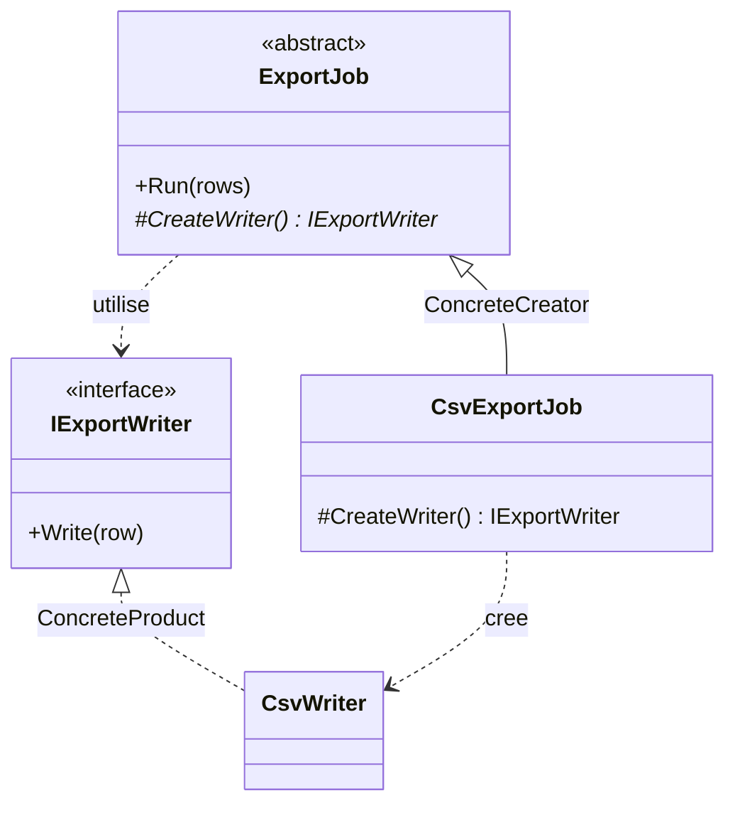

# Factory Method

🌍 🇫🇷 Français (ce fichier) · 🇬🇧 [English](FactoryMethod-en.md)

## Intention

Factory Method est un patron de création qui définit une interface pour créer un objet mais laisse les
sous-classes décider quelle classe instancier, en leur déléguant l'instanciation.

## Problème

Une classe sait parfois quand créer quelque chose, et dans quel ordre s'en servir, sans savoir quoi.

Un job d'export connaît toute la procédure : ouvrir un writer, y pousser chaque ligne, fermer. Cette
séquence est l'affaire du job et ne change pas. Quel writer — CSV, XML, un format à colonnes fixes pour
le mainframe — n'est pas du tout l'affaire du job, et change à chaque nouvel export.

Écrites directement, les deux se soudent :

```csharp
public void Run(IEnumerable<string> rows) {
    var writer = new CsvWriter();          // la seule ligne qui n'a rien à faire ici
    foreach (var row in rows) writer.Write(row);
}
```

La procédure n'est plus réutilisable sans traîner le CSV avec elle, et un second format oblige soit à
copier la boucle, soit à y faufiler un `switch`.

## Solution

Le patron déplace cette ligne dans une opération à part, déclarée sans corps et fournie par les
sous-classes.

La classe de base garde la procédure et appelle l'opération là où était le `new`. Chaque sous-classe
répond à une seule question — quel produit ? — et hérite de tout le reste. La création est déléguée vers
le bas de la hiérarchie pendant que l'algorithme reste en haut.

## Structure



Deux hiérarchies parallèles et une diagonale : les créateurs à gauche, les produits à droite, et chaque
créateur concret pointant en travers vers le produit concret qu'il fabrique.

## Les rôles

| Rôle | Annotation | S'applique à | Ce qu'il porte |
|---|---|---|---|
| Creator | `[FactoryMethod.Creator]` | classe, interface | Déclare la factory method et, d'ordinaire, l'appelle pour obtenir un produit. |
| FactoryMethod | `[FactoryMethod.FactoryMethod]` | méthode | L'opération qui crée le produit, et que les sous-classes redéfinissent. |
| ConcreteCreator | `[FactoryMethod.ConcreteCreator]` | classe | Redéfinit la factory method pour rendre une instance d'un produit concret. |
| Product | `[FactoryMethod.Product]` | interface, classe | Déclare l'interface des objets que la factory method crée. |
| ConcreteProduct | `[FactoryMethod.ConcreteProduct]` | classe, struct | Implémente l'interface du produit. |

L'un des cinq rôles est une méthode et non un type. C'est le seul patron de création de ce catalogue à
porter un rôle au niveau membre, et l'annotation va sur la méthode, non sur la classe qui la déclare.

## L'exemple

Extrait de [`FactoryMethodUsage.cs`](../../../../DesignPatternCatalog.Usage/GangOfFour/FactoryMethodUsage.cs).

```csharp
[FactoryMethod.Product]
public interface IExportWriter {
    void Write(string row);
}

[FactoryMethod.ConcreteProduct(Product = typeof(IExportWriter))]
public sealed class CsvWriter : IExportWriter {
    public void Write(string row) { }
}
```

L'axe des produits. Le créateur ne nommera jamais que l'interface.

```csharp
[FactoryMethod.Creator]
public abstract class ExportJob {

    public void Run(IEnumerable<string> rows) {
        IExportWriter writer = CreateWriter();
        foreach (string row in rows) { writer.Write(row); }
    }
```

`Run` est complète, concrète et héritée par toutes les sous-classes : elle porte la procédure. Elle
appelle `CreateWriter()` là où un `new` se serait trouvé, et ne sait donc rien du CSV.

```csharp
    [FactoryMethod.FactoryMethod]
    protected abstract IExportWriter CreateWriter();

}
```

La factory method elle-même. `abstract`, donc chaque sous-classe doit répondre ; `protected`, donc la
réponse est une affaire interne à la hiérarchie plutôt qu'une chose que les appelants invoquent.

```csharp
[FactoryMethod.ConcreteCreator(Creator = typeof(ExportJob), ConcreteProduct = typeof(CsvWriter))]
public sealed class CsvExportJob : ExportJob {

    protected override IExportWriter CreateWriter() => new CsvWriter();

}
```

Un job d'export entier en une ligne, tout le reste étant hérité. Les deux liens de l'annotation
consignent la diagonale que montre le diagramme : ce créateur, ce produit.

`Run` est elle-même un `TemplateMethod` — un algorithme fixe dont une étape est laissée aux sous-classes.
Le livre dit que les deux voyagent normalement ensemble, et que les factory methods sont d'ordinaire
appelées depuis des template methods. L'exemple montre les deux et n'en annote qu'un, parce que le
catalogue tient un patron là où une œuvre le présente plutôt que partout où un lecteur pourrait le
repérer.

## Possibilités d'application

**Utilisez Factory Method lorsqu'une classe ne peut pas anticiper la classe des objets qu'elle doit
créer.**

**Utilisez Factory Method lorsqu'une classe veut que ses sous-classes spécifient les objets qu'elle
crée.**

**Utilisez Factory Method lorsqu'une classe délègue le travail à l'une de plusieurs sous-classes
auxiliaires et que la connaissance de laquelle doit tenir en un seul endroit.**

Le fil commun : la partie variable est un objet unique, et le code qui la fait varier est déjà une
sous-classe pour d'autres raisons.

## Quand ne pas l'utiliser

**N'utilisez pas Factory Method là où une injection suffirait.** Pour ne faire varier que l'objet créé,
il suffit de le passer : un paramètre de constructeur de type `IExportWriter`, ou un `Func<IExportWriter>`
lorsqu'il en faut un neuf à chaque appel. Hériter pour changer une instanciation est un levier lourd, et
cela force chaque variation à devenir un type. Sur .NET, c'est en général le meilleur défaut, et le
catalogue `DependencyInjection` le tient sous `ConstructorInjection`.

**N'utilisez pas Factory Method quand le choix est une donnée.** Un format qui arrive sous forme de
chaîne depuis la configuration appelle une table — un dictionnaire de fabriques, un registre — et non une
sous-classe par valeur. Les sous-classes répondent à *quelle classe* ; elles répondent mal quand la
question est *laquelle des cinquante lignes*.

**N'utilisez pas Factory Method quand le créateur n'a aucune autre raison d'être une hiérarchie.** Une
classe de base dont le seul membre abstrait est la factory method est une hiérarchie inventée pour
héberger une ligne.

**Ne confondez pas le patron avec une fabrique statique.** `Money.FromCents(500)`, `Task.FromResult(x)`
et `Uri.TryCreate(…)` sont couramment appelés factory methods et ne sont pas ce patron : pas de
sous-classe, pas de délégation, rien de redéfini. C'est une convention de nommage pour des constructeurs
mieux nommés — utile, sans rapport, et source fréquente de confusion en revue.

## Avantages

* La procédure est écrite une fois et réutilisée par chaque variante.
* Les classes spécifiques à l'application restent hors du code de framework, ce qui est la revendication
  centrale du livre et la raison pour laquelle le patron est partout dans les bibliothèques.
* La connaissance du produit à construire tient dans exactement une méthode par variante.

## Inconvénients

* Une sous-classe par produit, ce que le livre énonce comme le coût : un client peut devoir hériter du
  créateur uniquement pour créer un produit particulier.
* Deux hiérarchies à tenir en phase, la diagonale entre elles n'existant que dans le code qui redéfinit.
* Une indirection de plus entre la lecture de l'algorithme et la connaissance de ce sur quoi il opère.

## Liens avec les autres patrons

**`AbstractFactory`** crée plusieurs produits choisis ensemble par un objet, là où Factory Method en crée
un choisi par une sous-classe. Les opérations d'une Abstract Factory sont d'ordinaire des factory
methods.

**`TemplateMethod`** est un algorithme fixe dont des étapes sont laissées aux sous-classes ; Factory
Method est le cas particulier où l'étape déléguée est la création, et comme dans l'exemple elle est
typiquement appelée depuis une template method.

**`Prototype`** fait varier aussi ce qui est créé, mais en clonant une instance configurée au lieu
d'hériter du créateur. Il convient au cas où c'est justement la hiérarchie parallèle que l'on cherche à
éviter.

## Source

*Design Patterns: Elements of Reusable Object-Oriented Software*, Gamma, Helm, Johnson & Vlissides,
Addison-Wesley, 1994 — chapitre des patrons de création.

* [Entrée d'index](../../../generated/catalog-index.md#factorymethod-gang-of-four)
* [Attribut généré](../../../../DesignPatternCatalog.GangOfFour/FactoryMethod.cs)
* [Exemple](../../../../DesignPatternCatalog.Usage/GangOfFour/FactoryMethodUsage.cs)
