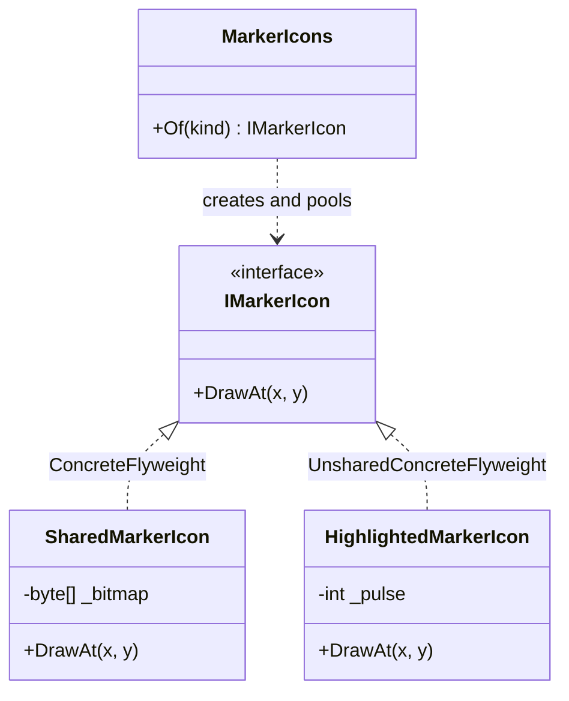

# Flyweight

🌍 🇬🇧 English (this file) · 🇫🇷 [Français](Flyweight-fr.md)

## Intent

Flyweight is a structural pattern that uses sharing to support large numbers of fine grained objects
efficiently, by separating the state that can be shared from the state that cannot.

## Problem

A map shows forty thousand markers. Each marker has a position and an icon, and there are eleven distinct
icons.

An object per marker holds its own copy of a bitmap, so the same eleven images are in memory some
thousands of times each. The position is genuinely per marker; the bitmap is genuinely not.

## Solution

The pattern splits the state in two and shares one half.

What does not depend on where the object appears — the bitmap — is *intrinsic* and is held by a shared
object. What does depend on it — the coordinates — is *extrinsic* and is passed in on each operation,
never stored. Forty thousand markers then need eleven objects, because the only thing that differed
between them has been moved out.

A factory hands out the shared objects and guarantees that asking twice for the same icon yields the same
instance.

## Structure



The coordinates appear in the signature of `DrawAt` and nowhere in the classes. That is the whole
mechanism: extrinsic state travels through parameters.

## The roles

| Role | Annotation | Applies to | What it carries |
|---|---|---|---|
| Flyweight | `[Flyweight.Flyweight]` | interface, class | Declares the operations through which flyweights receive the state that is not shared. |
| ConcreteFlyweight | `[Flyweight.ConcreteFlyweight]` | class, struct | A shareable flyweight: it holds only state that is independent of its context. |
| UnsharedConcreteFlyweight | `[Flyweight.UnsharedConcreteFlyweight]` | class, struct | A flyweight that is deliberately not shared, although the interface allows sharing. |
| FlyweightFactory | `[Flyweight.FlyweightFactory]` | class | Creates and manages flyweights, and guarantees that shared ones are reused. |

## The example

From [`FlyweightUsage.cs`](../../../../DesignPatternCatalog.Usage/GangOfFour/FlyweightUsage.cs).

```csharp
[Flyweight.Flyweight]
public interface IMarkerIcon {
    void DrawAt(int x, int y);
}
```

The interface takes the position rather than holding it, which is what allows one instance to serve every
marker.

```csharp
[Flyweight.ConcreteFlyweight(Flyweight = typeof(IMarkerIcon))]
public sealed class SharedMarkerIcon : IMarkerIcon {

    private readonly byte[] _bitmap;

    public SharedMarkerIcon(byte[] bitmap) { _bitmap = bitmap; }

    // x and y are the extrinsic state: they are passed in, never stored.
    public void DrawAt(int x, int y) { }

}
```

The shared flyweight holds the bitmap and nothing else. It has no field that could differ between two
markers, which is precisely the condition that makes sharing safe.

```csharp
[Flyweight.UnsharedConcreteFlyweight(Flyweight = typeof(IMarkerIcon))]
public sealed class HighlightedMarkerIcon : IMarkerIcon {

    // Deliberately not shared: it carries per-instance animation state.
    private int _pulse;

    public void DrawAt(int x, int y) => _pulse++;

}
```

The fourth role, and the one that surprises readers who expect the pattern to mean "everything is shared".
The interface permits sharing; it does not oblige it. This icon animates, so it has state of its own and
gets an instance of its own — and the pattern names that case rather than treating it as a violation.

```csharp
[Flyweight.FlyweightFactory(Flyweight = typeof(IMarkerIcon))]
public sealed class MarkerIcons {

    private readonly Dictionary<string, IMarkerIcon> _shared = new();

    public IMarkerIcon Of(string kind) {
        if (_shared.TryGetValue(kind, out IMarkerIcon? icon)) { return icon; }

        icon           = new SharedMarkerIcon(Array.Empty<byte>());
        _shared[kind]  = icon;

        return icon;
    }

}
```

The factory is what makes the sharing real. Callers ask it rather than constructing, so identical requests
receive an identical instance. Nothing prevents a caller from bypassing it and calling the constructor,
which is why the sharing is a convention the factory upholds rather than an invariant the type system
enforces.

## Applicability

The book states five conditions and says the pattern applies when **all** of them hold.

* The application uses a large number of objects.
* Storage costs are high because of that quantity.
* Most of the object state can be made extrinsic.
* Many groups of objects can be replaced by relatively few shared ones once extrinsic state is removed.
* **The application does not depend on object identity.**

## When not to use it

**Do not use Flyweight where object identity matters.** This is the condition that disqualifies most
candidates. Once instances are shared, reference equality stops distinguishing markers, a dictionary keyed
on the object collapses entries, and anything attached per instance is attached to all of them at once.

**Do not use Flyweight where the extrinsic state costs more than the sharing saves.** State moved out of
the object has to travel on every call, and a wide extrinsic parameter list passed millions of times can
outweigh the memory recovered.

**Do not use Flyweight on a modest number of objects.** The pattern buys memory at the price of a factory,
a split invariant and a less obvious design; below a large quantity it is a cost with no return.

**Do not use Flyweight where the platform already shares.** Interned strings, `record struct` values in a
contiguous array, and cached immutable instances solve the same problem without the roles.

**Do not use Flyweight where the shared object would carry mutable state.** A field that changes on one
caller's behalf changes for every caller sharing the instance, which is the bug the split into intrinsic
and extrinsic exists to prevent.

## Advantages

* Memory falls in proportion to the sharing: the same eleven bitmaps instead of forty thousand copies.
* The number of objects created drops, and with it the pressure on allocation.
* The intrinsic and extrinsic split is stated in the signatures, so what is shareable is visible in the
  interface.

## Drawbacks

* Sharing costs identity, and identity is not always recoverable once given up.
* Extrinsic state has to be found, stored elsewhere and passed on every call, which complicates callers.
* The factory is a required piece of machinery, and the sharing it guarantees is only guaranteed for
  callers that use it.

## Relations with other patterns

**`Composite`** and Flyweight combine well: leaves of a tree that carry no context of their own can be
shared between parents, and the book presents that combination directly.

**`State`** and **`Strategy`** are often implemented as flyweights, since an object representing a state or
an algorithm usually holds no data of its own.

**`FactoryMethod`** and **`AbstractFactory`** describe how objects are created without saying anything about
sharing them; the flyweight factory exists specifically to return an object that already exists.

**`Singleton`** shares one instance of one type, where Flyweight shares a small pool across a large
population.

## Source

*Design Patterns: Elements of Reusable Object-Oriented Software*, Gamma, Helm, Johnson & Vlissides,
Addison-Wesley, 1994 — the structural patterns chapter.

* [Index entry](../../../generated/catalog-index.md#flyweight-gang-of-four)
* [Generated attribute](../../../../DesignPatternCatalog.GangOfFour/Flyweight.cs)
* [Sample](../../../../DesignPatternCatalog.Usage/GangOfFour/FlyweightUsage.cs)
