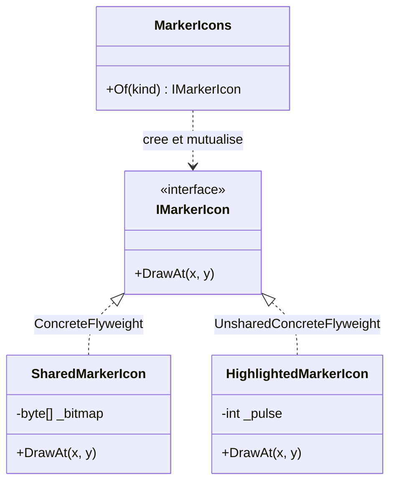

# Flyweight

🌍 🇫🇷 Français (ce fichier) · 🇬🇧 [English](Flyweight-en.md)

## Intention

Flyweight est un patron structurel qui recourt au partage pour prendre en charge efficacement de grands
nombres d'objets à granularité fine, en séparant l'état partageable de celui qui ne l'est pas.

## Problème

Une carte affiche quarante mille marqueurs. Chaque marqueur a une position et une icône, et il existe onze
icônes distinctes.

Un objet par marqueur détient sa propre copie d'une image : les mêmes onze images occupent donc la mémoire
quelques milliers de fois chacune. La position est réellement propre au marqueur ; l'image ne l'est
réellement pas.

## Solution

Le patron scinde l'état en deux et partage une des moitiés.

Ce qui ne dépend pas de l'endroit où l'objet apparaît — l'image — est *intrinsèque* et est détenu par un
objet partagé. Ce qui en dépend — les coordonnées — est *extrinsèque* et est passé à chaque opération, jamais
stocké. Quarante mille marqueurs ne demandent alors que onze objets, la seule chose qui les distinguait
ayant été sortie.

Une fabrique distribue les objets partagés et garantit que demander deux fois la même icône rend la même
instance.

## Structure



Les coordonnées apparaissent dans la signature de `DrawAt` et nulle part dans les classes. C'est tout le
mécanisme : l'état extrinsèque voyage par les paramètres.

## Les rôles

| Rôle | Annotation | S'applique à | Ce qu'il porte |
|---|---|---|---|
| Flyweight | `[Flyweight.Flyweight]` | interface, classe | Déclare les opérations par lesquelles les poids-mouches reçoivent l'état non partagé. |
| ConcreteFlyweight | `[Flyweight.ConcreteFlyweight]` | classe, struct | Un poids-mouche partageable : il ne porte que de l'état indépendant de son contexte. |
| UnsharedConcreteFlyweight | `[Flyweight.UnsharedConcreteFlyweight]` | classe, struct | Un poids-mouche délibérément non partagé, bien que l'interface autorise le partage. |
| FlyweightFactory | `[Flyweight.FlyweightFactory]` | classe | Crée et gère les poids-mouches, et garantit la réutilisation de ceux qui sont partagés. |

## L'exemple

Extrait de [`FlyweightUsage.cs`](../../../../DesignPatternCatalog.Usage/GangOfFour/FlyweightUsage.cs).

```csharp
[Flyweight.Flyweight]
public interface IMarkerIcon {
    void DrawAt(int x, int y);
}
```

L'interface prend la position au lieu de la détenir, ce qui permet à une instance de servir tous les
marqueurs.

```csharp
[Flyweight.ConcreteFlyweight(Flyweight = typeof(IMarkerIcon))]
public sealed class SharedMarkerIcon : IMarkerIcon {

    private readonly byte[] _bitmap;

    public SharedMarkerIcon(byte[] bitmap) { _bitmap = bitmap; }

    // x and y are the extrinsic state: they are passed in, never stored.
    public void DrawAt(int x, int y) { }

}
```

Le poids-mouche partagé détient l'image et rien d'autre. Il n'a aucun champ qui puisse différer entre deux
marqueurs, ce qui est précisément la condition rendant le partage sûr.

```csharp
[Flyweight.UnsharedConcreteFlyweight(Flyweight = typeof(IMarkerIcon))]
public sealed class HighlightedMarkerIcon : IMarkerIcon {

    // Deliberately not shared: it carries per-instance animation state.
    private int _pulse;

    public void DrawAt(int x, int y) => _pulse++;

}
```

Le quatrième rôle, et celui qui surprend le lecteur attendant du patron que « tout soit partagé ». L'interface
permet le partage ; elle ne l'oblige pas. Cette icône s'animе, elle a donc un état propre et reçoit une
instance propre — et le patron nomme ce cas au lieu de le traiter comme une infraction.

```csharp
[Flyweight.FlyweightFactory(Flyweight = typeof(IMarkerIcon))]
public sealed class MarkerIcons {

    private readonly Dictionary<string, IMarkerIcon> _shared = new();

    public IMarkerIcon Of(string kind) {
        if (_shared.TryGetValue(kind, out IMarkerIcon? icon)) { return icon; }

        icon           = new SharedMarkerIcon(Array.Empty<byte>());
        _shared[kind]  = icon;

        return icon;
    }

}
```

La fabrique est ce qui rend le partage réel. Les appelants l'interrogent au lieu de construire, de sorte que
des demandes identiques reçoivent une instance identique. Rien n'empêche un appelant de la contourner et
d'appeler le constructeur, et c'est pourquoi le partage est une convention que la fabrique fait respecter
plutôt qu'un invariant que le système de types impose.

## Possibilités d'application

Le livre énonce cinq conditions et dit que le patron s'applique quand **toutes** sont réunies.

* L'application emploie un grand nombre d'objets.
* Les coûts de stockage sont élevés à cause de cette quantité.
* L'essentiel de l'état des objets peut être rendu extrinsèque.
* De nombreux groupes d'objets peuvent être remplacés par relativement peu d'objets partagés une fois l'état
  extrinsèque retiré.
* **L'application ne dépend pas de l'identité des objets.**

## Quand ne pas l'utiliser

**N'utilisez pas Flyweight là où l'identité des objets compte.** C'est la condition qui disqualifie la plupart
des candidats. Dès que les instances sont partagées, l'égalité par référence cesse de distinguer les
marqueurs, un dictionnaire indexé sur l'objet fusionne ses entrées, et tout ce qui est attaché par instance
est attaché à toutes à la fois.

**N'utilisez pas Flyweight là où l'état extrinsèque coûte plus que le partage n'économise.** Un état sorti de
l'objet doit voyager à chaque appel, et une large liste de paramètres extrinsèques passée des millions de
fois peut dépasser la mémoire récupérée.

**N'utilisez pas Flyweight sur un nombre modeste d'objets.** Le patron achète de la mémoire au prix d'une
fabrique, d'un invariant scindé et d'une conception moins évidente ; sous une grande quantité, c'est un coût
sans retour.

**N'utilisez pas Flyweight là où la plateforme partage déjà.** Les chaînes internées, les valeurs
`record struct` dans un tableau contigu et les instances immuables mises en cache résolvent le même problème
sans les rôles.

**N'utilisez pas Flyweight si l'objet partagé devait porter un état mutable.** Un champ qui change pour un
appelant change pour tous ceux qui partagent l'instance, ce qui est le bug que la scission entre intrinsèque
et extrinsèque existe pour empêcher.

## Avantages

* La mémoire baisse en proportion du partage : les mêmes onze images au lieu de quarante mille copies.
* Le nombre d'objets créés chute, et avec lui la pression sur l'allocation.
* La scission intrinsèque/extrinsèque est énoncée dans les signatures : ce qui est partageable se voit dans
  l'interface.

## Inconvénients

* Le partage coûte l'identité, et l'identité n'est pas toujours récupérable une fois abandonnée.
* L'état extrinsèque doit être trouvé, stocké ailleurs et passé à chaque appel, ce qui complique les
  appelants.
* La fabrique est une machinerie obligatoire, et le partage qu'elle garantit ne l'est que pour les appelants
  qui l'emploient.

## Liens avec les autres patrons

**`Composite`** et Flyweight se marient bien : les feuilles d'un arbre qui ne portent aucun contexte propre
peuvent être partagées entre parents, et le livre présente directement cette combinaison.

**`State`** et **`Strategy`** sont souvent implémentés en poids-mouches, un objet représentant un état ou un
algorithme ne portant d'ordinaire aucune donnée propre.

**`FactoryMethod`** et **`AbstractFactory`** décrivent comment des objets sont créés sans rien dire de leur
partage ; la fabrique de poids-mouches existe précisément pour rendre un objet qui existe déjà.

**`Singleton`** partage une instance d'un type, là où Flyweight partage un petit réservoir sur une grande
population.

## Source

*Design Patterns: Elements of Reusable Object-Oriented Software*, Gamma, Helm, Johnson & Vlissides,
Addison-Wesley, 1994 — chapitre des patrons structurels.

* [Entrée d'index](../../../generated/catalog-index.md#flyweight-gang-of-four)
* [Attribut généré](../../../../DesignPatternCatalog.GangOfFour/Flyweight.cs)
* [Exemple](../../../../DesignPatternCatalog.Usage/GangOfFour/FlyweightUsage.cs)
