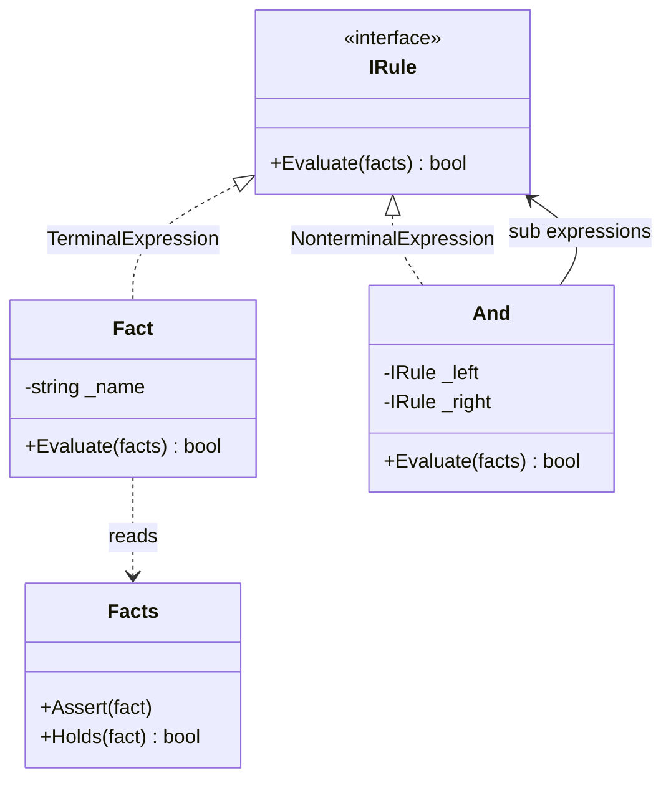

# Interpreter

🌍 🇬🇧 English (this file) · 🇫🇷 [Français](Interpreter-fr.md)

## Intent

Interpreter is a behavioural pattern that, given a language, defines a representation for its grammar
together with an interpreter that uses that representation to interpret sentences of the language.

## Problem

Eligibility rules change every quarter: a customer qualifies if they are a member and have an active
subscription, or if they are staff. Next quarter it is a different sentence.

Written in C#, each rule is a method, a deployment and a release. Written as a string and parsed by hand,
every combination has to be anticipated. What is wanted is for the rules to be *data* — composable,
storable, editable by someone who does not build the application.

## Solution

The pattern makes the grammar a class hierarchy.

Each construct of the little language becomes a type: a fact is one, a conjunction is another. Every type
answers the same question — evaluate yourself against this context — and a nonterminal answers it by
asking its children. A sentence is then a tree of objects, and interpreting it is one call at the root.

New constructs are new classes. New rules need no code at all: they are new trees.

## Structure



The arrow from `And` back to `IRule` is what makes the structure a tree: a conjunction holds rules, so a
conjunction of conjunctions is a rule too.

## The roles

| Role | Annotation | Applies to | What it carries |
|---|---|---|---|
| AbstractExpression | `[Interpreter.AbstractExpression]` | interface, class | Declares the interpretation operation shared by every node of the syntax tree. |
| TerminalExpression | `[Interpreter.TerminalExpression]` | class, struct | Interprets a terminal symbol of the grammar: it has no sub expression. |
| NonterminalExpression | `[Interpreter.NonterminalExpression]` | class | Interprets a grammar rule by delegating to its sub expressions. |
| Context | `[Interpreter.Context]` | class, struct | Carries the information global to the interpretation. |

## The example

From [`InterpreterUsage.cs`](../../../../DesignPatternCatalog.Usage/GangOfFour/InterpreterUsage.cs).

```csharp
[Interpreter.Context]
public sealed class Facts {

    private readonly HashSet<string> _true = new();

    public void Assert(string fact) => _true.Add(fact);
    public bool Holds(string fact)  => _true.Contains(fact);

}
```

The context holds what is true of the world being asked about. It is passed to every node and belongs to
none of them, which is what lets one rule tree be evaluated against many customers.

```csharp
[Interpreter.AbstractExpression]
public interface IRule {
    bool Evaluate(Facts facts);
}
```

One operation for the whole language. Every construct answers it, and that uniformity is what allows a
node to hold another node without knowing which kind.

```csharp
[Interpreter.TerminalExpression(AbstractExpression = typeof(IRule))]
public sealed class Fact : IRule {

    private readonly string _name;

    public Fact(string name) { _name = name; }

    public bool Evaluate(Facts facts) => facts.Holds(_name);

}
```

The terminal: it asks the context and recurses into nothing. Every leaf of every rule tree is one of
these.

```csharp
[Interpreter.NonterminalExpression(AbstractExpression = typeof(IRule))]
public sealed class And : IRule {

    private readonly IRule _left;
    private readonly IRule _right;

    public And(IRule left, IRule right) {
        _left  = left;
        _right = right;
    }

    public bool Evaluate(Facts facts) => _left.Evaluate(facts) && _right.Evaluate(facts);

}
```

The nonterminal: one line of grammar, expressed as one line of code. `And` holds `IRule`, so it holds
facts and other conjunctions alike, and a rule of any depth is built by nesting constructors.

Two things the sample does not have, and a real language would. There is no parser: rules are assembled
in C# rather than read from a string, and the book treats parsing as outside the pattern. And there is no
`Or` and no `Not` — each is another class, which is exactly how the grammar grows and exactly why a large
grammar becomes many classes.

## Applicability

**Use Interpreter when there is a language to interpret and its sentences can be represented as abstract
syntax trees**, the grammar being expressible as a class hierarchy.

**Use Interpreter when the grammar is simple.** The book is explicit: for complex grammars the class
hierarchy becomes unmanageable and a parser generator is the better tool, because it interprets without
building the tree.

**Use Interpreter when efficiency is not a critical concern.** The book says so in terms, and adds that
the most efficient interpreters are usually not implemented by interpreting parse trees directly.

## When not to use it

**Do not use Interpreter for a grammar with many rules.** The book's own stated drawback: at least one
class per rule, so a grammar of any size is a package of small classes that is hard to manage and hard to
read as a grammar. The pattern is for little languages.

**Do not use Interpreter where a real language or library exists.** A rules engine, an expression
library, or a scripting host will already have a parser, an evaluator, error messages and a test suite —
all of which a hand-written interpreter has to grow.

**Do not use Interpreter where the sentences are on a hot path.** Every evaluation walks the tree and
makes a virtual call per node, and the tree is rebuilt or re-read rather than compiled.

**Do not use Interpreter where the rules never change.** A language exists so that its sentences can be
written without touching the program; if the only author is the development team, the sentences may as
well be methods.

## Advantages

* The grammar is easy to change and extend: a construct is a class, and inheritance can specialise one.
* Each rule of the grammar is implemented in one small place, which makes both easy to read.
* Sentences become data — composable at run time, storable, and writable by someone who is not building
  the application.
* How a sentence is interpreted can be changed without touching the grammar, by adding a visitor over the
  tree instead of another method on every node.

## Drawbacks

* A class per rule, which puts a ceiling on the size of grammar the pattern can carry.
* Interpretation walks the tree, so it is slower than a compiled or table-driven alternative.
* Everything before the tree — lexing, parsing, error reporting — is outside the pattern and still has to
  be written.

## Relations with other patterns

**`Composite`** is what the syntax tree is: the abstract expression is a component, terminals are leaves,
nonterminals are composites.

**`Flyweight`** applies to terminals, which usually carry no context of their own and can be shared across
every sentence that mentions them.

**`Visitor`** offers a way to add operations — pretty-printing, type checking, optimisation — over the
tree without adding a method to every expression class.

**`Iterator`** can supply the traversal where the interpretation is not simply recursive.

## Source

*Design Patterns: Elements of Reusable Object-Oriented Software*, Gamma, Helm, Johnson & Vlissides,
Addison-Wesley, 1994 — the behavioural patterns chapter.

* [Index entry](../../../generated/catalog-index.md#interpreter-gang-of-four)
* [Generated attribute](../../../../DesignPatternCatalog.GangOfFour/Interpreter.cs)
* [Sample](../../../../DesignPatternCatalog.Usage/GangOfFour/InterpreterUsage.cs)
