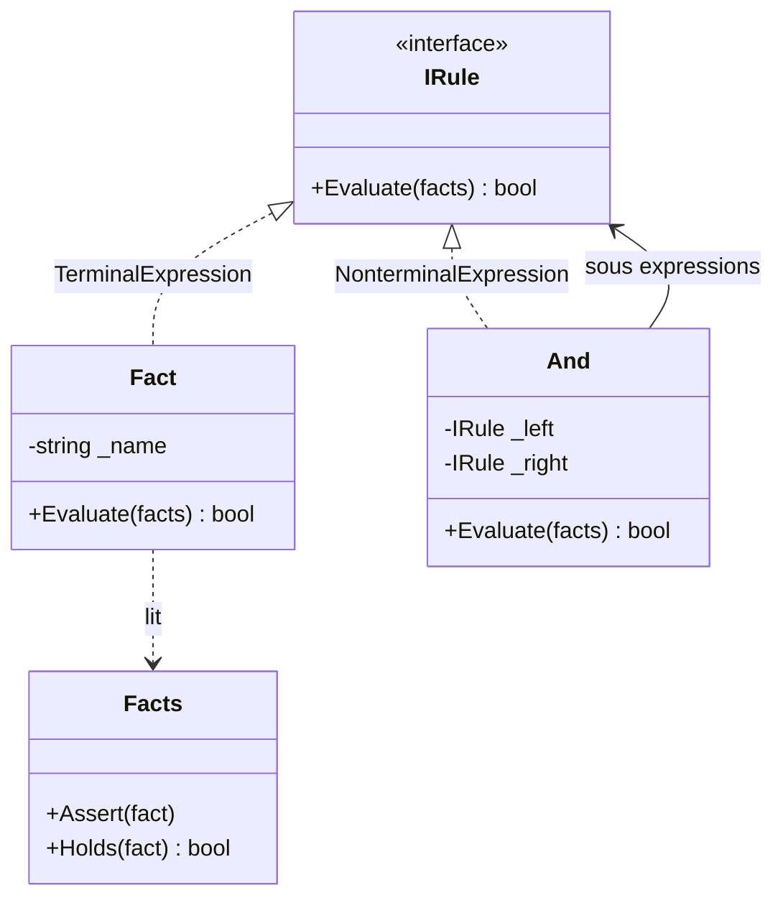

# Interpreter

🌍 🇫🇷 Français (ce fichier) · 🇬🇧 [English](Interpreter-en.md)

## Intention

Interpreter est un patron comportemental qui, étant donné un langage, définit une représentation de sa
grammaire ainsi qu'un interpréteur employant cette représentation pour interpréter les phrases du langage.

## Problème

Les règles d'éligibilité changent chaque trimestre : un client est éligible s'il est adhérent et détient
un abonnement actif, ou s'il fait partie du personnel. Le trimestre prochain, ce sera une autre phrase.

Écrite en C#, chaque règle est une méthode, un déploiement et une livraison. Écrite en chaîne de
caractères et analysée à la main, chaque combinaison doit être anticipée. Ce qu'on veut, c'est que les
règles soient des *données* — composables, stockables, modifiables par quelqu'un qui ne construit pas
l'application.

## Solution

Le patron fait de la grammaire une hiérarchie de classes.

Chaque construction du petit langage devient un type : un fait en est un, une conjonction un autre. Chaque
type répond à la même question — s'évaluer dans un contexte donné — et un non-terminal y répond en
interrogeant ses enfants. Une phrase est alors un arbre d'objets, et l'interpréter est un appel à la racine.

De nouvelles constructions sont de nouvelles classes. De nouvelles règles ne demandent aucun code : ce
sont de nouveaux arbres.

## Structure



La flèche de `And` vers `IRule` est ce qui fait de la structure un arbre : une conjonction détient des
règles, donc une conjonction de conjonctions est une règle aussi.

## Les rôles

| Rôle | Annotation | S'applique à | Ce qu'il porte |
|---|---|---|---|
| AbstractExpression | `[Interpreter.AbstractExpression]` | interface, classe | Déclare l'opération d'interprétation partagée par chaque nœud de l'arbre syntaxique. |
| TerminalExpression | `[Interpreter.TerminalExpression]` | classe, struct | Interprète un symbole terminal de la grammaire : il n'a pas de sous-expression. |
| NonterminalExpression | `[Interpreter.NonterminalExpression]` | classe | Interprète une règle de grammaire en déléguant à ses sous-expressions. |
| Context | `[Interpreter.Context]` | classe, struct | Porte l'information globale à l'interprétation. |

## L'exemple

Extrait de [`InterpreterUsage.cs`](../../../../DesignPatternCatalog.Usage/GangOfFour/InterpreterUsage.cs).

```csharp
[Interpreter.Context]
public sealed class Facts {

    private readonly HashSet<string> _true = new();

    public void Assert(string fact) => _true.Add(fact);
    public bool Holds(string fact)  => _true.Contains(fact);

}
```

Le contexte porte ce qui est vrai du monde interrogé. Il est passé à chaque nœud et n'appartient à aucun,
ce qui permet d'évaluer un même arbre de règles pour de nombreux clients.

```csharp
[Interpreter.AbstractExpression]
public interface IRule {
    bool Evaluate(Facts facts);
}
```

Une opération pour tout le langage. Chaque construction y répond, et cette uniformité est ce qui permet à
un nœud d'en détenir un autre sans savoir lequel.

```csharp
[Interpreter.TerminalExpression(AbstractExpression = typeof(IRule))]
public sealed class Fact : IRule {

    private readonly string _name;

    public Fact(string name) { _name = name; }

    public bool Evaluate(Facts facts) => facts.Holds(_name);

}
```

Le terminal : il interroge le contexte et ne récurse dans rien. Chaque feuille de chaque arbre de règles
en est un.

```csharp
[Interpreter.NonterminalExpression(AbstractExpression = typeof(IRule))]
public sealed class And : IRule {

    private readonly IRule _left;
    private readonly IRule _right;

    public And(IRule left, IRule right) {
        _left  = left;
        _right = right;
    }

    public bool Evaluate(Facts facts) => _left.Evaluate(facts) && _right.Evaluate(facts);

}
```

Le non-terminal : une ligne de grammaire exprimée en une ligne de code. `And` détient des `IRule`, donc des
faits comme d'autres conjonctions, et une règle de n'importe quelle profondeur se bâtit en imbriquant des
constructeurs.

Deux choses manquent à l'exemple qu'un vrai langage aurait. Il n'y a pas d'analyseur : les règles sont
assemblées en C# plutôt que lues depuis une chaîne, et le livre traite l'analyse syntaxique comme
extérieure au patron. Et il n'y a ni `Or` ni `Not` — chacun est une classe de plus, ce qui est exactement
la façon dont la grammaire croît et exactement pourquoi une grande grammaire devient beaucoup de classes.

## Possibilités d'application

**Utilisez Interpreter lorsqu'il y a un langage à interpréter et que ses phrases peuvent être représentées
en arbres syntaxiques abstraits**, la grammaire étant exprimable en hiérarchie de classes.

**Utilisez Interpreter lorsque la grammaire est simple.** Le livre est explicite : pour les grammaires
complexes, la hiérarchie de classes devient ingérable, et un générateur d'analyseurs est le meilleur outil
parce qu'il interprète sans bâtir l'arbre.

**Utilisez Interpreter lorsque l'efficacité n'est pas une préoccupation critique.** Le livre le dit en
toutes lettres, et ajoute que les interpréteurs les plus efficaces ne sont d'ordinaire pas implémentés en
interprétant directement des arbres syntaxiques.

## Quand ne pas l'utiliser

**N'utilisez pas Interpreter pour une grammaire à nombreuses règles.** L'inconvénient que le livre énonce
lui-même : au moins une classe par règle, si bien qu'une grammaire de quelque taille devient un paquet de
petites classes difficile à gérer et difficile à lire comme une grammaire. Le patron est fait pour les
petits langages.

**N'utilisez pas Interpreter là où un vrai langage ou une bibliothèque existe.** Un moteur de règles, une
bibliothèque d'expressions ou un hôte de script disposeront déjà d'un analyseur, d'un évaluateur, de
messages d'erreur et d'une suite de tests — que l'interpréteur écrit à la main devra tous faire pousser.

**N'utilisez pas Interpreter là où les phrases sont sur un chemin critique.** Chaque évaluation parcourt
l'arbre et fait un appel virtuel par nœud, et l'arbre est rebâti ou relu plutôt que compilé.

**N'utilisez pas Interpreter là où les règles ne changent jamais.** Un langage existe pour que ses phrases
s'écrivent sans toucher au programme ; si le seul auteur est l'équipe de développement, autant que les
phrases soient des méthodes.

## Avantages

* La grammaire est facile à changer et à étendre : une construction est une classe, et l'héritage peut en
  spécialiser une.
* Chaque règle de la grammaire est implémentée à un seul petit endroit, ce qui rend les deux faciles à
  lire.
* Les phrases deviennent des données — composables à l'exécution, stockables, et rédigeables par quelqu'un
  qui ne construit pas l'application.
* La manière d'interpréter une phrase peut changer sans toucher à la grammaire, en ajoutant un visiteur sur
  l'arbre au lieu d'une méthode de plus sur chaque nœud.

## Inconvénients

* Une classe par règle, ce qui plafonne la taille de grammaire que le patron peut porter.
* L'interprétation parcourt l'arbre : elle est plus lente qu'une alternative compilée ou pilotée par table.
* Tout ce qui précède l'arbre — analyse lexicale, analyse syntaxique, rapport d'erreurs — est hors du
  patron et reste à écrire.

## Liens avec les autres patrons

**`Composite`** est ce qu'est l'arbre syntaxique : l'expression abstraite est un composant, les terminaux
sont des feuilles, les non-terminaux des composites.

**`Flyweight`** s'applique aux terminaux, qui ne portent d'ordinaire aucun contexte propre et peuvent être
partagés par toutes les phrases qui les mentionnent.

**`Visitor`** offre un moyen d'ajouter des opérations — affichage, vérification de types, optimisation —
sur l'arbre sans ajouter une méthode à chaque classe d'expression.

**`Iterator`** peut fournir le parcours là où l'interprétation n'est pas simplement récursive.

## Source

*Design Patterns: Elements of Reusable Object-Oriented Software*, Gamma, Helm, Johnson & Vlissides,
Addison-Wesley, 1994 — chapitre des patrons comportementaux.

* [Entrée d'index](../../../generated/catalog-index.md#interpreter-gang-of-four)
* [Attribut généré](../../../../DesignPatternCatalog.GangOfFour/Interpreter.cs)
* [Exemple](../../../../DesignPatternCatalog.Usage/GangOfFour/InterpreterUsage.cs)
