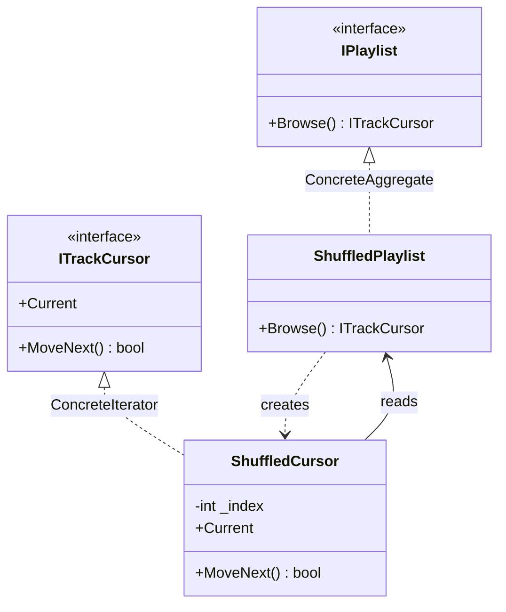

# Iterator

🌍 🇬🇧 English (this file) · 🇫🇷 [Français](Iterator-fr.md)

## Intent

Iterator is a behavioural pattern that provides a way to access the elements of an aggregate object
sequentially, without exposing its underlying representation.

## Problem

A playlist holds tracks. A screen shows them in order, a shuffler walks them in another, an exporter
writes them out.

If the playlist exposes its array so that callers can walk it, every caller now depends on it being an
array — and the day it becomes a linked list, a paged query or a shuffled view, all of them break. If
instead the playlist grows a `ForEach` method, it decides the traversal for everyone and two callers that
want different orders cannot both be served.

## Solution

The pattern makes the traversal an object of its own.

The aggregate answers one question: give me something that can walk you. That object holds the position
and knows the representation; the aggregate keeps its structure private, and several walks can be under
way at once because each has its own cursor.

## Structure



## The roles

| Role | Annotation | Applies to | What it carries |
|---|---|---|---|
| Iterator | `[Iterator.Iterator]` | interface, class | Declares the operations for traversing the elements. |
| ConcreteIterator | `[Iterator.ConcreteIterator]` | class, struct | Implements the traversal, and keeps track of the current position. |
| Aggregate | `[Iterator.Aggregate]` | interface, class | Declares the operation that creates an iterator over its elements. |
| ConcreteAggregate | `[Iterator.ConcreteAggregate]` | class | Returns an iterator suited to its own representation. |

## The example

From [`IteratorUsage.cs`](../../../../DesignPatternCatalog.Usage/GangOfFour/IteratorUsage.cs).

```csharp
[Iterator.Iterator]
public interface ITrackCursor {
    bool   MoveNext();
    string Current { get; }
}

[Iterator.Aggregate]
public interface IPlaylist {
    ITrackCursor Browse();
}
```

Two interfaces, and the second's only job is to produce the first. A caller that holds an `IPlaylist` can
walk it and can learn nothing else about it.

```csharp
[Iterator.ConcreteAggregate(Aggregate = typeof(IPlaylist))]
public sealed class ShuffledPlaylist : IPlaylist {

    internal readonly string[] Tracks;

    public ShuffledPlaylist(params string[] tracks) { Tracks = tracks; }

    public ITrackCursor Browse() => new ShuffledCursor(this);

}
```

`Tracks` is `internal`, not `private`, and that is the pattern's structural difficulty made visible. The
cursor is a separate class and needs the representation to walk it, so the aggregate has to open itself
to it. C# has no `friend`, so `internal` is the narrowest door available: the array is hidden from
consumers of the package and visible to the cursor that shares it.

```csharp
[Iterator.ConcreteIterator(Iterator = typeof(ITrackCursor), ConcreteAggregate = typeof(ShuffledPlaylist))]
public sealed class ShuffledCursor : ITrackCursor {

    private readonly ShuffledPlaylist _playlist;
    private          int              _index = -1;

    public ShuffledCursor(ShuffledPlaylist playlist) { _playlist = playlist; }

    public string Current => _playlist.Tracks[_index];

    public bool MoveNext() => ++_index < _playlist.Tracks.Length;

}
```

The position lives in the cursor, which is what allows two of them over one playlist. Starting at `-1`
and pre-incrementing is the convention `MoveNext`-then-`Current` requires: the cursor is not on an
element until it has been moved once, so `Current` before the first `MoveNext` reads outside the array.

Nothing here notices a playlist that changes while a walk is under way. A track appended between two
`MoveNext` calls is visited or not depending on where the index has got to; one removed can push
`Current` past the end. Detecting that is a version counter the aggregate would have to keep, and this
sample does not.

## Applicability

**Use Iterator to access an aggregate's contents without exposing its internal representation.**

**Use Iterator to support several traversals of the same aggregate at once**, each with its own position.

**Use Iterator to provide a uniform interface for traversing different aggregate structures**, so that
one piece of code walks a list and a tree alike.

## When not to use it

**Do not write the roles by hand on .NET.** The platform is the pattern: `IEnumerable<T>` is the
aggregate, `IEnumerator<T>` is the iterator, `foreach` is the traversal, and `yield return` writes the
concrete iterator from a method body. A hand-written cursor gives up LINQ, `foreach`, deferred execution
and every extension method in the framework, and gains nothing a reader will thank it for.

**Do not use Iterator where the aggregate is small and public.** A read-only list exposed directly is
simpler than two interfaces and two classes, and the encapsulation the pattern protects is worth its cost
only when the representation is likely to change.

**Do not use Iterator without deciding what a concurrent modification does.** Either the aggregate
detects the change and the iterator fails loudly — as the framework's collections do — or the behaviour
is undefined and callers will meet it as an intermittent bug.

**Do not use Iterator where the traversal is the aggregate's business.** An order that only the structure
can compute, or that must hold a lock for its duration, belongs to a method on the aggregate rather than
to a cursor handed out to callers.

## Advantages

* The aggregate's representation stays private, and can be replaced without touching callers.
* Several traversals can run at once, each with its own position.
* Traversal variants — in order, shuffled, filtered — are separate classes rather than parameters on the
  aggregate.

## Drawbacks

* Two types instead of none, for a job the language may already do.
* The iterator needs access to the representation, so the aggregate has to open a door to it that no one
  else should use.
* An iterator over a mutable aggregate has an invalidation problem that the pattern raises and does not
  solve.

## Relations with other patterns

**`Composite`** is a frequent aggregate, an iterator being the usual way to walk a recursive structure
without exposing it.

**`FactoryMethod`** is what the aggregate's creation operation usually is: `Browse` defers to the concrete
aggregate the choice of which cursor to build.

**`Memento`** can capture an iterator's position, so that a traversal can be suspended and resumed.

**`Visitor`** performs an operation over a structure; an iterator supplies the traversal that a visitor
otherwise has to write.

## Source

*Design Patterns: Elements of Reusable Object-Oriented Software*, Gamma, Helm, Johnson & Vlissides,
Addison-Wesley, 1994 — the behavioural patterns chapter.

* [Index entry](../../../generated/catalog-index.md#iterator-gang-of-four)
* [Generated attribute](../../../../DesignPatternCatalog.GangOfFour/Iterator.cs)
* [Sample](../../../../DesignPatternCatalog.Usage/GangOfFour/IteratorUsage.cs)
