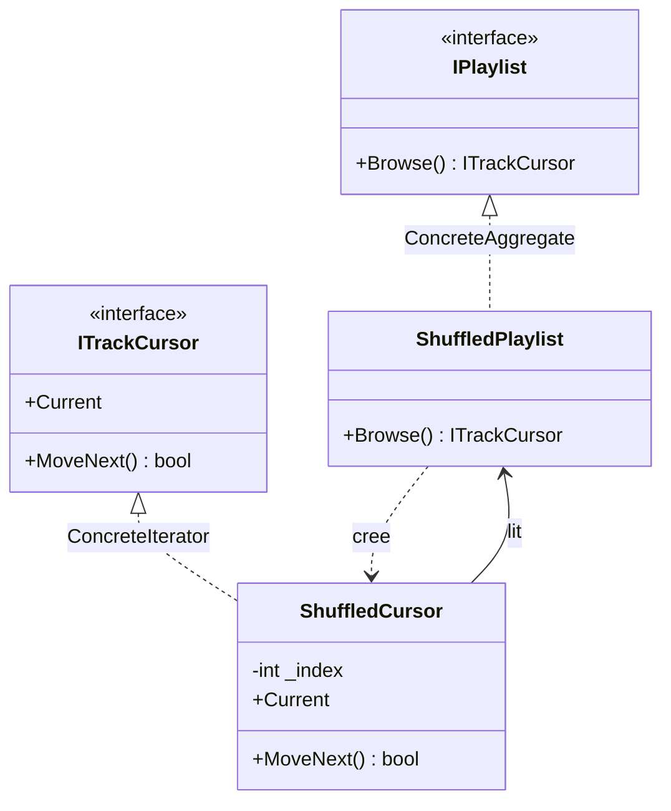

# Iterator

🌍 🇫🇷 Français (ce fichier) · 🇬🇧 [English](Iterator-en.md)

## Intention

Iterator est un patron comportemental qui fournit un moyen d'accéder séquentiellement aux éléments d'un
agrégat, sans exposer sa représentation sous-jacente.

## Problème

Une liste de lecture détient des morceaux. Un écran les affiche dans l'ordre, un mode aléatoire les
parcourt dans un autre, un exportateur les écrit.

Si la liste expose son tableau pour que les appelants le parcourent, chacun dépend désormais du fait que
c'est un tableau — et le jour où cela devient une liste chaînée, une requête paginée ou une vue mélangée,
tous cassent. Si au contraire la liste se dote d'une méthode `ForEach`, elle décide du parcours pour tout
le monde, et deux appelants voulant des ordres différents ne peuvent pas être servis tous les deux.

## Solution

Le patron fait du parcours un objet à part entière.

L'agrégat répond à une seule question : donne-moi de quoi te parcourir. Cet objet détient la position et
connaît la représentation ; l'agrégat garde sa structure privée, et plusieurs parcours peuvent avoir lieu
simultanément puisque chacun a son curseur.

## Structure



## Les rôles

| Rôle | Annotation | S'applique à | Ce qu'il porte |
|---|---|---|---|
| Iterator | `[Iterator.Iterator]` | interface, classe | Déclare les opérations de parcours des éléments. |
| ConcreteIterator | `[Iterator.ConcreteIterator]` | classe, struct | Implémente le parcours, et suit la position courante. |
| Aggregate | `[Iterator.Aggregate]` | interface, classe | Déclare l'opération qui crée un itérateur sur ses éléments. |
| ConcreteAggregate | `[Iterator.ConcreteAggregate]` | classe | Rend un itérateur adapté à sa propre représentation. |

## L'exemple

Extrait de [`IteratorUsage.cs`](../../../../DesignPatternCatalog.Usage/GangOfFour/IteratorUsage.cs).

```csharp
[Iterator.Iterator]
public interface ITrackCursor {
    bool   MoveNext();
    string Current { get; }
}

[Iterator.Aggregate]
public interface IPlaylist {
    ITrackCursor Browse();
}
```

Deux interfaces, et le seul travail de la seconde est de produire la première. Un appelant qui détient un
`IPlaylist` peut le parcourir et ne peut rien apprendre d'autre à son sujet.

```csharp
[Iterator.ConcreteAggregate(Aggregate = typeof(IPlaylist))]
public sealed class ShuffledPlaylist : IPlaylist {

    internal readonly string[] Tracks;

    public ShuffledPlaylist(params string[] tracks) { Tracks = tracks; }

    public ITrackCursor Browse() => new ShuffledCursor(this);

}
```

`Tracks` est `internal` et non `private`, et c'est la difficulté structurelle du patron rendue visible. Le
curseur est une classe distincte et a besoin de la représentation pour la parcourir : l'agrégat doit donc
s'ouvrir à lui. C# n'a pas de `friend`, si bien qu'`internal` est la porte la plus étroite disponible : le
tableau est caché aux consommateurs du paquet et visible au curseur qui le partage.

```csharp
[Iterator.ConcreteIterator(Iterator = typeof(ITrackCursor), ConcreteAggregate = typeof(ShuffledPlaylist))]
public sealed class ShuffledCursor : ITrackCursor {

    private readonly ShuffledPlaylist _playlist;
    private          int              _index = -1;

    public ShuffledCursor(ShuffledPlaylist playlist) { _playlist = playlist; }

    public string Current => _playlist.Tracks[_index];

    public bool MoveNext() => ++_index < _playlist.Tracks.Length;

}
```

La position vit dans le curseur, ce qui autorise deux curseurs sur une même liste. Partir de `-1` et
pré-incrémenter est la convention qu'impose la séquence `MoveNext` puis `Current` : le curseur n'est sur
aucun élément tant qu'il n'a pas été déplacé une fois, et `Current` avant le premier `MoveNext` lit hors
du tableau.

Rien ici ne remarque une liste modifiée pendant un parcours. Un morceau ajouté entre deux `MoveNext` est
visité ou non selon l'avancement de l'index ; un morceau retiré peut pousser `Current` au-delà de la fin.
Détecter cela suppose un compteur de version que l'agrégat devrait tenir, et cet exemple n'en a pas.

## Possibilités d'application

**Utilisez Iterator pour accéder au contenu d'un agrégat sans exposer sa représentation interne.**

**Utilisez Iterator pour permettre plusieurs parcours simultanés du même agrégat**, chacun avec sa
position.

**Utilisez Iterator pour offrir une interface uniforme de parcours sur des structures d'agrégats
différentes**, de sorte qu'un même code parcoure une liste comme un arbre.

## Quand ne pas l'utiliser

**N'écrivez pas les rôles à la main sur .NET.** La plateforme est le patron : `IEnumerable<T>` est
l'agrégat, `IEnumerator<T>` l'itérateur, `foreach` le parcours, et `yield return` écrit l'itérateur
concret à partir d'un corps de méthode. Un curseur écrit à la main renonce à LINQ, à `foreach`, à
l'exécution différée et à toutes les méthodes d'extension du framework, et ne gagne rien dont un lecteur
lui saura gré.

**N'utilisez pas Iterator là où l'agrégat est petit et public.** Une liste en lecture seule exposée
directement est plus simple que deux interfaces et deux classes, et l'encapsulation que protège le patron
ne vaut son coût que si la représentation est susceptible de changer.

**N'utilisez pas Iterator sans décider de ce que fait une modification concurrente.** Ou bien l'agrégat
détecte le changement et l'itérateur échoue bruyamment — comme le font les collections du framework — ou
bien le comportement est indéfini et les appelants le rencontreront sous forme de bug intermittent.

**N'utilisez pas Iterator là où le parcours est l'affaire de l'agrégat.** Un ordre que seule la structure
peut calculer, ou qui doit tenir un verrou pendant toute sa durée, relève d'une méthode sur l'agrégat
plutôt que d'un curseur distribué aux appelants.

## Avantages

* La représentation de l'agrégat reste privée, et peut être remplacée sans toucher aux appelants.
* Plusieurs parcours peuvent avoir lieu simultanément, chacun avec sa position.
* Les variantes de parcours — dans l'ordre, mélangé, filtré — sont des classes distinctes plutôt que des
  paramètres sur l'agrégat.

## Inconvénients

* Deux types au lieu d'aucun, pour un travail que le langage fait peut-être déjà.
* L'itérateur a besoin d'accéder à la représentation : l'agrégat doit donc lui ouvrir une porte que
  personne d'autre ne devrait emprunter.
* Un itérateur sur un agrégat mutable pose un problème d'invalidation que le patron soulève et ne résout
  pas.

## Liens avec les autres patrons

**`Composite`** est un agrégat fréquent, un itérateur étant la manière habituelle de parcourir une
structure récursive sans l'exposer.

**`FactoryMethod`** est ce qu'est d'ordinaire l'opération de création de l'agrégat : `Browse` délègue à
l'agrégat concret le choix du curseur à bâtir.

**`Memento`** peut capturer la position d'un itérateur, de sorte qu'un parcours puisse être suspendu et
repris.

**`Visitor`** effectue une opération sur une structure ; un itérateur fournit le parcours qu'un visiteur
doit sinon écrire.

## Source

*Design Patterns: Elements of Reusable Object-Oriented Software*, Gamma, Helm, Johnson & Vlissides,
Addison-Wesley, 1994 — chapitre des patrons comportementaux.

* [Entrée d'index](../../../generated/catalog-index.md#iterator-gang-of-four)
* [Attribut généré](../../../../DesignPatternCatalog.GangOfFour/Iterator.cs)
* [Exemple](../../../../DesignPatternCatalog.Usage/GangOfFour/IteratorUsage.cs)
