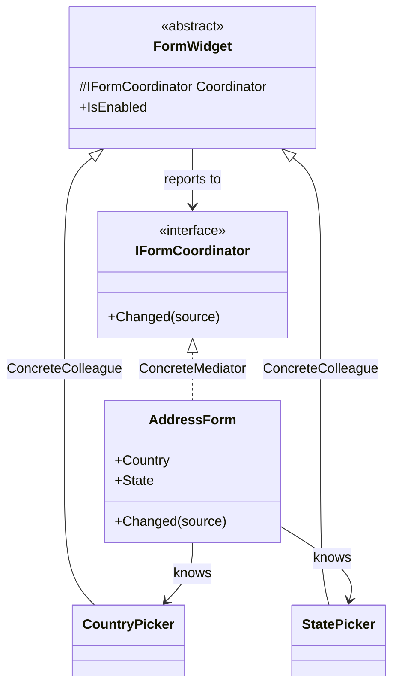

# Mediator

🌍 🇬🇧 English (this file) · 🇫🇷 [Français](Mediator-fr.md)

## Intent

Mediator is a behavioural pattern that defines an object encapsulating how a set of objects interact,
keeping them from referring to each other explicitly.

## Problem

An address form has a country picker, a state picker, a postcode field and a validation summary. Choosing
a country enables or disables the state picker; changing the state clears the postcode; an invalid
postcode updates the summary.

Written directly, each widget holds the others:

```csharp
public string Country {
    set { _country = value; _statePicker.IsEnabled = value == "US"; _summary.Revalidate(); }
}
```

The country picker now knows about state pickers and validation summaries, so it cannot be used on a form
that has neither. Every widget ends up knowing every other, and the number of connections grows with the
square of the number of widgets.

## Solution

The pattern gives the interaction an object.

Each widget reports that something changed and knows nothing about who cares. One mediator holds the
rules: which widget affects which, in what order, under what condition. The widgets become reusable
because they are ignorant, and the form's behaviour becomes readable because it is in one class.

Many-to-many connections become many-to-one.

## Structure



The arrows are the pattern: every colleague points at the mediator, the mediator points at every
colleague, and no colleague points at another.

## The roles

| Role | Annotation | Applies to | What it carries |
|---|---|---|---|
| Mediator | `[Mediator.Mediator]` | interface, class | Declares the interface through which colleagues communicate. |
| ConcreteMediator | `[Mediator.ConcreteMediator]` | class | Knows the colleagues and coordinates their interactions. |
| Colleague | `[Mediator.Colleague]` | interface, class | Communicates with the other participants only through the mediator. |
| ConcreteColleague | `[Mediator.ConcreteColleague]` | class | One participant of the interaction. |

## The example

From [`MediatorUsage.cs`](../../../../DesignPatternCatalog.Usage/GangOfFour/MediatorUsage.cs).

```csharp
[Mediator.Mediator]
public interface IFormCoordinator {
    void Changed(FormWidget source);
}
```

One operation, and it says as little as possible: something changed, here is which. A mediator interface
that grew a method per event would put the form's rules back into the widgets' vocabulary.

```csharp
[Mediator.Colleague(Mediator = typeof(IFormCoordinator))]
public abstract class FormWidget {

    protected FormWidget(IFormCoordinator coordinator) { Coordinator = coordinator; }

    protected IFormCoordinator Coordinator { get; }

    public bool IsEnabled { get; set; } = true;

}
```

Every colleague holds the mediator and nothing else. That single reference replaces all the references
the widgets would otherwise hold to one another.

```csharp
[Mediator.ConcreteColleague(Colleague = typeof(FormWidget))]
public sealed class CountryPicker : FormWidget {

    private string _country = string.Empty;

    public CountryPicker(IFormCoordinator coordinator) : base(coordinator) { }

    public string Country {
        get => _country;
        set {
            _country = value;
            Coordinator.Changed(this);
        }
    }

}
```

The picker announces and does not decide. It has no idea that a state picker exists, which is what makes
it usable on a form that has none.

```csharp
[Mediator.ConcreteMediator(Mediator = typeof(IFormCoordinator))]
public sealed class AddressForm : IFormCoordinator {

    public CountryPicker Country { get; }
    public StatePicker   State   { get; }

    public AddressForm() {
        Country = new CountryPicker(this);
        State   = new StatePicker(this);
    }

    public void Changed(FormWidget source) {
        if (ReferenceEquals(source, Country)) { State.IsEnabled = Country.Country == "US"; }
    }

}
```

The whole behaviour of the form, in one method. This is the pattern's return: a rule that was spread
across two widgets is now one line that can be read, changed and tested in one place.

`Changed` identifies its caller with `ReferenceEquals`. With two colleagues that reads well; with ten it
becomes a chain of tests, and the mediator starts to want a method per colleague or a dispatch table.
That growth is the drawback the next section names, and it begins here.

The form also constructs its colleagues, which is what allows it to pass `this` as their mediator. It is
also what makes the widgets impossible to substitute in a test of the form, and the reason a larger
example would take them as constructor parameters and connect them afterwards.

## Applicability

**Use Mediator when a set of objects communicate in well-defined but complex ways**, the interdependencies
being unstructured and hard to follow.

**Use Mediator when reusing an object is difficult because it refers to and communicates with many
others.**

**Use Mediator when behaviour distributed between several classes should be customisable without a great
deal of subclassing** — the variation living in a mediator rather than in every colleague.

## When not to use it

**Do not let the mediator become the application.** The book states the cost plainly: the pattern trades
complexity of interaction for complexity in the mediator, and a mediator that coordinates twenty
colleagues can be harder to understand than the connections it replaced. It is a god object waiting to
happen, and nothing in the structure resists it.

**Do not use Mediator for two colleagues.** One reference between them is simpler than an interface, an
abstract class and a coordinator.

**Do not use Mediator where the colleagues form a pipeline.** Interactions that flow in one direction are
better expressed as a chain or a sequence than as a hub that re-derives the order on every event.

**Do not use Mediator where the platform binds for you.** Data binding, reactive streams and event
aggregators already express *when this changes, that follows*, and a hand-written coordinator competes
with them rather than complementing them.

## Advantages

* Colleagues become reusable, since none of them names another.
* The interaction is localised: the form's behaviour is a class, not an emergent property of its parts.
* Many-to-many becomes many-to-one, so adding a colleague adds one reference rather than several.
* How objects interact can be changed by replacing the mediator, without touching any colleague.

## Drawbacks

* The mediator concentrates everything it removes from the colleagues, and grows accordingly.
* Behaviour is indirect: reading a colleague no longer tells what happens when it changes.
* The mediator knows every colleague concretely, so it is coupled to the whole set even though they are
  decoupled from each other.

## Relations with other patterns

**`Facade`** also centralises, and the direction differs: a facade's subsystems do not know it, where a
mediator's colleagues hold it and talk through it. A facade is one-way; a mediator is two-way.

**`Observer`** is how the colleague-to-mediator direction is often implemented, colleagues notifying the
mediator rather than calling it. The book's change-manager discussion connects the two directly.

**`Singleton`** is frequently applied to a mediator, one coordinator usually sufficing — with the
reservations that pattern's page sets out.

## Source

*Design Patterns: Elements of Reusable Object-Oriented Software*, Gamma, Helm, Johnson & Vlissides,
Addison-Wesley, 1994 — the behavioural patterns chapter.

* [Index entry](../../../generated/catalog-index.md#mediator-gang-of-four)
* [Generated attribute](../../../../DesignPatternCatalog.GangOfFour/Mediator.cs)
* [Sample](../../../../DesignPatternCatalog.Usage/GangOfFour/MediatorUsage.cs)
