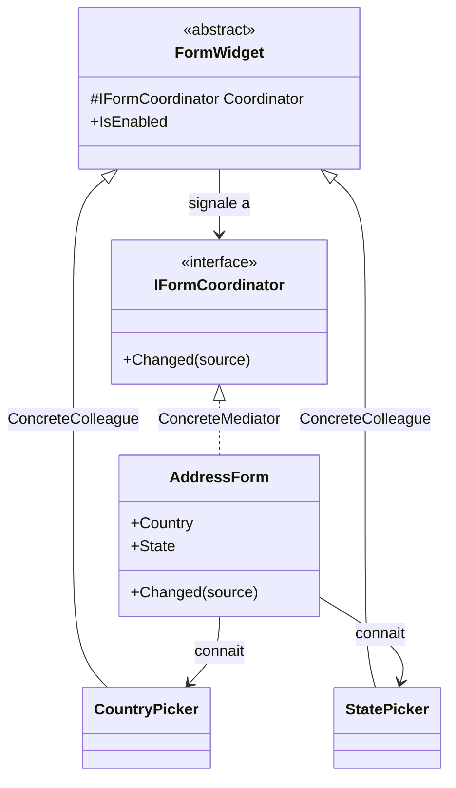

# Mediator

🌍 🇫🇷 Français (ce fichier) · 🇬🇧 [English](Mediator-en.md)

## Intention

Mediator est un patron comportemental qui définit un objet encapsulant la façon dont un ensemble d'objets
interagissent, en les empêchant de se référencer explicitement les uns les autres.

## Problème

Un formulaire d'adresse comporte un sélecteur de pays, un sélecteur de région, un champ de code postal et
un résumé de validation. Choisir un pays active ou désactive le sélecteur de région ; changer de région
efface le code postal ; un code postal invalide met à jour le résumé.

Écrit directement, chaque composant détient les autres :

```csharp
public string Country {
    set { _country = value; _statePicker.IsEnabled = value == "US"; _summary.Revalidate(); }
}
```

Le sélecteur de pays connaît désormais les sélecteurs de région et les résumés de validation : il n'est
donc plus utilisable sur un formulaire qui n'en a pas. Chaque composant finit par connaître tous les
autres, et le nombre de liaisons croît comme le carré du nombre de composants.

## Solution

Le patron donne un objet à l'interaction.

Chaque composant signale qu'il a changé et ignore qui s'y intéresse. Un médiateur porte les règles :
lequel affecte lequel, dans quel ordre, sous quelle condition. Les composants redeviennent réutilisables
parce qu'ils sont ignorants, et le comportement du formulaire devient lisible parce qu'il tient dans une
classe.

Les liaisons de plusieurs à plusieurs deviennent de plusieurs à un.

## Structure



Les flèches sont le patron : chaque collègue pointe vers le médiateur, le médiateur pointe vers chaque
collègue, et aucun collègue ne pointe vers un autre.

## Les rôles

| Rôle | Annotation | S'applique à | Ce qu'il porte |
|---|---|---|---|
| Mediator | `[Mediator.Mediator]` | interface, classe | Déclare l'interface par laquelle les collègues communiquent. |
| ConcreteMediator | `[Mediator.ConcreteMediator]` | classe | Connaît les collègues et coordonne leurs interactions. |
| Colleague | `[Mediator.Colleague]` | interface, classe | Communique avec les autres participants uniquement par le médiateur. |
| ConcreteColleague | `[Mediator.ConcreteColleague]` | classe | Un participant de l'interaction. |

## L'exemple

Extrait de [`MediatorUsage.cs`](../../../../DesignPatternCatalog.Usage/GangOfFour/MediatorUsage.cs).

```csharp
[Mediator.Mediator]
public interface IFormCoordinator {
    void Changed(FormWidget source);
}
```

Une opération, et elle en dit le moins possible : quelque chose a changé, voici quoi. Une interface de
médiateur qui se doterait d'une méthode par événement replacerait les règles du formulaire dans le
vocabulaire des composants.

```csharp
[Mediator.Colleague(Mediator = typeof(IFormCoordinator))]
public abstract class FormWidget {

    protected FormWidget(IFormCoordinator coordinator) { Coordinator = coordinator; }

    protected IFormCoordinator Coordinator { get; }

    public bool IsEnabled { get; set; } = true;

}
```

Chaque collègue détient le médiateur et rien d'autre. Cette référence unique remplace toutes celles que
les composants détiendraient sinon les uns vers les autres.

```csharp
[Mediator.ConcreteColleague(Colleague = typeof(FormWidget))]
public sealed class CountryPicker : FormWidget {

    private string _country = string.Empty;

    public CountryPicker(IFormCoordinator coordinator) : base(coordinator) { }

    public string Country {
        get => _country;
        set {
            _country = value;
            Coordinator.Changed(this);
        }
    }

}
```

Le sélecteur annonce et ne décide pas. Il n'a aucune idée qu'un sélecteur de région existe, ce qui le rend
utilisable sur un formulaire qui n'en a pas.

```csharp
[Mediator.ConcreteMediator(Mediator = typeof(IFormCoordinator))]
public sealed class AddressForm : IFormCoordinator {

    public CountryPicker Country { get; }
    public StatePicker   State   { get; }

    public AddressForm() {
        Country = new CountryPicker(this);
        State   = new StatePicker(this);
    }

    public void Changed(FormWidget source) {
        if (ReferenceEquals(source, Country)) { State.IsEnabled = Country.Country == "US"; }
    }

}
```

Tout le comportement du formulaire, dans une méthode. C'est le rendement du patron : une règle qui était
répartie sur deux composants tient maintenant en une ligne qu'on peut lire, changer et tester au même
endroit.

`Changed` identifie son appelant par `ReferenceEquals`. Avec deux collègues cela se lit bien ; avec dix
cela devient une suite de tests, et le médiateur se met à vouloir une méthode par collègue ou une table
de répartition. Cette croissance est l'inconvénient que nomme la section suivante, et elle commence ici.

Le formulaire construit également ses collègues, ce qui lui permet de se passer lui-même comme médiateur.
C'est aussi ce qui rend les composants impossibles à substituer dans un test du formulaire, et la raison
pour laquelle un exemple plus grand les prendrait en paramètres de constructeur avant de les relier.

## Possibilités d'application

**Utilisez Mediator lorsqu'un ensemble d'objets communiquent de façon bien définie mais complexe**, les
interdépendances étant peu structurées et difficiles à suivre.

**Utilisez Mediator lorsqu'un objet est difficile à réutiliser parce qu'il référence et sollicite beaucoup
d'autres objets.**

**Utilisez Mediator lorsqu'un comportement réparti entre plusieurs classes doit être personnalisable sans
multiplier les sous-classes** — la variation vivant dans un médiateur plutôt que dans chaque collègue.

## Quand ne pas l'utiliser

**Ne laissez pas le médiateur devenir l'application.** Le livre énonce le coût sans détour : le patron
échange la complexité de l'interaction contre celle du médiateur, et un médiateur qui coordonne vingt
collègues peut être plus difficile à comprendre que les liaisons qu'il a remplacées. C'est un objet-dieu
en puissance, et rien dans la structure n'y résiste.

**N'utilisez pas Mediator pour deux collègues.** Une référence entre eux est plus simple qu'une interface,
une classe abstraite et un coordinateur.

**N'utilisez pas Mediator là où les collègues forment un pipeline.** Des interactions qui vont dans un
seul sens s'expriment mieux en chaîne ou en séquence qu'en concentrateur qui redérive l'ordre à chaque
événement.

**N'utilisez pas Mediator là où la plateforme fait la liaison.** La liaison de données, les flux réactifs
et les agrégateurs d'événements expriment déjà *quand ceci change, cela suit*, et un coordinateur écrit à
la main les concurrence au lieu de les compléter.

## Avantages

* Les collègues redeviennent réutilisables, aucun ne nommant un autre.
* L'interaction est localisée : le comportement du formulaire est une classe, non une propriété émergente
  de ses parties.
* Plusieurs-à-plusieurs devient plusieurs-à-un : ajouter un collègue ajoute une référence au lieu de
  plusieurs.
* La façon dont les objets interagissent se change en remplaçant le médiateur, sans toucher aucun
  collègue.

## Inconvénients

* Le médiateur concentre tout ce qu'il retire aux collègues, et grossit d'autant.
* Le comportement est indirect : lire un collègue ne dit plus ce qui se passe quand il change.
* Le médiateur connaît concrètement chaque collègue : il est donc couplé à l'ensemble, quand bien même
  ceux-ci sont découplés entre eux.

## Liens avec les autres patrons

**`Facade`** centralise aussi, et le sens diffère : les sous-systèmes d'une façade ne la connaissent pas,
là où les collègues d'un médiateur le détiennent et passent par lui. Une façade est à sens unique ; un
médiateur à double sens.

**`Observer`** est la façon dont le sens collègue-vers-médiateur est souvent implémenté, les collègues
notifiant le médiateur plutôt que de l'appeler. La discussion du livre sur le gestionnaire de changement
relie directement les deux.

**`Singleton`** s'applique fréquemment à un médiateur, un coordinateur suffisant d'ordinaire — avec les
réserves qu'expose la page de ce patron.

## Source

*Design Patterns: Elements of Reusable Object-Oriented Software*, Gamma, Helm, Johnson & Vlissides,
Addison-Wesley, 1994 — chapitre des patrons comportementaux.

* [Entrée d'index](../../../generated/catalog-index.md#mediator-gang-of-four)
* [Attribut généré](../../../../DesignPatternCatalog.GangOfFour/Mediator.cs)
* [Exemple](../../../../DesignPatternCatalog.Usage/GangOfFour/MediatorUsage.cs)
