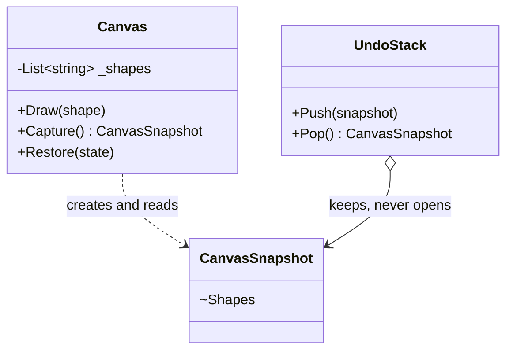

# Memento

🌍 🇬🇧 English (this file) · 🇫🇷 [Français](Memento-fr.md)

## Intent

Memento is a behavioural pattern that captures and externalizes an object's internal state, without
violating encapsulation, so that the object can be restored to that state later.

## Problem

A drawing canvas needs undo. Undo means the canvas has to be put back the way it was, which means its
state has to be kept somewhere before each change.

The undo stack is the natural place to keep it, and the undo stack has no business knowing what a canvas
is made of. If the canvas exposes its shapes so the stack can copy them, every consumer can now read and
edit them, and the encapsulation the canvas was written with is gone — to serve a feature that never
needed to look inside anything.

## Solution

The pattern hands out a sealed envelope.

The originator produces an object holding its state, and that object exposes nothing useful to anybody
else. A caretaker keeps it, passes it around and gives it back on request, without ever being able to
open it. The originator is the only thing that can read it, and it does so only to restore itself.

## Structure



## The roles

| Role | Annotation | Applies to | What it carries |
|---|---|---|---|
| Originator | `[Memento.Originator]` | class | Creates a memento of its own state, and uses one to restore itself. |
| Memento | `[Memento.Memento]` | class, struct | Holds the captured state, and exposes it only to its originator. |
| Caretaker | `[Memento.Caretaker]` | class | Keeps mementos safe, and never inspects or alters their content. |

## The example

From [`MementoUsage.cs`](../../../../DesignPatternCatalog.Usage/GangOfFour/MementoUsage.cs).

```csharp
[Memento.Memento]
public sealed record CanvasSnapshot {

    internal CanvasSnapshot(IReadOnlyList<string> shapes) { Shapes = shapes; }

    internal IReadOnlyList<string> Shapes { get; }

}
```

Both members are `internal`, and that is the whole design of the memento. The type is `public`, so an undo
stack outside the assembly can hold one and pass it about; its contents are `internal`, so only code
inside the assembly — the canvas — can read them.

The book describes this as a wide interface for the originator and a narrow one for everyone else, and
notes that it needs a language feature to enforce. C++ has `friend`; C# does not, so `internal` is the
narrowest door available. It is a weaker guarantee — anything in the same assembly can open the envelope
— and stating that is more useful than implying the compiler has closed it.

```csharp
[Memento.Originator(Memento = typeof(CanvasSnapshot))]
public sealed class Canvas {

    private List<string> _shapes = new();

    public void Draw(string shape) => _shapes.Add(shape);

    public CanvasSnapshot Capture()                     => new(_shapes.ToArray());
    public void           Restore(CanvasSnapshot state) => _shapes = state.Shapes.ToList();

}
```

`Capture` copies with `.ToArray()` and `Restore` copies back with `.ToList()`. Both copies are the
pattern: a snapshot sharing the canvas's list would change every time the canvas did, and would restore
the present rather than the past.

```csharp
[Memento.Caretaker(Memento = typeof(CanvasSnapshot))]
public sealed class UndoStack {

    private readonly Stack<CanvasSnapshot> _snapshots = new();

    // Keeps the snapshots, and never looks inside them.
    public void Push(CanvasSnapshot snapshot) => _snapshots.Push(snapshot);

    public CanvasSnapshot? Pop() => _snapshots.Count == 0 ? null : _snapshots.Pop();

}
```

A general-purpose stack that happens to hold canvases. It could hold snapshots of anything, because it
uses nothing about them — which is the property that lets one undo mechanism serve a whole application.

## Applicability

**Use Memento when a snapshot of an object's state must be saved so that it can be restored later.**

**Use Memento when a direct interface to obtain that state would expose implementation details** and
break the object's encapsulation.

## When not to use it

**Do not use Memento where the state is large and the snapshots are many.** The book names the cost: a
memento holds a copy, and an undo history holds one per step. A canvas with ten thousand shapes and a
hundred steps of undo is a hundred copies of ten thousand shapes, and nothing in the pattern makes them
cheaper.

**Do not use Memento where the caretaker must budget for what it holds.** The book raises this directly:
a caretaker cannot know how much state a memento contains, so it cannot decide what to discard when
memory runs short. Trimming a history requires knowledge the pattern deliberately denies it.

**Do not use Memento where the object is immutable.** Restoring an immutable object is keeping the old
reference; a snapshot of something that cannot change is the thing itself.

**Do not use Memento where an incremental record is better.** Storing what changed — a command that knows
its own inverse, or an event log — costs a delta per step instead of a copy per step, and gives a
history that can be read, audited and replayed. A full snapshot is simpler and pays per step.

## Advantages

* Encapsulation survives: the originator's internals never leave the originator.
* The originator stays simple, since it does not accumulate the versions of itself that someone else
  needs.
* One caretaker serves every originator, because it uses nothing about what it holds.

## Drawbacks

* A memento may be expensive: it is a copy, and copies are made whether or not they will ever be used.
* The caretaker cannot manage what it cannot see, so history trimming has no information to work with.
* In a language without `friend`, the narrow interface is a convention supported by visibility rather
  than a guarantee.

## Relations with other patterns

**`Command`** is the usual caretaker. A command that cannot compute its own inverse captures a memento
before executing and restores it on undo.

**`Iterator`** can use a memento to hold a traversal's position, so that a walk can be suspended and
resumed.

**`Prototype`** also copies an object, for a different purpose: a prototype's copy is a new object to be
used, a memento's is a past state to be restored.

## Source

*Design Patterns: Elements of Reusable Object-Oriented Software*, Gamma, Helm, Johnson & Vlissides,
Addison-Wesley, 1994 — the behavioural patterns chapter.

* [Index entry](../../../generated/catalog-index.md#memento-gang-of-four)
* [Generated attribute](../../../../DesignPatternCatalog.GangOfFour/Memento.cs)
* [Sample](../../../../DesignPatternCatalog.Usage/GangOfFour/MementoUsage.cs)
