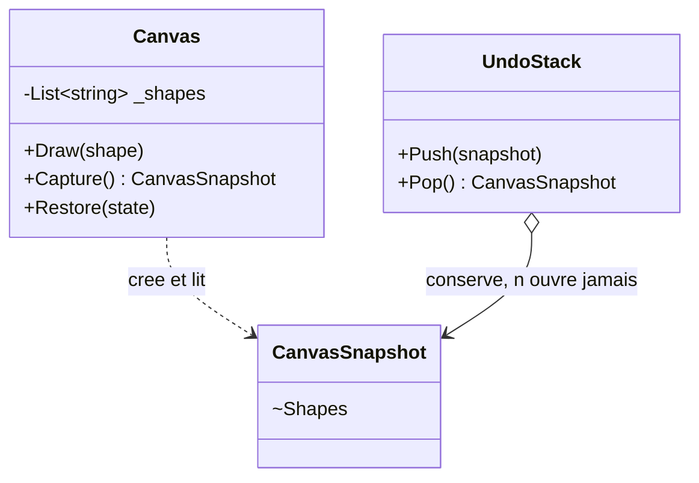

# Memento

🌍 🇫🇷 Français (ce fichier) · 🇬🇧 [English](Memento-en.md)

## Intention

Memento est un patron comportemental qui capture et externalise l'état interne d'un objet, sans violer son
encapsulation, afin que cet objet puisse être restauré dans cet état plus tard.

## Problème

Un canevas de dessin a besoin d'une annulation. Annuler signifie remettre le canevas dans l'état où il
était, donc conserver son état quelque part avant chaque changement.

La pile d'annulation est l'endroit naturel pour le conserver, et la pile d'annulation n'a aucune raison de
savoir de quoi un canevas est fait. Si le canevas expose ses formes pour que la pile les copie, tous les
consommateurs peuvent désormais les lire et les modifier, et l'encapsulation avec laquelle le canevas a
été écrit disparaît — au service d'une fonctionnalité qui n'a jamais eu besoin de regarder à l'intérieur
de quoi que ce soit.

## Solution

Le patron distribue une enveloppe scellée.

L'originateur produit un objet portant son état, et cet objet n'expose rien d'utile à quiconque d'autre.
Un gardien le conserve, le transmet et le restitue sur demande, sans jamais pouvoir l'ouvrir.
L'originateur est la seule chose qui puisse le lire, et il ne le lit que pour se restaurer.

## Structure



## Les rôles

| Rôle | Annotation | S'applique à | Ce qu'il porte |
|---|---|---|---|
| Originator | `[Memento.Originator]` | classe | Crée un memento de son propre état, et en emploie un pour se restaurer. |
| Memento | `[Memento.Memento]` | classe, struct | Porte l'état capturé, et ne l'expose qu'à son originateur. |
| Caretaker | `[Memento.Caretaker]` | classe | Conserve les mementos, et n'en inspecte ni n'en altère jamais le contenu. |

## L'exemple

Extrait de [`MementoUsage.cs`](../../../../DesignPatternCatalog.Usage/GangOfFour/MementoUsage.cs).

```csharp
[Memento.Memento]
public sealed record CanvasSnapshot {

    internal CanvasSnapshot(IReadOnlyList<string> shapes) { Shapes = shapes; }

    internal IReadOnlyList<string> Shapes { get; }

}
```

Les deux membres sont `internal`, et c'est toute la conception du memento. Le type est `public`, de sorte
qu'une pile d'annulation extérieure à l'assembly puisse en détenir un et le faire circuler ; son contenu
est `internal`, de sorte que seul le code interne à l'assembly — le canevas — puisse le lire.

Le livre décrit cela comme une interface large pour l'originateur et étroite pour tous les autres, et note
qu'il y faut une fonctionnalité du langage. C++ a `friend` ; C# non, si bien qu'`internal` est la porte la
plus étroite disponible. C'est une garantie plus faible — tout ce qui est dans le même assembly peut
ouvrir l'enveloppe — et le dire est plus utile que de laisser croire que le compilateur l'a fermée.

```csharp
[Memento.Originator(Memento = typeof(CanvasSnapshot))]
public sealed class Canvas {

    private List<string> _shapes = new();

    public void Draw(string shape) => _shapes.Add(shape);

    public CanvasSnapshot Capture()                     => new(_shapes.ToArray());
    public void           Restore(CanvasSnapshot state) => _shapes = state.Shapes.ToList();

}
```

`Capture` copie avec `.ToArray()` et `Restore` recopie avec `.ToList()`. Les deux copies sont le patron :
un instantané partageant la liste du canevas changerait chaque fois que le canevas change, et
restaurerait le présent plutôt que le passé.

```csharp
[Memento.Caretaker(Memento = typeof(CanvasSnapshot))]
public sealed class UndoStack {

    private readonly Stack<CanvasSnapshot> _snapshots = new();

    // Keeps the snapshots, and never looks inside them.
    public void Push(CanvasSnapshot snapshot) => _snapshots.Push(snapshot);

    public CanvasSnapshot? Pop() => _snapshots.Count == 0 ? null : _snapshots.Pop();

}
```

Une pile générique qui se trouve contenir des canevas. Elle pourrait contenir des instantanés de n'importe
quoi, puisqu'elle n'en utilise rien — propriété qui permet à un seul mécanisme d'annulation de servir
toute une application.

## Possibilités d'application

**Utilisez Memento lorsqu'un instantané de l'état d'un objet doit être conservé pour être restauré plus
tard.**

**Utilisez Memento lorsqu'une interface directe pour obtenir cet état exposerait des détails
d'implémentation** et romprait l'encapsulation de l'objet.

## Quand ne pas l'utiliser

**N'utilisez pas Memento là où l'état est volumineux et les instantanés nombreux.** Le livre nomme le
coût : un memento détient une copie, et un historique d'annulation en détient une par étape. Un canevas de
dix mille formes avec cent pas d'annulation, ce sont cent copies de dix mille formes, et rien dans le
patron ne les rend moins chères.

**N'utilisez pas Memento là où le gardien doit arbitrer ce qu'il conserve.** Le livre le soulève
directement : un gardien ne peut pas savoir combien d'état contient un memento, il ne peut donc pas
décider quoi écarter quand la mémoire manque. Élaguer un historique demande une connaissance que le patron
lui refuse délibérément.

**N'utilisez pas Memento là où l'objet est immuable.** Restaurer un objet immuable, c'est garder l'ancienne
référence ; un instantané de ce qui ne peut pas changer est la chose elle-même.

**N'utilisez pas Memento là où un enregistrement incrémental vaut mieux.** Stocker ce qui a changé — une
commande qui connaît son inverse, ou un journal d'événements — coûte un delta par étape au lieu d'une
copie par étape, et donne un historique lisible, auditable et rejouable. L'instantané complet est plus
simple et se paie à chaque pas.

## Avantages

* L'encapsulation survit : les entrailles de l'originateur ne quittent jamais l'originateur.
* L'originateur reste simple, puisqu'il n'accumule pas les versions de lui-même dont quelqu'un d'autre a
  besoin.
* Un seul gardien sert tous les originateurs, puisqu'il n'utilise rien de ce qu'il détient.

## Inconvénients

* Un memento peut coûter cher : c'est une copie, et les copies se font qu'elles servent un jour ou non.
* Le gardien ne peut pas gérer ce qu'il ne voit pas : élaguer l'historique n'a aucune information sur
  quoi s'appuyer.
* Dans un langage sans `friend`, l'interface étroite est une convention soutenue par la visibilité plutôt
  qu'une garantie.

## Liens avec les autres patrons

**`Command`** est le gardien habituel. Une commande qui ne sait pas calculer son inverse capture un memento
avant de s'exécuter et le restaure à l'annulation.

**`Iterator`** peut employer un memento pour porter la position d'un parcours, de sorte qu'il puisse être
suspendu et repris.

**`Prototype`** copie aussi un objet, dans un autre but : la copie d'un prototype est un objet neuf destiné
à servir, celle d'un memento un état passé destiné à être restauré.

## Source

*Design Patterns: Elements of Reusable Object-Oriented Software*, Gamma, Helm, Johnson & Vlissides,
Addison-Wesley, 1994 — chapitre des patrons comportementaux.

* [Entrée d'index](../../../generated/catalog-index.md#memento-gang-of-four)
* [Attribut généré](../../../../DesignPatternCatalog.GangOfFour/Memento.cs)
* [Exemple](../../../../DesignPatternCatalog.Usage/GangOfFour/MementoUsage.cs)
