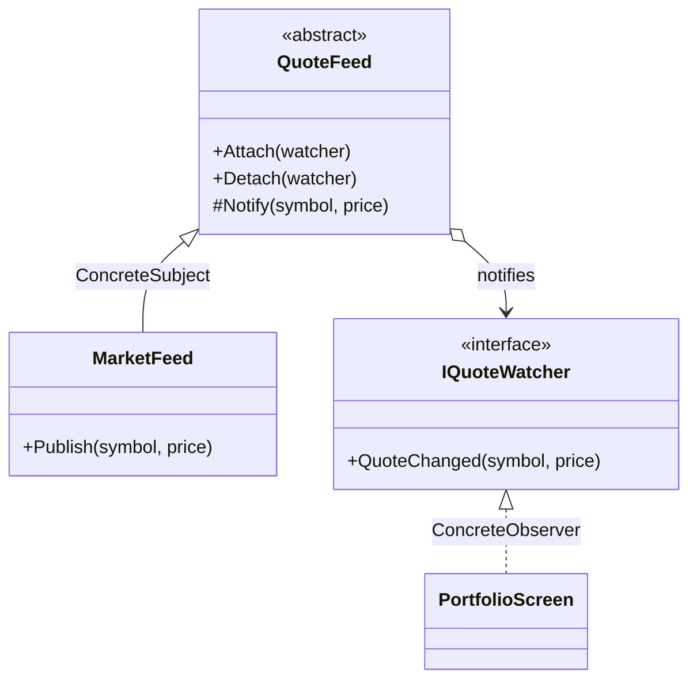

# Observer

🌍 🇬🇧 English (this file) · 🇫🇷 [Français](Observer-fr.md)

## Intent

Observer is a behavioural pattern that defines a one to many dependency between objects, so that when one
object changes state all its dependents are notified and updated automatically.

## Problem

A market feed publishes quotes. A portfolio screen shows them, an alert engine watches for thresholds, an
audit log records every tick, and next quarter something else will want them too.

Written directly, the feed names each of them:

```csharp
_portfolio.Refresh(symbol, price);
_alerts.Check(symbol, price);
_audit.Record(symbol, price);
```

The feed now depends on three unrelated parts of the application, and a fourth consumer means editing the
class that has the least to do with it.

## Solution

The pattern inverts the direction of the knowledge.

The feed keeps a list of things implementing one small interface, and calls that interface when its state
changes. It knows how many observers it has and nothing else about them: not their types, not what they
do with the news. Consumers register themselves, and a fourth one changes no existing code.

## Structure



## The roles

| Role | Annotation | Applies to | What it carries |
|---|---|---|---|
| Subject | `[Observer.Subject]` | interface, class | Knows its observers, and declares the operations to attach and detach them. |
| ConcreteSubject | `[Observer.ConcreteSubject]` | class | Holds the state of interest, and notifies its observers when it changes. |
| Observer | `[Observer.Observer]` | interface, class | Declares the update operation invoked when the observed subject changes. |
| ConcreteObserver | `[Observer.ConcreteObserver]` | class | Reacts to the notification, and keeps itself consistent with the subject. |
| NotifyMethod | `[Observer.NotifyMethod]` | method | The operation that informs every registered observer of a change. |
| UpdateMethod | `[Observer.UpdateMethod]` | method | The operation invoked on an observer when the subject has changed. |

Six roles, two of them methods — the most of any Gang of Four pattern in this catalogue.

## The example

From [`ObserverUsage.cs`](../../../../DesignPatternCatalog.Usage/GangOfFour/ObserverUsage.cs).

```csharp
[Observer.Observer]
public interface IQuoteWatcher {

    [Observer.UpdateMethod]
    void QuoteChanged(string symbol, decimal price);

}
```

The observer interface, and the operation that is the pattern's point of contact.

```csharp
[Observer.Subject(Observer = typeof(IQuoteWatcher))]
public abstract class QuoteFeed {

    private readonly List<IQuoteWatcher> _watchers = new();

    public void Attach(IQuoteWatcher watcher) => _watchers.Add(watcher);
    public void Detach(IQuoteWatcher watcher) => _watchers.Remove(watcher);

    [Observer.NotifyMethod]
    protected void Notify(string symbol, decimal price) {
        foreach (IQuoteWatcher watcher in _watchers) { watcher.QuoteChanged(symbol, price); }
    }

}
```

`Attach` and `Detach` are the registration; `Notify` is the broadcast, and it is `protected`, so only the
subject decides when a change is worth announcing.

That `foreach` carries two properties worth stating. It has no ordering contract — observers are called
in registration order, which nothing promises and nothing should be relied on. And an observer that
throws stops the loop, so the watchers registered after it are never told.

```csharp
[Observer.ConcreteSubject(Subject = typeof(QuoteFeed))]
public sealed class MarketFeed : QuoteFeed {
    public void Publish(string symbol, decimal price) => Notify(symbol, price);
}

[Observer.ConcreteObserver(Observer = typeof(IQuoteWatcher), ConcreteSubject = typeof(MarketFeed))]
public sealed class PortfolioScreen : IQuoteWatcher {
    public void QuoteChanged(string symbol, decimal price) { }
}
```

The concrete subject decides what counts as a change. The concrete observer names both the interface it
implements and the subject it follows, which is what tells two occurrences of the pattern apart in one
codebase.

## Applicability

**Use Observer when an abstraction has two aspects, one dependent on the other**, and encapsulating them
separately lets each be reused independently.

**Use Observer when a change to one object requires changing others, and how many is not known.**

**Use Observer when an object should notify others without making assumptions about who they are** —
that is, when the subject should not be coupled to its consumers.

## When not to use it

**Do not use Observer without deciding who detaches.** An observer registered and never removed is kept
alive by the subject's list for as long as the subject lives, and it keeps receiving notifications after
it has stopped being useful. This is the pattern's most common failure on any platform with garbage
collection, and `Attach` existing does not make `Detach` happen.

**Do not use Observer where an update can cascade.** A change to one subject notifies observers that
change subjects of their own, and the book names the consequence: an observer cannot see, from a
notification, what caused it or what else is under way. Cycles are possible and nothing detects them.

**Do not use Observer where the order of notification matters.** The pattern promises that everyone is
told, not when. Where one consumer has to run before another, that ordering has to live somewhere the
pattern does not provide.

**Do not use Observer where the platform already offers it.** On .NET the pattern is a language feature
and a family of interfaces: `event`, `IObservable<T>`/`IObserver<T>`, `INotifyPropertyChanged`. Writing
the roles by hand is worth it when the subject needs behaviour those do not give.

## Advantages

* Subject and observers vary independently: either can be reused or replaced without the other.
* The coupling is abstract — the subject knows an interface and a count, nothing more.
* Broadcast is free: adding a consumer is registering it.

## Drawbacks

* An unexpected update is hard to trace, since a small change can cost a wide cascade that no single
  place describes.
* The notification carries no reason, so an observer that needs to know why must be told separately or
  must ask.
* Registration is a lifetime obligation, and forgetting it leaks.

## Relations with other patterns

**`Mediator`** encapsulates complex update semantics between colleagues; the book's own suggestion is that
a change manager mediating between subjects and observers is itself a mediator.

**`Singleton`** is often applied to that change manager, so that it is unique.

**`Command`** is a common payload: notifying with an object rather than with parameters lets the reaction
be queued, logged or undone.

## Source

*Design Patterns: Elements of Reusable Object-Oriented Software*, Gamma, Helm, Johnson & Vlissides,
Addison-Wesley, 1994 — the behavioural patterns chapter.

* [Index entry](../../../generated/catalog-index.md#observer-gang-of-four)
* [Generated attribute](../../../../DesignPatternCatalog.GangOfFour/Observer.cs)
* [Sample](../../../../DesignPatternCatalog.Usage/GangOfFour/ObserverUsage.cs)
