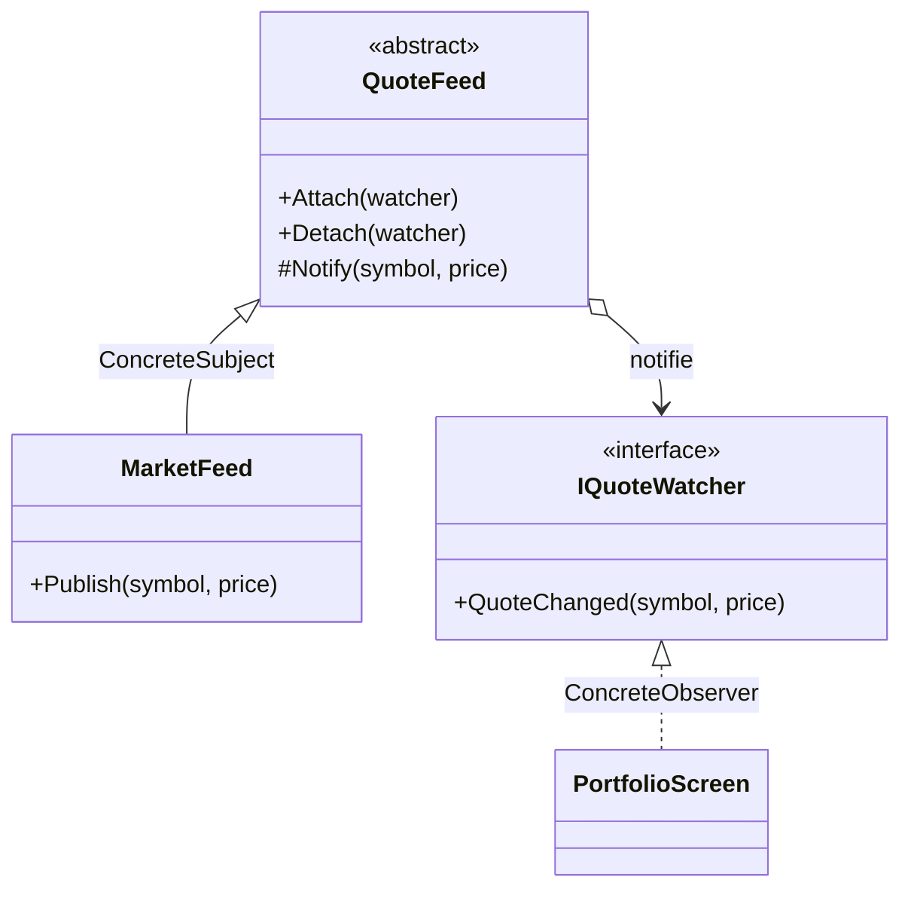

# Observer

🌍 🇫🇷 Français (ce fichier) · 🇬🇧 [English](Observer-en.md)

## Intention

Observer est un patron comportemental qui définit une dépendance de un à plusieurs entre objets, de sorte
que lorsqu'un objet change d'état, tous ses dépendants en sont avertis et mis à jour automatiquement.

## Problème

Un flux de marché publie des cotations. Un écran de portefeuille les affiche, un moteur d'alertes
surveille des seuils, un journal d'audit enregistre chaque tick, et le trimestre prochain quelque chose
d'autre les voudra aussi.

Écrit directement, le flux nomme chacun d'eux :

```csharp
_portfolio.Refresh(symbol, price);
_alerts.Check(symbol, price);
_audit.Record(symbol, price);
```

Le flux dépend désormais de trois parties sans rapport de l'application, et un quatrième consommateur
oblige à modifier la classe qui a le moins à y voir.

## Solution

Le patron inverse le sens de la connaissance.

Le flux tient une liste de choses implémentant une petite interface, et appelle cette interface quand son
état change. Il sait combien il a d'observateurs et rien d'autre à leur sujet : ni leur type, ni ce
qu'ils font de la nouvelle. Les consommateurs s'inscrivent eux-mêmes, et un quatrième ne change aucun
code existant.

## Structure



## Les rôles

| Rôle | Annotation | S'applique à | Ce qu'il porte |
|---|---|---|---|
| Subject | `[Observer.Subject]` | interface, classe | Connaît ses observateurs, et déclare les opérations pour les attacher et les détacher. |
| ConcreteSubject | `[Observer.ConcreteSubject]` | classe | Détient l'état d'intérêt, et notifie ses observateurs quand il change. |
| Observer | `[Observer.Observer]` | interface, classe | Déclare l'opération de mise à jour invoquée quand le sujet observé change. |
| ConcreteObserver | `[Observer.ConcreteObserver]` | classe | Réagit à la notification, et se maintient cohérent avec le sujet. |
| NotifyMethod | `[Observer.NotifyMethod]` | méthode | L'opération qui informe d'un changement chaque observateur inscrit. |
| UpdateMethod | `[Observer.UpdateMethod]` | méthode | L'opération invoquée sur un observateur lorsque le sujet a changé. |

Six rôles, dont deux méthodes — le plus grand nombre de tous les patrons du Gang of Four dans ce
catalogue.

## L'exemple

Extrait de [`ObserverUsage.cs`](../../../../DesignPatternCatalog.Usage/GangOfFour/ObserverUsage.cs).

```csharp
[Observer.Observer]
public interface IQuoteWatcher {

    [Observer.UpdateMethod]
    void QuoteChanged(string symbol, decimal price);

}
```

L'interface d'observateur, et l'opération qui est le point de contact du patron.

```csharp
[Observer.Subject(Observer = typeof(IQuoteWatcher))]
public abstract class QuoteFeed {

    private readonly List<IQuoteWatcher> _watchers = new();

    public void Attach(IQuoteWatcher watcher) => _watchers.Add(watcher);
    public void Detach(IQuoteWatcher watcher) => _watchers.Remove(watcher);

    [Observer.NotifyMethod]
    protected void Notify(string symbol, decimal price) {
        foreach (IQuoteWatcher watcher in _watchers) { watcher.QuoteChanged(symbol, price); }
    }

}
```

`Attach` et `Detach` sont l'inscription ; `Notify` est la diffusion, et elle est `protected`, de sorte que
seul le sujet décide qu'un changement mérite d'être annoncé.

Ce `foreach` porte deux propriétés qui méritent d'être énoncées. Il n'a aucun contrat d'ordre — les
observateurs sont appelés dans l'ordre d'inscription, ce que rien ne promet et sur quoi rien ne doit
reposer. Et un observateur qui lève une exception interrompt la boucle : ceux inscrits après lui ne sont
jamais avertis.

```csharp
[Observer.ConcreteSubject(Subject = typeof(QuoteFeed))]
public sealed class MarketFeed : QuoteFeed {
    public void Publish(string symbol, decimal price) => Notify(symbol, price);
}

[Observer.ConcreteObserver(Observer = typeof(IQuoteWatcher), ConcreteSubject = typeof(MarketFeed))]
public sealed class PortfolioScreen : IQuoteWatcher {
    public void QuoteChanged(string symbol, decimal price) { }
}
```

Le sujet concret décide de ce qui compte comme un changement. L'observateur concret nomme à la fois
l'interface qu'il implémente et le sujet qu'il suit, ce qui distingue deux occurrences du patron dans une
même base de code.

## Possibilités d'application

**Utilisez Observer lorsqu'une abstraction comporte deux aspects, l'un dépendant de l'autre**, et que les
encapsuler séparément permet de réutiliser chacun indépendamment.

**Utilisez Observer lorsqu'un changement dans un objet en impose à d'autres, sans qu'on sache combien.**

**Utilisez Observer lorsqu'un objet doit en avertir d'autres sans faire d'hypothèse sur leur identité** —
c'est-à-dire lorsque le sujet ne doit pas être couplé à ses consommateurs.

## Quand ne pas l'utiliser

**N'utilisez pas Observer sans décider qui détache.** Un observateur inscrit et jamais retiré est maintenu
en vie par la liste du sujet aussi longtemps que celui-ci vit, et il continue de recevoir des
notifications après avoir cessé d'être utile. C'est l'échec le plus fréquent de ce patron sur toute
plateforme à ramasse-miettes, et l'existence d'`Attach` ne fait pas advenir `Detach`.

**N'utilisez pas Observer là où une mise à jour peut se propager en cascade.** Un changement dans un sujet
avertit des observateurs qui modifient leurs propres sujets, et le livre en nomme la conséquence : depuis
une notification, un observateur ne peut voir ni ce qui l'a causée, ni ce qui est en cours par ailleurs.
Des cycles sont possibles et rien ne les détecte.

**N'utilisez pas Observer là où l'ordre des notifications compte.** Le patron promet que tout le monde est
averti, pas quand. Là où un consommateur doit passer avant un autre, cet ordre doit vivre à un endroit que
le patron ne fournit pas.

**N'utilisez pas Observer là où la plateforme l'offre déjà.** Sur .NET, le patron est une fonctionnalité du
langage et une famille d'interfaces : `event`, `IObservable<T>`/`IObserver<T>`, `INotifyPropertyChanged`.
Écrire les rôles à la main se justifie quand le sujet a besoin d'un comportement qu'elles ne donnent pas.

## Avantages

* Sujet et observateurs varient indépendamment : l'un ou l'autre peut être réutilisé ou remplacé sans
  l'autre.
* Le couplage est abstrait — le sujet connaît une interface et un compte, rien de plus.
* La diffusion est gratuite : ajouter un consommateur, c'est l'inscrire.

## Inconvénients

* Une mise à jour inattendue est difficile à tracer, un petit changement pouvant coûter une large cascade
  qu'aucun endroit unique ne décrit.
* La notification ne porte aucune raison : un observateur qui a besoin de savoir pourquoi doit être
  renseigné à part ou aller demander.
* L'inscription est une obligation de durée de vie, et l'oublier fuit.

## Liens avec les autres patrons

**`Mediator`** encapsule des sémantiques de mise à jour complexes entre collègues ; la suggestion même du
livre est qu'un gestionnaire de changement s'interposant entre sujets et observateurs est un médiateur.

**`Singleton`** s'applique souvent à ce gestionnaire, pour qu'il soit unique.

**`Command`** est une charge utile courante : notifier avec un objet plutôt qu'avec des paramètres permet
de mettre la réaction en file, de la journaliser ou de l'annuler.

## Source

*Design Patterns: Elements of Reusable Object-Oriented Software*, Gamma, Helm, Johnson & Vlissides,
Addison-Wesley, 1994 — chapitre des patrons comportementaux.

* [Entrée d'index](../../../generated/catalog-index.md#observer-gang-of-four)
* [Attribut généré](../../../../DesignPatternCatalog.GangOfFour/Observer.cs)
* [Exemple](../../../../DesignPatternCatalog.Usage/GangOfFour/ObserverUsage.cs)
