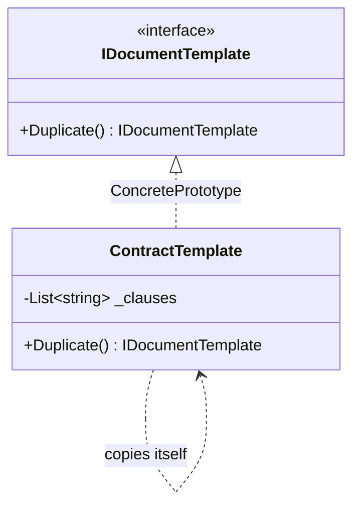

# Prototype

🌍 🇬🇧 English (this file) · 🇫🇷 [Français](Prototype-fr.md)

> Specifies the kinds of objects to create using a prototypical instance, and creates new objects by
> copying that prototype.
>
> — Gamma, Helm, Johnson & Vlissides, *Design Patterns*, 1994

## The problem

A contract template is forty clauses assembled by a lawyer. Every new contract starts from one of a
handful of templates and then diverges — this client gets an extra indemnity clause, that one has the
notice period changed.

Building each new contract from nothing means re-running the assembly: reading the clauses, ordering
them, validating them. Worse, it means the *kinds* of contract have to be known to the code. Add a
template and you add a class, or a branch, or a row in a `switch`.

But the assembled template is already sitting in memory, correct and complete. The obvious move is to
start from it — and the obvious move is where the difficulty is.

## The solution

Let an object make copies of itself.

Declare one operation — a clone — on the type. Each implementation knows how to copy its own insides,
because it is the only code that knows what its insides are. A caller that wants a new contract asks a
template for a copy and never names a class.

New kinds arrive by **registering another configured instance**, not by writing another type. The set
of things you can create becomes data.

## Structure



The arrow that loops back on itself is the pattern. Nothing outside knows how to build a
`ContractTemplate`; the only thing that does is a `ContractTemplate`.

## The roles

| Role | Annotation | Applies to | What it carries |
|---|---|---|---|
| Prototype | `[Prototype.Prototype]` | interface, class | Declares the operation that clones itself. |
| ConcretePrototype | `[Prototype.ConcretePrototype]` | class, struct | Implements the cloning operation for its own representation. |
| CloneMethod | `[Prototype.CloneMethod]` | method | The operation that returns a copy of the prototype. |

## The example

From [`PrototypeUsage.cs`](../../../../DesignPatternCatalog.Usage/GangOfFour/PrototypeUsage.cs).

```csharp
[Prototype.Prototype]
public interface IDocumentTemplate {

    [Prototype.CloneMethod]
    IDocumentTemplate Duplicate();

}
```

Two annotations on four lines, and they say different things. `[Prototype.Prototype]` marks the type
that participates; `[Prototype.CloneMethod]` marks **the operation that is the pattern** — because
without it the interface is just an interface.

The method is called `Duplicate`, not `Clone`, and the return type is `IDocumentTemplate`, not
`object`. Both choices are deliberate, and the *When not to use it* section explains why.

```csharp
[Prototype.ConcretePrototype(Prototype = typeof(IDocumentTemplate))]
public sealed class ContractTemplate : IDocumentTemplate {

    private readonly List<string> _clauses;

    public ContractTemplate(IEnumerable<string> clauses) { _clauses = clauses.ToList(); }

    public IDocumentTemplate Duplicate() => new ContractTemplate(_clauses);

}
```

Everything interesting is in that last line, and it is one decision made twice.

`new ContractTemplate(_clauses)` passes the existing list to a constructor that calls `.ToList()` on
it — so the copy gets **its own list**, and adding a clause to the copy does not add it to the
original. That is a *deep* copy of the collection.

What it is not is a deep copy of the clauses themselves. They are strings, and strings are immutable,
so sharing them is free and correct. Had a clause been a mutable object, sharing it would have meant
that editing the copy's third clause edited the original's third clause too — the bug that lives at
the centre of this pattern.

**The whole of Prototype is that one judgement, made per field.**

## When to use it

The book's own list:

* the classes to instantiate are specified **at run time** — loaded dynamically, chosen by
  configuration, registered by a plug-in;
* to avoid building a hierarchy of factories that mirrors the hierarchy of products;
* instances have one of only a few **combinations of state** — install those few as prototypes and
  clone, rather than write a class per combination.

The third is the one that comes up most in ordinary code, and it is the sample's case.

## When not to use it

* **When the object graph is deep or shared.** Cloning is where the bugs live. Every reference field
  forces a decision — share it or copy it — and the wrong answer produces two objects that look
  independent and are not. If the graph is large, that is a long series of decisions with no compiler
  checking any of them.
* **When the object is immutable.** There is nothing to protect, so share the instance. Copying it
  costs memory and buys nothing.
* **Through `ICloneable`.** The .NET interface does not say whether the copy is deep or shallow, and
  returns `object`. Microsoft's own guidance is not to implement it for that reason. Declare your own
  clone operation with a meaningful name and a precise return type — which is exactly why the sample
  says `IDocumentTemplate Duplicate()` and not `object Clone()`.
* **When construction is cheap.** A constructor or a factory is clearer than a copy, and says what it
  builds rather than what it started from.
* **When `record` already covers it.** In modern C#, `with` expressions give a shallow copy with
  changes, generated by the compiler and correct by construction. For a value-like type that is the
  answer, and the pattern adds nothing.

## What it costs

**What you gain**

* products can be added and removed **at run time**, by registering an instance rather than shipping a
  type;
* new kinds are specified by varying **values** — the same class configured differently is a new
  prototype — and by varying **structure**, for objects assembled from parts;
* less subclassing: no parallel hierarchy of creators, which is what the book offers it against
  `FactoryMethod` for.

**What you pay**

* **every concrete prototype must implement the clone**, and the book names the case where that is
  hard: internals that do not support copying, and **circular references**, which naive cloning turns
  into infinite recursion;
* the deep-or-shallow decision is per field, invisible in the signature, and unchecked;
* a clone starts from a state someone else configured, so a bug in the prototype is copied into every
  object made from it.

## Patterns it is confused with

| | |
|---|---|
| **`FactoryMethod`** | Also decides what gets created, but by subclassing the creator. Prototype exists partly to avoid that hierarchy — choose it when the parallel hierarchy is the cost you are trying to escape. |
| **`AbstractFactory`** | Can be *implemented* with prototypes: a concrete factory stores one configured instance per product and clones it. Complementary, not competing. |
| **`Memento`** | Also produces a copy of state, for a completely different reason — to restore an object later, not to create a new one. A memento is opaque to everyone but its originator; a prototype's copy is an ordinary object. |
| **`with` expressions** | Not a pattern in this catalogue. The compiler-generated shallow copy that covers the common case in modern C#. |

## Where this comes from

*Design Patterns: Elements of Reusable Object-Oriented Software*, Gamma, Helm, Johnson & Vlissides,
Addison-Wesley, 1994 — the Creational patterns chapter.

* [Index entry](../../../generated/catalog-index.md#prototype-gang-of-four) — the annotations, the
  targets, the links.
* [Generated attribute](../../../../DesignPatternCatalog.GangOfFour/Prototype.cs)
* [Sample](../../../../DesignPatternCatalog.Usage/GangOfFour/PrototypeUsage.cs)
