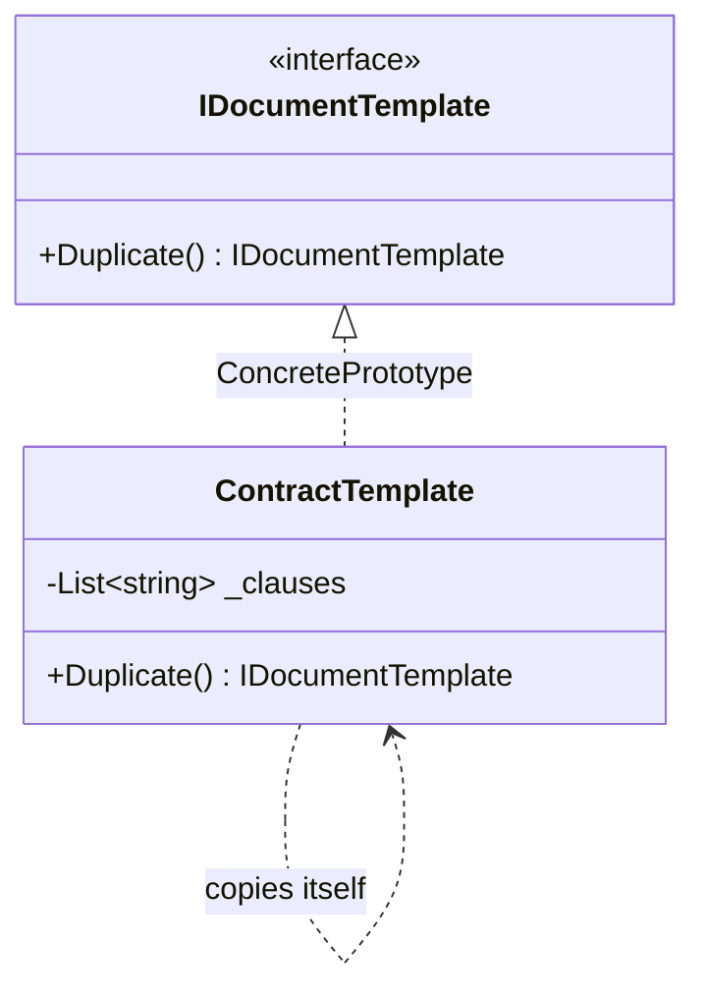

# Prototype

🌍 🇬🇧 English (this file) · 🇫🇷 [Français](Prototype-fr.md)

## Intent

Prototype is a creational pattern that specifies the kinds of objects to create using a prototypical
instance, and creates new objects by copying that prototype.

## Problem

A contract template is forty clauses assembled by a lawyer. Every new contract starts from one of a
handful of templates and then diverges: one client gains an indemnity clause, another has the notice
period changed.

Building each new contract from nothing means re-running the assembly — reading the clauses, ordering
them, validating them. It also means the code has to know the kinds of contract: adding a template adds
a class, or a branch, or a row in a `switch`.

The assembled template is already in memory, correct and complete. Starting from it is the obvious move,
and the difficulty lies inside that move.

## Solution

The pattern lets an object make copies of itself.

One operation — a clone — is declared on the type. Each implementation knows how to copy its own
internals, being the only code that knows what they are. A caller that wants a new contract asks a
template for a copy and never names a class.

New kinds arrive by registering another configured instance rather than by writing another type: the set
of things that can be created becomes data.

## Structure



The arrow that loops back on itself is the pattern: nothing outside knows how to build a
`ContractTemplate`, and the only thing that does is a `ContractTemplate`.

## The roles

| Role | Annotation | Applies to | What it carries |
|---|---|---|---|
| Prototype | `[Prototype.Prototype]` | interface, class | Declares the operation that clones itself. |
| ConcretePrototype | `[Prototype.ConcretePrototype]` | class, struct | Implements the cloning operation for its own representation. |
| CloneMethod | `[Prototype.CloneMethod]` | method | The operation that returns a copy of the prototype. |

## The example

From [`PrototypeUsage.cs`](../../../../DesignPatternCatalog.Usage/GangOfFour/PrototypeUsage.cs).

```csharp
[Prototype.Prototype]
public interface IDocumentTemplate {

    [Prototype.CloneMethod]
    IDocumentTemplate Duplicate();

}
```

Two annotations saying different things: `[Prototype.Prototype]` marks the participating type, and
`[Prototype.CloneMethod]` marks the operation that constitutes the pattern.

The method is named `Duplicate` rather than `Clone`, and returns `IDocumentTemplate` rather than
`object`. Both choices are deliberate, for reasons the *When not to use it* section gives.

```csharp
[Prototype.ConcretePrototype(Prototype = typeof(IDocumentTemplate))]
public sealed class ContractTemplate : IDocumentTemplate {

    private readonly List<string> _clauses;

    public ContractTemplate(IEnumerable<string> clauses) { _clauses = clauses.ToList(); }

    public IDocumentTemplate Duplicate() => new ContractTemplate(_clauses);

}
```

`new ContractTemplate(_clauses)` passes the existing list to a constructor that calls `.ToList()` on it,
so the copy receives its own list and adding a clause to the copy does not add one to the original. That
is a deep copy of the collection.

It is not a deep copy of the clauses themselves. They are strings, and strings are immutable, so sharing
them is free and correct. Had a clause been a mutable object, sharing it would have meant that editing
the copy's third clause edited the original's too — the bug that lives at the centre of this pattern.

The pattern amounts to that judgement, made once per field.

## Applicability

**Use Prototype when the classes to instantiate are specified at run time** — loaded dynamically, chosen
by configuration, registered by a plug-in.

**Use Prototype to avoid building a hierarchy of factories that mirrors the hierarchy of products.**

**Use Prototype when instances have one of only a few combinations of state.** Those few are installed as
prototypes and cloned, instead of a class being written per combination. This is the sample's case and
the one that arises most in ordinary code.

## When not to use it

**Do not use Prototype where the object graph is deep or shared.** Every reference field forces a
decision — share it or copy it — and the wrong answer produces two objects that appear independent and
are not. A large graph means a long series of such decisions, none of them checked by the compiler.

**Do not use Prototype for an immutable object.** There is nothing to protect, so the instance can be
shared; copying it costs memory and buys nothing.

**Do not implement it through `ICloneable`.** The .NET interface does not say whether the copy is deep or
shallow, and returns `object`; Microsoft's own guidance is not to implement it for that reason. A clone
operation with a meaningful name and a precise return type is the alternative, which is why the sample
declares `IDocumentTemplate Duplicate()`.

**Do not use Prototype where construction is cheap.** A constructor or a factory is clearer, and says
what it builds rather than what it started from.

**Do not use Prototype where a `record` already covers the need.** In modern C#, `with` expressions give
a shallow copy with changes, generated by the compiler and correct by construction.

## Advantages

* Products can be added and removed at run time by registering an instance rather than shipping a type.
* New kinds are specified by varying values — the same class configured differently is a new prototype —
  and by varying structure, for objects assembled from parts.
* Less subclassing than `FactoryMethod` requires: no parallel hierarchy of creators.

## Drawbacks

* Every concrete prototype implements the clone, and the book names the hard cases: internals that do not
  support copying, and circular references, which naive cloning turns into infinite recursion.
* The deep-or-shallow decision is made per field, does not appear in the signature, and is checked by
  nothing.
* A clone starts from a state someone else configured, so a bug in the prototype is copied into every
  object descending from it.

## Relations with other patterns

**`FactoryMethod`** also decides what gets created, but by subclassing the creator. Prototype exists
partly to avoid that hierarchy.

**`AbstractFactory`** can be implemented with prototypes: a concrete factory stores one configured
instance per product and clones it.

**`Memento`** also produces a copy of state, for a different purpose — restoring an object later rather
than creating a new one. A memento is opaque to everyone but its originator; a prototype's copy is an
ordinary object.

**`with` expressions**, not a pattern of this catalogue, are the compiler-generated shallow copy that
covers the common case in modern C#.

## Source

*Design Patterns: Elements of Reusable Object-Oriented Software*, Gamma, Helm, Johnson & Vlissides,
Addison-Wesley, 1994 — the creational patterns chapter.

* [Index entry](../../../generated/catalog-index.md#prototype-gang-of-four)
* [Generated attribute](../../../../DesignPatternCatalog.GangOfFour/Prototype.cs)
* [Sample](../../../../DesignPatternCatalog.Usage/GangOfFour/PrototypeUsage.cs)
