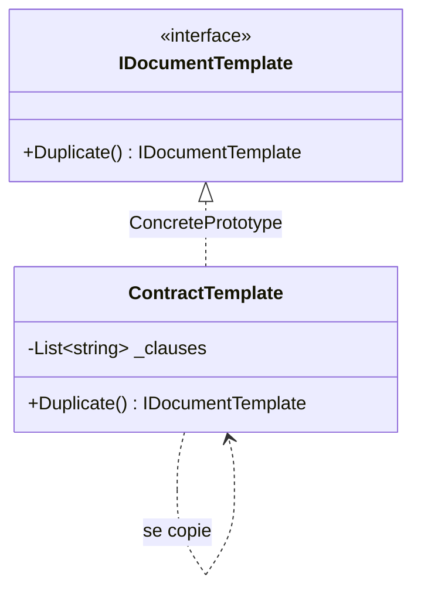

# Prototype

🌍 🇫🇷 Français (ce fichier) · 🇬🇧 [English](Prototype-en.md)

> Spécifie les sortes d'objets à créer au moyen d'une instance prototypique, et crée de nouveaux objets
> en copiant ce prototype.
>
> — Gamma, Helm, Johnson & Vlissides, *Design Patterns*, 1994

## Le problème

Un modèle de contrat, c'est quarante clauses assemblées par un juriste. Chaque nouveau contrat part
d'un de ces quelques modèles puis diverge — ce client-ci gagne une clause d'indemnisation, celui-là
voit son préavis modifié.

Bâtir chaque nouveau contrat à partir de rien oblige à rejouer l'assemblage : lire les clauses, les
ordonner, les valider. Pire, cela oblige le code à connaître les *sortes* de contrats. Ajouter un
modèle, c'est ajouter une classe, ou une branche, ou une ligne dans un `switch`.

Mais le modèle assemblé est déjà en mémoire, correct et complet. Le geste évident est d'en partir — et
c'est dans ce geste évident que se trouve la difficulté.

## La solution

Laisser un objet faire des copies de lui-même.

Déclare une opération — un clonage — sur le type. Chaque implémentation sait copier ses propres
entrailles, parce qu'elle est le seul code qui sache ce qu'elles contiennent. Un appelant qui veut un
nouveau contrat demande une copie à un modèle et ne nomme jamais de classe.

De nouvelles sortes arrivent en **enregistrant une autre instance configurée**, pas en écrivant un
autre type. L'ensemble de ce qu'on peut créer devient une donnée.

## Structure



La flèche qui reboucle sur elle-même, c'est le pattern. Rien à l'extérieur ne sait construire un
`ContractTemplate` ; la seule chose qui le sache est un `ContractTemplate`.

## Les rôles

| Rôle | Annotation | S'applique à | Ce qu'il porte |
|---|---|---|---|
| Prototype | `[Prototype.Prototype]` | interface, classe | Déclare l'opération qui se clone elle-même. |
| ConcretePrototype | `[Prototype.ConcretePrototype]` | classe, struct | Implémente l'opération de clonage pour sa propre représentation. |
| CloneMethod | `[Prototype.CloneMethod]` | méthode | L'opération qui rend une copie du prototype. |

## L'exemple

Tiré de [`PrototypeUsage.cs`](../../../../DesignPatternCatalog.Usage/GangOfFour/PrototypeUsage.cs).

```csharp
[Prototype.Prototype]
public interface IDocumentTemplate {

    [Prototype.CloneMethod]
    IDocumentTemplate Duplicate();

}
```

Deux annotations sur quatre lignes, et elles disent des choses différentes. `[Prototype.Prototype]`
marque le type qui participe ; `[Prototype.CloneMethod]` marque **l'opération qui est le pattern** —
car sans elle, l'interface n'est qu'une interface.

La méthode s'appelle `Duplicate` et non `Clone`, et son type de retour est `IDocumentTemplate` et non
`object`. Les deux choix sont délibérés, et la section *Quand ne pas l'utiliser* explique pourquoi.

```csharp
[Prototype.ConcretePrototype(Prototype = typeof(IDocumentTemplate))]
public sealed class ContractTemplate : IDocumentTemplate {

    private readonly List<string> _clauses;

    public ContractTemplate(IEnumerable<string> clauses) { _clauses = clauses.ToList(); }

    public IDocumentTemplate Duplicate() => new ContractTemplate(_clauses);

}
```

Tout ce qui est intéressant tient dans cette dernière ligne, et c'est une décision prise deux fois.

`new ContractTemplate(_clauses)` passe la liste existante à un constructeur qui appelle `.ToList()`
dessus — la copie obtient donc **sa propre liste**, et ajouter une clause à la copie n'en ajoute pas
une à l'original. C'est une copie *profonde* de la collection.

Ce que ce n'est pas, c'est une copie profonde des clauses elles-mêmes. Ce sont des chaînes, et les
chaînes sont immuables : les partager est gratuit et correct. Si une clause avait été un objet mutable,
la partager aurait voulu dire qu'éditer la troisième clause de la copie éditait aussi celle de
l'original — le bug qui vit au centre de ce pattern.

**Tout Prototype tient dans ce jugement-là, porté champ par champ.**

## Quand l'utiliser

La liste du livre :

* les classes à instancier sont spécifiées **à l'exécution** — chargées dynamiquement, choisies par
  configuration, enregistrées par un plug-in ;
* pour éviter de bâtir une hiérarchie de fabriques qui décalque la hiérarchie des produits ;
* les instances n'ont qu'un petit nombre de **combinaisons d'état** — installe ces quelques-unes en
  prototypes et clone, plutôt que d'écrire une classe par combinaison.

Le troisième est celui qu'on rencontre le plus en code ordinaire, et c'est le cas de l'exemple.

## Quand ne pas l'utiliser

* **Quand le graphe d'objets est profond ou partagé.** Le clonage est l'endroit où vivent les bugs.
  Chaque champ référence impose une décision — le partager ou le copier — et la mauvaise réponse
  produit deux objets qui semblent indépendants sans l'être. Si le graphe est grand, cela fait une
  longue série de décisions dont le compilateur ne vérifie aucune.
* **Quand l'objet est immuable.** Il n'y a rien à protéger : partage l'instance. La copier coûte de la
  mémoire et n'achète rien.
* **Via `ICloneable`.** L'interface .NET ne dit pas si la copie est profonde ou superficielle, et rend
  un `object`. La recommandation de Microsoft elle-même est de ne pas l'implémenter, pour cette raison.
  Déclare ta propre opération de clonage, avec un nom qui veut dire quelque chose et un type de retour
  précis — c'est exactement pourquoi l'exemple écrit `IDocumentTemplate Duplicate()` et non
  `object Clone()`.
* **Quand la construction est bon marché.** Un constructeur ou une fabrique est plus clair qu'une
  copie, et dit ce qu'il bâtit plutôt que ce dont il est parti.
* **Quand un `record` le couvre déjà.** En C# moderne, les expressions `with` donnent une copie
  superficielle avec modifications, générée par le compilateur et correcte par construction. Pour un
  type à sémantique de valeur, c'est la réponse, et le pattern n'ajoute rien.

## Ce qu'il coûte

**Ce que tu gagnes**

* des produits peuvent être ajoutés et retirés **à l'exécution**, en enregistrant une instance plutôt
  qu'en livrant un type ;
* de nouvelles sortes se spécifient en faisant varier des **valeurs** — la même classe configurée
  autrement est un nouveau prototype — et en faisant varier la **structure**, pour les objets assemblés
  de parties ;
* moins d'héritage : pas de hiérarchie parallèle de créateurs, ce que le livre lui reconnaît face à
  `FactoryMethod`.

**Ce que tu paies**

* **chaque prototype concret doit implémenter le clonage**, et le livre nomme le cas où c'est difficile :
  des entrailles qui ne supportent pas la copie, et les **références circulaires**, qu'un clonage naïf
  transforme en récursion infinie ;
* la décision profond-ou-superficiel se prend champ par champ, n'apparaît pas dans la signature, et
  n'est vérifiée par rien ;
* un clone part d'un état que quelqu'un d'autre a configuré : un bug dans le prototype est recopié dans
  chaque objet qui en descend.

## Patterns qu'on confond avec lui

| | |
|---|---|
| **`FactoryMethod`** | Décide aussi de ce qui est créé, mais en héritant du créateur. Prototype existe en partie pour éviter cette hiérarchie — choisis-le quand c'est justement la hiérarchie parallèle que tu cherches à fuir. |
| **`AbstractFactory`** | Peut être *implémenté* avec des prototypes : une fabrique concrète stocke une instance configurée par produit et la clone. Complémentaires, pas concurrents. |
| **`Memento`** | Produit aussi une copie d'état, pour une raison entièrement différente — restaurer un objet plus tard, pas en créer un nouveau. Un memento est opaque pour tous sauf son originateur ; la copie d'un prototype est un objet ordinaire. |
| **Les expressions `with`** | Pas un pattern de ce catalogue. La copie superficielle générée par le compilateur, qui couvre le cas courant en C# moderne. |

## D'où cela vient

*Design Patterns: Elements of Reusable Object-Oriented Software*, Gamma, Helm, Johnson & Vlissides,
Addison-Wesley, 1994 — chapitre des patterns de création.

* [Entrée d'index](../../../generated/catalog-index.md#prototype-gang-of-four) — les annotations, les
  cibles, les liens.
* [Attribut généré](../../../../DesignPatternCatalog.GangOfFour/Prototype.cs)
* [Exemple](../../../../DesignPatternCatalog.Usage/GangOfFour/PrototypeUsage.cs)
