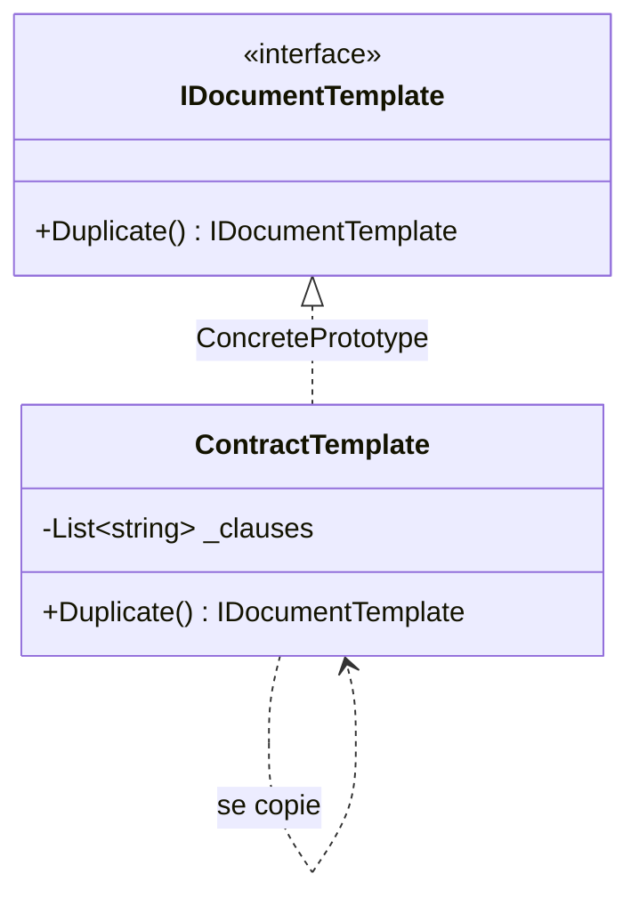

# Prototype

🌍 🇫🇷 Français (ce fichier) · 🇬🇧 [English](Prototype-en.md)

## Intention

Prototype est un patron de création qui spécifie les sortes d'objets à créer au moyen d'une instance
prototypique, et crée de nouveaux objets en copiant ce prototype.

## Problème

Un modèle de contrat, ce sont quarante clauses assemblées par un juriste. Chaque nouveau contrat part
d'un de ces quelques modèles puis diverge : un client gagne une clause d'indemnisation, un autre voit son
préavis modifié.

Bâtir chaque nouveau contrat à partir de rien oblige à rejouer l'assemblage — lire les clauses, les
ordonner, les valider. Cela oblige aussi le code à connaître les sortes de contrats : ajouter un modèle
ajoute une classe, ou une branche, ou une ligne dans un `switch`.

Le modèle assemblé est déjà en mémoire, correct et complet. En partir est le geste évident, et la
difficulté se trouve à l'intérieur de ce geste.

## Solution

Le patron laisse un objet faire des copies de lui-même.

Une opération — un clonage — est déclarée sur le type. Chaque implémentation sait copier ses propres
entrailles, étant le seul code qui sache ce qu'elles contiennent. Un appelant qui veut un nouveau contrat
demande une copie à un modèle et ne nomme jamais de classe.

De nouvelles sortes arrivent en enregistrant une autre instance configurée plutôt qu'en écrivant un autre
type : l'ensemble de ce qui peut être créé devient une donnée.

## Structure



La flèche qui reboucle sur elle-même est le patron : rien à l'extérieur ne sait construire un
`ContractTemplate`, et la seule chose qui le sache est un `ContractTemplate`.

## Les rôles

| Rôle | Annotation | S'applique à | Ce qu'il porte |
|---|---|---|---|
| Prototype | `[Prototype.Prototype]` | interface, classe | Déclare l'opération qui se clone elle-même. |
| ConcretePrototype | `[Prototype.ConcretePrototype]` | classe, struct | Implémente l'opération de clonage pour sa propre représentation. |
| CloneMethod | `[Prototype.CloneMethod]` | méthode | L'opération qui rend une copie du prototype. |

## L'exemple

Extrait de [`PrototypeUsage.cs`](../../../../DesignPatternCatalog.Usage/GangOfFour/PrototypeUsage.cs).

```csharp
[Prototype.Prototype]
public interface IDocumentTemplate {

    [Prototype.CloneMethod]
    IDocumentTemplate Duplicate();

}
```

Deux annotations qui disent des choses différentes : `[Prototype.Prototype]` marque le type participant,
et `[Prototype.CloneMethod]` marque l'opération qui constitue le patron.

La méthode est nommée `Duplicate` et non `Clone`, et rend `IDocumentTemplate` et non `object`. Les deux
choix sont délibérés, pour les raisons que donne la section *Quand ne pas l'utiliser*.

```csharp
[Prototype.ConcretePrototype(Prototype = typeof(IDocumentTemplate))]
public sealed class ContractTemplate : IDocumentTemplate {

    private readonly List<string> _clauses;

    public ContractTemplate(IEnumerable<string> clauses) { _clauses = clauses.ToList(); }

    public IDocumentTemplate Duplicate() => new ContractTemplate(_clauses);

}
```

`new ContractTemplate(_clauses)` passe la liste existante à un constructeur qui appelle `.ToList()`
dessus : la copie reçoit donc sa propre liste, et ajouter une clause à la copie n'en ajoute pas une à
l'original. C'est une copie profonde de la collection.

Ce n'est pas une copie profonde des clauses elles-mêmes. Ce sont des chaînes, et les chaînes sont
immuables, donc les partager est gratuit et correct. Si une clause avait été un objet mutable, la partager
aurait signifié qu'éditer la troisième clause de la copie éditait aussi celle de l'original — le bug qui
vit au centre de ce patron.

Le patron se ramène à ce jugement, porté une fois par champ.

## Possibilités d'application

**Utilisez Prototype lorsque les classes à instancier sont spécifiées à l'exécution** — chargées
dynamiquement, choisies par configuration, enregistrées par un plug-in.

**Utilisez Prototype pour éviter de bâtir une hiérarchie de fabriques qui décalque la hiérarchie des
produits.**

**Utilisez Prototype lorsque les instances n'ont qu'un petit nombre de combinaisons d'état.** Ces
quelques-unes sont installées en prototypes et clonées, au lieu d'écrire une classe par combinaison.
C'est le cas de l'exemple, et celui qui se présente le plus en code ordinaire.

## Quand ne pas l'utiliser

**N'utilisez pas Prototype là où le graphe d'objets est profond ou partagé.** Chaque champ référence impose
une décision — le partager ou le copier — et la mauvaise réponse produit deux objets qui paraissent
indépendants sans l'être. Un grand graphe signifie une longue série de ces décisions, dont aucune n'est
vérifiée par le compilateur.

**N'utilisez pas Prototype pour un objet immuable.** Il n'y a rien à protéger, l'instance peut donc être
partagée ; la copier coûte de la mémoire et n'achète rien.

**Ne l'implémentez pas via `ICloneable`.** L'interface .NET ne dit pas si la copie est profonde ou
superficielle, et rend un `object` ; la recommandation de Microsoft elle-même est de ne pas l'implémenter
pour cette raison. Une opération de clonage au nom explicite et au type de retour précis est l'alternative,
et c'est pourquoi l'exemple déclare `IDocumentTemplate Duplicate()`.

**N'utilisez pas Prototype là où la construction est bon marché.** Un constructeur ou une fabrique est plus
clair, et dit ce qu'il bâtit plutôt que ce dont il est parti.

**N'utilisez pas Prototype là où un `record` couvre déjà le besoin.** En C# moderne, les expressions `with`
donnent une copie superficielle avec modifications, générée par le compilateur et correcte par
construction.

## Avantages

* Des produits peuvent être ajoutés et retirés à l'exécution en enregistrant une instance plutôt qu'en
  livrant un type.
* De nouvelles sortes se spécifient en faisant varier des valeurs — la même classe configurée autrement est
  un nouveau prototype — et en faisant varier la structure, pour les objets assemblés de parties.
* Moins d'héritage que n'en demande `FactoryMethod` : pas de hiérarchie parallèle de créateurs.

## Inconvénients

* Chaque prototype concret implémente le clonage, et le livre nomme les cas difficiles : des entrailles qui
  ne supportent pas la copie, et les références circulaires, qu'un clonage naïf transforme en récursion
  infinie.
* La décision profond-ou-superficiel se prend champ par champ, n'apparaît pas dans la signature, et n'est
  vérifiée par rien.
* Un clone part d'un état que quelqu'un d'autre a configuré, donc un bug dans le prototype est recopié dans
  chaque objet qui en descend.

## Liens avec les autres patrons

**`FactoryMethod`** décide aussi de ce qui est créé, mais en héritant du créateur. Prototype existe en
partie pour éviter cette hiérarchie.

**`AbstractFactory`** peut être implémenté avec des prototypes : une fabrique concrète stocke une instance
configurée par produit et la clone.

**`Memento`** produit aussi une copie d'état, dans un autre but — restaurer un objet plus tard plutôt que
d'en créer un nouveau. Un memento est opaque pour tous sauf son originateur ; la copie d'un prototype est
un objet ordinaire.

**Les expressions `with`**, qui ne sont pas un patron de ce catalogue, sont la copie superficielle générée
par le compilateur, laquelle couvre le cas courant en C# moderne.

## Source

*Design Patterns: Elements of Reusable Object-Oriented Software*, Gamma, Helm, Johnson & Vlissides,
Addison-Wesley, 1994 — chapitre des patrons de création.

* [Entrée d'index](../../../generated/catalog-index.md#prototype-gang-of-four)
* [Attribut généré](../../../../DesignPatternCatalog.GangOfFour/Prototype.cs)
* [Exemple](../../../../DesignPatternCatalog.Usage/GangOfFour/PrototypeUsage.cs)
