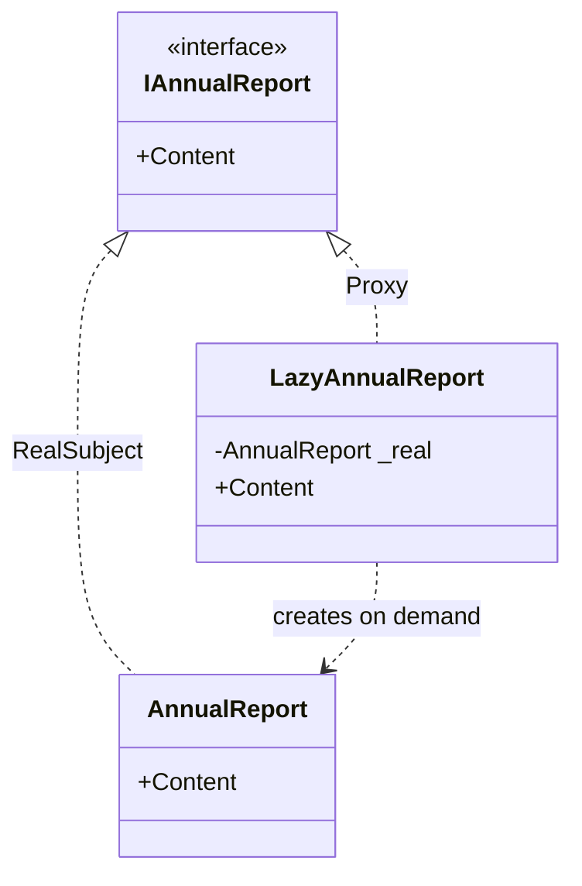

# Proxy

🌍 🇬🇧 English (this file) · 🇫🇷 [Français](Proxy-fr.md)

## Intent

Proxy is a structural pattern that provides a surrogate or placeholder for another object in order to
control access to it.

## Problem

An annual report is expensive to assemble — it aggregates a year of data — and most screens that hold one
never read it. A dashboard lists twelve reports and renders one.

Building all twelve to display one wastes the eleven. Making the caller decide when to build moves the
question into every screen, and each of them has to remember to ask.

## Solution

The pattern puts something in front of the real object that satisfies the same interface.

Because the surrogate is interchangeable with the thing it stands for, callers do not change. Behind the
interface it can defer creation until the first real use, check a permission, count references, or reach
across a network. The control is exercised in one place and is invisible to everyone else.

## Structure



Both types implement the subject interface, which is what makes them interchangeable. The proxy also
knows the concrete class, because in this form it is responsible for creating it.

## The roles

| Role | Annotation | Applies to | What it carries |
|---|---|---|---|
| Subject | `[Proxy.Subject]` | interface, class | Declares the interface shared by the real object and its proxy, so that they are interchangeable. |
| RealSubject | `[Proxy.RealSubject]` | class | The object the proxy stands for, and which does the real work. |
| Proxy | `[Proxy.Proxy]` | class | Controls access to the real subject, and may be responsible for creating it. |

## The example

From [`ProxyUsage.cs`](../../../../DesignPatternCatalog.Usage/GangOfFour/ProxyUsage.cs).

```csharp
[Proxy.Subject]
public interface IAnnualReport {
    string Content { get; }
}

[Proxy.RealSubject(Subject = typeof(IAnnualReport))]
public sealed class AnnualReport : IAnnualReport {

    public AnnualReport() { Content = "…"; }

    public string Content { get; }

}
```

The real subject does its expensive work in its constructor, which is what makes creating it worth
avoiding.

```csharp
[Proxy.Proxy(Subject = typeof(IAnnualReport), RealSubject = typeof(AnnualReport))]
public sealed class LazyAnnualReport : IAnnualReport {

    private AnnualReport? _real;

    public string Content => (_real ??= new AnnualReport()).Content;

}
```

This is a *virtual proxy*, the second of the four kinds the book distinguishes: the object is created on
first use and not before.

Two properties of that one line are worth being explicit about, because they are what a caller inherits
by accepting the proxy.

The cost has moved. It used to be paid at construction, where a caller expects work; it is now paid on
the first read of a property, where a caller expects none. A failure while building the report surfaces
inside a getter, at a moment nothing in the calling code marks as risky.

And `??=` is not atomic. Two threads reading `Content` at once can both find `_real` null and both build a
report, and one of them will be discarded. That is precisely the ground POSA2 covers with
`DoubleCheckedLockingOptimization`; on .NET, `Lazy<T>` is the answer that comes with the platform.

## Applicability

The book distinguishes four situations, and they are different enough that "proxy" alone rarely says
which is meant.

**A remote proxy** stands for an object in another address space and hides the communication.

**A virtual proxy** creates an expensive object on demand. This is the sample.

**A protection proxy** controls access, checking a caller's rights before forwarding.

**A smart reference** does bookkeeping on access — counting references, loading a persistent object on
first use, locking it while it is in use.

## When not to use it

**Do not write a virtual proxy where `Lazy<T>` suffices.** The platform type is thread-safe by default and
says what it does in its own name, where a hand-written proxy has to be read to find out.

**Do not use a proxy where the deferred failure is worse than the eager cost.** Moving construction into a
property moves its exceptions there too, and a getter that can throw is a getter every caller must now
treat as an operation.

**Do not use a proxy where callers depend on identity or on the concrete type.** The proxy is a different
object: reference equality, `is`, `GetType()` and serialisation all see it rather than the subject.

**Do not use a protection proxy as the only place a rule is enforced** where callers can obtain the real
subject another way. A proxy controls the access that goes through it and no other.

**Do not use a proxy where nothing needs controlling.** A surrogate that only forwards adds a type and an
indirection and answers no question.

## Advantages

* The caller is unchanged: the proxy and the subject are interchangeable by construction.
* The cost, the check or the bookkeeping lives in one place instead of at every call site.
* The subject stays unaware, so it can be sealed, generated, or owned by someone else.

## Drawbacks

* One more type, and one more hop on every call.
* The proxy is not the subject, so identity, type tests and equality see the surrogate.
* Deferring work moves its failures to an unexpected moment, and thread safety becomes the proxy's
  problem.

## Relations with other patterns

**`Decorator`** has the same shape — same interface, holds one — and the intent differs: a decorator adds
behaviour, a proxy controls access. The book notes that a decorator with control responsibilities and a
proxy with added behaviour are hard to tell apart, and that the intent decides the name.

**`Adapter`** presents a *different* interface, where a proxy presents the same one.

**`Facade`** stands in front of a whole subsystem rather than one object, and offers an interface the
subsystem does not have.

**`FlyweightFactory`** is a smart reference in spirit, returning a shared object where a caller asked for
one of its own.

## Source

*Design Patterns: Elements of Reusable Object-Oriented Software*, Gamma, Helm, Johnson & Vlissides,
Addison-Wesley, 1994 — the structural patterns chapter.

* [Index entry](../../../generated/catalog-index.md#proxy-gang-of-four)
* [Generated attribute](../../../../DesignPatternCatalog.GangOfFour/Proxy.cs)
* [Sample](../../../../DesignPatternCatalog.Usage/GangOfFour/ProxyUsage.cs)
