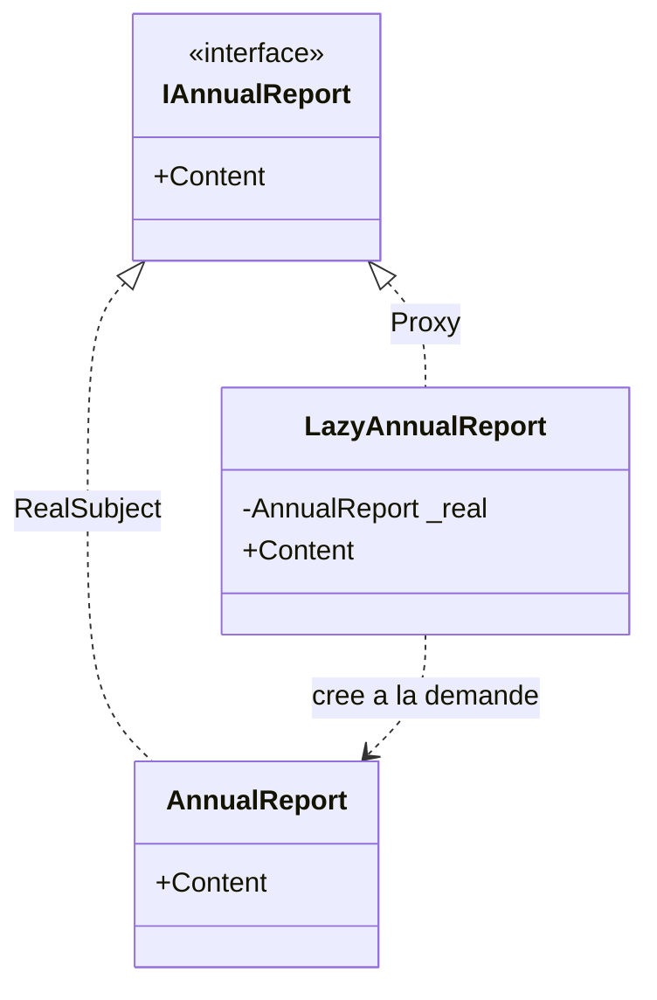

# Proxy

🌍 🇫🇷 Français (ce fichier) · 🇬🇧 [English](Proxy-en.md)

## Intention

Proxy est un patron structurel qui fournit un substitut ou un mandataire à un autre objet afin de contrôler
l'accès à celui-ci.

## Problème

Un rapport annuel est coûteux à assembler — il agrège une année de données — et la plupart des écrans qui en
détiennent un ne le lisent jamais. Un tableau de bord liste douze rapports et en affiche un.

Construire les douze pour en montrer un gaspille les onze autres. Laisser l'appelant décider du moment de la
construction déplace la question dans chaque écran, et chacun doit penser à la poser.

## Solution

Le patron place devant l'objet réel quelque chose qui satisfait la même interface.

Comme le substitut est interchangeable avec ce qu'il représente, les appelants ne changent pas. Derrière
l'interface, il peut différer la création jusqu'au premier usage réel, vérifier une autorisation, compter des
références, ou traverser un réseau. Le contrôle s'exerce en un seul endroit et reste invisible pour tous les
autres.

## Structure



Les deux types implémentent l'interface du sujet, ce qui les rend interchangeables. Le proxy connaît en outre
la classe concrète, car sous cette forme il est chargé de la créer.

## Les rôles

| Rôle | Annotation | S'applique à | Ce qu'il porte |
|---|---|---|---|
| Subject | `[Proxy.Subject]` | interface, classe | Déclare l'interface partagée par l'objet réel et son proxy, afin qu'ils soient interchangeables. |
| RealSubject | `[Proxy.RealSubject]` | classe | L'objet que le proxy représente, et qui fait le travail réel. |
| Proxy | `[Proxy.Proxy]` | classe | Contrôle l'accès au sujet réel, et peut être chargé de le créer. |

## L'exemple

Extrait de [`ProxyUsage.cs`](../../../../DesignPatternCatalog.Usage/GangOfFour/ProxyUsage.cs).

```csharp
[Proxy.Subject]
public interface IAnnualReport {
    string Content { get; }
}

[Proxy.RealSubject(Subject = typeof(IAnnualReport))]
public sealed class AnnualReport : IAnnualReport {

    public AnnualReport() { Content = "…"; }

    public string Content { get; }

}
```

Le sujet réel fait son travail coûteux dans son constructeur, et c'est ce qui rend sa création digne d'être
évitée.

```csharp
[Proxy.Proxy(Subject = typeof(IAnnualReport), RealSubject = typeof(AnnualReport))]
public sealed class LazyAnnualReport : IAnnualReport {

    private AnnualReport? _real;

    public string Content => (_real ??= new AnnualReport()).Content;

}
```

Voilà un *proxy virtuel*, la deuxième des quatre sortes que le livre distingue : l'objet est créé au premier
usage et pas avant.

Deux propriétés de cette unique ligne méritent d'être explicitées, car ce sont elles qu'un appelant hérite en
acceptant le proxy.

Le coût a changé de place. Il se payait à la construction, là où un appelant s'attend à du travail ; il se
paie maintenant à la première lecture d'une propriété, là où il n'en attend aucun. Une défaillance pendant la
construction du rapport surgit dans un accesseur, à un moment que rien dans le code appelant ne signale comme
risqué.

Et `??=` n'est pas atomique. Deux threads qui lisent `Content` en même temps peuvent tous deux trouver `_real`
à null et construire chacun un rapport, dont l'un sera jeté. C'est exactement le terrain que POSA2 couvre avec
`DoubleCheckedLockingOptimization` ; sur .NET, `Lazy<T>` est la réponse fournie avec la plateforme.

## Possibilités d'application

Le livre distingue quatre situations, et elles sont assez différentes pour que le seul mot « proxy » dise
rarement laquelle est visée.

**Un proxy distant** représente un objet situé dans un autre espace d'adressage et masque la communication.

**Un proxy virtuel** crée à la demande un objet coûteux. C'est le cas de l'exemple.

**Un proxy de protection** contrôle l'accès, en vérifiant les droits d'un appelant avant de transmettre.

**Une référence intelligente** tient une comptabilité à l'accès — compter les références, charger un objet
persistant au premier usage, le verrouiller pendant son emploi.

## Quand ne pas l'utiliser

**N'écrivez pas de proxy virtuel là où `Lazy<T>` suffit.** Le type de la plateforme est thread-safe par défaut
et dit ce qu'il fait dans son nom, là où un proxy écrit à la main doit être lu pour qu'on le sache.

**N'utilisez pas de proxy là où la défaillance différée est pire que le coût immédiat.** Déplacer la
construction dans une propriété y déplace aussi ses exceptions, et un accesseur qui peut lever devient une
opération que chaque appelant doit désormais traiter comme telle.

**N'utilisez pas de proxy là où les appelants dépendent de l'identité ou du type concret.** Le proxy est un
autre objet : égalité par référence, `is`, `GetType()` et sérialisation le voient à la place du sujet.

**N'utilisez pas un proxy de protection comme seul endroit où une règle est appliquée** si les appelants
peuvent obtenir le sujet réel par un autre chemin. Un proxy contrôle l'accès qui passe par lui et aucun autre.

**N'utilisez pas de proxy là où il n'y a rien à contrôler.** Un substitut qui ne fait que transmettre ajoute un
type et une indirection, et ne répond à aucune question.

## Avantages

* L'appelant est inchangé : le proxy et le sujet sont interchangeables par construction.
* Le coût, la vérification ou la comptabilité vit en un seul endroit au lieu de chaque site d'appel.
* Le sujet reste ignorant, il peut donc être scellé, généré, ou détenu par quelqu'un d'autre.

## Inconvénients

* Un type de plus, et un saut de plus à chaque appel.
* Le proxy n'est pas le sujet : identité, tests de type et égalité voient le substitut.
* Différer un travail déplace ses défaillances à un moment inattendu, et la sûreté vis-à-vis des threads
  devient le problème du proxy.

## Liens avec les autres patrons

**`Decorator`** a la même forme — même interface, en détient un — et l'intention diffère : un décorateur
ajoute du comportement, un proxy contrôle l'accès. Le livre note qu'un décorateur doté de responsabilités de
contrôle et un proxy doté de comportement ajouté sont difficiles à distinguer, et que c'est l'intention qui
décide du nom.

**`Adapter`** présente une interface *différente*, là où un proxy présente la même.

**`Facade`** se place devant tout un sous-système plutôt que devant un objet, et offre une interface que le
sous-système ne possède pas.

**`FlyweightFactory`** est une référence intelligente par l'esprit, rendant un objet partagé là où un appelant
en demandait un à lui.

## Source

*Design Patterns: Elements of Reusable Object-Oriented Software*, Gamma, Helm, Johnson & Vlissides,
Addison-Wesley, 1994 — chapitre des patrons structurels.

* [Entrée d'index](../../../generated/catalog-index.md#proxy-gang-of-four)
* [Attribut généré](../../../../DesignPatternCatalog.GangOfFour/Proxy.cs)
* [Exemple](../../../../DesignPatternCatalog.Usage/GangOfFour/ProxyUsage.cs)
